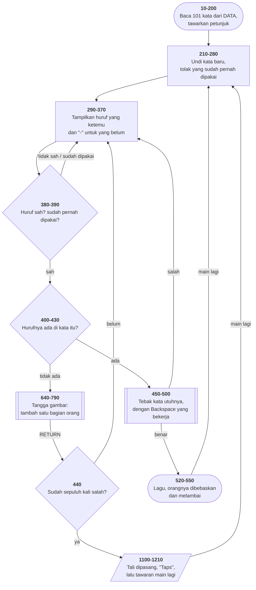

# HANGMAN.BAS di penelusur

> Program kesebelas, dan yang terbesar sejauh ini. 217 baris, nomor 1–2240,
> cakupan tabel **217/217 (100%)**.

Sumber: `run/HANGMAN.BAS` · tabel: `tracer/program/HANGMAN.js` ·
analisis: [`reviews/HANGMAN.md`](../../reviews/HANGMAN.md)

Hangman dengan 101 kata. Yang layak dipelajari bukan permainannya, melainkan
**dua cara menghindari sepuluh salinan kode**.

## Sepuluh gambar dari satu tangga

Orang-orangan hangman punya sepuluh keadaan: tiang saja, tiang + kepala,
tiang + kepala + badan, dan seterusnya. Bagaimana menggambarnya tanpa menulis
sepuluh rutin?

```basic
650 ON CHANCE GOTO 760,750,740,730,720,710,700,690,680
660 GOSUB 1230   ' tiang gantungan
670 GOSUB 980    ' telapak kiri
680 GOSUB 970    ' telapak kanan
690 GOSUB 1090   ' tangan kanan
700 GOSUB 1080   ' tangan kiri
710 GOSUB 1040   ' lengan kanan
720 GOSUB 1000   ' lengan kiri
730 GOSUB 960    ' tungkai kanan
740 GOSUB 950    ' tungkai kiri
750 GOSUB 880    ' badan
760 GOSUB 810    ' kepala
```

Baris 650 memilih **pintu masuk**. Sisanya jatuh ke bawah tanpa satu pun `GOTO`
di antaranya.

Terverifikasi di penelusur — dengan `CHANCE=2`, baris yang dilewati:

```
650 → 750 → 760 → 770 → 780
```

Masuk dari 750 menggambar **badan**, lalu jatuh ke 760 dan menggambar **kepala**
juga. Tebakan salah pertama masuk dari 760: kepala saja. Yang kesepuluh tidak
cocok dengan satu pun tujuan, jadi jatuh dari 660 dan menggambar **semuanya**.

Yang didapat: sepuluh keadaan, satu tangga, dan **urutan lapisan yang terjaga
sendiri** — bagian yang digambar belakangan selalu di atas, karena urutan
barisnya yang mengaturnya.

## Satu PRINT yang menggambar dua dimensi

Baris 1980–2120 membangun string animasi yang berisi karakter kendali kursor:

| kode | artinya |
|--:|---|
| 28 | kursor kanan |
| 29 | kursor **kiri** |
| 30 | kursor **atas** |
| 31 | kursor **bawah** |

Keempatnya tidak menggambar apa pun — ia perintah, bukan gambar. Jadi satu
`PRINT` bisa: cetak sebuah blok, naik, mundur, cetak lagi, naik, mundur, cetak
lagi. Hasilnya bentuk **dua dimensi** dari satu perintah tunggal — lengan yang
melambai, digambar sekali kirim.

Kenapa repot? Karena mengirim satu string panjang ke layar jauh lebih cepat
daripada belasan `LOCATE` dan `PRINT` terpisah. Di komputer 4,77 MHz, itu
bedanya animasi yang mulus dan animasi yang tersendat.

Prinsipnya masih hidup: tiap kali sebuah program menggambar bilah kemajuan di
terminal Anda, ia mengirim urutan escape yang mengerjakan hal yang sama.
`mesin/konsol.js` sekarang meniru keempat kode ini.

Contoh terkecilnya ada di baris 2240 — Backspace, ditulis tangan:

```basic
2240 PRINT CHR$(29)" "CHR$(29);
```

Mundur, timpa dengan spasi, mundur lagi. Terminal modern melakukan hal yang
persis sama.

## `MID$` di sisi kiri penugasan

```basic
420 … MID$(WORD,G,1)=MID$(WORD(B),G,1)
```

Di sisi **kanan**, `MID$` mengambil potongan string. Di sisi **kiri**, ia
**mengganti** potongan itu di tempatnya, tanpa membuat string baru.

Terverifikasi: menebak `R` pada kata `PRINTER` mengubah `WORD` dari
`"       "` menjadi `" R    R"` dalam satu jalan — kedua R sekaligus.

Menariknya, banyak bahasa modern justru **tidak punya** ini: string di
JavaScript, Java, Python, dan C# tidak bisa diubah isinya. Yang tersedia hanya
membuat string baru — persis cara yang dihindari BASIC di sini.

Alasannya bukan kemunduran: string yang tidak bisa diubah lebih aman dipakai
bersama-sama dan lebih mudah dinalar. Tapi di komputer dengan 64 KB memori,
membuat string baru untuk tiap huruf yang ditebak adalah kemewahan yang tidak
ada.

## Peta arsitektur



## Pseudokode

```
baris  170   baca 101 kata dari DATA ke dalam larik
baris  230   ULANG tiap permainan:
baris  260       undi nomor kata; kalau sudah pernah dipakai, undi lagi
baris  280       siapkan tampilan sepanjang katanya, semuanya kosong
baris  290       tampilkan huruf yang ketemu, "-" untuk yang belum
baris  370       minta satu huruf
baris  380       bukan A-Z? tolak
baris  390       sudah pernah dipakai? tolak
baris  420       cari huruf itu di seluruh kata:
baris  420           ketemu -> cetak di posisinya, GANTI SATU KARAKTER DI TAMPILAN
baris  420           tampilan sama dengan kata aslinya? MENANG
baris  440       tidak ketemu satu pun? tambah satu bagian orang-orangan
baris  650           PILIH PINTU MASUK TANGGA menurut jumlah salah
baris  660           sisanya jatuh ke bawah: makin tinggi masuknya, makin banyak
baris  440       sudah sepuluh kali salah? kalah
baris  460       huruf ketemu -> tawarkan menebak kata utuhnya
baris  520   MENANG: lagu, orangnya dibebaskan dan melambai
baris 1100   KALAH: tali dipasang, "Taps" dimainkan
```

## Yang bisa dicoba di halaman

| coba ini | yang terlihat |
|---|---|
| jawab `N` pada petunjuk | kata terpilih: `PRINTER`, ditampilkan `- - - - - - -` |
| tebak `R` | **kedua** R muncul sekaligus; `WORD` jadi `" R    R"` |
| tebak huruf yang tidak ada | telusuri baris 650 → lihat pintu masuk tangganya berpindah tiap kali |
| pasang titik henti di 780 | satu-satunya cara melihat gambarnya sebelum `CLS` menghapusnya |
| tebak huruf yang sama dua kali | ditolak di baris 390 |
| menang, lalu turunkan laju | animasi melambai di baris 1810–1970, satu bingkai per langkah |

Satu perilaku yang mudah disalahpahami: **tombol yang ditekan sebelum
promptnya muncul akan hilang.** Baris 1550 berbunyi `W=INKEY$:IF W<>"" THEN
1550` — ia sengaja mengeringkan penyangga dulu, supaya tombol nyasar dari layar
sebelumnya tidak terbaca sebagai jawaban. Di penelusur itu terasa seperti
tombol yang tidak berfungsi; sebenarnya ia bekerja persis seperti seharusnya.

## Penyimpangan dari aslinya

1. **Kedua lagunya tidak berbunyi** ("Hail To The Chief" di baris 520–540,
   "Taps" di 1130–1170), dan `SOUND` di baris 1190 juga diam.
2. **Animasi melambai berjalan seketika.** Baris 1810–1970 mencetak dua belas
   kali berturut-turut, dan di mesin aslinya **kecepatan pencetakan layar** yang
   menjadi pengatur temponya. Di sini tiap pencetakan seketika, jadi yang
   terlihat cuma bingkai terakhirnya.
3. **Pengacaknya bukan pengacak GW-BASIC, dan benihnya tetap**, jadi kata yang
   diundi selalu sama pada permainan pertama.
4. **Keempat gelung tunda habis seketika** (baris 500, 620, 780, 1180).
5. **Larik `WORD()` dan `A()` ditulis `WORD_` dan `A_` di dalam mesin.**

## Yang jangan ditiru

- **`RANDOMIZE` di dalam gelung, sekali lagi** (baris 250) — kesalahan yang
  sama dengan [MASTER.BAS](master.md), dan [BOGGY.BAS](boggy.md) di koleksi
  yang sama melakukannya dengan benar.
- **Gelung tunda sebagai pengatur tempo animasi.** Tempo yang bersandar pada
  kecepatan perangkat keras adalah tempo yang akan rusak.
- **Nilai batas yang ditulis dua kali.** Sepuluh kesempatan tertulis sebagai
  `CHANCE=10` di baris 440 dan 770, dan sebagai sembilan tujuan di baris 650.
  Ubah jumlahnya, dan tiga tempat harus disunting bersama.

---
[Rancangan penelusur](_rancangan.md) · [MENU](menu.md) · [INTRO](intro.md) · [CHECK](check.md) · [TOWERS](towers.md) · [HEAREYE](heareye.md) · [TICTAC](tictac.md) · [MASTER](master.md) · [BOGGY](boggy.md) · [PEGLEAP](pegleap.md) · [BIO](bio.md)
