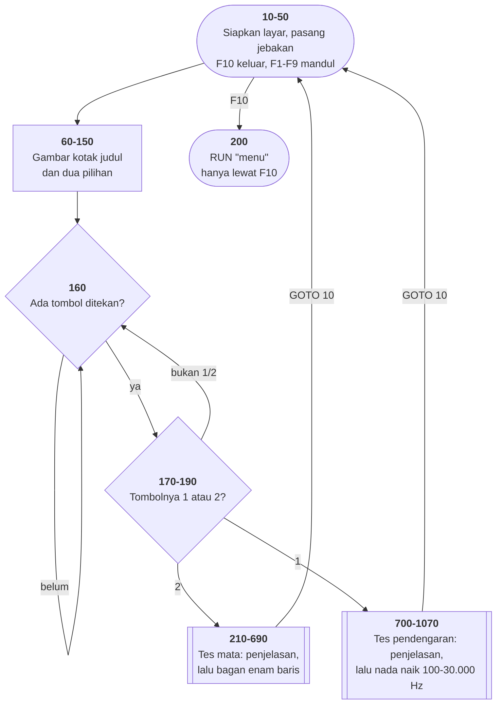

# HEAREYE.BAS di penelusur

> Program kelima. 117 baris, nomor 10–1180, cakupan tabel **117/117 (100%)**.

Sumber: `run/HEAREYE.BAS` · tabel: `tracer/program/HEAREYE.js` ·
analisis: [`reviews/HEAREYE.md`](../../reviews/HEAREYE.md)

Tes mata dan tes pendengaran dalam satu program. Baris 10–90 di sini
**identik** dengan [`INTRO.BAS`](intro.md) — ini kembarannya, dari templat yang
sama, dengan isi tengah yang berbeda.

## Yang ditagih program ini: hampir tidak ada

Empat program sebelumnya masing-masing memaksa mesinnya tumbuh: jebakan tombol
fungsi, baris berbagian, `RESUME`, gelung `FOR` lintas baris. Yang ini cuma
menambah dua perintah, dan keduanya diam: `SOUND` dan `PLAY`.

Itu kabar baik, dan layak dicatat: sesudah empat program, kerangka koleksi ini
sudah tertiru cukup lengkap untuk menjalankan program kelima nyaris tanpa
pekerjaan mesin baru.

## Peta arsitektur

Dihasilkan oleh `TRACER.peta.mermaid()` dari data `arsitektur` di
[`tracer/program/HEAREYE.js`](../program/HEAREYE.js).



### Kenapa program ini cukup dengan satu diagram

[TOWERS](towers.md) dapat tambahan peta keadaan karena satu variabel di sana
mengubah arti tombol yang sama. Program ini **tidak** dapat tambahan, dan itu
keputusan, bukan kelalaian.

Jenis diagram mengikuti bentuk programnya:

| kalau programnya | diagram yang dipakai |
|---|---|
| alur lurus, satu gelung utama | flowchart saja |
| punya beberapa peran atau skenario | + use case |
| subrutin yang saling memanggil berurutan | + sequence |
| punya mode/fase yang berganti | + state |

HEAREYE tidak punya keadaan yang berganti-ganti, tidak punya beberapa peran
pemakai, dan kedua subrutinnya lurus dari atas ke bawah tanpa saling memanggil.
Ia menu dengan dua cabang. Menambahkan diagram keadaan untuk program yang tidak
punya keadaan bukan kelengkapan — itu hiasan yang menyiratkan kerumitan yang
tidak ada.

## Pseudokode

```
baris   10   siapkan layar, buang tombol yang tertunda
baris   30   kalau F10 ditekan, panggil baris 200 (kembali ke menu)
baris   50   pasang jebakan F1-F9 - semuanya cuma PULANG
baris   60   gambar kotak dan judul FRIENDLYWARE
baris  120   tulis pilihan 1 (tes pendengaran) dan 2 (tes mata)

baris  160   ULANG SELAMANYA:
baris  160       tunggu satu tombol
baris  170       kalau "2": JALANKAN TES MATA, lalu ULANGI PROGRAM DARI BARIS 10
baris  180       kalau "1": jalankan tes pendengaran, lalu ulangi dari baris 10
baris  190       tombol lain: abaikan

baris  210   TES MATA (baris 210-690):
baris  220       gambar bingkai balok penuh di sekeliling layar
baris  270       tulis penjelasan: berdiri 20 kaki, tutup satu mata
baris  390       tunggu satu tombol
baris  400       ganti warna jadi hitam-di-atas-kelabu, LALU bersihkan layar
baris  430       cetak 14 baris bagan: huruf E dan C dari balok CP437
baris  650       tunggu tombol, kembalikan warna, pulang

baris  700   TES PENDENGARAN (baris 700-1070):
baris  730       tulis penjelasan: tekan tombol saat nada tak terdengar lagi
baris  880       lama tiap nada = 1 detak jam
baris  920       tunggu tombol mulai
baris  950       untuk frekuensi dari 100 sampai 30.000, naik 100:
baris  960           bunyikan nada pada frekuensi itu
baris  970           lewat 14.000 Hz, tahan tiap nada 10x lebih lama
baris  980           ada tombol ditekan? KELUAR DARI GELUNG
baris 1030       tampilkan NILAI FREKUENSI TERAKHIR - variabel gelung masih hidup
baris 1060       tunggu tombol, pulang
```

## Penjelasan untuk pemula

### Satu variabel yang menjadi jawaban

Perhatikan apa yang **tidak** dilakukan tes pendengaran. Ia tidak menyimpan
frekuensi ke variabel hasil, tidak mencatat waktu, tidak menghitung apa pun
sesudahnya.

```basic
950 FOR I=100 TO 30000 STEP 100
960   SOUND I,J
980   B$=INKEY$:IF B$<>"" THEN 1000
990 NEXT I
1000 REM STOP TEST
1030 LOCATE 14,20,0 : PRINT "     Key Was Struck At"; I ;"Cycles Per Second     ";
```

Baris 950 menaikkan `I`; baris 980 keluar dari gelung begitu ada tombol; baris
1030 mencetak `I`. **Jawabannya adalah variabel gelungnya.** Cara paling murah
menyimpan hasil: jangan menyimpannya.

Itu jalan karena di BASIC — dan di C, Python, serta JavaScript dengan `var` —
variabel gelung tidak dibuang saat gelungnya berakhir. Di JavaScript dengan
`let` dan di Rust, variabelnya hilang dan pola ini tidak akan jalan:

```javascript
for (let i = 100; i <= 30000; i += 100) { … }
console.log(i);            // ReferenceError: i is not defined
```

Bukan berarti pola BASIC-nya bagus. Ia menyandarkan hasil pada detail bahasa
yang tidak terlihat di baris mana pun. Tapi mengenalinya membuat Anda paham
kenapa kode lama sering terlihat "kurang satu langkah".

Di penelusur, turunkan laju ke 4 baris/detik dan tekan tombol mulai: Anda akan
melihat `950 → 960 → 970 → 980 → 990 → 960 …` berputar, dan `I` naik seratus
demi seratus.

### Kenapa layarnya kelabu

Dua baris berurutan, dan urutannya menentukan seluruh tampilan:

```basic
400 COLOR 0,7
410 CLS
```

`CLS` tidak sekadar menghapus. Ia mengisi kedua ribu sel layar dengan spasi
**berwarna latar yang sedang berlaku**. Jadi sesudah `COLOR 0,7` (hitam di atas
kelabu), seluruh layar menjadi kelabu — dan bagan yang dicetak sesudahnya
keluar hitam di atasnya, seperti bagan mata sungguhan di klinik.

Balik urutannya dan Anda dapat layar hitam dengan bagan yang nyaris tak
terlihat. Perbedaan sebesar itu, dari menukar dua baris.

### Menggambar ulang dari nol lebih murah daripada membersihkan

Sesudah tes selesai, baris 170 dan 180 tidak kembali ke gelung menu:

```basic
170 IF RESP$="2" THEN GOSUB 210:GOTO 10
```

Semua yang sesudah `THEN` milik `THEN` — termasuk `GOTO 10`. Jadi sesudah tes
pulang, program **mengulang dirinya dari baris 10**: menggambar ulang seluruh
layar dari nol.

Kenapa tidak sekadar membersihkan sisa layar tes? Karena "apa saja yang perlu
dibersihkan" adalah daftar yang harus dijaga tetap benar setiap kali tampilan
berubah, dan daftar semacam itu selalu ketinggalan. Menggambar ulang dari
keadaan yang diketahui tidak punya daftar untuk ketinggalan.

Kerangka antarmuka modern memakai pola yang sama, dengan nama yang lebih
mentereng: gambar ulang dari keadaan, jangan tambal selisihnya.

### Kembaran INTRO.BAS

Buka [INTRO.BAS](intro.md) di penelusur dan bandingkan baris 10 sampai 90. Sama
persis: siapkan layar, pasang jebakan F10, gambar kotak dari `CHR$(218)` dan
`STRING$(42,196)`, tulis FRIENDLYWARE terbalik-warna.

Satu perbedaan yang layak diperhatikan: INTRO.BAS punya

```basic
41 ON ERROR GOTO 200
```

yang menelan semua galat. HEAREYE **tidak punya penangkap galat sama sekali**.
Dua program dari templat yang sama, dua sikap berbeda terhadap kegagalan — dan
kemungkinan besar bukan karena diputuskan, melainkan karena baris itu ikut
tersalin di satu tempat dan tidak di tempat lain.

Kalau Anda pernah menyalin berkas kerangka lalu mengubahnya, Anda sudah membuat
perbedaan seperti ini. Itu sebabnya kerangka lebih baik **dipanggil** daripada
**disalin**.

## Yang bisa dicoba di halaman

| coba ini | yang terlihat |
|---|---|
| Langkah dari awal | `50.0` memanggil baris 1080, penunjuknya jatuh melewati sembilan baris `ON KEY` identik, lalu `1180 RETURN` mengembalikannya ke `50.1` |
| tekan `2` | bagan mata tergambar: huruf E dari balok CP437, mengecil dari 20/50 ke 20/5 |
| pasang titik henti di 410, lalu tekan `2` | berhenti tepat sesudah `COLOR 0,7` dan **sebelum** `CLS` — layarnya masih hitam |
| tekan `1`, lalu tombol apa saja dua kali | sapuan nada dimulai: `950 → 960 → 970 → 980 → 990 → 960 …` |
| di tengah sapuan, tekan tombol | keluar di baris 980, dan baris 1030 mencetak frekuensi terakhir |
| turunkan laju ke 4 baris/detik | gelung sapuan terlihat berjalan seratus demi seratus |
| tekan `F10` | jebakan dari baris 30 → `RUN"menu"` |

## Penyimpangan dari aslinya

1. **`SOUND` tidak berbunyi — dan ini penyimpangan terbesar sejauh ini.**
   Seluruh tes pendengaran adalah nada yang naik dari 100 Hz ke 30.000 Hz;
   tanpa nada itu tidak ada yang bisa didengar untuk diuji. Yang masih bisa
   ditelusuri adalah kerangkanya: 300 putaran, satu jajak papan ketik per
   putaran, dan satu variabel gelung yang bertahan hidup untuk menjadi
   jawabannya.
2. **Bagan matanya tidak berukuran benar.** Ia dirancang untuk layar CGA 25
   baris yang ditonton dari jarak enam meter. Di jendela peramban ukurannya
   bergantung tetapan pembaca, jadi angka 20/20 di sana tidak berarti apa-apa
   di sini. Bentuknya tetap disalin persis.
3. **Isi bagan disalin sebagai kode bita, bukan diketik ulang.** Empat belas
   barisnya gambar dari balok CP437; satu kolom meleset merusak barisnya. Di
   berkas port isinya tersimpan sebagai daftar kode yang diringkas
   (`219*9` = sembilan balok penuh), diambil langsung dari `run/HEAREYE.BAS`.
4. **`PLAY "MF"` tidak berbuat apa-apa.** Perintah itu mengatur agar nada
   dimainkan sampai selesai sebelum program lanjut. Tanpa suara, tidak ada yang
   perlu diatur.

## Membandingkan dengan yang asli

```
run\HEAREYE.bat
```

Di DOSBox-X tes pendengarannya benar-benar berbunyi, dan itulah satu-satunya
cara program ini masuk akal.

---
[Rancangan penelusur](_rancangan.md) · [Catatan MENU](menu.md) · [Catatan INTRO](intro.md) · [Catatan CHECK](check.md) · [Catatan TOWERS](towers.md)
