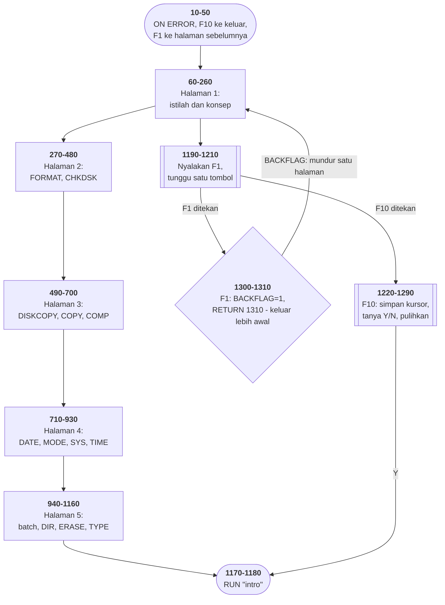

# HINTS.BAS di penelusur

> Program keempat puluh sembilan. 132 baris, nomor 10–1320, cakupan tabel
> **132/132 (100%)**.

Sumber: `run/HINTS.BAS` · tabel: `tracer/program/HINTS.js`

Lima halaman bantuan perintah DOS, dengan F1 untuk halaman sebelumnya dan F10
untuk keluar. Bukan permainan, bukan perhitungan — sebuah **pembaca dokumen**,
ditulis dengan cara satu-satunya yang tersedia pada 1982.

Dan di tengahnya ada satu baris yang layak seluruh halaman ini.

## RETURN yang tidak pulang ke tempatnya

Masalahnya kelihatan sederhana: pemakai sedang menunggu di dalam subrutin
(`GOSUB 1190`, menunggu tombol di baris 1210), dan menekan F1 harus membuat
**seluruh penungguan itu batal** lalu kembali ke halaman sebelumnya.

Di bahasa modern itu sebuah `break`, atau pengecualian, atau sinyal batal.
BASIC 1982 tidak punya satu pun. Yang dipunyainya: **`RETURN <nomor baris>`**.

```basic
1300 KEY(1) OFF:BACKFLAG=1:RETURN 1310
1310 RETURN
```

Jalannya:

```
baris 250    GOSUB 1190      ← alamat pulang PERTAMA masuk tumpukan (260)
baris 1210   Z=INKEY$: …     ← menunggu di sini
F1 ditekan   GOSUB 1300      ← alamat pulang KEDUA masuk tumpukan
baris 1300   RETURN 1310     ← alamat pulang KEDUA DIBUANG
baris 1310   RETURN          ← memakai alamat pulang PERTAMA → baris 260
```

Penungguan di baris 1210 **tidak pernah selesai**, tapi programnya melanjutkan
seolah-olah selesai — di baris 260, dengan `BACKFLAG` menyala.

Terverifikasi di penelusur, F1 ditekan saat menunggu di halaman 2:

```
setelah F1: baris berikutnya=1310   BACKFLAG=1
lanjut ke baris 110   (isi halaman 1)
```

Dua baris, dan sebuah pembatalan yang bersih. Tumpukannya tidak bocor, dan
tidak ada jejak yang tertinggal. Trik yang sama dipakai BIO.BAS baris 1680
untuk membatalkan penggambaran grafik yang sedang berjalan.

## Tombol yang cuma berarti di tempat tertentu

```basic
30   ON KEY(1) GOSUB 1300      ' dipasang sekali
1190 BACKFLAG=0:KEY(1) ON:…    ' dinyalakan tiap kali mulai menunggu
```

Pemasangan dan penyalaan **dipisah**, dan yang kedua itulah yang menentukan
konteksnya. Di luar penungguan, F1 tidak berarti apa-apa — dan itu disengaja:
"halaman sebelumnya" cuma masuk akal saat halaman sedang ditampilkan.

## F10: menyimpan kursor sebelum menimpanya

```basic
1220 KEY(10) OFF:XLIN=CSRLIN:XPOS=POS(0):LOCATE 25,1:PRINT SPC(79);
1280 PRINT " Strike <F10> To Leave This Program ";:COLOR 3,0:LOCATE XLIN,XPOS,0
```

`CSRLIN` dan `POS(0)` mencatat posisi kursor sebelum bilah pertanyaan menimpa
baris 25; baris 1280 mengembalikannya. Kalau jawabannya "N", pemakai kembali ke
halaman yang persis sama seperti sebelumnya.

Terverifikasi: F10 ditekan → `XLIN=24 XPOS=70` tersimpan → jawaban N → kembali
ke penungguan di baris 1210.

## Satu subrutin, dua jalan masuk

Baris 1270–1290 menggambar bilah bawah dan dipanggil tiap halaman lewat
`GOSUB 1270`. Tapi baris 1260 juga **jatuh ke bawah** ke sana:

```basic
1260 IF Z<>"n" AND Z<>"N" THEN 1240
1270 LOCATE 25,1:PRINT SPC(79);:LOCATE 25,23:COLOR 0,7
```

Jawaban "N" meneruskan langsung ke penggambar bilah, lalu `RETURN` di 1290
pulang dari jebakan F10. Satu subrutin yang dipakai sebagai subrutin *dan*
sebagai lanjutan.

## Peta arsitektur



## Dokumen yang harus berupa program

Lima halaman teks tentang perintah DOS. Pada 1982 tidak ada cara lain
menyampaikannya di layar selain **menulis program yang mencetaknya**. Tidak ada
penampil teks, tidak ada `more` yang bisa diandalkan ada, tidak ada format
dokumen. Yang ada BASIC, dan sebuah disket.

Jadi 132 baris ini pada dasarnya sebuah *pager*: menggambar bingkai, mencetak
halaman, menunggu tombol, menyediakan cara mundur. Persis pekerjaan yang
sekarang dikerjakan `less`, penampil PDF, atau sebuah halaman web.

Karena dokumennya **adalah** programnya, keduanya tidak bisa tidak sinkron —
tidak ada berkas bantuan yang bisa hilang, tidak ada versi yang bisa
ketinggalan. Dan harganya juga langsung: mengubah satu kalimat berarti
menyunting kode, dan menyisipkan satu halaman berarti mengubah nomor baris di
dua tempat.

## Yang bisa dicoba di halaman

| coba ini | yang terlihat |
|---|---|
| tekan F1 saat menunggu | `RETURN 1310` — penungguan batal, `BACKFLAG=1` |
| pasang titik henti di 1310 | tumpukan `GOSUB` yang tinggal satu |
| tekan F10 lalu N | `XLIN`/`XPOS` disimpan, lalu kursor dipulihkan |
| pasang titik henti di 1190 | `KEY(1) ON` — F1 baru berarti mulai dari sini |

## Penyimpangan dari aslinya

1. **`POKE 106,0` dijadikan pembuang penyangga tombol** (baris 1200), karena
   dipasangkan dengan gelung pembuang `IF INKEY$<>""` di baris yang sama.
2. **Berakhir dengan `RUN"intro`**, dan penangkap galat di baris 1320 dengan
   `RUN "menu` — keduanya tanpa tanda kutip penutup.

## Yang jangan ditiru

- **Lima salinan bingkai yang sama.** Baris 70–100, 280–310, 500–530, 710–740,
  950–980 menggambar bingkai dan judul yang identik. Empat puluh baris untuk
  sesuatu yang cukup satu subrutin — dan halaman 4 malah menggabungkan baris
  atasnya ke baris 710, jadi kelimanya tidak persis sama bentuknya.
- **Tanda kutip yang tidak pernah ditutup.** Baris 110, 120, 130, 320, 550,
  560, 580, 590, 750, 1180, 1250, 1320. Di berkas ini itu jelas kebiasaan,
  bukan kecelakaan.
- **Salah eja di dokumen bantuan.** `orginal` (590), `extention` (1030, 1060,
  1110). Ini **dokumentasi** — satu-satunya bagian program yang gunanya memang
  dibaca.
- **Nomor halaman yang ditulis di dua tempat.** Baris 480, 700, 930, 1160
  masing-masing menyebut nomor baris halaman sebelumnya. Menyisipkan satu
  halaman berarti mengubah dua tempat sekaligus.

---
[Rancangan penelusur](_rancangan.md) · [CURVE](curve.md) · [BOWLING](bowling.md) · [METEOR](meteor.md) · [Keluarga BUS*](bus-akuntansi.md)
