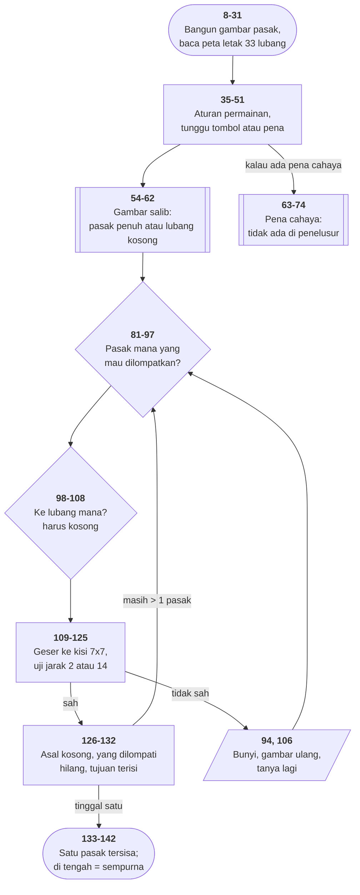

# HIQUE2.BAS di penelusur

> Program kelima puluh dua. 142 baris, nomor 1–142, cakupan tabel
> **142/142 (100%)**.

Sumber: `run/HIQUE2.BAS` · tabel: `tracer/program/HIQUE2.js`

Teka-teki Hi-Q oleh Wes Meier: 33 lubang berbentuk salib, 32 pasak, satu lubang
kosong di tengah. Lompati pasak untuk membuangnya; sisakan sesedikit mungkin.

**Dan gagasan pusatnya adalah mengubah salib jadi kisi.**

## Papan yang tidak beraturan

```
       1  2  3
       4  5  6
 7  8  9 10 11 12 13
14 15 16 17 18 19 20
21 22 23 24 25 26 27
      28 29 30
      31 32 33
```

Barisnya selebar 3, 3, 7, 7, 7, 3, 3. Pertanyaannya: apakah lubang 5 dan 17
cukup dekat untuk lompatan menegak? Selisihnya 12. Lubang 8 ke 22? Selisihnya
14. Keduanya lompatan menegak yang sah — tapi angkanya berbeda, karena baris
atasnya cuma selebar tiga.

Cara biasa: tabel ketetanggaan 33×4, setiap angkanya harus dimasukkan dengan
benar.

## Cara program ini: geser nomornya

```basic
109 IF MOVE.FROM<4 THEN MF=MOVE.FROM-6:GOTO 114
110 IF MOVE.FROM<7 THEN MF=MOVE.FROM-2:GOTO 114
111 IF MOVE.FROM>30 THEN MF=MOVE.FROM+6:GOTO 114
112 IF MOVE.FROM>27 THEN MF=MOVE.FROM+2:GOTO 114
113 MF=MOVE.FROM
```

Sesudah pergeseran itu, lubang 1 jadi −5, lubang 5 jadi 3, lubang 17 tetap 17,
lubang 32 jadi 38. Dan sekarang **setiap baris berjarak tepat tujuh**, seolah
papannya persegi 7×7 dan lubang yang tidak ada cuma tidak dipakai.

Maka seluruh aturan lompatan muat di satu baris:

```basic
119 IF ABS(MT-MF)<>2 AND ABS(MT-MF)<>14 THEN 106
```

Dua = dua kolom (mendatar). Empat belas = dua baris (menegak). Diagonal
otomatis tertolak karena selisihnya tidak pernah 2 maupun 14.

Dan pasak yang dilompati ada tepat di tengah — `(MF+MT)/2` — lalu digeser balik
oleh baris 121–124.

Terverifikasi di penelusur:

```
lompat 5 -> 17 :  MF=3  MT=17  (selisih 14)  OP=10
                  P(5)=0  P(10)=0  P(17)=-1   PEGS 32 -> 31
lompat 12 -> 18 (diagonal) : ditolak di baris 94
```

**Masalahnya tidak dipecahkan — ia dipindahkan ke ruang tempat ia sudah
terpecahkan.** Sembilan baris aritmetika menggantikan tabel yang harus diketik,
diperiksa, dan dijaga.

## Dua koordinat jadi satu angka

```basic
31 FOR X=1 TO 33:READ T(X):L2T(X)=L(X)^2-T(X):NEXT
```

Baris dikuadratkan lalu dikurangi kolom — satu bilangan yang unik untuk tiap
lubang. Dipakai subrutin pena cahaya di baris 71–73 supaya pencarian lubang
yang disentuh cukup **satu** perbandingan, bukan dua.

Sebuah *fungsi pemasangan*, ditulis tanpa menyebut namanya.

## Gambar dua dimensi dari satu string

```basic
11 A=STRING$(4,219)+STRING$(4,29)+CHR$(31)+STRING$(4,219)+CHR$(30)+"  "
```

Empat blok █, empat kali **kursor-kiri** (29), **kursor-bawah** (31), empat blok
lagi, **kursor-atas** (30), dua spasi.

Satu `PRINT A;` menggambar kotak 4×2 **dan mengembalikan kursornya**, siap untuk
lubang berikutnya. Bentuk yang sama dipakai [BOWLING.BAS](bowling.md) untuk rak
pinnya.

## Benar dan salah sebagai nilai

```basic
23 FULL=-1:EMPTY=NOT FULL
```

Karena perbandingan di BASIC menghasilkan −1 dan 0, kedua tetapan itu bisa
dipakai langsung: `IF P(X)=FULL` terbaca seperti kalimat, dan `IF USE.PEN`
bekerja tanpa perbandingan sama sekali.

## Nama variabel bertitik

`MOVE.FROM`, `MOVE.TO`, `USE.PEN`, `PEN.MOVE`. GW-BASIC mengizinkan titik di
nama variabel, dan penulisnya memakainya sebagai pemisah kata — empat puluh
tahun sebelum `snake_case` jadi kebiasaan umum.

## Peta arsitektur



## Yang bisa dicoba di halaman

| coba ini | yang terlihat |
|---|---|
| pasang titik henti di 119 | `MF` dan `MT` — nomor yang sudah digeser ke kisi |
| pasang titik henti di 120 | `OP` = pasak yang dilompati, tepat di tengah |
| ketik `5` lalu `17` | lompatan menegak pertama yang sah |
| ketik `12` lalu `18` | diagonal — ditolak tanpa penjelasan |
| pasang titik henti di 11 | gambar pasak dari kode gerak kursor |

## Penyimpangan dari aslinya

1. **Pena cahaya tidak ada.** `PEN ON`, `ON PEN GOSUB`, `PEN(8)/PEN(9)` tidak
   ditiru; `USE.PEN` selalu berakhir nol. Baris 63–74 tetap ada di tabel supaya
   cakupannya utuh, tapi **isinya kerangka kosong**.
2. **`SOUND` dan `PLAY` diam.**
3. **`COLOR 20` dan `COLOR 22` memakai atribut kedip** (4+16, 6+16); pasak yang
   sedang dipilih (baris 97) seharusnya berkedip.
4. **`POKE &H417,96` tidak ditiru** — bendera papan tombol BIOS.

## Yang jangan ditiru

- **Tidak ada uji buntu.** Baris 133 mengakhiri permainan **hanya** kalau
  tinggal satu pasak. Di Hi-Q, sebagian besar permainan berakhir dengan empat
  sampai enam pasak dan **tidak ada lompatan yang sah** — dan program ini akan
  terus bertanya selamanya, menolak setiap jawaban, tanpa mengatakan bahwa
  permainannya sudah selesai. Ujinya tidak sulit ditulis: bahannya sudah ada.
- **Penolakan tanpa alasan.** Delapan tempat melompat ke baris 94, yang cuma
  membunyikan nada. Lubang di luar papan, lubang kosong, diagonal, jarak salah
  — semuanya terdengar sama.
- **Gelung tunggu yang bergantung pada perangkat keras.** Baris 90 dan 102
  hanya bisa diakhiri jebakan pena; yang menyelamatkannya cuma baris 88 dan 100
  yang melompatinya.
- **Salah ketik di layar aturan.** Baris 37: *"Your task is to is to remove"*.

---
[Rancangan penelusur](_rancangan.md) · [MAXIT1](maxit1.md) · [BOWLING](bowling.md) · [KENO](keno.md)
