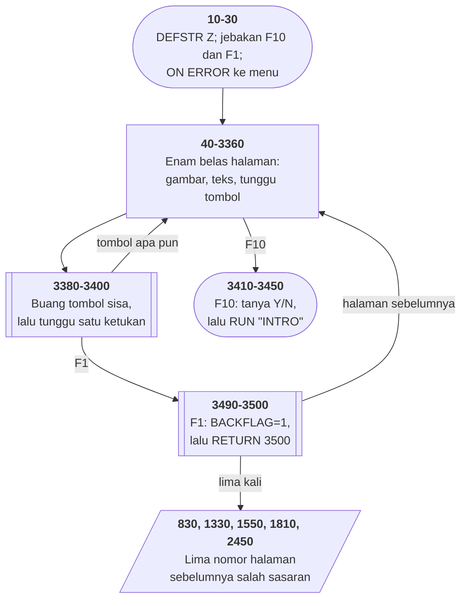

# HISTORY.BAS di penelusur

> Program keenam puluh lima. 351 baris, nomor 10–3510, cakupan tabel
> **351/351 (100%)**.

Sumber: `run/HISTORY.BAS` · tabel: `tracer/program/HISTORY.js`

History. Enam belas halaman pelajaran komputer untuk orang yang baru membuka kardus PC-nya — dengan tombol mundur yang salah sasaran di lima halaman.

## Tombol mundur yang mundur terlalu jauh

Susunan berkas ini rapi dan berulang. Tiap halaman menggambar isinya, lalu:

`GOSUB 3380`
`IF BACKFLAG THEN <nomor halaman sebelumnya>`

Dua baris, enam belas kali. Dan lima belas nomor yang harus ditulis tangan, satu per halaman.

Lima di antaranya salah.

Yang menarik bukan bahwa ada yang salah — melainkan **bagaimana** salahnya. Tidak ada satu pun yang menunjuk ke halaman berikutnya, atau ke nomor baris yang tidak ada, atau ke tengah-tengah sebuah halaman. Kelimanya menunjuk ke awal sebuah halaman yang sah — cuma halaman yang salah, dan selalu **terlalu jauh ke belakang**.

Itu tanda tangan salin-tempel. Penulisnya menyalin pasangan `GOSUB`/`IF` dari halaman sebelumnya, lalu lupa memperbarui nomornya. Dan karena nomor lama **tetap sebuah halaman yang sah**, tidak ada yang meledak.

Baris 1810 memberi petunjuk terakhir. Ia menulis `THEN 840`, dan 840 adalah halaman kelima — nilai yang seharusnya dipakai baris **1330**. Jadi nomornya bukan cuma lupa diperbarui; ia **bergeser satu halaman**, dan geseran itu ikut tersalin ke bawah.

Pelajarannya bukan "hati-hati menyalin". Pelajarannya: **nomor halaman sebelumnya tidak seharusnya ditulis tangan sama sekali**. Sebuah larik nomor halaman, dan satu penunjuk yang naik-turun, akan membuat kelima cacat ini mustahil ada.

## Sebuah PC menjelaskan dirinya sendiri

Program ini ditulis untuk orang yang baru saja membuka kardus IBM PC-nya dan tidak tahu apa yang ada di dalamnya.

Halaman pertama menggambar bingkai di sekeliling layar dan mengatakan: *bingkai ini adalah ENIAC*. Seluas 1500 kaki persegi, berbobot 30 ton, 18.000 tabung hampa yang satu di antaranya rusak tiap tujuh menit. Di dalamnya ada kotak kecil bertuliskan IBM 360, dan kotak yang lebih kecil lagi bertuliskan PC.

Tiga benda dalam satu layar, dengan skala yang bisa dilihat mata. Untuk sebuah pelajaran teks 80×25, itu cara menjelaskan yang sulit dikalahkan.

Yang lain-lainnya juga menarik dibaca hari ini. *"Setiap disket memuat sampai 64 BERKAS"* (baris 2090) — angka yang benar untuk direktori akar disket PC pertama. *"1 MEG kira-kira 333 HALAMAN"*. *"CPU di IBM PC empat kali lebih cepat daripada 360"*.

Dan lima belas perintah merawat disket, yang ditutup dengan: *"Perlakukan disket seperti piringan hitam, bukan frisbee."*

Berkas ini mengajarkan komputer kepada orang yang belum pernah memegangnya — dan hari ini ia jadi bahan pelajaran tentang sesuatu yang lain: bagaimana lima belas nomor yang ditulis tangan menghasilkan lima cacat yang tak seorang pun melihatnya.

## Peta arsitektur

## Alur yang layak diikuti

| baris | yang terjadi |
|---|---|
| `3490` | F1 → `BACKFLAG=1`, lalu `RETURN 3500` — **buang alamat pulang** |
| `3380` | jadi `GOSUB 3380` kembali dengan bendera menyala… |
| `830` | …dan `IF BACKFLAG THEN 40` membuang pembaca ke **halaman pertama**, bukan ketiga |
| `1330` | `THEN 580` — salinan baris 1010 yang tidak diperbarui |
| `1550` | `THEN 580` lagi — salinan yang sama, dua halaman berturut-turut |
| `10` | `DEFSTR Z` — Z bertipe string **tanpa tanda dolar**; satu-satunya di koleksi ini |
| `3390` | `POKE 106,0` dalam gelung sampai `INKEY$` kosong — perbaikan yang **hilang** dari MUSIC.BAS |
| `2050` | halaman kesepuluh **tidak** memanggil CLS — ia menimpa bingkai halaman kesembilan |
| `3510` | `ON ERROR` → `RUN "menu"`: **setiap** galat pulang diam-diam |

## Yang bisa dicoba di halaman

| coba ini | yang terlihat |
|---|---|
| pasang titik henti di 3490 | F1 → `BACKFLAG=1`, lalu `RETURN 3500` — **buang alamat pulang** |
| pasang titik henti di 3380 | jadi `GOSUB 3380` kembali dengan bendera menyala… |
| pasang titik henti di 830 | …dan `IF BACKFLAG THEN 40` membuang pembaca ke **halaman pertama**, bukan ketiga |
| pasang titik henti di 1330 | `THEN 580` — salinan baris 1010 yang tidak diperbarui |
| pasang titik henti di 1550 | `THEN 580` lagi — salinan yang sama, dua halaman berturut-turut |

Aslinya dijalankan dengan `run\\HISTORY.bat`.

> Tombol apa pun maju satu halaman, F1 mundur, F10 keluar. Coba tekan F1 di halaman keempat, keenam, ketujuh, kedelapan, dan kesebelas — kelimanya mendarat di halaman yang salah.

## Penyimpangan dari aslinya

1. **`RUN "intro"` dan `RUN "menu"` tidak bisa dijalankan** — INTRO.BAS dan MENU.BAS tidak ada di koleksi ini. Penelusur berhenti dengan pesan program tidak ditemukan.
2. **`ON ERROR GOTO 3510` dipasang tapi tidak pernah terpicu**; tidak ada jalur di berkas ini yang membangkitkan galat.
3. **`DEF SEG:POKE 106,0` ditiru sebagai pengosongan penyangga tombol** — itu memang persis artinya di GW-BASIC.
4. **Warna 1 (biru tua) di baris 1690 dan warna 0,7 (hitam di atas putih) tetap ditampilkan**, tapi konsol penelusur tidak punya pinggiran layar, jadi argumen ketiga `SCREEN` diabaikan.

## Yang layak ditiru

**Membuang alamat pulang untuk membawa jawaban.** Jebakan F1 di baris 3490 tidak bisa langsung memberitahu halaman mana yang sedang dibuka — ia bisa terpicu di mana saja. Yang dilakukannya: setel `BACKFLAG=1`, lalu `RETURN 3500`. `RETURN <baris>` **membuang** alamat pulang di tumpukan dan melanjutkan di baris yang disebut. Baris 3500 adalah `RETURN` biasa — miliknya subrutin 3380. Jadi jebakan itu memaksa `GOSUB 3380` pulang lebih awal, membawa bendera. Pemanggilnya lalu tinggal menulis satu baris: `IF BACKFLAG THEN <halaman sebelumnya>`. Setiap halaman tahu tetangganya sendiri, dan jebakannya tidak perlu tahu apa-apa.

**Membuang tombol yang terlanjur tertekan.** Baris 3390: `DEF SEG:POKE 106,0:IF INKEY$<>"" THEN 3390`. Ia mengosongkan penyangga tombol **berulang kali** sampai `INKEY$` benar-benar kosong, baru menunggu ketukan yang sebenarnya di 3400. Tanpa itu, satu ketukan nyasar dari halaman sebelumnya akan langsung membalik dua halaman sekaligus. Ini **persis** perbaikan yang hilang dari MUSIC.BAS dan baru muncul di MUSIC1.BAS — dan di sini ia sudah ada sejak awal, lengkap dengan gelungnya.

**Halaman yang menumpang bingkai tetangganya.** Halaman kesepuluh (baris 2050) tidak memanggil `CLS`. Ia langsung mencetak judul dan isinya di atas bingkai yang digambar halaman kesembilan — karena bingkainya memang sama persis. Menggambar bingkai 80×23 dengan `LOCATE` dan `PRINT` butuh dua puluh dua putaran gelung. Melewatinya membuat halaman itu muncul seketika, sementara yang lain tergambar baris demi baris.

**Tanda kutip yang tidak bisa diketik.** Baris 780: `PRINT CHR$(34)"BRAIN"CHR$(34)`. BASIC tidak punya aksara pelolos — tidak ada cara menulis tanda kutip **di dalam** string. Satu-satunya jalan adalah menyebut kode ASCII-nya dan menyambungnya.

**Satu variabel string tanpa tanda dolar.** `DEFSTR Z` di baris 10 membuat setiap variabel yang namanya dimulai Z bertipe string. Itu sebabnya baris 3400 bisa menulis `Z=INKEY$`. Satu-satunya `DEFSTR` di seluruh koleksi ini — program lain memakai `DEFINT` atau tidak sama sekali.

## Yang jangan ditiru

**Lima tombol mundur yang salah sasaran.** Enam belas halaman, lima belas nomor "halaman sebelumnya", dan **lima** di antaranya menunjuk ke halaman yang keliru: ` 830` halaman ke-4 → ke-1 *(seharusnya ke-3)*
`1330` halaman ke-6 → ke-4 *(seharusnya ke-5)*
`1550` halaman ke-7 → ke-4 *(seharusnya ke-6)*
`1810` halaman ke-8 → ke-5 *(seharusnya ke-7)*
`2450` halaman ke-11 → ke-9 *(seharusnya ke-10)* Polanya jelas: semuanya melompat **terlalu jauh ke belakang**, tidak ada satu pun yang melompat ke depan. Baris 1010 menulis `THEN 580` dan itu benar. Baris 1330 dan 1550 adalah salinannya. Dan baris 1810 menulis `THEN 840` — nilai yang justru seharusnya dipakai baris 1330. Nomornya bergeser satu halaman, dan **bergesernya ikut tersalin**.

**Cacat yang tidak pernah menghasilkan galat.** Menekan F1 di halaman keempat tidak menghentikan apa pun. Layar berganti, isinya sah, bingkainya rapi — cuma bukan halaman yang barusan dilihat pembacanya. Dan pembaca yang baru belajar komputer tidak punya cara tahu bahwa yang salah programnya. Yang lebih mungkin ia simpulkan: *"saya yang salah ingat"*.

**Setiap galat pulang diam-diam.** `ON ERROR GOTO 3510`, dan baris 3510 berbunyi `RUN "menu"`. Apa pun yang salah — berkas hilang, bagi nol, memori habis — jawabannya sama: kembali ke menu, tanpa pesan. Pemakainya melihat program tiba-tiba menutup diri.

**Nama berkas dengan besar-kecil yang berbeda.** Baris 360 dan 3370 menulis `RUN"intro`; baris 3440 menulis `RUN"INTRO`. Di DOS tidak ada bedanya, dan di sinilah kebiasaan itu tumbuh — kebiasaan yang jadi cacat begitu kodenya pindah ke sistem berkas yang membedakannya.

**Kata yang tersambung dua kali.** Baris 530 berakhir dengan *"…(central processing unit) in"* dan baris 540 dimulai dengan *"in the IBM P C is…"*. Di layar terbaca *"unit) in in the IBM P C"*. Salah sambung yang cuma terlihat kalau kedua barisnya dibaca berurutan — dan penulisnya menulis keduanya terpisah.

**Salah eja di komentar dan di layar.** `OPERATING SYSYEMS` (baris 2210, di dalam REM) dan "Dartmouth **University**" (baris 2810) — yang benar Dartmouth **College**.

---
[Rancangan penelusur](_rancangan.md) · [TEM-INS](tem-ins.md) · [HINTS](hints.md) · [ANATOMY](anatomy.md)
