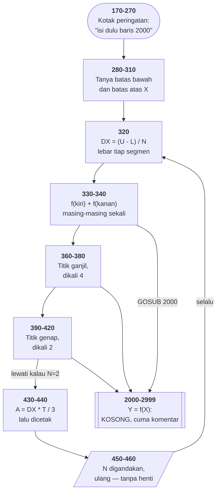

# INTEGRAT.BAS di penelusur

> Program ketiga puluh empat. 42 baris, nomor 100–2999, cakupan tabel
> **42/42 (100%)**.

Sumber: `run/INTEGRAT.BAS` · tabel: `tracer/program/INTEGRAT.js`

Integral tentu dengan **aturan Simpson**, dari Feldman & Rugg 1982. Program
pertama di koleksi ini yang matematikanya sungguhan dan bukan permainan.

Dan program pertama yang **sengaja dikirim dalam keadaan belum selesai**.

## Baris kosong yang jadi antarmuka

```basic
2000 REM **** Y=F(X) Goes Here ************
```

Itu saja. Sebuah komentar. Pemakainya diharapkan mengetik sendiri baris
penggantinya di prompt GW-BASIC — `2000 Y=X*X` — lalu `RUN`. Baris bernomor
sama menimpa yang lama, dan seluruh sisanya menyesuaikan tanpa disentuh.

Yang sedang terjadi adalah **menyuntikkan perilaku ke dalam algoritma umum**.
Di bahasa modern kita menyerahkan fungsi sebagai argumen — `integrate(f, a, b)`.
BASIC 1982 tidak punya fungsi sebagai nilai, jadi yang disepakati bukan nama
parameter melainkan **nomor baris**: 2000–2999 milik pemakai, sisanya milik
program.

Kelemahannya kelihatan begitu disebut: **tidak ada yang memaksakan kesepakatan
itu**. Kalau baris 2000 dibiarkan, `Y` tetap 0 — nilai awal setiap variabel
BASIC — dan programnya berjalan mulus sambil mengintegralkan fungsi nol.

Terverifikasi apa adanya di penelusur, batas 0 sampai 1:

```
N=2   A=0   DX=0.5
N=4   A=0   DX=0.25
N=8   A=0   DX=0.125
N=16  A=0   DX=0.0625
N=32  A=0   DX=0.03125
```

**Sebuah program yang berjalan sempurna tanpa melakukan satu pun kesalahan, dan
tidak menghitung apa pun.**

Kotak peringatan bergaris ganda di baris 180–250 ada karena penulisnya tahu
persis bahwa orang akan menjalankannya begitu saja. Peringatan yang ditulis
*karena masalahnya sudah diketahui* hampir selalu menandakan tempat yang
seharusnya diperiksa program, bukan dibaca manusia.

## Kalau baris 2000 diisi

Diuji dengan `2000 Y=X*X` disisipkan hanya untuk pengujian — **berkas yang
dikirim tetap kosong seperti aslinya**. Integral x² dari 0 ke 1 seharusnya ⅓:

```
N=2   A=0.3333333333333333
N=4   A=0.3333333333333333
```

Tepat, sejak segmen pertama. Aturan Simpson memang **eksak** untuk polinom
sampai derajat tiga — parabolanya bukan hampiran lagi, melainkan kurvanya
sendiri.

Yang lebih menarik, `2000 Y=SIN(X)`, dari 0 sampai π (seharusnya 2):

| N | hasil | galat |
|--:|---|---|
| 2 | 2,0943951024 | 9,4 × 10⁻² |
| 4 | 2,0045597550 | 4,6 × 10⁻³ |
| 8 | 2,0002691699 | 2,7 × 10⁻⁴ |
| 16 | 2,0000165910 | 1,7 × 10⁻⁵ |
| 32 | 2,0000010334 | 1,0 × 10⁻⁶ |
| 64 | 2,0000000645 | 6,5 × 10⁻⁸ |
| 128 | 2,0000000040 | 4,0 × 10⁻⁹ |

Galatnya menyusut **kira-kira 16 kali tiap segmennya digandakan**. Itu bukan
kebetulan: 16 = 2⁴, dan aturan Simpson berorde empat. Membaca kolom itu dari
atas ke bawah adalah cara melihat kekonvergenan dengan mata sendiri.

## Kenapa parabola dan bukan persegi panjang

Cara paling sederhana menghitung luas di bawah kurva: potong jadi persegi
panjang tipis, jumlahkan. Kesalahannya menyusut sebanding dengan lebar
potongannya.

Simpson mengganti tiap **pasang** potongan dengan parabola yang melewati tiga
titiknya. Karena parabola melengkung mengikuti kurvanya, kesalahannya menyusut
sebanding dengan **pangkat empat** lebar potongannya — itulah angka 16 di tabel
atas.

Bobot 1–4–2–4–…–4–1 yang terlihat di baris 330–420 adalah akibat langsung dari
aljabar parabola itu:

```basic
330 X=L:GOSUB 2000:T=T+Y        ' ujung kiri, sekali
340 X=U:GOSUB 2000:T=T+Y        ' ujung kanan, sekali
360 FOR J=1 TO M                ' titik ganjil
380   Z=Z+Y:NEXT:T=T+4*Z        '   dikali 4
400 Z=0:FOR J=1 TO M            ' titik genap
420   NEXT:T=T+2*Z              '   dikali 2
430 A=DX*T/3
```

Itu sebabnya `N` harus **genap**. Baris 160 memulainya dari 2 dan baris 450
selalu menggandakannya, jadi syarat itu terpenuhi tanpa perlu diperiksa — salah
satu keputusan paling rapi di program ini.

## Gelung yang tidak pernah selesai

```basic
450 N=N*2
460 GOTO 320
```

Tidak ada batas putaran, tidak ada uji kekonvergenan, tidak ada tawaran keluar.
Ctrl-Break satu-satunya jalan.

Gagasannya benar — menggandakan segmen supaya pemakainya bisa melihat angkanya
mengendap. Yang hilang cuma satu baris:

```basic
445 IF ABS(A-A0)<.0001 THEN END ELSE A0=A
```

Tanpa itu, `N` terus berlipat melewati sejuta, dan tiap putaran memanggil
subrutin 2000 sebanyak `N+1` kali. **Uji berhenti itulah yang seharusnya jadi
inti sebuah penghitung integral** — dan justru itu yang tidak ditulis.

Di halaman ini gelung itu juga tidak berhenti sendiri: pakai **Jeda**, atau
pasang titik henti di baris 440 dan perhatikan `N` berlipat dua tiap kali baris
itu tersorot.

## Peta arsitektur



## Yang bisa dicoba di halaman

| coba ini | yang terlihat |
|---|---|
| jalankan apa adanya | kolom hasil nol semua — kerangka yang tak diisi |
| pasang titik henti di 440 | `N` berlipat dua tiap kali baris itu tersorot |
| pasang titik henti di 370 | titik ganjil: `X = L + DX*(2J-1)` |
| pasang titik henti di 410 | titik genap: `X = L + DX*2J` |
| lihat baris 270 | satu baris kotak kosong, dipanggil enam kali |

## Penyimpangan dari aslinya

1. **`WIDTH 40` tidak ditiru**; konsol tetap 80 kolom. Tampilan kotaknya tidak
   berubah karena seluruh isinya di dalam kolom 31, tapi barisnya tidak
   membungkus di tempat yang sama.
2. **Koma di `PRINT` ditiru dengan `TAB(15)`.** Di GW-BASIC koma memindahkan ke
   zona 14 kolom berikutnya; di sini kolomnya dipatok.
3. **Baris 2000 dibiarkan kosong seperti aslinya.** Bukan kelalaian — itu isi
   programnya.

## Yang jangan ditiru

- **Gelung tanpa syarat berhenti.** Baris 450–460.
- **Kerangka yang diam saja kalau tidak diisi.** `Y` tetap 0, hasilnya nol,
  tanpa satu pun galat.
- **Kotak peringatan sebagai pengganti pemeriksaan.**

---
[Rancangan penelusur](_rancangan.md) · [SIMEQN](simeqn.md) · [READING](reading.md) · [WORDS](words.md) · [NOTETABL](notetabl.md)
