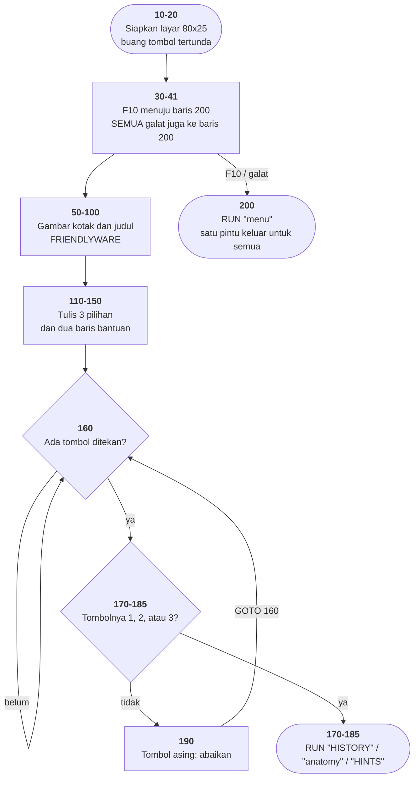

# INTRO.BAS di penelusur

> Program kedua yang ditelusuri. 23 baris, nomor 10–200, cakupan tabel
> **23/23 (100%)**.

Sumber: `run/INTRO.BAS` · tabel: `tracer/program/INTRO.js` ·
analisis: [`reviews/INTRO.md`](../../reviews/INTRO.md)

## Kenapa ini yang kedua

Bukan karena ia yang paling menarik, tapi karena ia **menagih paling banyak
dari mesinnya per baris**. Rencananya memang begitu: biarkan program kedua yang
memberi tahu bagian mana dari mesin yang masih kurang. INTRO menagih tiga hal,
dan ketiganya berlaku untuk dua puluh dua program sisanya.

### 1. Glif CP437

```basic
60  LOCATE 1,19:PRINT CHR$(218) STRING$(42,196) CHR$(191)
```

`CHR$(196)` **bukan** "karakter nomor 196 dalam Unicode" (yang akan keluar
sebagai `Ä`). Ia glif nomor 196 di ROM font kartu CGA, yaitu garis mendatar
`─`. Tanpa tabel pemetaan, kotak di baris 60–80 keluar sebagai huruf beraksen
acak dan tidak ada yang tahu kenapa.

`mesin/konsol.js` sekarang memuat pemetaan 256 kode CP437 ke Unicode. Tabelnya
ditulis sebagai daftar kode heksadesimal, bukan sebagai huruf-hurufnya
langsung — dua kali di repositori ini karakter tak terlihat ikut tersalin ke
berkas sumber dan baru ketahuan berjam-jam kemudian.

### 2. Jebakan tombol fungsi yang benar-benar menyala

Di `MENU.BAS`, kesepuluh jebakan `ON KEY` hanya menuju `RETURN` — mandul
dengan sengaja. Di sini F10 menuju baris 200 yang memuat program lain, jadi
jebakannya punya akibat yang terlihat, dan mesinnya harus benar-benar
mendukungnya.

Yang ditambahkan ke `mesin/penjalan.js`:

- `m.pasangJebakan(n, baris)` untuk `ON KEY(n) GOSUB baris`
- `m.jebakan(n, nyala)` untuk `KEY(n) ON` / `KEY(n) OFF`
- penjemputan di **batas baris**, sebelum baris berikutnya dijalankan
- jebakan mati selama penangannya berjalan, hidup lagi saat `RETURN` —
  tanpa ini, satu tombol yang ditahan menumpuk panggilan sampai tumpukannya
  habis
- tombol fungsi tanpa jebakan yang menyala **dibuang**, tidak menumpuk

Ini sekaligus membuat jebakan `MENU.BAS` jadi hidup: tekan F1 di sana dan
penunjuknya melompat ke 510 lalu pulang.

### 3. `STRING$(n, kode)` dan `SPC(n)`

`SPC(42)` mencetak 42 spasi (bergerak relatif); `TAB(42)` menuju kolom 42
(mutlak). Keduanya sekarang ada dan berbeda, karena baris 80 memakai `SPC` dan
`MENU.BAS` memakai `TAB`.

## Peta arsitektur

Dihasilkan oleh `TRACER.peta.mermaid()` dari data `arsitektur` di
[`tracer/program/INTRO.js`](../program/INTRO.js) — sumber yang sama dengan peta
SVG di halaman penelusur.



Bandingkan bentuknya dengan [peta MENU.BAS](menu.md#peta-arsitektur): hampir
sama persis. Itu bukan kebetulan — keduanya menu, dan keduanya disalin dari
templat yang sama. Bedanya cuma satu panah: di sini ada jalur langsung dari
pemasangan jebakan ke pintu keluar, dan panah itulah seluruh cerita program ini.

## Pseudokode

```
baris  10   sembunyikan baris label tombol fungsi
baris  20   siapkan layar teks 80x25, buang tombol yang tertunda
baris  30   kalau F10 ditekan, PANGGIL BARIS 200
baris  40   nyalakan jebakan F10 - memasang dan menyalakan itu dua hal terpisah
baris  41   kalau ada galat apa pun, JUGA LOMPAT KE BARIS 200
baris  60   gambar sisi atas kotak: sudut + 42 garis + sudut
baris  70   gambar sisi bawah kotak
baris  80   gambar sisi kiri dan kanan - kotaknya digambar dari luar ke dalam
baris 100   tulis "FRIENDLYWARE" terbalik-warna di dalam kotak
baris 110   tulis "Introduction To Computers"
baris 120   tulis pilihan 1, 2, dan 3
baris 150   tulis "Strike <F10> To Leave" di baris 25 (tanpa turun baris!)
baris 160   ULANG SELAMANYA:
baris 160       tombol = tombol yang sedang ditekan
baris 160       kalau kosong, coba lagi dari awal gelung
baris 170       kalau "1": muat program HISTORY
baris 180       kalau "2": muat ANATOMY
baris 185       kalau "3": muat HINTS
baris 190       tombol lain - abaikan, ulangi gelung
baris 200   PINTU KELUAR (dipakai F10 dan semua galat):
baris 200       muat program menu - tidak pernah kembali ke sini
```

## Penjelasan untuk pemula

### Program terpendek adalah pintu masuk terbaik

Dua puluh tiga baris. Baris 10–90 di program ini **identik** dengan
`HEAREYE.BAS` — keduanya lahir dari templat yang sama, disalin lalu diubah
bagian tengahnya.

Kalau Anda menghadapi kumpulan program yang ditulis satu tim, carilah yang
paling pendek dan pelajari itu lebih dulu. Ia biasanya memperlihatkan kerangka
bersamanya tanpa tertutup logika permainan. Sekali mengerti kerangka ini, dua
puluh program lain terbaca jauh lebih cepat.

### Dua jalur, satu pintu keluar

Perhatikan peta alur di atas: baris 30 mengarahkan tombol F10 ke baris 200, dan
baris 41 mengarahkan **semua galat** ke baris 200 juga.

Jadi apa pun yang terjadi — pemakai menekan F10, atau ada cacat tak terduga di
baris mana pun — hasilnya identik: kembali ke menu dengan tenang.

Itu keputusan produk, bukan kemalasan. Program ini dijual ke orang yang baru
pertama kali memegang komputer pada 1982. Menampilkan `Syntax error in 170`
lalu meninggalkan mereka di prompt `Ok` jauh lebih buruk daripada diam-diam
kembali ke menu.

### Tapi jangan tiru ini di program Anda sendiri

Menelan semua galat itu anggun bagi pemakai dan **buta total bagi pembuatnya**.
Kalau ada salah ketik di baris 100, program ini akan kembali ke menu seolah
tidak terjadi apa-apa — selamanya, tanpa satu pun catatan.

Aturan praktisnya: **tangani galat yang Anda antisipasi, dan biarkan yang tidak
Anda antisipasi terlihat** — atau setidaknya tercatat di suatu tempat yang Anda
baca.

### Memasang dan menyalakan adalah dua hal

Baris 30 (`ON KEY(10) GOSUB 200`) memberi *alamat*: kalau F10 ditekan, ke mana
harus pergi. Baris 40 (`KEY(10) ON`) yang *menghidupkan* jebakannya.

Di antara kedua baris itu ada celah nyata: jebakannya sudah punya alamat tapi
belum aktif. Di sini celahnya cuma selebar satu baris, jadi tidak jadi masalah.
Tapi pola "daftarkan dulu, aktifkan kemudian" ada di mana-mana — pendengar
kejadian, langganan, sinyal — dan celah di antaranya adalah tempat cacat
berumah.

### GOSUB yang tidak pernah pulang

F10 memanggil baris 200 lewat `GOSUB`. Baris 200 menjalankan `RUN"menu"`. Tidak
ada `RETURN` di mana pun.

Biasanya itu cacat: setiap `GOSUB` menaruh alamat pulang di tumpukan, dan
tumpukan yang tidak pernah dikosongkan akan penuh. Di sini tidak jadi masalah
karena `RUN` membuang **seluruh** program berikut tumpukannya. Tidak ada lagi
yang menunggu untuk dipulangi.

Pelajarannya bukan "boleh tidak RETURN", melainkan: **sebuah aturan bisa aman
dilanggar kalau Anda tahu persis kenapa aturan itu ada**. Yang berbahaya adalah
melanggarnya tanpa tahu.

## Jejak eksekusi yang terverifikasi

```
20 → 30 → 40 → 41 → 50 → 60 → 70 → 80 → 90 → 100 → 110 → 120 → 130 → 135
   → 140 → 150 → 160 → 160 → 160 …
```

Kotaknya digambar dari luar ke dalam: baris 1 (sisi atas), lalu baris 3 (sisi
bawah), **baru** baris 2 (sisi kiri-kanan). Urutan yang tidak intuitif tapi
tidak salah — dan terlihat langsung kalau lajunya diturunkan ke 1 baris/detik.

## Yang bisa dicoba di halaman

| coba ini | yang terlihat |
|---|---|
| tekan `F10` | penunjuk melompat ke baris 200 lewat GOSUB, lalu `RUN"menu"` memuat MENU.BAS dari nol. **GOSUB itu tidak pernah pulang** — dan tidak apa-apa, karena RUN membuang tumpukannya sekalian. |
| tekan `1`, `2`, atau `3` | penelusuran berhenti: `HISTORY.BAS`, `ANATOMY.BAS`, `HINTS.BAS` ada di `run/` tapi di luar cakupan penelusur. |
| pasang titik henti di 80, lalu Jalan | berhenti dengan kotak yang **belum punya sisi kiri-kanan** — sisi atas dan bawah sudah ada. |
| turunkan laju ke 1 baris/detik | terlihat urutan menggambar kotak yang tidak intuitif itu. |

## Arsitektur keluar: dua jalur, satu tujuan

```basic
30 ON KEY(10) GOSUB 200
41 ON ERROR GOTO 200
```

Tombol keluar dan penangan galat menunjuk **baris yang sama**. Apa pun yang
terjadi — pemakai menekan F10, atau ada galat tak terduga — hasilnya identik:
kembali ke menu dengan tenang.

Itu keputusan produk, bukan kemalasan. Friendlyware dijual ke pemula;
menampilkan `Syntax error in 170` lalu meninggalkan mereka di prompt `Ok` jauh
lebih buruk daripada kembali ke menu.

Bandingkan dengan `MENU.BAS`, yang menangani `ERR=53` secara spesifik lalu
mematikan penangkapnya:

| | `INTRO.BAS` | `MENU.BAS` |
|---|---|---|
| galat yang diantisipasi | ditelan | ditangani khusus |
| galat lain | **juga ditelan** | dibiarkan terlihat |

Untuk produk konsumen, sikap INTRO masuk akal. Untuk perkakas pengembang, sikap
MENU yang benar. Yang tidak pernah benar adalah menelan semua galat **tanpa
mencatatnya di mana pun** — dan itulah yang dilakukan program ini.

## Penyimpangan dari aslinya

Semuanya juga tampil di halaman:

1. **Jebakan F10 dijemput di batas baris, bukan batas pernyataan.** Di baris
   yang memuat banyak pernyataan, tombol fungsi tertunda lebih lama di sini
   daripada di GW-BASIC.
2. **Ketiga pilihan menu berhenti, bukan berjalan** — di luar cakupan
   penelusur, dan yang berhenti mengatakan alasannya.
3. **`KEY OFF`, `SCREEN 0,0,0`, `WIDTH 80` tidak berbuat apa-apa.** Konsolnya
   memang sudah mode teks 80×25 tanpa baris label tombol fungsi. Akibat
   sampingannya kebetulan menguntungkan: baris 25 selalu bebas, jadi baris 150
   tetap punya tempat menulis.
4. **Kedip tidak ditiru.** Selera, dan dinyatakan sebagai selera.

Satu hal yang **tidak** menyimpang dan mungkin terlihat seperti cacat: kursor
tetap terlihat berkedip di layar. `INTRO.BAS` tidak pernah memanggil
`LOCATE ,,0` seperti `MENU.BAS`, jadi memang begitulah tampilannya di mesin
aslinya.

## Membandingkan dengan yang asli

```
run\INTRO.bat
```

Baris 10–90 di program ini identik dengan `HEAREYE.BAS`; keduanya lahir dari
templat yang sama. Sekali mengerti kerangka ini, dua puluh program lain
terbaca lebih cepat.

---
[Rancangan penelusur](_rancangan.md) · [Catatan MENU](menu.md) · [Review INTRO.BAS](../../reviews/INTRO.md)
