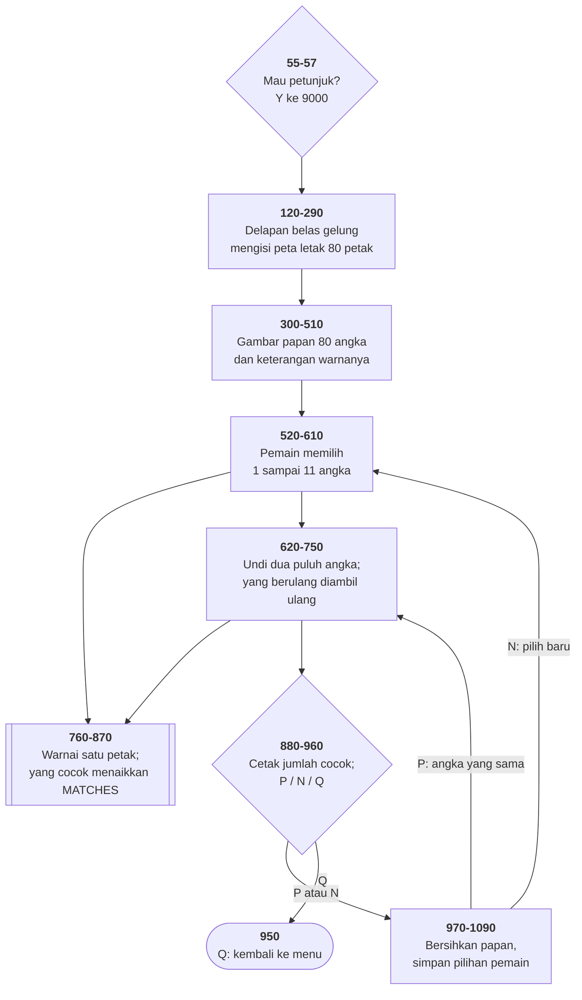

# KENO.BAS di penelusur

> Program kelima puluh. 137 baris, nomor 10–9140, cakupan tabel
> **137/137 (100%)**.

Sumber: `run/KENO.BAS` · tabel: `tracer/program/KENO.js`

Steve Schlich, September 1984. Papan 80 angka; pemain memilih 1–11, komputer
mengundi 20, dan yang cocok diwarnai.

Dua hal yang layak ditelusuri, dan keduanya soal **nama**.

## `ROW()` menyimpan kolom, `COL()` menyimpan baris

```basic
840 LOCATE COL(C1),ROW(C1)
```

`LOCATE` di BASIC menerima **baris dulu, kolom kemudian**. Jadi larik bernama
`COL` berisi nomor baris, dan `ROW` berisi nomor kolom.

Isinya mengkonfirmasi — terverifikasi di penelusur:

```
petak  1  ->  baris 2,  kolom 16
petak 80  ->  baris 18, kolom 61
```

`ROW()` diisi 16, 21, 26, … 61 — sepuluh nilai berjarak lima, untuk sepuluh
kolom papan. `COL()` diisi 2, 4, 6, 8, 12, 14, 16, 18 — delapan nilai, untuk
delapan baris papan.

Programnya **benar**: kedua larik dipakai konsisten di ketiga tempat yang
menyentuhnya. Tidak ada satu pun cacat yang timbul dari sini.

Yang timbul cuma satu hal, dan ia tidak terlihat di keluaran program: **setiap
orang yang membaca baris 840 akan berhenti dan membacanya dua kali.** Nama yang
salah tidak membuat program gagal; ia membuat pembacanya gagal, sekali per
pembaca, selamanya.

## Delapan belas gelung untuk satu rumus

```basic
120 FOR C1=1 TO 71 STEP 10: ROW(C1)=16: NEXT C1
130 FOR C1=2 TO 72 STEP 10: ROW(C1)=21: NEXT C1
…
260 FOR C1=41 TO 50: COL(C1)=12: NEXT C1
```

Bisa ditulis dua baris:

```basic
ROW(n) = 16 + 5*((n-1) MOD 10)
COL(n) =  2 + 2*INT((n-1)/10)
```

Yang menghalangi cuma satu ketidakteraturan: baris judul `* * * P C * K E N O
* * *` di tengah papan membuat barisnya melompat dari **8 ke 12**, bukan 10.

**Satu pengecualian, dan seluruh rumus ditulis panjang** — padahal satu `IF`
sudah cukup.

## Mengambil ulang tanpa gelung tambahan

```basic
660 FOR D1=1 TO 20
670 CHOICE=INT(RND*80)+1
680 IF CHOSEN(CHOICE)<>1 THEN 700
690 D1=D1-1: GOTO 740
700 CHOSEN(CHOICE)=1
740 NEXT D1
```

Kalau angka yang keluar sudah pernah muncul, pencacah gelungnya **dikurangi**
lalu dilanjutkan ke `NEXT` — yang menaikkannya kembali. Hasilnya putaran itu
tidak dihitung.

Mengubah variabel `FOR` dari dalam gelungnya sendiri dilarang di banyak bahasa
modern, dan di sini justru bentuk paling ringkas dari *rejection sampling*.

Terverifikasi: dua puluh angka terundi, tanpa satu pun pengulangan.

## Warna sebagai keterangan

Empat keadaan petak dibedakan **hanya dengan warna**:

| keadaan | warna | baris |
|---|---|--:|
| dipilih pemain | hitam di atas cyan | 770 |
| diundi komputer | hitam di atas putih | 830 |
| **keduanya** | ungu **berkedip** | 810 |
| bukan keduanya | kuning di atas hitam | 860 |

Baris 510 mencetak keterangannya di baris 25. Tidak ada satu huruf pun yang
menandai keadaan — seluruh papan terbaca dari warnanya.

Terverifikasi dengan 11 pilihan: `MATCHES=1`, cocok dengan penghitungan silang
langsung atas `PICK()` dan `CHOSEN()`.

## Janji yang tidak ada di kode

```basic
9050 PRINT"will come up.  Your payoff (if there is one) depends on the ratio between"
9060 PRINT"how many spots you picked and how many came up during the game."
```

Kalimat itu benar untuk Keno sungguhan: di kasino, 3 dari 5 pilihan membayar
berbeda dari 3 dari 10, dan seluruh tabel pembayarannya adalah inti permainan.

Di program ini **tidak ada pembayaran**. Tidak ada taruhan, tidak ada saldo,
tidak ada tabel. Yang dicetak baris 890 satu angka: berapa pilihan yang kena.

Ada dua kemungkinan yang sama masuk akal — pembayarannya direncanakan lalu
tidak jadi ditulis, atau petunjuknya disalin dari penjelasan Keno sungguhan
tanpa disesuaikan. Yang bisa dipastikan cuma akibatnya: pemakai membaca janji,
memainkan permainannya, dan tidak mendapatkan yang dijanjikan — tanpa satu pun
galat.

**Dokumentasi tidak bisa diuji.** Ia satu-satunya bagian sebuah program yang
bisa berbohong tanpa pernah ketahuan oleh mesin.

## Peta arsitektur



## Yang bisa dicoba di halaman

| coba ini | yang terlihat |
|---|---|
| pasang titik henti di 840 | `COL()` dan `ROW()` — nama yang tertukar |
| pasang titik henti di 690 | `D1` dikurangi: undian yang berulang dibuang |
| pasang titik henti di 800 | `MATCHES` naik, dan warnanya berubah |
| pilih 11 spot lalu jalankan | papan penuh warna; hitung sendiri yang ungu |

## Penyimpangan dari aslinya

1. **Gelung tunda habis seketika** (baris 730) — kedua puluh angka undian
   muncul sekaligus. Pakai penggeser laju.
2. **`COLOR 16,5` memakai atribut kedip** (16 = 0 + bit kedip); konsol
   penelusur tidak berkedip.
3. **`RANDOMIZE T` memasang benih tetap.**
4. **`LOAD"MENU",R` diperlakukan sama seperti `RUN "MENU"`.**

## Yang jangan ditiru

- **Nama larik yang tertukar.** `ROW()`/`COL()`.
- **Janji di petunjuk yang tidak ada di kode.** Pembayaran.
- **Delapan belas gelung untuk satu rumus.**
- **Angka yang sama boleh dipilih dua kali.** Baris 565 cuma memeriksa
  rentang; pilihan kedua hilang tanpa diberi tahu.
- **Baris yang tidak pernah tercapai** (1100), dan **`GAME=1` ditulis dua
  kali** (baris 20 dan 105).

---
[Rancangan penelusur](_rancangan.md) · [ZAP'EM](zapem.md) · [BOWLING](bowling.md) · [METEOR](meteor.md)
