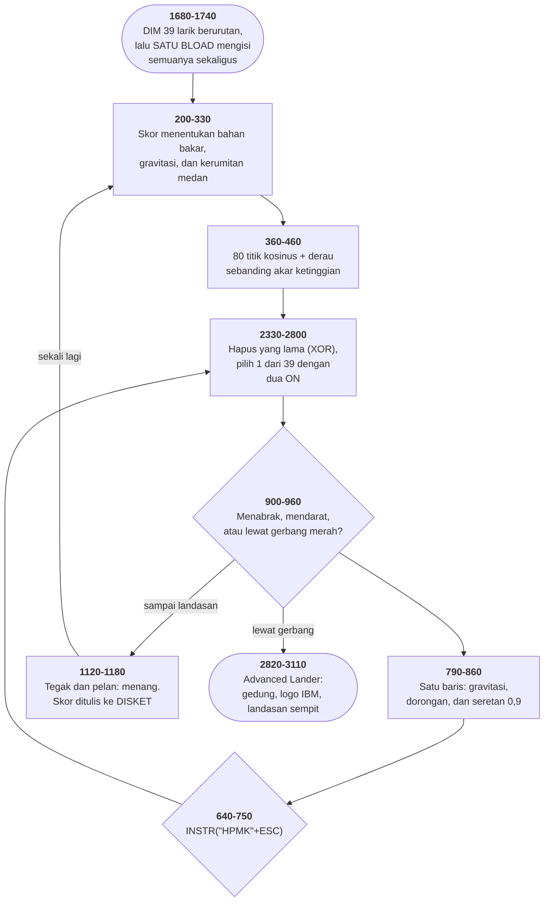

# LANDER.BAS di penelusur

> Program kedelapan puluh satu. 399 baris, nomor 10–3990, cakupan tabel
> **399/399 (100%)**.

Sumber: `run/LANDER.BAS` · tabel: `tracer/program/LANDER.js`

Rocket Lander (1982). Satu BLOAD yang mengisi empat puluh larik — dan sebuah komentar bertanggal 23 Februari 1982 yang mengaku kenapa SCREEN harus dipanggil dua kali.

## Empat puluh larik, satu pernyataan

Baris 1680 sampai 1730 adalah enam baris, dan di dalamnya ada seluruh gambar permainan ini.

```basic
1680 DEFINT M,R,P,X,T,L,B: S=66: DIM PDATA(20)
```

```basic
1690 DIM M1(S),M2(S),…,M13(S)
```

```basic
1700 DIM R1(S),R2(S),…,R13(S)
```

```basic
1710 DIM RR1(S),RR2(S),…,RR13(S)
```

```basic
1720 DEF SEG=0:A=VARPTR(PDATA(0))
```

```basic
1730 DEF SEG:BLOAD"LANDER.BIN",A
```

Empat puluh larik di-DIM berurutan. GW-BASIC mengalokasikannya di memori dalam urutan itu, bersebelahan.

`VARPTR(PDATA(0))` memberikan alamat unsur pertama yang pertama. Dan `BLOAD` menyalin isi berkas ke alamat mana pun yang diberikan — lima ribu enam ratus empat puluh empat bita, tanpa peduli larik mana yang kebetulan ada di sana.

Jadi satu pernyataan mengisi PDATA dengan tiga belas sudut kemiringannya, lalu terus mengisi M1 sampai M13 dengan gambar kapal tanpa semburan, R1 sampai R13 dengan semburan kecil, dan RR1 sampai RR13 dengan semburan besar.

Tidak ada apa pun di berkas .BIN yang menyebutkan nama larik. Tidak ada kepala berkas, tidak ada penanda, tidak ada jumlah. Yang menghubungkan bita ke-1.234 dengan larik R3 hanyalah **urutan baris 1690 sampai 1710**.

Itu membuatnya sangat efisien dan sangat rapuh sekaligus. Menukar dua nama di baris 1700 menukar dua gambar kapal, dan tidak akan ada galat, tidak akan ada peringatan — kapalnya cuma akan miring ke arah yang salah.

Porting ini tidak bisa menirunya: tidak ada memori bersebelahan yang bisa ditimpa. Yang dilakukannya sebaliknya — membaca berkas .BIN itu SEKARANG, memotongnya di batas yang sama, dan menyimpan ke-39 gambar apa adanya. Tiap gambar 21×21 piksel, dan sprite pertama, kalau digambar dengan aksara:

`          .          `

`         .#.         `

`      . .###. .      `

`      ...###...      `

`      .#######.      `

`      .........      `

`       .     .       `

`    .....   .....    `

Modul pendarat bulan, tegak, tanpa semburan. Gambar ke-7 sudut kemiringannya 180 derajat, dan gambarnya benar-benar terbalik — kaki di atas, hidung di bawah.

## Sebuah komentar bertanggal 23 Februari 1982

Di bagian paling bawah program, di rutin yang berpindah dari layar warna ke monokrom, ada dua baris ini:

```basic
3940 SCREEN 1         'be sure next line is a change 02/23/82
```

```basic
3950 SCREEN 0         'put into text mode for sure
```

Dua pernyataan `SCREEN` berurutan, dan yang pertama memasang mode grafik yang langsung dibuang lagi.

Komentarnya menjelaskan seluruhnya: *pastikan baris berikutnya adalah sebuah perubahan.*

Sebabnya aturan GW-BASIC yang tidak tertulis di mana pun kecuali di manualnya: **`SCREEN` hanya membersihkan dan menyetel ulang layar kalau MODENYA berganti.** Memanggil `SCREEN 0` saat sudah berada di mode 0 tidak melakukan apa-apa.

Dan di sini itu jadi masalah: sesudah `POKE &H410` di baris 3920 menukar kartu tampilan, BASIC harus disuruh menyetel ulang layarnya. Tapi ia sudah berada di mode 0, jadi `SCREEN 0` saja tidak cukup.

Jalan keluarnya: pindah ke mode 1 lebih dulu, supaya kembali ke mode 0 benar-benar jadi sebuah perubahan.

Yang membuat dua baris ini layak dibaca bukan triknya, melainkan bahwa penulisnya **menuliskan tanggalnya**. Dua puluh tiga Februari 1982 — hari seseorang menemukan sendiri aturan yang tidak dijelaskan kepadanya, memperbaikinya dalam satu baris, dan menaruh tanggal di sebelahnya supaya orang berikutnya tahu bahwa baris itu sengaja ada.

Empat puluh empat tahun kemudian, porting ini menabrak aturan yang persis sama. Permukaan grafik penelusur mula-mula membersihkan layar pada setiap `SCREEN`, dan SOLITAIR.BAS — yang memanggilnya berkali-kali cuma untuk menukar halaman teks — kehilangan seluruh mejanya tiap kali.

Yang memperbaikinya satu baris di `mesin/grafik.js`, dan yang membuktikan bahwa perbaikannya benar adalah komentar di baris 3940 ini.

## Peta arsitektur



## Alur yang layak diikuti

| baris | yang terjadi |
|---|---|
| `1730` | satu `BLOAD` mengisi PDATA **dan 39 larik sesudahnya** |
| `1690` | …yang menjamin kebenarannya cuma **urutan DIM** |
| `2350` | `ON INT(1.8+T/10)` → tiga ukuran semburan tanpa satu IF |
| `2390` | …lalu `ON TILTOLD` memilih satu dari tiga belas |
| `790` | seluruh fisikanya satu baris — termasuk seretan `0.9*SX` |
| `390` | medan dari kosinus; **frekuensinya naik bersama skor** |
| `400` | …derau sebanding **akar** ketinggian: puncak bergolak, lembah mulus |
| `1230` | perbandingan dipakai sebagai angka: `-(X<11)*10` |
| `230` | `OUT 980,2:OUT 981,43` menggeser gambar di **tabungnya** |
| `3940` | `SCREEN 1:SCREEN 0` — komentarnya mengaku kenapa |
| `1180` | skor tertinggi ditulis ke **disket**; 152 poin atas nama "You" |

## Yang bisa dicoba di halaman

| coba ini | yang terlihat |
|---|---|
| pasang titik henti di 1730 | satu `BLOAD` mengisi PDATA **dan 39 larik sesudahnya** |
| pasang titik henti di 1690 | …yang menjamin kebenarannya cuma **urutan DIM** |
| pasang titik henti di 2350 | `ON INT(1.8+T/10)` → tiga ukuran semburan tanpa satu IF |
| pasang titik henti di 2390 | …lalu `ON TILTOLD` memilih satu dari tiga belas |
| pasang titik henti di 790 | seluruh fisikanya satu baris — termasuk seretan `0.9*SX` |

Aslinya dijalankan dengan `run\\LANDER.bat`.

> Panah atas dan bawah mengatur daya dorong, kiri dan kanan memiringkan kapal. Turunkan kecepatan jatuh di bawah 15 dan mendaratlah tegak di landasan merah. Esc keluar. Skor 100 membuka Advanced Lander.

## Penyimpangan dari aslinya

1. **`PLAY` dan `SOUND` diam.** Yang hilang dua lagu utuh: Blue Danube Waltz (150 nada) dan Stars and Stripes Forever (82 nada), keduanya masih ada sebagai DATA dan tetap dibaca penelusur.
2. **`BLOAD"LANDER.BIN"` tidak membaca disket.** Isi berkas itu sudah dibaca saat porting ini dibuat, dan ke-39 gambarnya tersimpan apa adanya di larik `GBR` — 21×21 piksel, empat warna, persis seperti yang dipungut `GET` di tahun 1982.
3. **`OUT 980,2: OUT 981,43` diabaikan.** Kedua port itu &H3D4 dan &H3D5, dua register pengendali layar 6845; menulis 43 ke register 2 menggeser seluruh gambar mendatar di tabungnya.
4. **`POKE &H410` (baris 3790 dan 3920) diabaikan.** Di mesin aslinya keduanya benar-benar berpindah antara layar warna dan monokrom.
5. **Jam dan `RANDOMIZE` diganti benih tetap.**

## Yang layak ditiru

**Alamat sebagai jembatan antara disket dan larik.** `1720 DEF SEG=0:A=VARPTR(PDATA(0))` `1730 DEF SEG:BLOAD"LANDER.BIN",A` `VARPTR` memberikan alamat unsur pertama sebuah larik. `BLOAD` menyalin isi berkas ke alamat mana pun. Gabungannya: berkas 5.644 bita dituang mulai dari PDATA dan terus melewatinya, menimpa M1 sampai M13, R1 sampai R13, dan RR1 sampai RR13 — tiga puluh sembilan larik, dalam urutan mereka dialokasikan. Satu pernyataan, dan seluruh gambar kapalnya ada di memori. Alternatifnya tiga puluh sembilan `OPEN`, atau ribuan baris `DATA`.

**Dua ON untuk tiga puluh sembilan tujuan.** `2350 ON INT(1.8+TOLD/10) GOSUB 2390,2530,2670` Daya dorong 0 sampai 19. Bagi sepuluh dan tambah 1,8: hasilnya 1,8 sampai 3,7. `INT` memotongnya jadi 1, 2, atau 3. Tiga tingkat semburan — tidak ada, kecil, besar — dari satu penambahan yang dipilih supaya batasnya jatuh di tempat yang benar. Angka 1,8 bukan hiasan: dengan 1,5 batasnya akan meleset setengah tingkat. Lalu `ON TILTOLD GOTO` dengan tiga belas tujuan memilih sudutnya. Dua tingkat, 39 kemungkinan, nol perbandingan. Yang memaksa bentuk ini: larik di BASIC tidak bisa dipilih lewat indeks. Tidak ada cara menulis `PUT (X,Y),M(TILT)`. Maka tiga puluh sembilan nama harus ditulis satu per satu, dan `ON GOTO` adalah cara termurah untuk memilih di antaranya.

**Derau yang tahu tempatnya.** `400 LY(I)=LY(I)+SQR(LY(I))*(0.5-RND)` Derau ditambahkan sebanding **akar** ketinggian titiknya. Puncak yang tinggi bergolak; lembah yang rendah hampir mulus. Satu `SQR`, dan medannya berhenti terlihat seperti gelombang kosinus dan mulai terlihat seperti batu. Bentuk derau yang mengikuti bentuk yang didera.

**Perbandingan sebagai bilangan.** `1230 EX=10+X-(X<11)*10:EX=EX+(EX>309)*10` Di BASIC, `X<11` bernilai −1 kalau benar dan 0 kalau salah. Jadi `-(X<11)*10` menambah sepuluh kalau X kecil, dan tidak menambah apa-apa kalau tidak. Empat penjagaan batas untuk titik pusat ledakan, dalam satu baris, tanpa satu pun `IF`.

**Delapan puluh dua frekuensi dari satu rumus.** `1930 FOR I=7 TO 88: MM(I)=INT(36.8*(2^(1/12))^(I-6)):NEXT` Tiap setengah nada mengalikan frekuensinya dengan akar pangkat dua belas dari dua. Tangga nada berjenjang sama, dibangkitkan alih-alih ditabelkan. Dan lagunya sendiri disimpan sebagai pasangan (nomor nada, lama), jadi `DATA`-nya cuma angka kecil dan tidak ada satu pun frekuensi yang ditulis tangan. Dua ratus tiga puluh dua nada dari dua lagu, dalam lima belas baris DATA.

## Yang jangan ditiru

**Pernyataan sesudah RETURN di baris yang sama.** `640 K$=RIGHT$(INKEY$,1):IF (K$="")THEN RETURN:IF (F=0)THEN RETURN` Pernyataan ketiga tidak pernah dijalankan. Kalau `K$` kosong, baris ini sudah pulang; kalau tidak kosong, `RETURN` yang pertama tidak jalan tapi yang kedua juga tidak pernah diperiksa — sebab keduanya di baris yang sama, dan yang pertama sudah keluar. Uji "bahan bakar habis" yang tidak pernah terjadi. Akibatnya: tombol tetap diterima meski bahan bakar nol — yang untungnya sudah ditangani baris 850 di tempat lain.

**Tiga puluh sembilan nama yang harus dijaga sejajar.** Baris 1690-1710 mendaftarkan 39 larik. Baris 2400-2800 memakainya satu per satu. Berkas .BIN mengisinya menurut urutan. Tiga daftar terpisah yang harus sama persis, dan tidak ada satu pun yang bisa memeriksa yang lain. Menyisipkan satu larik di baris 1690 — atau sekadar menukar dua nama — menggeser seluruh isi berkas .BIN satu tempat, dan kapalnya akan terbang dengan gambar yang salah tanpa satu pun galat. Yang menyelamatkannya cuma bahwa tidak ada yang pernah menyunting baris-baris itu lagi.

**Seretan udara di bulan.** `790 … SX=0.9*SX+T*SIN(3.14*ANG(TILT)/180) ' SX has air drag.` Komentarnya jujur, dan fisikanya salah: bulan tidak punya udara. Tapi tanpa baris itu kapalnya akan melayang menyamping selamanya, dan satu dorongan miring yang tidak sengaja jadi hukuman seumur permainan. Sepersepuluh kecepatan yang dibuang tiap langkah membuat kapalnya bisa dikemudikan. Kesalahan yang disengaja, dicatat sebagai komentar, dan dibiarkan — karena permainan yang benar lebih penting daripada bulan yang benar. Yang layak ditiru bukan seretannya, melainkan komentarnya.

**Rumus jarum ukur yang menyembunyikan sebuah tingkat.** `560 GG2=INT(5+SY/(2.8+(S>ADLAND)))` `(S>ADLAND)` bernilai −1 atau 0, jadi pembaginya 2,8 atau 1,8. Skala jarum kecepatan jatuh **berubah diam-diam** begitu pemainnya melewati seratus poin. Itu benar — di Advanced Lander batas kecepatannya memang lebih ketat, jadi jarumnya harus lebih peka. Tapi tidak ada apa pun di layar yang mengatakannya, dan pemain yang sudah hafal letak jarumnya akan salah membaca tepat di saat taruhannya paling tinggi.

---
[Rancangan penelusur](_rancangan.md) · [ABM2A](abm2a.md) · [BREAKOUT](breakout.md) · [SOLITAIR](solitair.md)
