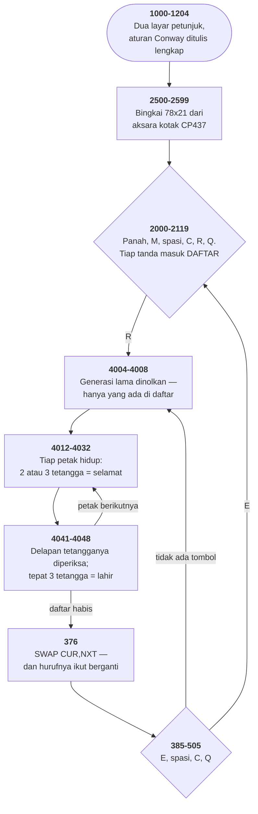

# LIFE2.BAS di penelusur

> Program ketujuh puluh delapan. 188 baris, nomor 1–65005, cakupan tabel
> **188/188 (100%)**.

Sumber: `run/LIFE2.BAS` · tabel: `tracer/program/LIFE2.js`

Life (John Sigle, 21 Februari 1983). Kehidupan Conway yang tidak pernah menelusuri papannya — dan sebuah STOP yang dipasang sebagai penjaga.

## Papan yang tidak pernah ditelusuri

Cara yang lugas menghitung satu generasi Kehidupan Conway: dua gelung bersarang atas seluruh papan, hitung tetangga tiap petak, tentukan nasibnya. Untuk papan 21×78 itu 1638 petak, dan tiap petak butuh delapan pembacaan larik. Tiga belas ribu pembacaan per generasi.

Di GW-BASIC tahun 1983, itu beberapa detik per generasi. Terlalu lambat untuk terlihat hidup.

Program ini tidak melakukannya. Ia memelihara sebuah daftar:

```basic
58 DIM CLIST(1,1500,1), LLEN(1)
```

`CLIST(0,k,papan)` baris petak ke-k, `CLIST(1,k,papan)` kolomnya, dan `LLEN(papan)` berapa banyak yang terpakai.

Satu generasi (baris 4012-4060) menelusuri daftar itu, bukan papannya. Untuk tiap petak hidup ia melakukan dua hal: memutuskan apakah petak itu sendiri bertahan, dan memeriksa kedelapan tetangganya sebagai calon kelahiran.

Pola dua puluh bakteri berarti 20 petak dan 160 tetangga. Seratus delapan puluh pemeriksaan, bukan 1638.

Yang lebih penting daripada angkanya: waktunya sekarang ikut **isi** papan, bukan ikut **ukuran** papan. Membesarkan papan dua kali lipat tidak menambah apa pun selama polanya tidak ikut membesar.

Dan ada satu bagian yang mudah terlewat — baris 4213:

```basic
4213 IF G(R,C,NXT)=1 THEN RETURN  'Cell already added
```

Sebuah petak kosong bisa jadi tetangga dari beberapa bakteri sekaligus, dan karena itu diperiksa beberapa kali dalam satu generasi. Tanpa baris ini ia akan masuk daftar berkali-kali, dan daftarnya membengkak sampai batas.

Yang dipakai sebagai penanda "sudah dimasukkan" bukan larik tersendiri, melainkan papan `NXT` itu sendiri — yang memang sedang diisi. Satu struktur data yang menjawab dua pertanyaan.

Urutan penolakan di baris 4203-4213 juga bukan kebetulan: sudah hidup (satu pembacaan), di pinggir (empat perbandingan), sudah dimasukkan (satu pembacaan). Yang paling murah dan paling sering benar diletakkan paling depan.

## Mention early for efficiency

Baris kelima puluh dua:

```basic
52 C=0:R=0:CUR=0:NXT=1:NN=0:CR=0:RN=0 'Mention early for efficiency
```

Tujuh penugasan yang semuanya tidak melakukan apa-apa — variabel BASIC sudah bernilai nol sebelum disebut. Yang dikerjakan baris ini bukan mengisi, melainkan **menyebut**.

GW-BASIC menyimpan seluruh variabel program dalam satu daftar berurutan. Tiap kali sebuah nama muncul di dalam kode, penafsirnya mencari nama itu di daftar — dari depan, satu per satu. Variabel yang pertama kali disebut duduk paling depan dan paling cepat ditemukan; yang disebut belakangan duduk di belakang.

Tujuh nama di baris 52 adalah tujuh nama yang paling sering muncul di gelung terdalam program ini. `R` dan `C` muncul enam belas kali dalam satu baris 4102 saja. `CUR` dan `NXT` muncul di hampir setiap pembacaan larik.

Memindahkan mereka ke depan daftar tidak mengubah satu pun hasilnya. Ia hanya memperpendek pencarian — dan pencarian itu terjadi puluhan ribu kali per generasi.

Komentar tiga katanya menjelaskan seluruhnya kepada siapa pun yang tahu bagaimana penafsirnya bekerja, dan tidak menjelaskan apa-apa kepada siapa pun yang tidak.

Pengoptimalan seperti ini tidak punya padanan di bahasa mana pun yang dipakai sekarang. Ia menuntut model mental tentang isi perut penafsirnya — pengetahuan yang tidak ada di manual bahasa, cuma di manual mesinnya. Dan begitu penafsirnya diganti, seluruh pengetahuan itu jadi tidak berlaku.

Baris 52 masih di sana, masih benar, dan sudah tidak berarti apa-apa lagi.

## Peta arsitektur



## Alur yang layak diikuti

| baris | yang terjadi |
|---|---|
| `4012` | yang ditelusuri **DAFTAR petak hidup**, bukan papannya |
| `4041` | …ditambah delapan tetangga tiap petak, ditulis satu per satu |
| `4213` | …dan penjaga "sudah dimasukkan" yang mencegah daftar kembar |
| `376` | `SWAP CUR,NXT` — satu penukaran, bukan penyalinan larik |
| `60` | …dan huruf X/O ikut bertukar: **denyut generasi yang terlihat** |
| `55` | cincin pinggiran +1 → baris 4102 tak perlu satu pun uji batas |
| `52` | *Mention early for efficiency* — daftar variabel dicari dari depan |
| `2074` | `STOP` sebagai **penjaga**: "ini tidak mungkin terjadi" |
| `2016` | penyangga papan tik dikosongkan lewat **alamat BIOS**, bukan INKEY$ |
| `504` | jeda: baca satu tombol lalu **tafsirkan lagi** dari 501 |

## Yang bisa dicoba di halaman

| coba ini | yang terlihat |
|---|---|
| pasang titik henti di 4012 | yang ditelusuri **DAFTAR petak hidup**, bukan papannya |
| pasang titik henti di 4041 | …ditambah delapan tetangga tiap petak, ditulis satu per satu |
| pasang titik henti di 4213 | …dan penjaga "sudah dimasukkan" yang mencegah daftar kembar |
| pasang titik henti di 376 | `SWAP CUR,NXT` — satu penukaran, bukan penyalinan larik |
| pasang titik henti di 60 | …dan huruf X/O ikut bertukar: **denyut generasi yang terlihat** |

Aslinya dijalankan dengan `run\\LIFE2.bat`.

> Dua layar petunjuk lebih dulu. Di mode EDIT, panah memindahkan kursor dan M menandai bakteri; R memulai evolusinya. Perhatikan hurufnya berganti X dan O tiap generasi.

## Penyimpangan dari aslinya

1. **`SOUND 700,.1` diam** (baris 378); gelung tundanya tetap dijalankan sebagai gelung sungguhan.
2. **`DEF SEG=0:POKE 1052,PEEK(1050)` diganti pengosongan penyangga penelusur.** Alamat 1050 dan 1052 adalah kepala dan ekor penyangga papan tik BIOS; menyamakan keduanya mengosongkannya. Akibatnya sama persis, mekanismenya tidak.
3. **`INPUT$(1)` ditulis sebagai permintaan masukan biasa** di penelusur, jadi ia menunggu Enter alih-alih satu tombol.
4. **`RUN DRIVE$+":"+"START"` di baris 65002 tidak pernah terjadi** — lihat catatan cacat.

## Yang layak ditiru

**Menyimpan yang ada, bukan yang mungkin.** Papannya 21×78 = 1638 petak. Cara lugas menghitung satu generasi memeriksa semuanya. Program ini memelihara `CLIST` — daftar koordinat petak yang hidup — dan satu generasi hanya menyentuh petak di daftar itu ditambah delapan tetangga masing-masing. Pola dua puluh bakteri: 20 petak hidup, 160 tetangga, 180 pemeriksaan. Bukan 1638. Dan yang lebih penting: waktunya ikut **isi** papan, bukan ikut **ukuran** papan. Membesarkan papannya jadi gratis. Harganya dibayar di tempat lain: menghapus satu tanda saat menyunting butuh mencari petaknya di daftar lalu menggeser sisanya (baris 2072-2077). Mahal — dan penyuntingan memang jarang.

**Dua papan, satu SWAP.** `G` berdimensi tiga: baris, kolom, dan **nomor papan**. `CUR` dan `NXT` memilih papan mana yang mana. Baris 376 menukar keduanya. Satu pernyataan, dan generasi baru jadi generasi sekarang — tanpa menyalin 1638 petak ke mana pun. Dan `CLIST` serta `LLEN` juga berdimensi ganda dengan indeks yang sama, jadi satu penukaran memindahkan seluruh keadaan sekaligus.

**Huruf yang berganti sebagai denyut.** `60 CH$(0)="X" : CH$(1)="O"`, dan baris 4032 mencetak `CH$(NXT)`. Karena `NXT` bertukar tiap generasi, generasi ganjil tampil sebagai X dan generasi genap sebagai O. Layarnya berdenyut, dan denyut itu memberi tahu pemainnya bahwa sesuatu memang berjalan — bahkan pada pola yang diam. Ada akibat kedua yang tidak kalah berguna: petak yang tetap hidup ditimpa huruf yang **berbeda**, jadi ia terlihat digambar ulang dan layarnya tidak perlu dibersihkan lebih dulu. Ditelusuri dengan satu *glider* lima bakteri: empat generasi berturut-turut tampil sebagai O, X, O, X, dan sesudah keempatnya polanya kembali ke bentuk semula — bergeser satu petak ke kanan-bawah. `LLEN` tetap 5 sepanjang keempatnya.

**STOP sebagai penjaga.** `2074 NEXT K : STOP` Gelung di baris 2072-2074 mencari petak yang mau dihapus di dalam `CLIST`. Kalau ketemu, baris 2073 melompat keluar. Kalau gelungnya sampai habis, berarti petak itu tercatat hidup di `G` tapi tidak ada di daftarnya. Itu tidak mungkin terjadi. Dan justru karena tidak mungkin, penulisnya menaruh `STOP` di sana — program berhenti dan mengatakan di baris berapa, alih-alih melanjutkan dengan dua struktur data yang sudah tidak sepakat. Pernyataan "ini tidak mungkin terjadi", ditulis sebagai kode yang benar-benar jalan. Tahun 1983.

**Cincin pinggiran alih-alih uji batas.** `55 DIM G(NROWS+1,NCOLS+1,1)` — satu lebih besar dari yang dipakai, di kedua sumbu. Petak 0 dan NROWS+1 ada dan selalu nol. Karena itu baris 4102 boleh membaca delapan tetangga sekaligus tanpa satu pun perbandingan: `4102 NN=G(R-1,C,CUR)+G(R-1,C+1,CUR)+…` Uji batasnya tetap ada — tapi cuma di baris 4211, sekali, saat memutuskan apakah sebuah petak boleh **melahirkan**. Menghitung dan memutuskan dipisah, dan yang mahal cuma dikerjakan di tempat yang benar-benar butuh.

**Menyebut variabel lebih awal.** `52 C=0:R=0:CUR=0:NXT=1:NN=0:CR=0:RN=0 'Mention early for efficiency` GW-BASIC menyimpan variabel dalam satu daftar dan MENCARINYA dari depan tiap kali sebuah nama muncul. Variabel yang pertama kali disebut duduk paling depan. Baris ini menyebut tujuh variabel yang paling sering dipakai gelung terdalam — sebelum apa pun yang lain — semata-mata supaya pencariannya pendek. Pengoptimalan yang sekarang tidak punya padanan sama sekali, dan yang hanya bisa ditulis oleh orang yang tahu bagaimana penafsirnya bekerja di dalam.

## Yang jangan ditiru

**Daftar yang lebih pendek dari papannya.** `58 DIM CLIST(1,1500,1)`. Daftarnya menampung 1500 koordinat. Papannya 21×78 = **1638** petak. Jadi pola yang mengisi lebih dari 1500 petak sekaligus akan menabrak batas larik di baris 4031 atau 4231 — "Subscript out of range", dan seluruh pola hilang. Tidak ada satu pun pemeriksaan terhadap `LL`. Angka 1500 dipilih sebagai "cukup besar", dan ia memang cukup besar untuk setiap pola yang masuk akal — tapi tidak untuk setiap pola yang MUNGKIN, dan bedanya cuma sembilan persen. Menaikkannya jadi 1638 menghabiskan 552 bita dan menghapus seluruh persoalannya.

**Jalan pulang ke variabel yang tidak pernah diisi.** `65002 IF ADDR.%<>0 THEN RUN DRIVE$+":"+"START"` `ADDR.%` dan `DRIVE$` tidak pernah muncul di tempat lain mana pun di 188 baris ini. Keduanya diisi nol dan string kosong, jadi syaratnya selalu salah dan `RUN`-nya tidak pernah terjadi. Keduanya sisa dari cangkang disket majalah yang dulu memuatnya — baris 65000 masih berkomentar *Return to Magazette*. Kalau program dijalankan dari cangkang itu, variabelnya sudah terisi sebelum program ini mulai. Ini bentuk paling halus dari cacat "jalan pulang yang hilang" di koleksi ini: kodenya masih ada, syaratnya masih diuji, dan yang lenyap cuma dunia tempat syarat itu pernah benar.

**Nomor baris yang meleset seribu.** Urutan nomor di layar petunjuk: 1006, 1008, 1009, 1010, 1011, **1112**, 1114, 1116… Baris 1112 jelas dimaksudkan 1012. Angkanya salah ketik seribu. Tidak ada akibatnya — 1112 tetap lebih besar dari 1011, jadi urutan jalannya benar. Tapi ia menutup celah: tidak ada lagi tempat untuk menyisipkan baris di antara 1011 dan 1112 tanpa mengacak penomoran, dan seluruh sisa layar petunjuk sekarang duduk di wilayah nomor yang salah.

---
[Rancangan penelusur](_rancangan.md) · [SOLITAIR](solitair.md) · [FLYS](flys.md)
