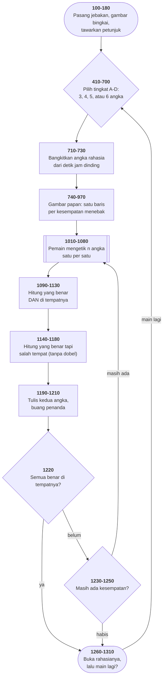

# MASTER.BAS di penelusur

> Program ketujuh, dan yang pertama memakai kebetulan. 137 baris, nomor
> 100–1460, cakupan tabel **137/137 (100%)**.

Sumber: `run/MASTER.BAS` · tabel: `tracer/program/MASTER.js` ·
analisis: [`reviews/MASTER.md`](../../reviews/MASTER.md)

Mastermind: tebak deret 3–6 angka. Setelah tiap tebakan Anda diberi tahu
berapa angka yang benar, dan berapa yang benar **dan** di tempatnya.

## Satu baris yang membangkitkan seluruh rahasianya

```basic
710 FOR SUB=1 TO DIGITS
720 RANDOMIZE(VAL(RIGHT$(TIME$,2))):ANSWER(SUB)=FIX(RND(SUB)*10)
730 NEXT SUB
```

Tiga keputusan di satu baris, dan ketiganya layak dipertanyakan:

**1. Benihnya cuma enam puluh kemungkinan.** `TIME$` berbentuk `"14:32:07"`;
`RIGHT$(...,2)` mengambil `"07"`; `VAL` menjadikannya 7. Jadi benihnya **detik
jam dinding**: nol sampai lima puluh sembilan.

**2. `RANDOMIZE` ada di dalam gelung.** Ia menyemai ulang sebelum *setiap*
angka, dari detik yang sama — karena gelungnya habis dalam sepersekian
milidetik. Menyemai ulang dengan benih yang sama bukan cara menambah keacakan.

**3. `RND(SUB)` terlihat bermakna padahal bukan.** Di GW-BASIC, argumen positif
apa pun berperilaku sama dengan `RND` polos. Menuliskan pencacah gelung di sana
membuat pembacanya mengira tiap angka diambil dari deret berbeda. Tidak.

### Yang terlihat di penelusur, dan yang belum diketahui

Di penelusur ini **ketiga angka rahasianya selalu sama** — `6 6 6` dengan benih
bawaan. Itu akibat langsung dari poin 2: semai ulang dengan benih yang sama,
ambil angka pertama, dapat angka pertama yang sama.

**Apakah GW-BASIC asli berperilaku begitu juga, belum diperiksa.** Sebagian
BASIC Microsoft hanya menimpa *sebagian* keadaan pengacaknya saat `RANDOMIZE`,
sehingga deretnya tetap maju dan angkanya tetap berbeda-beda. Penelusur ini
memakai penyemaian penuh, yang merupakan arti harfiah `RANDOMIZE n` — tapi
harfiah tidak selalu sama dengan yang dikerjakan penafsirnya.

Cara menyelesaikannya satu perintah:

```
run\MASTER.bat        pilih tingkat A, kalah tiga kali, lihat angka yang dibuka
```

Kalau yang muncul tiga angka identik, temuan ini berlaku untuk mesin aslinya
juga. Kalau berbeda-beda, yang berlaku cuma untuk penelusur — dan catatan ini
harus diperbaiki.

## Peta arsitektur



Flowchart saja sudah cukup: alurnya lurus, tidak ada keadaan yang berganti
arti, dan kedua putaran penilaian berjalan berurutan tanpa saling memanggil.

## Pseudokode

```
baris  100   pasang jebakan F1-F10; F10 keluar, sisanya mandul
baris  190   gambar bingkai balok, tawarkan petunjuk
baris  450   tanya tingkat: A=3, B=4, C=5, D=6 angka
baris  660   simpan berapa angka, dan di kolom mana papannya digambar

baris  710   untuk tiap angka rahasia:
baris  720       semai pengacak dari DETIK JAM DINDING - 60 kemungkinan
baris  720       ambil satu angka acak 0-9

baris  740   gambar papan: satu baris per kesempatan menebak
baris  980   untuk tiap baris kesempatan:
baris 1000       buat dua larik penanda, kosong
baris 1010       minta n angka tebakan, satu per satu
baris 1090       PUTARAN PERTAMA: hitung yang benar DAN di tempatnya
baris 1110           tandai angkanya terpakai di kedua larik penanda
baris 1140       PUTARAN KEDUA: hitung yang benar tapi salah tempat
baris 1160           hanya kalau kedua selnya MASIH BEBAS
baris 1190       tulis kedua angka di kolom kanan
baris 1210       buang larik penanda - putaran berikutnya membuatnya lagi
baris 1220       semua benar di tempatnya? MENANG, buka rahasianya
baris 1240   kesempatan habis: buka rahasianya, umumkan kalah
baris 1260   main lagi? kembali ke pilihan tingkat, atau kembali ke menu
```

## Penjelasan untuk pemula

### Kenapa penilaiannya butuh dua putaran

Bayangkan rahasianya `3 3 9` dan tebakan Anda `3 9 3`.

Yang di tempatnya: satu (angka 3 pertama). Yang benar tapi salah tempat: dua.
Total benar: tiga.

Kesulitannya: angka 3 muncul dua kali di rahasia dan dua kali di tebakan. Kalau
dihitung sembarangan, 3 yang sudah dipakai sebagai "di tempatnya" bisa dihitung
lagi sebagai "salah tempat" — dan pemainnya diberi petunjuk yang salah.

Solusinya **dua putaran, dan penanda**. Putaran pertama (1090–1130) mengambil
semua yang di tempatnya dan **menandai** angkanya terpakai. Putaran kedua
(1140–1180) hanya boleh memakai yang belum ditandai.

Urutan ini wajib. Kalau dibalik, putaran "salah tempat" akan mencuri angka yang
seharusnya jadi "di tempatnya".

### Larik teks sebagai larik boolean

`HITS$` dan `MISSES$` adalah larik teks dua dimensi yang isinya hanya `""` atau
`"*"`. Boros — tiap sel teks makan lebih banyak memori daripada satu bit.

Tapi `HITS$(...)=""` terbaca sebagai "belum ditandai" jauh lebih jelas daripada
`H(...)=0`. Kalau bahasanya tidak punya tipe boolean, pilih bentuk yang
terbaca.

Yang salah bukan pilihan tipenya, melainkan **enam kondisi di-`AND` dalam satu
baris 234 kolom** di baris 1160. Di porting penelusur ini barisnya ditulis
ulang dengan nama:

```javascript
var cocok  = (g === ANSWER[Y]);
var bebasX = (HITS$[g][X] === '' && MISSES$[g][X] === '');
var bebasY = (HITS$[g][Y] === '' && MISSES$[g][Y] === '');
if (cocok && bebasX && X !== Y && bebasY) { … }
```

Perilakunya sama persis; yang berubah cuma keterbacaannya. **Memberi nama pada
bagian ekspresi adalah bentuk abstraksi paling murah yang ada**, dan tersedia
bahkan di BASIC.

### Enam puluh kemungkinan, dan kenapa itu penting di luar permainan

Benih yang cuma punya enam puluh nilai tidak berbahaya untuk permainan tebak
angka — pemainnya toh tidak tahu jam berapa program menyemai.

Tapi pola pikirnya persis sama dengan yang melahirkan lubang keamanan
sungguhan: **benih yang bisa ditebak karena diambil dari sesuatu yang bisa
diamati.** Kalau yang dibangkitkan bukan angka rahasia permainan melainkan kata
sandi sementara atau token, enam puluh kemungkinan bisa dicoba semua dalam
sekejap.

### Kenapa penelusur ini memakai benih tetap

Kalau angka rahasianya berubah tiap kali halaman dimuat, tidak ada percobaan
yang bisa diulang: Anda memasang titik henti di baris 1160, menelusuri sampai
ke sana, memuat ulang — dan angkanya sudah lain.

Maka penelusur menyemai dengan angka tetap (42, menggantikan detik jam
dinding). Menjalankan MASTER dua kali selalu memberi rahasia yang sama.

Ini pilihan yang sama dengan yang diambil semua penguji perangkat lunak yang
serius: **keacakan yang bisa diulang.** Kalau uji Anda memakai pengacak,
semailah dari angka yang tercatat — supaya kegagalan yang muncul sekali bisa
dimunculkan lagi.

## Yang bisa dicoba di halaman

| coba ini | yang terlihat |
|---|---|
| jawab `N`, lalu `A` | tingkat 3 angka; telusuri baris 710–730 dan lihat `ANSWER(1..3)` terisi |
| pasang titik henti di 720, jalan | tiga kali berhenti, dan tiap kali `RANDOMIZE` menyemai dengan benih yang sama |
| tebak `1 2 3` | penilaian 0 dan 0 |
| tebak `6 6 1` | penilaian **2 dan 2** — dua benar, keduanya di tempatnya |
| tebak `6 6 6` | menang; baris 3 membuka rahasianya dan baris 22 menulis "CONGRATULATIONS" |
| pasang titik henti di 1160 | putaran kedua penilaian, satu perbandingan per langkah |

## Satu cacat mesin yang ditemukan program ini

Baris 1110 melompat keluar dari gelung `Y` langsung ke `1130 NEXT X`. Sampai
program ini, mesin penelusur menolaknya: "NEXT X padahal gelung terdalam adalah
Y".

Itu terlalu ketat. Di GW-BASIC, `NEXT X` menutup gelung `X` **dan sekaligus
membuang semua gelung yang lebih dalam darinya** — dan itulah cara program lama
keluar dari gelung bersarang. Mesinnya diperbaiki, dan sekarang gagal hanya
kalau nama gelungnya benar-benar tidak ada di tumpukan.

Tanpa perbaikan itu, penilaian "benar dan di tempatnya" berhenti di tengah
jalan dan melaporkan angka yang salah.

## Penyimpangan dari aslinya

1. **Pengacaknya bukan pengacak GW-BASIC, dan benihnya tetap.** Yang ditiru
   perilakunya, bukan angkanya.
2. **Ketiga angka rahasianya selalu sama di penelusur** — lihat bagian di atas,
   termasuk apa yang belum diketahui.
3. **Lagu menang dan kalah tidak hilang — ia memang tidak pernah ditulis.**
   Baris 1420 dan 1440 di berkas aslinya cuma `REM LOSE SONG` dan
   `REM WIN SONG`, lalu `RETURN`. Rencana yang tertinggal di dalam berkas.
4. **Baris 1160 ditulis ulang dengan nama** — perilaku sama, keterbacaan beda.
5. **`ERASE` ditiru sebagai membuang larik**, dan `DIM` di baris 1000
   membuatnya lagi tiap putaran. Itu cara BASIC mengosongkan larik.

---
[Rancangan penelusur](_rancangan.md) · [MENU](menu.md) · [INTRO](intro.md) · [CHECK](check.md) · [TOWERS](towers.md) · [HEAREYE](heareye.md) · [TICTAC](tictac.md)
