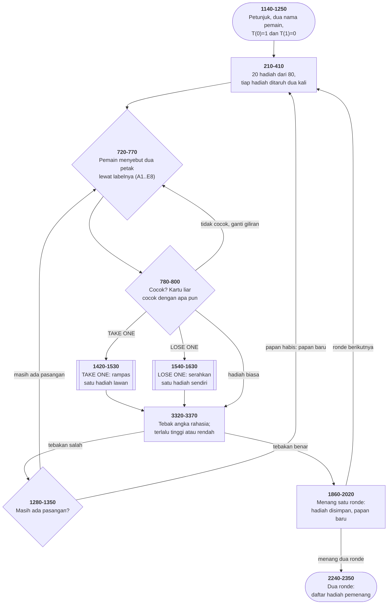

# MATCH.BAS di penelusur

> Program kedua puluh dua. 369 baris, nomor 10–3780, cakupan tabel
> **369/369 (100%)**.

Sumber: `run/MATCH.BAS` · tabel: `tracer/program/MATCH.js`

Permainan ingatan berhadiah untuk dua pemain. Papan 8×5 berisi dua puluh hadiah
yang masing-masing disembunyikan **dua kali**:

```
╔══════════════╦══════════════╦══════════════╦══════════════╦══════════════╗
║      A1      ║      B1      ║      C1      ║      D1      ║      E1      ║
╠══════════════╬══════════════╬══════════════╬══════════════╬══════════════╣
║      A2      ║      B2      ║      C2      ║      D2      ║      E2      ║
```

## Dua angka yang menggantikan seluruh percabangan giliran

Permainan dua pemain selalu punya masalah yang sama: di mana pun kode menyebut
"pemain ini", ia juga perlu menyebut "pemain itu". Cara biasa: `IF T=0 THEN …
ELSE …` di setiap tempat.

Cara program ini, baris 1220:

```basic
1220 T(0)=1:T(1)=0
```

Sebuah larik dua elemen yang isinya "lawan dari 0 adalah 1" dan sebaliknya.
Sesudah itu `T(T)` berarti **"pemain lain"** di mana pun, dan `T=T(T)` berarti
**"ganti giliran"**.

Lihat baris 1610, yang memindahkan hadiah ke lawan:

```basic
TBL(T(T),Q(T(T)))=TBL(T,B)
```

**Tidak ada satu pun `IF` yang menanyakan siapa yang sedang bermain** di
seluruh program.

Harganya: `T` skalar dan `T()` larik adalah dua benda berbeda dengan nama yang
sama. BASIC membedakannya; pembaca manusia belum tentu.

Terverifikasi: dua pemain `ALI` dan `BUDI`, giliran berganti sendiri sesudah
tebakan yang tidak cocok. Pasangan `A1` dan `D7` sama-sama berisi hadiah 22 —
"DISHWASHER, $320.00" — dan layar menulis `ALLRIGHT, A Match !!`.

## Satu tanda kutip yang mengubah kode jadi teks

Baris 1600, apa adanya:

```basic
1600 IF B<0 OR B>Q(T)-1 THEN LOCATE 22,23:PRINT"    Please Try Again "PL(T)":FOR X=1 TO 2000:NEXT:LOCATE 22,10:PRINT SPC(60):GOTO 1520
```

Hitung tanda kutipnya. Ada pembuka dan penutup untuk `"    Please Try Again "`,
lalu **satu lagi** sesudah `PL(T)` — dan tidak ada yang menutupnya.

BASIC membaca kutip itu sebagai awal string baru, dan string boleh berakhir di
ujung baris. Jadi seluruh sisanya — termasuk `GOTO 1520` — menjadi **teks yang
dicetak ke layar**.

Bandingkan dengan baris 1490, yang mengerjakan hal yang sama untuk "TAKE ONE" —
di situ kutipnya benar, dan barisnya bekerja.

Akibatnya: nomor hadiah yang tidak sah di layar "LOSE ONE" mencetak sepotong
kode BASIC ke layar, lalu **jatuh ke baris 1610** dan memindahkan hadiah nomor
itu juga.

Yang membuat cacat ini bertahan: ia hanya muncul kalau pemain salah ketik, di
salah satu dari dua kartu istimewa. Diuji sekali dengan masukan yang benar,
semuanya tampak beres.

## Peta arsitektur



## Rentang yang tidak cocok dengan yang diminta

```basic
270  SC=FIX(RND*89)+10          ' menghasilkan 10 sampai 98
3320 ... Guess My Secret Number <11 to 99>
```

Menebak **99 tidak akan pernah benar**, dan **10 tidak pernah ditawarkan**. Dua
ujung, dua kesalahan pagar-tiang, dalam satu program.

*(Dan baris 270 ada di dalam gelung dua puluh putaran yang memilih hadiah —
jadi angka rahasianya diundi dua puluh kali dan yang terakhir yang berlaku.)*

## Pembulatan yang menahan seluruh program

`DEFINT A-C` di baris 130 membuat `A()`, `B()`, dan `C` bilangan bulat — dan
penugasan ke variabel bulat di BASIC **membulatkan**, bukan memotong.

```basic
290 B(0)=1                      ' petak 0 diblokir
310 C=RND*40                    ' 0 sampai 40, BUKAN 0 sampai 39
330 IF B(C)=0 THEN B(C)=A(A) ELSE 310
```

Empat puluh penempatan, dan tepat empat puluh petak yang boleh dipakai (1–40).
Kalau pembulatannya dipotong jadi 0–39, petaknya tinggal **39** dan gelung
penolakan ini berputar **selamanya**.

Ditemukan justru karena penelusur salah lebih dulu: dengan `Math.trunc`,
papannya tidak pernah selesai terisi.

Cacat kedua yang ditemukan lewat jalan yang sama: baris 320 menyemai ulang
pengacak **di dalam** gelung penolakan itu. `RANDOMIZE` di GW-BASIC
**mencampur** argumennya ke benih yang sedang berjalan; kalau ia dimodelkan
sebagai penggantian murni, undian berikutnya membeku pada nilai yang sama dan
gelungnya juga tidak pernah selesai. Mesin penelusur sekarang punya
`m.semaiCampur` untuk keadaan ini — dipakai di program ini saja, karena tidak
ada port lain yang menyemai ulang dengan angka tetap berulang-ulang.

## Yang bisa dicoba di halaman

| coba ini | yang terlihat |
|---|---|
| pasang titik henti di 1220 | dua angka yang menggantikan seluruh percabangan giliran |
| pasang titik henti di 820 | `T=T(T)` — ganti giliran tanpa `IF` |
| pasang titik henti di 780 | `SWAP` yang membuat kartu liar cuma perlu diperiksa di satu sisi |
| pasang titik henti di 310 | gelung penolakan; makin penuh papannya makin sering mengulang |
| pasang titik henti di 270 | angka rahasia diundi dua puluh kali |
| pasang titik henti di 1600 | baris yang separuhnya jadi teks |
| pasang titik henti di 1000 | delapan baris `IF` yang mengerjakan satu `MOD` |
| buka pasangan yang cocok | `ALLRIGHT, A Match !!` lalu tebakan angka rahasia |

## Penyimpangan dari aslinya

1. **Tiga larik diganti namanya:** `A(20)` → `A_`, `B(40)` → `B_`, `T(1)` →
   `T_`. Yang terakhir paling penting: skalarnya giliran, lariknya tabel lawan.
2. **`SOUND` diam.**
3. **Pengacaknya berbenih tetap**, dan baris 220/320 memakai `m.semaiCampur`
   (lihat di atas).
4. **Baris 940 ditulis ulang sebagai gelung JavaScript biasa.** Aslinya keluar
   dari `FOR` dengan `A=0` tanpa menutup gelungnya — yang di GW-BASIC
   meninggalkan bingkai `FOR` terbuka di tumpukan. Penelusur meniru hasilnya,
   bukan kebocorannya.
5. **Nilai awal nol ditulis eksplisit di baris 130.** BASIC memberi nol pada
   tiap variabel; `T` sudah dibaca di baris 720 sebelum ada yang mengisinya.

## Yang jangan ditiru

- **Satu tanda kutip yang mengubah kode jadi teks.** Baris 1600.
- **Rentang yang tidak cocok dengan yang diminta.** Baris 270 versus 3320.
- **Angka rahasia yang diundi dua puluh kali.**
- **Keluar dari `FOR` tanpa menutupnya.** Baris 940.
- **Mengubah kedua pencacah gelung dari dalam.** Baris 250:
  `IF A(B)=A(A) THEN B=A:A=A-1` — satu baris yang menghentikan gelung dalam
  **dan** memundurkan gelung luar.
- **Dua gaya untuk satu pertanyaan.** Baris 990 menghitung barisnya dengan satu
  rumus rapi; baris 1000–1080 menghitung kolomnya dengan **delapan baris `IF`**
  yang mengerjakan apa yang bisa ditulis `((GS-1) MOD 5)*15`.

---
[Rancangan penelusur](_rancangan.md) · [MENU](menu.md) · [INTRO](intro.md) · [CHECK](check.md) · [TOWERS](towers.md) · [HEAREYE](heareye.md) · [TICTAC](tictac.md) · [MASTER](master.md) · [BOGGY](boggy.md) · [PEGLEAP](pegleap.md) · [BIO](bio.md) · [HANGMAN](hangman.md) · [BUSONE](busone.md) · [OTHELLO](othello.md) · [CRAPS](craps.md) · [DRAW](draw.md) · [WILDCAT](wildcat.md) · [MAZE](maze.md) · [SUB](sub.md) · [21](21.md) · [FOOTBALL](football.md) · [GOLF](golf.md)
