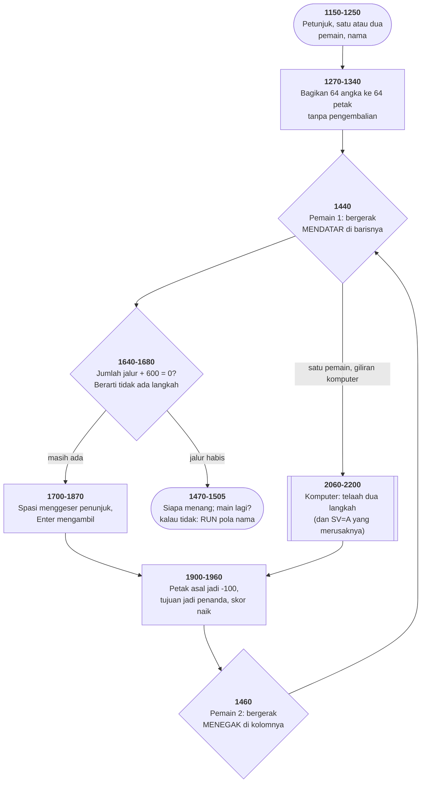

# MAXIT1.BAS di penelusur

> Program kelima puluh tiga. 145 baris, nomor 1000–3000, cakupan tabel
> **145/145 (100%)**.

Sumber: `run/MAXIT1.BAS` · tabel: `tracer/program/MAXIT1.js`

```basic
1000 '   MAXIT  FROM PET
1010 '   ADAPTED TO IPM PC BY PATRICK LEABO
1020 '   3-20-82              TUCSON ARIZONA
```

Papan 8×8 berisi angka −9 sampai 15. Pemain pertama bergerak **mendatar**,
pemain kedua **menegak**, dan tiap langkah mengambil angka di petak tujuan.
Petak yang ditinggalkan hilang selamanya. Yang mengumpulkan angka terbesar
menang.

## Satu huruf, dan komputernya berhenti berpikir

Otak komputernya (baris 2060–2200) sebenarnya lumayan: **telaah dua langkah**.

```basic
2180 DT=PC-MX+PQ-MY:IF DT>MT THEN MT=DT:GG=A1
```

Nilai yang ia ambil (`PC`), dikurangi nilai terbaik yang jadi terbuka untuk
lawan (`MX`), ditambah nilai yang bisa ia ambil sesudah itu (`PQ`), dikurangi
jawaban lawan (`MY`). Minimaks dua tingkat, dalam satu baris.

Yang membuatnya tidak bekerja ada di baris 2080:

```basic
2080 IF A2<>C2 THEN PK=BD(A1,A2):IF PK<>-100 AND PK>MX THEN MX=PK:SV=A
```

Gelung itu mencari kolom bernilai tertinggi dan menyimpan nilainya di `MX`.
Kolomnya sendiri seharusnya disimpan di `SV` — tapi yang ditulis **`SV=A`**,
bukan `SV=A2`. Dan `A` tidak pernah diberi nilai di seluruh program; karena
`DEFINT A-Z`, nilainya **nol**.

Terverifikasi — subrutin otak dipanggil langsung dengan papan yang baru dibagi:

```
SV=0    A=(tak pernah diberi nilai)    MX=15
```

`MX=15` berarti kolom terbaik **ditemukan**. `SV=0` berarti nomornya **tidak
tercatat**. Baris 2130 lalu memakainya:

```basic
2130 FOR A2=0 TO 7:PQ=BD(A2,SV)
```

— dan selalu memeriksa kolom nol. Langkah kedua yang ditelaah bukan langkah
yang akan diambil komputer; ia langkah di kolom paling kiri, apa pun keadaannya.

Yang membuat cacat ini bertahan: **komputernya tetap bermain.** Ia tetap
memilih sesuatu, tetap kadang menang, dan tidak pernah melakukan hal yang
jelas-jelas bodoh — karena bagian pertama penilaiannya (`PC - MX`) masih benar.
Yang hilang cuma ketajaman, dan ketajaman tidak punya pesan galat.

## Tiga fosil dalam satu berkas

| baris | isi | asalnya |
|--:|---|---|
| 1000 | `' MAXIT FROM PET` | disebut sendiri |
| 2350 | `PLOT 8:END` | **`PLOT` perintah Commodore PET**, bukan GW-BASIC |
| 2360 | `REM OTHER OTHELLO BOARD` | penggambar papan diambil dari Othello |

Baris 2350 layak diperhatikan. `PLOT` tidak ada di GW-BASIC sama sekali. Kalau
baris itu pernah dijalankan sekali saja, penafsirnya akan berhenti dengan
"Syntax error" dan penulisnya akan menghapusnya.

Ia tidak pernah dijalankan, karena baris 2340 — baris terakhir subrutin
petunjuk — sudah `RETURN` lebih dulu. Jadi ia bertahan empat puluh tahun.

**Kode mati tidak cuma menumpuk, ia menyembunyikan.** Baris 2350 adalah
kesalahan sintaks yang jelas, di bahasa yang salah, dan tidak ada satu pun alat
yang akan menemukannya — karena satu-satunya alat yang memeriksa sintaks BASIC
adalah penafsirnya sendiri, dan penafsir cuma memeriksa baris yang benar-benar
ia jalankan.

## Membagikan tanpa pengembalian

```basic
1270 FOR K=1 TO 64:AV(K)=K:NEXT
1280 FOR K=64 TO 1 STEP -1:READ PC
1290 P1=1+INT(K*RND(1))
1300 J=AV(P1)-1
1310 IF P1<K THEN FOR I=P1 TO K-1:AV(I)=AV(I+1):NEXT
1320 I=INT(J/8):J=J-8*I
1330 BD(I,J)=PC
```

Larik `AV` berisi petak yang **masih tersedia**. Tiap putaran mengambil satu
secara acak, lalu **menggeser sisanya menutupi lubangnya**. Gagasan yang sama
dengan pengocokan Fisher–Yates — ditulis dengan penggeseran alih-alih
penukaran.

Terverifikasi: **64 petak terisi**, jumlah seluruh nilainya 194 — 94 dari angka
papan ditambah 100 dari penanda pemain, yang memang ikut dibagikan sebagai
angka DATA ke-64.

Baris 1320 memecah nomor petak 0–63 jadi baris dan kolom dengan bagi-delapan
dan sisanya — kisi dua dimensi disimpan sebagai satu urutan.

## Dua nilai ajaib yang dibedakan tandanya

`+100` adalah penanda pemain; `−100` adalah petak yang sudah diambil. Baris
1820 melewati keduanya dengan satu uji:

```basic
1820 PT=BD(Y,X):IF ABS(PT)=100 THEN 1800
```

Tanda dipakai sebagai informasi tambahan pada satu bilangan.

## Uji "sudah habis" dengan penjumlahan

```basic
1640 FL=600:FOR J=0 TO 7:FL=FL+BD(C1,J):NEXT
1650 IF FL=0 THEN RETURN
```

Tujuh petak yang sudah diambil bernilai −100 masing-masing, ditambah penanda
+100, ditambah 600 — hasilnya tepat **nol** saat jalurnya habis. Satu
penjumlahan menggantikan delapan pemeriksaan.

## Tiga cabang dari satu tanda

```basic
1470 ON 2+SGN(S2-S1) GOSUB 1510,1520,1530
```

`SGN` memberi −1, 0, atau 1; ditambah dua jadi 1, 2, 3 — tepat indeks yang
dibutuhkan `ON…GOSUB`. Menang, seri, kalah, tanpa satu pun `IF`.

## Peta arsitektur



## Yang bisa dicoba di halaman

| coba ini | yang terlihat |
|---|---|
| pasang titik henti di 1310 | `AV()` menyusut: petak yang sudah dibagikan hilang |
| pasang titik henti di 2080 | `MX` terisi, `SV` tetap nol |
| pasang titik henti di 1640 | `FL` — jumlah jalur, nol berarti habis |
| pasang titik henti di 1470 | `SGN(S2-S1)` memilih salah satu dari tiga |
| jawab "n" pada "play again" | baris 1505 menabrak galat *Bad file name* |

## Penyimpangan dari aslinya

1. **`WIDTH 40` tidak ditiru**; konsol tetap 80 kolom.
2. **`PLAY` dan `BEEP` diam.** Tiga tempat memakai penyisipan nilai ke dalam
   string makronya — `N=NT(NT);` di baris 1980 bahkan menyisipkan **unsur
   larik**.
3. **Gelung tunda habis seketika** — jeda "berpikir" komputer di baris 1900
   tidak terasa.
4. **`RANDOMIZE VAL(RIGHT$(TIME$,2))` memasang benih tetap.**
5. **`RUN "b:???0??"` di baris 1505 tidak bisa dijalankan.** Nama berkas berisi
   tanda tanya; `RUN` tidak menerima pola nama. Di penelusur baris itu memicu
   galat 64 (*Bad file name*) — sama seperti yang akan terjadi di GW-BASIC.
6. **Baris 2350 (`PLOT 8:END`) tidak pernah tercapai** di aslinya; di sini ia
   menghentikan penelusuran dengan pesan yang mengatakannya.

## Yang jangan ditiru

- **Satu huruf yang mematikan telaah komputer.** `SV=A` di baris 2080.
- **Perintah dari bahasa lain yang tertinggal.** `PLOT` di baris 2350.
- **Nama berkas yang tidak mungkin.** `RUN "b:???0??"` — menjawab "tidak" pada
  tawaran main lagi tidak kembali ke mana-mana; ia menabrak galat.
- **Judul yang tertinggal.** `REM OTHER OTHELLO BOARD`.
- **Subrutin kosong dan subrutin yatim.** Baris 2020–2050 cuma `REM` dan
  `RETURN`, tapi tetap dipanggil dari 2440. Dan baris 3000 tidak pernah
  dipanggil dari mana pun.

---
[Rancangan penelusur](_rancangan.md) · [HIQUE2](hique2.md) · [OTHELLO](othello.md) · [KENO](keno.md)
