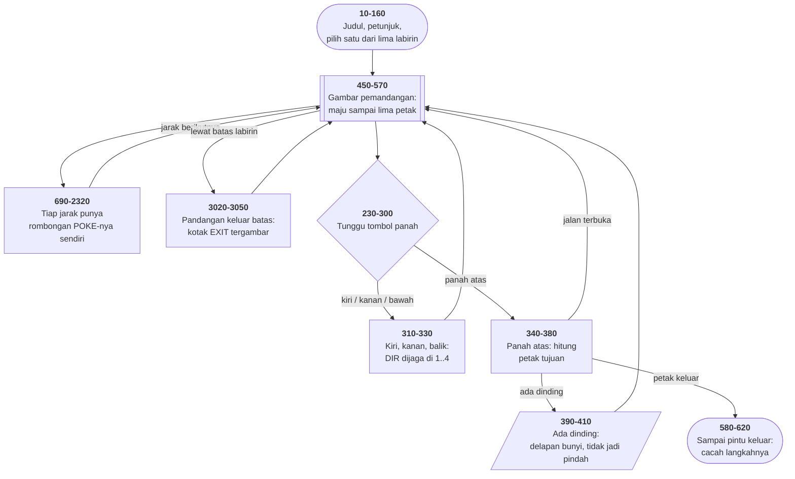

# MAZE.BAS di penelusur

> Program ketujuh belas. 305 baris, nomor 10–3050, cakupan tabel
> **305/305 (100%)**.

Sumber: `run/MAZE.BAS` · tabel: `tracer/program/MAZE.js`

Labirin orang-pertama. Anda berdiri **di dalam** labirin 8×8 dan hanya bisa
melihat empat langkah ke depan — dan seluruh gambar tiga dimensinya dibuat dari
**tiga aksara**.

## Tiga dimensi dari tiga aksara

Layar teks tidak bisa menggambar garis. Yang bisa dilakukannya cuma menaruh
salah satu dari 256 aksara di salah satu dari 2000 kotak. Program ini memakai
tiga:

| kode | bentuk | gunanya |
|---|---|---|
| 219 | █ | balok penuh |
| 220 | ▄ | setengah bawah |
| 223 | ▀ | setengah atas |

Dengan balok setengah, satu baris teks bisa dipotong jadi **dua** tingkat — dan
itu cukup untuk membuat garis miring yang meyakinkan. Hasilnya, terverifikasi
apa adanya di penelusur (baris ganjil saja, supaya muat):

```
████████                                                              ▄████████
░░░░░░░█▄▄▄▄▄▄▄▄▄▄▄▄▄                                     ▄▄▄███▀▀▀    █░░░░░░░
░░░░░░░█           █    ▀▀██▄▄                     ██▀▀    █           █░░░░░░░
░░░░░░░█           █       █   █               █   █       █           █░░░░░░░
░░░░░░░█           █       █ ▄█▀▀▀▀▀▀▀▀▀▀▀▀▀▀▀▀▀▀▀▀█       █           █░░░░░░░
░░░░░░░█           █     ▄█▀                       ▀█▄     █           █░░░░░░░
░░░░░░░█           █ ▄█▀                               ▀█▄ █           █░░░░░░░
░░░░░░░█▀▀▀▀▀▀▀▀▀▀▀▀                                       ▀█▄         █░░░░░░░
```

Sebuah lorong dengan titik hilang, cabang di kiri dan kanan, dan tekstur `░` di
tepi layar. Semuanya `POKE`.

## Perspektif yang dipahat, bukan dihitung

Tidak ada satu pun perkalian proyeksi di program ini. Yang ada **lima rombongan
subrutin** — satu per jarak — dan tiap rombongan memuat alamat layar yang sudah
dihitung tangan:

```basic
480 ON L+1 GOSUB 940,960,1020,1060,1100
490 ON L+1 GOSUB 690,740,790,840,890
```

`L` adalah jarak, 0 sampai 4. Bandingkan dinding buntu di jarak 0 dengan yang
di jarak 4:

```basic
2180 FOR A=16 TO 142 STEP 2:POKE A,219:NEXT      ' jarak 0: 64 kolom
2300 FOR A=864 TO 894 STEP 2:POKE A,219:NEXT     ' jarak 3: 16 kolom
```

Yang menyusut bukan angka melainkan **daftar alamatnya**.

Contoh dinding kiri di jarak 1 (baris 1220–1230):

```basic
1220 A=176:POKE A,223:POKE A+2,219:POKE A+4,219:POKE A+6,219
1230 POKE A+8,220:POKE A+10,220:POKE A+12,220
```

Setengah-atas, tiga penuh, tiga setengah-bawah — satu potong dinding yang
menjauh, tujuh kolom.

## Kenapa lariknya tujuh, bukan empat

Peta dinding satu petak cuma empat bit. Baris 400 membongkarnya:

```basic
400 L(1)=D AND 8:L(2)=D AND 4:L(3)=D AND 2:L(4)=D AND 1
```

Tapi yang ditanyakan penggambar bukan "ada dinding di utara?" melainkan **"ada
dinding di kiri saya?"** — dan itu bergantung arah hadap:

- depan = `L(DIR)`
- kanan = `L(DIR+1)`
- kiri = `L(DIR+3)`

Dengan `DIR = 4` (barat), kiri berarti `L(7)` — yang seharusnya `L(3)`.

Jawaban yang wajar: `((DIR+3-1) MOD 4)+1`. Jawaban program ini, baris 470:

```basic
470 L(5)=D AND 8:L(6)=D AND 4:L(7)=D AND 2
```

**Salin tiga yang pertama ke ujung larik.** Sekarang `L(5)=L(1)`, `L(6)=L(2)`,
`L(7)=L(3)`, dan pembungkusannya terjadi sendiri.

Harganya tiga elemen larik. Yang dibelinya: enam belas tempat di baris 690–930
yang tidak perlu menulis modulo, di mesin yang setiap operasinya terasa. **Dan
tidak ada satu pun `MOD` di seluruh program ini.**

*(Lariknya sendiri tidak pernah di-`DIM`. BASIC membuatnya dengan batas 10
begitu disentuh — dan batas 10 itulah yang membuat `L(7)` muat.)*

## Peta arsitektur



## Coba dulu, baru simpan

Ada dua pasang koordinat, dan bedanya penting:

- `S,T` = petak tempat pemain **berada**
- `X,Y` = petak yang sedang **dipertimbangkan**

Waktu pemain menekan panah atas, baris 340–370 memindahkan `X,Y` — belum
`S,T`. Lalu:

```basic
390 D=A(S,T)                          ' baca dinding petak ASAL
410 IF L(DIR) THEN ... GOTO 440       ' ada dinding: batalkan
420 S=X:T=Y                           ' tidak ada: langkahnya jadi
440 X=S:Y=T:GOTO 200                  ' selaraskan lagi
```

Subrutin penggambar juga memakai `X,Y` sebagai petak berjalannya (baris
520–550), dan itu sebabnya baris 180 dan 430 selalu memulihkannya sesudah
menggambar. Satu pasang variabel, dua tugas.

Yang paling rapuh: baris 410 memakai **`X` sebagai pencacah gelung bunyi**.
`X` di situ adalah koordinat pemain. Itu berjalan hanya karena baris 440
mengembalikannya.

Terverifikasi: mulai di petak `(0,3)` menghadap selatan. Panah atas → `S`
berubah 0 → 1, `M` (cacah langkah) jadi 1. Panah kanan → `DIR` 3 → 4, penunjuk
arah berubah jadi `WEST`, dan pemandangannya jadi dinding buntu.

## Memilih labirin dengan cara membacanya lewat

```basic
2370 FOR C=1 TO FIX(RND*5)+1
2380 FOR A=0 TO 7:READ B(A):NEXT
2390 FOR A=0 TO 7:FOR B=0 TO 7:READ A(A,B):NEXT B,A
2400 NEXT C
```

Badan gelungnya membaca **satu labirin utuh** tiap putaran, dan yang tersisa di
larik adalah yang terakhir dibaca. Tidak ada penunjuk, tidak ada indeks —
penunjuk `DATA` sendiri yang jadi penomornya.

Lalu baris 2410 melempar koin sekali lagi: setengah peluang memakai titik mulai
cadangan `B(5), B(6), B(7)`. **Satu labirin, dua permainan.**

*(Dan baris 620 `RESTORE` mengembalikan penunjuk `DATA` ke awal, jadi main lagi
berarti mengundi ulang — tanpa menjalankan ulang programnya.)*

## Yang bisa dicoba di halaman

| coba ini | yang terlihat |
|---|---|
| pasang titik henti di 470 | tiga salinan yang membuat `DIR+3` tidak perlu MOD |
| pasang titik henti di 480 | `ON L+1 GOSUB` — rombongan gambar untuk jarak `L` |
| pasang titik henti di 1220 | tujuh `POKE` yang membentuk satu potong dinding miring |
| tekan panah atas ke arah dinding | baris 410: delapan putaran, dan `X` dipakai sebagai pencacah |
| pasang titik henti di 440 | `X,Y` dipulihkan dari `S,T` — inilah yang menyelamatkan 410 |
| pasang titik henti di 2370 | labirin dipilih dengan cara membaca DATA sampai lewat |
| berjalan sampai melihat batas | baris 560 → kotak `EXIT` di baris 3020 |
| pasang titik henti di 2820 | `COLOR 3,O` — huruf O yang menyamar jadi nol |

## Penyimpangan dari aslinya

1. **Empat larik diganti namanya.** `A(7,7)` → `A_`, `L()` → `L_`, `B()` →
   `B_`, `Z1()` → `Z1_`. Keempatnya punya kembaran skalar di program ini:
   `L` kedalaman, `A` dan `B` pencacah gelung, `Z1` tombol yang ditekan.
2. **`PEEK` dan `DEF SEG` tidak berarti apa-apa.** Uji kartu monokrom di baris
   20 selalu menjawab kartu warna.
3. **`SOUND` tidak berbunyi**, jadi menabrak dinding tidak terdengar — yang
   terlihat cuma delapan putaran gelung yang tidak mengubah apa pun.
4. **Pengacaknya berbenih tetap**, jadi labirin dan titik mulainya selalu sama.

## Yang jangan ditiru

- **Memakai koordinat pemain sebagai pencacah gelung.** Baris 410.
- **Baris kembar yang salah satunya mati.** Baris 190 dan 200 identik; baris
  440 melompat ke 200, jadi 190 hanya jalan sekali seumur permainan.
- **Komentar yang menceritakan program lain.** Baris 3010:
  `REM******** BATLLE HYMN OF THE REPUPLIC` — dua salah ketik, dan kodenya
  menggambar kotak "EXIT".
- **Huruf O yang menyamar jadi angka nol.** Baris 2820: `COLOR 3,O`. BASIC
  memperlakukannya sebagai variabel yang belum diisi, nilainya 0, dan hasilnya
  **kebetulan benar**.

---
[Rancangan penelusur](_rancangan.md) · [MENU](menu.md) · [INTRO](intro.md) · [CHECK](check.md) · [TOWERS](towers.md) · [HEAREYE](heareye.md) · [TICTAC](tictac.md) · [MASTER](master.md) · [BOGGY](boggy.md) · [PEGLEAP](pegleap.md) · [BIO](bio.md) · [HANGMAN](hangman.md) · [BUSONE](busone.md) · [OTHELLO](othello.md) · [CRAPS](craps.md) · [DRAW](draw.md) · [WILDCAT](wildcat.md)
