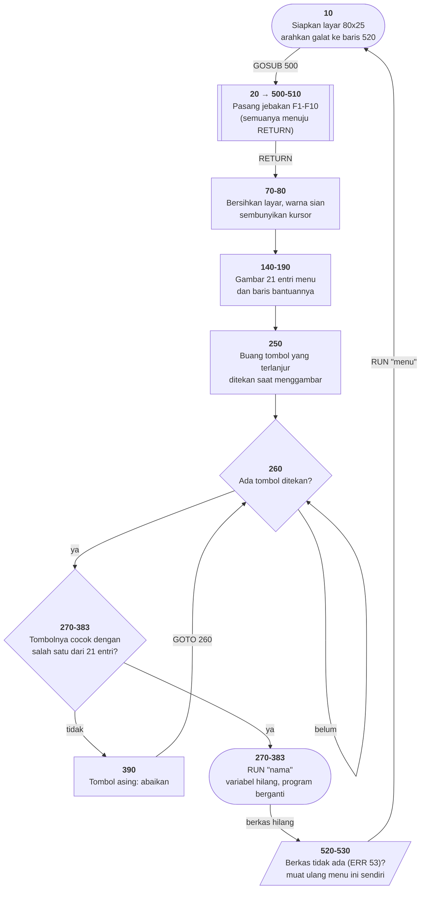

# MENU.BAS di penelusur

> Program pertama yang ditelusuri. 41 baris, nomor 10–530, cakupan tabel
> **41/41 (100%)**.

Sumber: `run/MENU.BAS` · tabel: `tracer/program/MENU.js` ·
analisis: [`reviews/MENU.md`](../../reviews/MENU.md)

## Kenapa ini yang pertama

Ia pendek, ia pintu masuk koleksi, dan ia memperlihatkan `RUN "nama"` — satu
perintah yang membuat seluruh variabel hilang. Menelusurinya sekali sudah
mengajarkan empat hal yang dipakai berulang di dua puluh tiga program sisanya:
gelung `INKEY$`, rantai `IF` sebagai pengganti tabel, `GOSUB` yang pulang lewat
baris yang juga dipakai penangan kejadian, dan penanganan galat yang benar.

## Peta arsitektur

*Diagram ini bukan tulisan tangan.* Ia dihasilkan oleh
`TRACER.peta.mermaid()` dari data `arsitektur` di
[`tracer/program/MENU.js`](../program/MENU.js) — data yang sama yang menggambar
peta SVG di halaman penelusur. Satu sumber, jadi gambar di sini dan gambar di
sana tidak mungkin bercerita hal yang berbeda.



Bentuk kotaknya punya arti tetap di seluruh koleksi ini: **bulat** = awal atau
keluar, **segi enam** = ada pilihan, **kotak bergaris ganda** = subrutin,
**kotak miring putus-putus** = jalur galat.

Yang paling layak diperhatikan: dua panah yang kembali ke atas. Panah
`390 → 260` adalah gelung utama program, dan `520 → 10` adalah program yang
memuat ulang dirinya sendiri saat berkasnya tidak ketemu.

## Pseudokode

```
baris  10   siapkan layar teks 80x25, warnanya kelabu di atas hitam
baris  10   kalau nanti ada galat, LOMPAT KE BARIS 520
baris  20   panggil subrutin pemasang jebakan tombol fungsi
baris 500       untuk n dari 1 sampai 10:
baris 500           kalau tombol Fn ditekan, panggil baris 510
baris 510       baris 510 isinya cuma PULANG - jebakan yang sengaja mandul
baris  70   bersihkan layar, buang tombol yang tertunda
baris  80   warna sian, sembunyikan kursor
baris 140   tulis judul di baris 2
baris 150   untuk tiap dari 7 baris menu:
baris 150       tulis 3 entri - hurufnya terbalik-warna, namanya sian
baris 190   tulis baris bantuan di baris 24
baris 250   buang tombol yang terlanjur ditekan selama menggambar
baris 260   ULANG SELAMANYA:
baris 260       tombol = tombol yang sedang ditekan (kosong kalau tidak ada)
baris 260       kalau kosong, COBA LAGI DARI AWAL GELUNG
baris 270       kalau tombol = "A" atau "a": MUAT PROGRAM WILDCAT, berhenti di sini
baris 280       kalau tombol = "B" atau "b": muat OTHELLO
baris 383       ... dan seterusnya, 21 kali sampai "U" untuk MENU2
baris 390       tombol tidak dikenal - abaikan, ulangi gelung
baris 520   KALAU ADA GALAT (dari mana pun):
baris 520       kalau galatnya 53 (berkas tidak ada): MUAT ULANG MENU INI SENDIRI
baris 530       galat lain: matikan penangkap, biarkan terlihat
```

Di halaman penelusur, tiap nomor baris di daftar ini bisa diklik dan akan
menyorot baris aslinya di panel kanan.

## Penjelasan untuk pemula

### Dua bagian, itu saja

Program sepanjang apa pun biasanya bisa diringkas jadi beberapa kalimat. Yang
ini cuma dua: **menggambar menu** (baris 140–190), lalu **menunggu tombol dan
memuat program yang sesuai** (baris 260–390). Sisanya persiapan dan penanganan
galat.

Kalau Anda baru mulai membaca program orang lain, carilah dua hal ini dulu:
mana bagian yang *menyiapkan*, dan mana bagian yang *berulang*. Di peta alur di
atas, bagian yang berulang terlihat sebagai panah yang kembali ke kotak di
atasnya.

### Kenapa gelungnya melompat ke dirinya sendiri

Baris 260 berbunyi `R$=INKEY$:IF R$="" THEN 260`. Perintah `INKEY$` menanyakan
"ada tombol yang sedang ditekan?" dan langsung menjawab — ia **tidak pernah
menunggu**. Kalau jawabannya kosong, baris itu menyuruh dirinya sendiri dicoba
lagi.

Di BASIC, "menunggu" bukan satu perintah. Ia gelung yang Anda tulis sendiri.
Bahasa modern menyembunyikan gelung ini di dalam `input()` atau `await`, tapi
di lapisan paling bawah ia tetap ada — program tetap harus bertanya berulang
kali.

Turunkan laju penelusuran ke 1 baris/detik dan tekan Jalan: sorotan akan
berdiam di baris 260, berputar di tempat, sampai Anda menekan tombol.

### Dua puluh satu IF yang sebenarnya sebuah tabel

Baris 270–383 adalah dua puluh satu `IF` yang bentuknya sama persis; yang
berbeda cuma hurufnya dan nama berkasnya. Itu ciri khas **tabel yang menyamar
jadi percabangan**.

BASIC 1982 tidak punya kamus atau larik berindeks teks, jadi rantai `IF` memang
jalan yang tersedia. Dalam bahasa sekarang Anda akan menulisnya sebagai satu
kamus:

```python
program = {"A": "WILDCAT", "B": "OTHELLO", "C": "PEGLEAP", ...}
if tombol.upper() in program:
    jalankan(program[tombol.upper()])
```

Dua puluh satu baris jadi tiga. Latihan mengenali pola ini berguna seumur
hidup: begitu Anda melihat beberapa cabang yang bentuknya identik dan isinya
cuma beda nilai, yang Anda lihat adalah **data yang tertulis sebagai kode**.

### Menangani satu galat, melepaskan sisanya

Baris 520 hanya mengurus galat nomor 53 — "berkas tidak ditemukan" — dengan
memuat ulang menu. Lalu baris 530 mematikan penangkapnya, sehingga galat jenis
lain kembali terlihat.

Itu urutan yang benar, dan lebih sering salah daripada benar di program pemula.
Menangkap *semua* galat memang membuat program tidak pernah mati — tapi juga
membuat Anda buta terhadap cacat yang belum Anda ketahui. Bandingkan dengan
[INTRO.BAS](intro.md), yang mengarahkan semua galat ke satu pintu keluar.

## Jejak eksekusi yang terverifikasi

Dijalankan dari awal, penunjuknya menempuh urutan ini:

```
10 → 20 → 500 → 510 → 70 → 80 → 140 → 150 → 160 → 170 → 180 → 181 → 182
   → 183 → 190 → 250 → 260 → 260 → 260 …
```

Tiga hal yang layak diperhatikan di jejak itu:

**Baris 500 dan 510 bekerja rangkap.** `GOSUB 500` dari baris 20 masuk ke
gelung `FOR A=1 TO 10` yang memasang jebakan `ON KEY`, lalu **jatuh** ke baris
510 yang `RETURN`. Jadi baris 510 adalah penutup subrutin itu sekaligus badan
lengkap penangan `ON KEY` yang baru saja dipasang: menekan F1–F10 memanggilnya
dan langsung kembali. Jebakan yang sengaja tidak berbuat apa-apa.

**Seluruh gelung `FOR` baris 500 habis dalam satu langkah penelusuran**, karena
kesepuluh putarannya muat dalam satu baris fisik. Bukan penyederhanaan:
penyorotan memang per baris, dan baris itu memang satu baris.

**Baris 260 melompat ke dirinya sendiri.** `R$=INKEY$:IF R$="" THEN 260`.
Itulah bentuk "menunggu" di BASIC — bukan satu perintah, melainkan gelung yang
ditulis sendiri.

## Yang bisa dicoba di halaman

| coba ini | yang terlihat |
|---|---|
| tekan tombol yang **tidak** ada di menu (mis. `Z`) | penunjuk turun melewati kedua puluh satu `IF` di 270–383, lalu `390 GOTO 260` mengembalikannya ke gelung. Dua puluh dua langkah untuk membuang satu tombol. |
| tekan `A` | baris 270 cocok dan memanggil `RUN"WILDCAT"` — dan halaman **benar-benar berpindah** ke Wildcatter. Sama seperti `RUN` yang asli: tidak ada jalan kembali kecuali lewat pintu yang disediakan program baru itu. |
| tekan `P` | `RUN"TOWERS"` — TOWERS punya tabel baris, jadi ia **ditelusuri di halaman ini juga**, bukan dibuka portnya. |
| pasang titik henti di 190, lalu Jalan | berhenti **sebelum** baris 24 digambar; baris bantuan di bawah layar masih kosong. |
| geser laju ke 1 baris/detik | terlihat menu digambar baris demi baris, satu baris layar per satu baris kode. |
| tekan `F1` sampai `F10` | penunjuk melompat ke baris 510 dan langsung pulang ke 260. Jebakan yang sengaja tidak berbuat apa-apa — dipasang justru supaya tombol fungsi **tidak** mengacaukan menu. |

## Jalur galat, dan kenapa ia layak dicontoh

Dua baris terakhir program ini adalah bagian terbaiknya:

```basic
520 IF ERR=53 THEN RUN"menu
530 ON ERROR GOTO 0
```

Galat 53 adalah *File not found*. Kalau pemakai memilih program yang tidak ada
di disket, menu **memuat ulang dirinya sendiri** alih-alih mati. Baris 530
kemudian mematikan penangkapnya, sehingga galat lain tetap terlihat.

Di penelusur, jalur itu ikut diuji: `RUN` ke nama yang tidak ada di koleksi
menghasilkan `ERR=53`, alurnya pindah ke 520, dan penunjuknya kembali ke baris
10 dengan pesan `RUN "menu" — variabel dikosongkan, layar dibiarkan`.

Perhatikan tanda kutip penutup di baris 520 memang tidak ada di berkas aslinya.
GW-BASIC memperbolehkan string yang ditutup oleh ujung baris, dan penulisnya
memakai kelonggaran itu.

## Penyimpangan dari aslinya

Semuanya juga tampil di halaman, di kotak "Yang tidak sama dengan aslinya":

1. **Gelung `INKEY$` berputar sepelan penelusurannya.** Di mesin aslinya baris
   260 menjajak papan ketik ribuan kali per detik. Di sini ia berputar secepat
   laju yang dipilih, lalu ditandai `tunggu` dan berhenti membakar langkah.
   Yang disorot tetap baris 260, karena di situlah program memang berada.
2. **`CLEAR ,36000`, `KEY OFF`, `SCREEN 0,0,0`, dan `WIDTH 80` tidak berbuat
   apa-apa.** Keempatnya mengatur hal yang di sini tidak ada: ruang string yang
   tak terbatas, baris label tombol fungsi yang tak pernah digambar, dan
   satu-satunya mode layar yang tersedia.
3. **Jebakan `ON KEY(1..10)` dijemput di batas baris, bukan batas pernyataan.**
   Jebakannya sendiri menyala dan bisa dicoba (lihat tabel di atas); yang
   berbeda hanya kapan ia diperiksa. GW-BASIC memeriksa di antara pernyataan,
   jadi baris yang memuat banyak pernyataan akan menunda tombol fungsi lebih
   lama di sini daripada di sana.
4. **Kedip tidak ditiru.** Atribut latar 8–15 dilipat ke 0–7. Tidak satu pun
   program dalam cakupan memakainya; kedip di halaman web mengganggu. Ini
   alasan selera, dan dinyatakan sebagai selera.
5. **Tombolnya benar-benar membawa ke programnya**, tapi lewat dua jalan
   berbeda. Program yang sudah punya tabel baris (`INTRO`, `CHECK`, `TOWERS`)
   ditelusuri di halaman yang sama. Sisanya membuka **port lengkapnya** di
   `web/games/` — bukan penelusuran baris, melainkan permainannya yang sudah
   jadi. `U` (Menu #2) menuju halaman koleksi, karena `MENU2.BAS` memang tidak
   jadi aplikasi terpisah: ia melebur menjadi shell koleksi ini.

## Membandingkan dengan yang asli

```
run\MENU.bat
```

Berkas itu memanggil DOSBox-X dengan profil `dosbox-games.conf` (IBM PC, CGA,
4,77 MHz), memasang `run\` sebagai drive C:, lalu menjalankan `GW MENU.BAS`.
Yang paling kentara bedanya: kecepatan gelung `INKEY$`.

---
[Rancangan penelusur](_rancangan.md) · [Review MENU.BAS](../../reviews/MENU.md)
