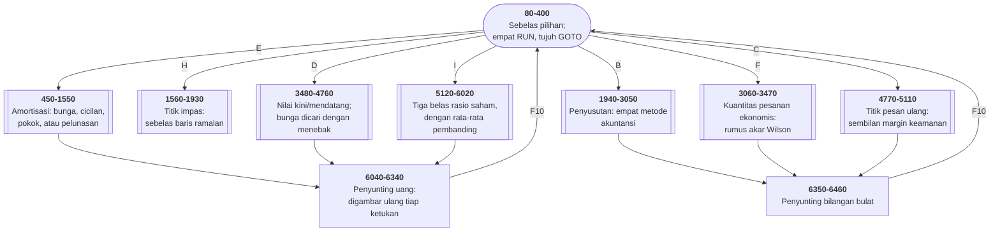

# MENU2.BAS di penelusur

> Program kedua puluh lima, dan yang terbesar. 642 baris, nomor 20–6470,
> cakupan tabel **642/642 (100%)**.

Sumber: `run/MENU2.BAS` · tabel: `tracer/program/MENU2.js`

Berkas ini bukan satu program melainkan **tujuh** — amortisasi, titik impas,
penyusutan, kuantitas pesanan ekonomis, nilai kini/mendatang, titik pesan
ulang, dan rasio saham — ditambah menunya sendiri.

```
                  ┌───────────────────────────────────────────┐
                  │          F R I E N D L Y W A R E          │
                  └───────────────────────────────────────────┘
                 Menu #2 - Programs Available On This Diskette

 A  Business Simulation    D  Present / Future Value     H  Break Even Analysis
 B  Depreciation Costs     E  Amortization Analysis      I  Stock Ratio Analysis
 C  Inventory Reorder      F  Economic Order Quantity    J  Check Book Register
                           G  Introduction to Computers  K  Return to Menu #1
```

## Menu yang melompat, bukan menjalankan

```basic
310 IF RS$="A" OR RS$="a" THEN RUN"BUSONE"
320 IF RS$="B" OR RS$="b" THEN 1940
```

Pilihan A menjalankan **berkas lain**. Pilihan B melompat ke baris 1940 **di
berkas ini**. Dari sisi pemakai, keduanya sama saja.

Kenapa dibagi begitu? Karena memori. GW-BASIC memuat seluruh programnya ke RAM,
dan mesin 64K tidak bisa memuat sepuluh program sekaligus. Yang kecil digabung;
yang besar dipisah. Akibatnya terlihat di baris 20: `CLEAR ,36000` — menyisakan
36 kilobita untuk variabel.

> Batas antara modul sering ditentukan oleh mesin, bukan oleh rancangan — dan
> waktu batas mesinnya hilang, batas modulnya sering ikut tertinggal.

## Angka yang selalu terlihat berformat

Baris 6040–6340 menyimpan angkanya sebagai **deret digit** (`ZH`), bukan sebagai
bilangan. Mulai dari `"000"`. Tiap ketukan menggeser satu digit masuk:

```basic
6220 ZH=ZH+"0":MID$(ZH,LEN(ZH)-2)=ZI
6230 RSET ZR=ZH:LOCATE XLIN,XPOS,1:PRINT USING MASK$;VAL(ZR)/100;
```

Lalu seluruh medannya **dicetak ulang**. Jadi mengetik 1, 0, 0, 0, 0
memperlihatkan berturut-turut `$0.01`, `$0.10`, `$1.00`, `$10.00`, `$100.00`
— **angkanya tumbuh dari kanan**, persis seperti mesin kasir.

Terverifikasi: mengetik `10000` di medan "Loan Amount" menghasilkan

```
║    Loan Amount                         $10,000.00        ║
```

dan `AMNT#` bernilai 10000.

Titik desimal ditangani bendera `PERIOD` dengan tiga keadaan (belum ada titik,
satu digit sesudahnya, dua digit) dan `FLAG` yang mengunci masukan sesudah dua
desimal. Dan `MASK$` dipilih baris 6050–6080 dari variabel `DEC`: **satu
penyunting, empat tampilan.**

## Satu gelung yang ditulis lima kali

Untuk mencari suku bunga dari nilai kini dan nilai mendatang tidak ada rumus
terbalik. Yang bisa dilakukan: menebak, hitung hasilnya, sesuaikan — kasar dulu,
lalu halus.

Yang tidak biasa adalah cara menulisnya. Baris 4110–4160:

```basic
4110 GS#=INT((PRS#*((1+IST#/100)^YS)+0.005000001)*100)/100
4120 GS#=INT(GS#*100)
4130 IF GS#>BT# AND GS#<TP# THEN 4470
4140 IF GS#>TP# THEN IST#=IST#-5:GOTO 4170
4150 IST#=IST#+5
4160 GOTO 4110
```

Lalu 4170–4220 mengulanginya dengan langkah **1**. Lalu 4230–4280 dengan
**0,1**. Lalu 4290–4340 dengan **0,01**. Lalu 4350–4400 dengan **0,001**.

**Tiga puluh enam baris, lima salinan, satu angka yang berbeda.** Dan baris
4490–4720 melakukannya lagi untuk mencari jumlah tahun.

Bandingkan dengan baris 1150–1240 di bagian amortisasi, yang memecahkan masalah
yang sama dengan **membelah dua** — sembilan baris, satu gelung, dan lebih cepat
bertemu. Dua pendekatan berbeda untuk pertanyaan yang sama, di dalam berkas yang
sama.

## Rantai GOSUB sebagai resep

```basic
600 GOSUB 640:GOSUB 790:GOSUB 930:GOSUB 950:GOSUB 970:GOSUB 990:GOSUB 1150:GOSUB 1050:GOSUB 780:GOSUB 460:GOTO 500
610 GOSUB 640:GOSUB 790:GOSUB 930:GOSUB 970:GOSUB 990:GOSUB 1010:GOSUB 1300:GOSUB 1050:GOSUB 780:GOSUB 460:GOTO 500
```

Tiap fungsi disusun dari potongan yang sama: gambar kepala, gambar kotak, minta
angka A, minta angka B, hitung, tampilkan. **Empat fungsi amortisasi berbeda
hanya di urutan potongannya.**

## Peta arsitektur



## Yang bisa dicoba di halaman

| coba ini | yang terlihat |
|---|---|
| pasang titik henti di 310 | empat `RUN` dan tujuh `GOTO` di penyalur yang sama |
| tekan `E`, lalu `B`, lalu ketik `10000` | angka tumbuh dari kanan, selalu berformat |
| pasang titik henti di 6230 | seluruh medan dicetak ulang tiap ketukan |
| pasang titik henti di 6050 | `DEC` memilih satu dari empat topeng |
| pasang titik henti di 4110 | tahap pertama pencarian; lalu lihat 4170, 4230, 4290, 4350 |
| pasang titik henti di 1150 | pendekatan lain untuk masalah yang sama: membelah dua |
| pasang titik henti di 5790 | `IF … THEN ELSE …` dengan cabang `THEN` kosong |
| pasang titik henti di 600 | rantai sepuluh `GOSUB` yang jadi "resep" satu fungsi |

## Penyimpangan dari aslinya

1. **Presisi ganda (`#`) ditiru dengan bilangan pecahan JavaScript biasa.**
   Untuk seluruh angka yang dipakai program ini hasilnya sama.
2. **`PRINT USING` yang ditiru cuma bentuk `$$`, `#`, `,`, `.##`**, beserta `%`
   harfiah di ujungnya.
3. **`POKE &H17` (bendera CapsLock) tidak berbuat apa-apa.**
4. **`RESUME NEXT` di baris 420 dijalankan sebagai `RESUME` biasa.** Tidak ada
   baris yang benar-benar melimpah, jadi bedanya tidak pernah terlihat.

## Yang jangan ditiru

- **Menulis satu gelung lima kali.** Baris 4100–4460, dan lagi di 4490–4720.
- **`THEN` yang kosong.** Baris 5790:
  `IF X1#<0.01 THEN ELSE DTE#=(TD#-CL#)/X1#`.
- **Konstanta ajaib yang berulang.** `0.005000001` muncul **lebih dari dua
  puluh kali** — itu "setengah sen, plus sedikit" untuk pembulatan ke atas.
  Satu variabel bernama akan menjelaskan dirinya sendiri; dua puluh salinan
  angka tidak.
- **Variabel yang diisi dan tidak pernah dibaca.** `SAVERS$` di baris 1990.

---
[Rancangan penelusur](_rancangan.md) · [MENU](menu.md) · [INTRO](intro.md) · [CHECK](check.md) · [TOWERS](towers.md) · [HEAREYE](heareye.md) · [TICTAC](tictac.md) · [MASTER](master.md) · [BOGGY](boggy.md) · [PEGLEAP](pegleap.md) · [BIO](bio.md) · [HANGMAN](hangman.md) · [BUSONE](busone.md) · [OTHELLO](othello.md) · [CRAPS](craps.md) · [DRAW](draw.md) · [WILDCAT](wildcat.md) · [MAZE](maze.md) · [SUB](sub.md) · [21](21.md) · [FOOTBALL](football.md) · [GOLF](golf.md) · [MATCH](match.md) · [DOMINOES](dominoes.md) · [STATS](stats.md)
