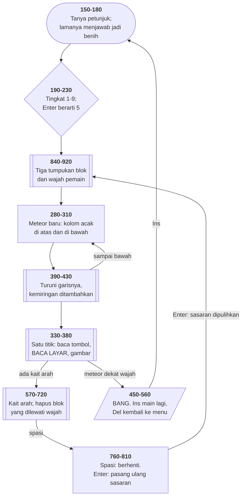

# METEOR.BAS di penelusur

> Program keempat puluh tujuh. 80 baris, nomor 99–1060, cakupan tabel
> **80/80 (100%)**.

Sumber: `run/METEOR.BAS` · tabel: `tracer/program/METEOR.js`

Satu-satunya program di koleksi ini yang menyebut sumbernya sendiri:

```basic
99  ' Source:  Creative Computing, Vol. 8, No. 8, pp. 178-185
110 REM  BY EDWARD T. ORDMAN      NOVEMBER 1981
```

Permainan arkade grafik-aksara: meteor jatuh sebagai garis miring dari baris 1
ke baris 24, dan pemain menggerakkan wajah ☻ dengan tombol panah untuk
menghapus blok █ sebelum tertimpa.

Alasan barisnya ada juga jelas: program ini **diketik ulang dari majalah**, dan
orang yang mengetiknya mencatat dari mana asalnya.

## Keacakan yang diambil dari orang yang bermain

Komputer 1981 punya masalah yang sekarang mudah dilupakan: **tidak ada sumber
keacakan sama sekali**. Menjalankan program yang sama dua kali memberi urutan
`RND` yang sama persis.

```basic
150 PRINT "DO YOU WANT DIRECTIONS (Y/N)?":R=523
160 R$=INKEY$:IF R$="Y" THEN GOSUB 930:GOTO 180
170 IF R$="N" OR R$=CHR$(13) THEN 180 ELSE R=(R+511)MOD 32003:GOTO 160
180 RANDOMIZE R
```

Gelung itu berputar secepat mesinnya bisa, menaikkan `R` sebesar 511 tiap kali,
dibungkus modulo 32003. Keduanya bilangan prima, jadi urutannya baru berulang
setelah puluhan ribu putaran.

Waktu pemain akhirnya menekan Y atau N, `R` sudah berjalan sejauh **lamanya
orang itu berpikir** — sesuatu yang tidak bisa diulang, tidak bisa diramalkan,
dan berbeda tiap kali program dijalankan.

Prinsip yang sama masih dipakai hari ini. Sistem operasi modern mengumpulkan
entropi dari waktu antar ketukan papan tombol dan gerakan tetikus — karena
**satu-satunya hal yang benar-benar tak terduga di sebuah mesin deterministik
adalah dunia di luarnya**.

## Garis miring tanpa perkalian berulang

```basic
400 S0=(X2-X1)/(Y2-Y1):S=X1-S0
410 FOR Y=Y1 TO Y2: S=S+S0: X=INT(0.5+S)
```

Kemiringan dihitung **sekali**. Di dalam gelung tinggal penambahan — tidak ada
perkalian sama sekali. Di mesin 8088 tanpa perangkat keras pecahan, itu
perbedaan antara mulus dan tersendat, dan gagasan yang sama ada di jantung
algoritma garis Bresenham.

Dan `S=X1-S0` di awal adalah penyetelan supaya penambahan pertama tepat
mengembalikannya ke `X1`.

`INT(0.5+S)` adalah **pembulatan ke bilangan terdekat**, ditulis sebelum ada
fungsi untuk itu. `INT` membuang pecahan ke bawah; menambah setengah lebih dulu
membuatnya membulat. Empat aksara yang menggantikan fungsi yang belum ada.

## Layar sebagai satu-satunya catatan

Tidak ada larik blok. `SCREEN(Y,X)=219` menanyakan langsung ke layar — baik
untuk meteor:

```basic
370 IF SCREEN(Y,X)=219 THEN C2=-1:SOUND 660,2:GOSUB 740
```

maupun untuk pemain:

```basic
700 IF SCREEN(HY,HX)=219 THEN SOUND 440,1:C2=10:GOSUB 740
710 IF SCREEN(HY,HX)=25  THEN SOUND 420,1:C2=2 :GOSUB 740
```

Blok yang dilewati wajah bernilai **+10**; jejak meteor **+2**; blok yang
tertimpa meteor **−1**. Terverifikasi: 195 blok sasaran terpasang (3 tumpukan ×
13 baris × 5), dan sebuah permainan tanpa gerakan berakhir dengan T = −12.

Ini program ketiga di koleksi ini yang memakai layar sebagai struktur datanya,
setelah [SERPENT](serpent.md) dan [BOWLING](bowling.md).

## Kait arah

`H$` menyimpan tombol panah terakhir, dan wajahnya terus bergerak ke arah itu
tiap titik meteor digambar — sampai tombol lain menekannya:

```basic
340 K$=INKEY$:IF K$<>"" THEN H$=K$
590 IF LEN(H$)=1 THEN H$="":RETURN
630 IF HH=77 THEN HX=HX+1:H$=K$:IF HX>80 THEN HX=1
```

Tombol panah datang sebagai **dua bita** (`CHR$(0)` lalu kodenya), jadi baris
590 bisa membedakannya dari huruf biasa: yang satu bita **mengosongkan kait**.
Itulah kenapa naskah petunjuknya berkata *"any letter will stop cursor
motion"*.

**Gerak terus-menerus dari masukan sesaat**, dengan satu variabel.

## Peta arsitektur



## Yang bisa dicoba di halaman

| coba ini | yang terlihat |
|---|---|
| pasang titik henti di 170 | `R` naik 511 tiap putaran menunggu |
| pasang titik henti di 410 | `S` bertambah tetap; `X` membulat |
| pasang titik henti di 370 | `SCREEN(Y,X)` di jalur meteor |
| pasang titik henti di 700 | blok yang dihapus wajah, +10 |
| jalankan tanpa menekan apa pun | `T` turun terus: meteor menghabisi sasaran |

## Penyimpangan dari aslinya

1. **`SOUND` diam.**
2. **Tombol panah, Ins, dan Del datang sebagai dua bita** `CHR$(0)+kode`,
   persis seperti aslinya — itulah yang diperiksa baris 540, 550, dan 600.
3. **`LOAD "MENU",R` diperlakukan sama seperti `RUN "MENU"`.**
4. **`RANDOMIZE R` memasang benih tetap** di penelusur, jadi jalur meteornya
   bisa diulang persis.

## Yang jangan ditiru

- **Menulis di sudut kanan bawah.** Baris 375 `IF Y=24 AND X=80 THEN X=79` —
  mencetak di petak terakhir layar teks menggulung seluruh layar.
- **Pemulihan sasaran yang gratis.** Baris 790: menekan Enter saat jeda
  menggambar seluruh sasaran kembali, tanpa harga dan tanpa batas. Spasi lalu
  Enter berulang-ulang adalah angka tanpa batas.
- **Nilai yang tidak dibersihkan tampilannya.** Baris 740 mencetak `T` tanpa
  menghapus angka sebelumnya; turun dari 100 ke 99 menyisakan "990".
- **Nomor baris yang bolong-bolong.** Sebagian sisa penyuntingan, sebagian
  ruang yang sengaja dikosongkan — dan tidak ada cara membedakannya.

---
[Rancangan penelusur](_rancangan.md) · [SERPENT](serpent.md) · [BOWLING](bowling.md) · [CURVE](curve.md) · [HINTS](hints.md)
