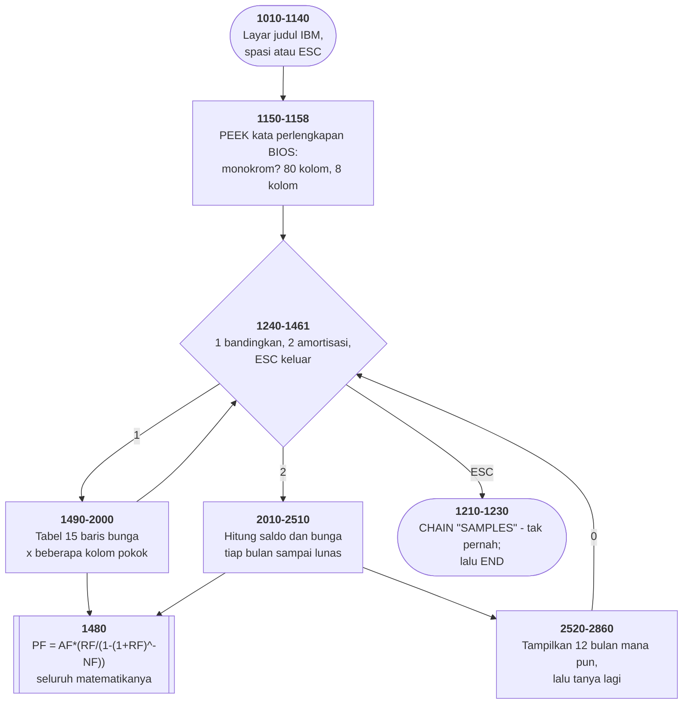

# MORTGAGE.BAS di penelusur

> Program kelima puluh lima. 204 baris, nomor 940–2860, cakupan tabel
> **204/204 (100%)**.

Sumber: `run/MORTGAGE.BAS` · tabel: `tracer/program/MORTGAGE.js`

```basic
950 REM Version 1.00 (C)Copyright IBM Corp 1981, 1982
960 REM Licensed Material - Program Property of IBM
965 REM Author - Glenn Stuart Dardick
970 REM Modified by Ayodele Isaac Anise; September, 1986.
```

Satu-satunya **perangkat lunak IBM resmi** di koleksi ini, dan satu-satunya
yang punya baris hak cipta perusahaan. Dua kegunaan: membandingkan angsuran
bulanan di berbagai suku bunga, dan membuat tabel amortisasi.

## Seluruh matematikanya satu baris

```basic
1480 PF = AF*(RF/(1-(1/((1+RF)^NF)))):RETURN
```

Rumus anuitas: angsuran = pokok × bunga ÷ (1 − (1+bunga)<sup>−jumlah</sup>).
Dipanggil dari kedua kegunaan program, dengan variabel yang sudah disiapkan
pemanggilnya — subrutin tanpa parameter, di bahasa yang tidak punya parameter.

Terverifikasi: pinjaman 100.000, bunga 12 persen, 30 tahun →

```
AF=100000   RF=0.01   NF=360
angsuran PF = 1028.61          (angka buku teks, tepat)
bulan 1  : bunga 1000.00   saldo 99971.39
bulan 360: saldo 8.17
```

Sisa **8,17** itu yang ditinggalkan pembulatan angsuran ke sen bulat. Program
tidak pernah menyebutkannya; kolom BALANCE di bulan terakhir memperlihatkannya
apa adanya. Di dunia nyata, sisa seperti ini ditagihkan di angsuran terakhir.

## Kenapa 0,005000001 dan bukan 0,005

```basic
1930 P = INT((P+0.005000001)*100)/100
```

Cara membulatkan yang biasa: tambahkan setengah, lalu buang pecahannya. Untuk
dua angka di belakang koma, setengahnya 0,005. Tapi yang ditulis
**0,005000001**.

Alasannya ada di cara komputer menyimpan pecahan. Bilangan seperti 0,005 tidak
bisa ditulis tepat dalam biner. Akibatnya angka yang secara matematika tepat
12,345 bisa tersimpan sebagai 12,34499999998 — ditambah 0,005 jadi
12,34999999998, dikali 100 jadi 1234,999999998, dan `INT` membuangnya jadi
**1234**. Dua belas koma tiga empat, bukan tiga lima.

Tambahan sepersejuta memberi dorongan yang cukup untuk melewati batas, dan
terlalu kecil untuk mengubah angka mana pun yang tidak sedang duduk tepat di
batasnya.

Ini **tambalan**, bukan pemecahan. Cara yang benar adalah menyimpan uang
sebagai bilangan bulat sen sejak awal — dan itulah yang dilakukan setiap sistem
keuangan modern. Tapi pada 1981, di BASIC tanpa jenis desimal, tambalan
sepersejuta adalah yang bisa ditulis.

Yang layak diingat: angka itu ada di sana karena **seseorang menemukan cicilan
yang meleset satu sen**, melacaknya sampai ke pembulatan, dan menambahkan enam
nol dan satu. Setiap angka aneh di kode keuangan biasanya punya cerita seperti
itu.

## Program yang menanyakan mesinnya sendiri

```basic
1155 IF (PEEK(&H410) AND &H30)<>&H30 THEN COLS = 3:GOTO 1158
1156 WIDTH 80:COLS=8
```

Alamat `&H410` adalah **kata perlengkapan BIOS** di 0040:0010 — enam belas bit
yang diisi BIOS saat mesin dinyalakan, mencatat berapa banyak disket, berapa
port, dan **jenis kartu layarnya**. Bit 4 dan 5 (topeng `&H30`) menyimpan yang
terakhir; nilai 0x30 berarti monokrom 80 kolom.

Hasilnya bukan cuma lebar layar. `COLS` menentukan **berapa banyak kolom pokok
pinjaman yang dibandingkan**: delapan di layar lebar, tiga di layar sempit.
Satu variabel menghubungkan perangkat keras dengan isi laporannya.

Ini bentuk paling awal dari *tata letak responsif*. Bedanya, di sini yang
ditanyakan bukan lebar jendela melainkan **kartu apa yang tertancap di papan
induk**, dan jawabannya dibaca langsung dari memori BIOS.

## Amortisasi dalam dua baris

```basic
2490 AMORT(I,2) = INT((AMORT(I-1,1)*RF+0.005000001)*100)/100
2500 AMORT(I,1) = AMORT(I-1,1)-PF+AMORT(I,2)
```

Bunga bulan ini dari saldo bulan lalu; saldo baru = saldo lama − angsuran +
bunga. Empat ratus dua puluh bulan dihitung sekali, disimpan, lalu bagian mana
pun bisa ditampilkan tanpa dihitung ulang.

`DEFDBL P` membuat `P`, `PD`, dan `PF` berpresisi ganda. Presisi tunggal BASIC
cuma punya tujuh angka berarti — dan untuk cicilan yang dihitung 420 kali
berturut-turut, galat kecil di awal jadi galat besar di akhir.

## Nomor baris salah, di dua tempat yang sama

```basic
1640 A = VAL(A$):IF A <= 0 THEN GOTO 1600
2200 AF = VAL(A$): IF AF <= 0 THEN 2150
```

Baris 1600 dan 2150 adalah **baris penggambar kotak**
(`PRINT CHR$(179)+"      ENTER THE APPROPRIATE VALUE    "+CHR$(179)`), bukan
tempat bertanya. Memasukkan nol melompat ke tengah kotak, mencetak tiga baris
sisanya di tempat yang salah, lalu jatuh ke prompt lagi.

Empat pemeriksaan lain di berkas yang sama (1690, 1770, 2280/2290, 2390/2400)
menunjuk baris yang benar. Dua dari enam meleset — dan keduanya meleset dengan
cara yang persis sama.

## Pintu masuk kedua yang tidak dipakai siapa pun

```basic
980 SAMPLES$="NO"
990 GOTO 1010
1000 SAMPLES$="YES"
…
1215 CHAIN "SAMPLES",1000
```

Baris 990 melompati baris 1000. Artinya `SAMPLES$` selalu "NO", dan `CHAIN
"SAMPLES",1000` tidak pernah tercapai.

Rancangannya jelas: program lain masuk lewat `RUN "MORTGAGE",1000` untuk
menyalakan modus contoh, dan program ini akan kembali ke sana saat selesai.
Tidak ada program seperti itu di disket ini.

## Peta arsitektur



## Yang bisa dicoba di halaman

| coba ini | yang terlihat |
|---|---|
| pilih 2, isi `100000` `12` `30` | angsuran 1028.61 |
| pasang titik henti di 1480 | rumus anuitas, satu baris |
| pasang titik henti di 2500 | saldo turun sedikit demi sedikit |
| lihat `AMORT(360,1)` | sisa 8,17 yang tidak pernah disebutkan |
| isi jumlah pinjaman `0` | melompat ke tengah kotak |

## Penyimpangan dari aslinya

1. **`WIDTH 40` tidak ditiru**; konsol tetap 80 kolom. Baris 1155 dijalankan
   seolah kartu layarnya **bukan** monokrom, jadi `COLS=3`.
2. **`COLOR 23,0` memakai atribut kedip** (7+16); "CALCULATING AMORTIZATION"
   seharusnya berkedip.
3. **Gelung tunda habis seketika** (baris 2460).
4. **`DEFDBL P` tidak berpengaruh.** JavaScript cuma punya satu jenis bilangan
   pecahan, dan ia setara dengan presisi ganda BASIC — hasilnya sama, tapi
   karena alasan yang berbeda.

## Yang jangan ditiru

- **Nomor baris salah di dua tempat yang sama.** Baris 1640 dan 2200.
- **Angka ajaib yang tidak dijelaskan.** `1200`, `0.0025/12`, `120000`, `2000`,
  `420`, `0.005000001` — enam keputusan, nol `REM`.
- **Pintu masuk kedua yang tidak dipakai siapa pun.** `SAMPLES$`.
- **Tabel yang dibuang seluruhnya karena satu sel.** Baris 1935: satu angsuran
  di atas 10.000 membatalkan seluruh tabel, meninggalkan yang sudah tergambar
  setengah jadi.

---
[Rancangan penelusur](_rancangan.md) · [ANATOMY](anatomy.md) · [SIMEQN](simeqn.md) · [CURVE](curve.md)
