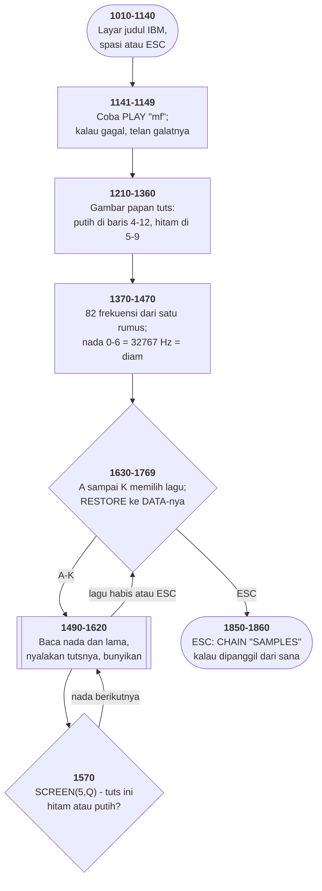

# MUSIC.BAS di penelusur

> Program kelima puluh delapan. 210 baris, nomor 940–4550, cakupan tabel
> **210/210 (100%)**.

Sumber: `run/MUSIC.BAS` · tabel: `tracer/program/MUSIC.js`

Music (IBM, 1981-82). Papan tuts di layar teks, sebelas lagu, dan delapan puluh dua frekuensi yang dihitung dari satu rumus.

## Papan tuts yang jadi tabel pencariannya sendiri

Baris 1240–1270 menggambar tuts hitam:

```basic
1240 FOR I=0 TO 12:FOR J=0 TO 4
1250 IF I=2 OR I=6 OR I=9 OR I=13 THEN 1270
1260 LOCATE 5+J,8+I*2:PRINT CHR$(32);CHR$(222);
```

Tuts hitam ada di semua posisi kecuali di antara E–F dan B–C — itulah yang dilewati baris 1250. Hasilnya papan tuts yang benar, dengan celah di tempat yang benar.

Sekarang pertanyaannya: waktu nada nomor 47 dibunyikan, tutsnya hitam atau putih? Jawaban yang biasa: simpan daftarnya.

Program ini bertanya ke layar:

```basic
1570 IF SCREEN(5,Q)<>32 THEN …
```

Baris 5 di kolom itu berisi sesuatu kalau ada tuts hitam di sana, dan spasi kalau tidak. Gambarnya **sudah** menyimpan jawabannya, jadi tidak perlu disimpan dua kali.

Dan itu menentukan di baris mana nadanya dinyalakan: tuts hitam di baris 11, tuts putih di baris 7. Baris 1610–1620 memadamkan lagi dengan uji yang sama persis.

Ini program **kelima** di koleksi ini yang memakai layar sebagai struktur data, dan yang paling halus dari semuanya. SERPENT menyimpan tubuh ularnya di sana, BOWLING pinnya, METEOR sasarannya, DROIDS ladang bijihnya — semuanya menyimpan **keadaan yang berubah**. Di sini yang dibaca adalah **keadaan yang tetap**: bentuk papan tuts, yang digambar sekali dan tidak pernah berubah lagi.

Bedanya penting. Yang lain memakai layar karena tidak punya cukup memori untuk dua salinan. Yang ini memakainya karena **daftar tuts hitam dan gambar tuts hitam memang benda yang sama**, dan menuliskannya dua kali berarti membuka jalan bagi keduanya untuk berselisih.

## Coba dulu, tangkap kalau gagal

Lima baris di tengah program, yang mudah dilewati begitu saja:

```basic
1141 ON ERROR GOTO 1148
1142 PLAY "mf"
1143 GOTO 1149
1148 RESUME 1149
1149 ON ERROR GOTO 0
```

Yang dikerjakannya: coba jalankan `PLAY "mf"`. Kalau berhasil, lompat ke 1149 dan matikan penangkap galatnya. Kalau gagal, penangkapnya menangkap, `RESUME 1149` melanjutkan di tempat yang sama, dan program berjalan terus.

Kenapa perlu? Karena IBM PC 1981 dijual dengan **Cassette BASIC** di ROM — versi yang tidak punya perintah `PLAY` sama sekali. Program yang sama harus jalan di mesin yang punya dan yang tidak.

Dan cara yang dipilih bukan memeriksa versi. Ia **mencoba**, lalu menangkap kegagalannya.

Bentuk itu punya nama sekarang: *feature detection*, dan setiap halaman web modern melakukannya — `try { new Foo() } catch { }`, atau `if (window.bar)`. Alasannya juga sama: memeriksa **versi** berarti menebak apa yang ada di versi itu; memeriksa **kemampuannya** berarti menanyakan hal yang benar-benar ingin diketahui.

Empat puluh tahun, dan jawabannya tidak berubah.

## Peta arsitektur



## Alur yang layak diikuti

| baris | yang terjadi |
|---|---|
| `1141` | **coba** `PLAY "mf"`; kalau BASIC-nya tidak punya, telan galatnya |
| `1210` | gambar tuts putih (16 pasang), lalu tuts hitam — melewati I=2, 6, 9 |
| `1370` | `M(I) = 36.8*(2^(1/12))^(I-6)` — **82 frekuensi, satu baris** |
| `1380` | nada 0–6 diberi **32767 Hz**: diam sebagai nada tak terdengar |
| `1400` | `O(nada)` = kolom layar tuts itu |
| `1680` | A sampai K memilih lagu, lalu `RESTORE` ke DATA-nya |
| `1490` | **ULANG:** baca nada dan lamanya; −1 berarti lagu selesai |
| `1570` | `SCREEN(5,Q)<>32`? **tuts hitam** — nyalakan di baris 11 |
| `1610` | sesudah nadanya, padamkan lagi — dengan uji layar yang sama |

## Yang bisa dicoba di halaman

| coba ini | yang terlihat |
|---|---|
| pasang titik henti di 1141 | **coba** `PLAY "mf"`; kalau BASIC-nya tidak punya, telan galatnya |
| pasang titik henti di 1210 | gambar tuts putih (16 pasang), lalu tuts hitam — melewati I=2, 6, 9 |
| pasang titik henti di 1370 | `M(I) = 36.8*(2^(1/12))^(I-6)` — **82 frekuensi, satu baris** |
| pasang titik henti di 1380 | nada 0–6 diberi **32767 Hz**: diam sebagai nada tak terdengar |
| pasang titik henti di 1400 | `O(nada)` = kolom layar tuts itu |

Aslinya dijalankan dengan `run\\MUSIC.bat`.

> Tekan A sampai K untuk memilih lagu. Di mesin sungguhan tiap nada terdengar; di sini yang tersisa animasi tutsnya.

## Penyimpangan dari aslinya

1. **`SOUND` dan `PLAY` diam.** Yang tersisa dari sebuah program musik cuma animasi tutsnya — dan itu justru membuat gagasan pusatnya terlihat: tiap nada menyalakan tutsnya.
2. **`WIDTH 40` tidak ditiru**; konsol tetap 80 kolom.
3. **`RESTORE <baris>` diberikan sebagai INDEKS** di larik DATA yang rata. Indeksnya **dihitung** dari daftar lagu, bukan diketik tangan, jadi tidak mungkin melenceng.
4. **BELUM TERVERIFIKASI: pemilihan tuts hitam/putih di baris 1570.** Di penelusur, `SCREEN(5,Q)` mengembalikan bukan-spasi untuk SETIAP kolom, jadi cabang tuts putih (baris 1580) tidak pernah terpakai dan seluruh nada dinyalakan di baris 11. Spasi yang seharusnya ditinggalkan gelung tuts hitam (baris 1240-1270) tidak muncul di layar penelusur, dan sebabnya belum ketemu. Yang lain di berkas ini — tabel frekuensi, DATA, pemilihan lagu — sudah diperiksa dan benar.
5. **Tabel barisnya dibangun bersama MUSIC1.BAS** dari satu pembuat. Kedua berkas .BAS itu memang cuma berbeda empat baris, dan dua di antaranya cuma tab lawan spasi.

## Yang layak ditiru

**Tabel frekuensi dari satu baris.** `M(I) = 36.8*(2^(1/12))^(I-6)` mengisi delapan puluh dua tuts piano. Pengali `2^(1/12)` adalah setengah nada; dua belas kali berturut-turut memberi tepat dua kali lipat, yaitu satu oktaf. Rumus yang sama muncul di OCTAVE.BAS dan NOTETABL.BAS — **tiga program di koleksi ini, satu persamaan**.

**Diam sebagai nada yang tidak terdengar.** Baris 1380 mengisi nada 0 sampai 6 dengan **32767 Hz**. Manusia mendengar sampai sekitar 20.000 Hz. Jadi "istirahat" tidak butuh penanganan khusus sama sekali: ia nada biasa yang kebetulan tidak terdengar, dan `SOUND` tetap menghabiskan waktunya. **Satu kasus khusus yang dihapus dengan memilih angka yang tepat.**

**Gambar sebagai tabel pencarian.** Baris 1570 bertanya `SCREEN(5,Q)<>32` untuk tahu apakah tuts di kolom itu hitam. Jawabannya ada di sana karena baris 1240–1270 baru saja menggambarnya. Alih-alih menyimpan daftar "tuts mana yang hitam", program **membaca gambarnya sendiri** — dan gambarnya memang sudah menyimpan jawabannya.

**Uji kemampuan lewat galat.** Baris 1141–1149 mencoba `PLAY "mf"` dengan penangkap galat terpasang, lalu `RESUME` ke baris berikutnya. Kalau BASIC-nya Cassette BASIC (yang tidak punya `PLAY`), galatnya ditelan dan program lanjut. Bentuk paling awal dari *feature detection* — coba dulu, tangkap kalau gagal.

**RESTORE sebagai penunjuk lagu.** Sebelas lagu duduk berurutan di satu antrean `DATA`, dan `RESTORE 4000` memindahkan penunjuk bacanya ke awal lagu yang diminta. Tidak ada indeks, tidak ada larik lagu — nomor baris **adalah** alamatnya.

## Yang jangan ditiru

**Uji yang tidak pernah benar.** Baris 1250: `IF I=2 OR I=6 OR I=9 OR I=13 THEN 1270`. Gelungnya `FOR I=0 TO 12` — **`I=13` tidak pernah terjadi**. Uji keempat itu sisa dari versi yang papan tutsnya lebih lebar, dan tidak pernah dicabut.

**Pintu masuk kedua yang tidak dipakai siapa pun.** Baris 990 melompati baris 1000 (`SAMPLES$="YES"`), jadi `CHAIN "SAMPLES",1000` di baris 1850 tidak pernah tercapai. Bentuk yang **sama persis** ada di MORTGAGE.BAS dan DROIDS.BAS — tiga berkas, satu idiom yang tidak terpakai.

**Dua salinan yang hampir sama di satu disket.** MUSIC1.BAS adalah berkas ini dengan **empat baris berbeda**, dan dua di antaranya cuma tab lawan spasi. Yang dua lagi menambahkan pembuang penyangga tombol. Tidak ada satu pun catatan di kedua berkas yang menyebutkan yang lain.

---
[Rancangan penelusur](_rancangan.md) · [MUSIC1](music1.md) · [NOTETABL](notetabl.md) · [OCTAVE](octave.md)
