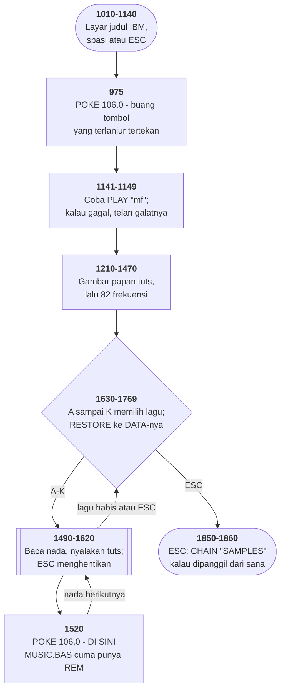

# MUSIC1.BAS di penelusur

> Program kelima puluh sembilan. 210 baris, nomor 940–4550, cakupan tabel
> **210/210 (100%)**.

Sumber: `run/MUSIC1.BAS` · tabel: `tracer/program/MUSIC1.js`

Music1 (MUSIC.BAS, dengan penyangga tombol dibuang). Berkas yang sama dengan MUSIC.BAS, berbeda empat baris — dan dua di antaranya tidak mengubah apa pun.

## Empat baris, dan dua di antaranya tidak berarti apa-apa

Membandingkan MUSIC.BAS dan MUSIC1.BAS baris demi baris memberi tepat empat perbedaan dari dua ratus sepuluh baris:

```basic
975  DEF SEG`  →  `DEF SEG: POKE 106,0
1520  REM`  →  `POKE 106,0
1540  IF J = -1<tab>THEN RETURN`  →  `IF J = -1<dua spasi>THEN RETURN
3700  <tab>DATA …`  →  `<empat spasi>DATA …
```

Dua yang terakhir **tidak mengubah apa pun**. Penafsir BASIC memperlakukan tab dan spasi sama saja di luar tanda kutip.

Tapi keduanya tetap bercerita. Sebuah tab yang berubah jadi spasi berarti berkasnya pernah dibuka oleh alat yang membentangkan tab — penyunting lain, alat pemindah, atau `LIST` ke berkas dari mesin yang setelannya berbeda.

Dua yang pertama adalah perubahan yang sebenarnya, dan keduanya hal yang sama: membuang tombol yang terlanjur tertekan.

Yang paling menarik justru **baris 1520 di MUSIC.BAS**. Ia berbunyi `REM` — baris bernomor tanpa isi apa pun, tepat di tempat pokenya berada di berkas satunya.

Baris seperti itu jarang diketik dengan sengaja. Yang lebih masuk akal: pokenya pernah ada di sana lalu dicabut, atau tempatnya disiapkan untuk sesuatu yang belum ditulis. Dua-duanya berarti hal yang sama bagi pembaca hari ini — **di sinilah sesuatu pernah terjadi**.

Dan tidak ada satu pun kata di kedua berkas yang mengatakan yang mana lebih dulu.

## Peta arsitektur



## Alur yang layak diikuti

| baris | yang terjadi |
|---|---|
| `975` | `POKE 106,0` — **buang tombol yang terlanjur tertekan** |
| `1520` | …dan sekali lagi di tiap nada. **Di MUSIC.BAS baris ini cuma `REM`** |
| `1500` | tanpa pembuangan itu, satu ketukan nyasar menghentikan lagunya di sini |
| `1370` | 82 frekuensi dari satu rumus — sama seperti MUSIC.BAS |
| `1570` | `SCREEN(5,Q)` menentukan tuts hitam atau putih |
| `1680` | sebelas lagu, dipilih dengan `RESTORE` |

## Yang bisa dicoba di halaman

| coba ini | yang terlihat |
|---|---|
| pasang titik henti di 975 | `POKE 106,0` — **buang tombol yang terlanjur tertekan** |
| pasang titik henti di 1520 | …dan sekali lagi di tiap nada. **Di MUSIC.BAS baris ini cuma `REM`** |
| pasang titik henti di 1500 | tanpa pembuangan itu, satu ketukan nyasar menghentikan lagunya di sini |
| pasang titik henti di 1370 | 82 frekuensi dari satu rumus — sama seperti MUSIC.BAS |
| pasang titik henti di 1570 | `SCREEN(5,Q)` menentukan tuts hitam atau putih |

Aslinya dijalankan dengan `run\\MUSIC1.bat`.

> Jalankan berdampingan dengan MUSIC.BAS: keduanya terlihat dan terdengar sama persis. Bedanya baru terasa kalau ada tombol yang tertekan sebelum lagunya mulai.

## Penyimpangan dari aslinya

1. **Sama dengan MUSIC.js** — `SOUND` dan `PLAY` diam, `WIDTH 40` tidak ditiru, dan `RESTORE` memakai indeks yang dihitung.
2. **Tabel barisnya dibangun oleh pembuat yang sama dengan MUSIC.js.** Itu keputusan yang disengaja: dua salinan tabel bisa melenceng, dan melencengnya dua salinan justru cacat yang sedang didokumentasikan halaman ini.
3. **Perbedaan tab lawan spasi di baris 1540 dan 3700 tidak terlihat** di penelusur, karena yang dijalankan tabel baris, bukan teksnya. Bandingkan sendiri di panel kanan kedua program.

## Yang layak ditiru

**Membuang tombol yang terlanjur tertekan.** `POKE 106,0` menulis nol ke cacah tombol tertunda milik penafsir BASIC sendiri. Gunanya di sini jelas: baris 1500 membaca `INKEY$` tiap nada, dan ESC menghentikan lagu. Tanpa pembuangan, satu ketukan nyasar yang tersisa dari menu akan langsung membatalkan lagu yang baru saja dipilih.

**Bekas luka yang tertinggal sebagai REM.** Di MUSIC.BAS, baris 1520 berbunyi `REM` saja — sebuah baris bernomor tanpa isi, tepat di tempat pokenya berada di MUSIC1.BAS. Baris kosong seperti itu jarang diketik dengan sengaja. Ia biasanya **bekas sesuatu**: entah yang dicabut, entah tempat yang disiapkan dan tidak pernah diisi.

**Tab lawan spasi sebagai sidik jari.** Baris 1540 dan 3700 berbeda **hanya** pada tab lawan spasi. Tidak ada bedanya bagi penafsir. Tapi ia mengatakan bahwa kedua berkas pernah lewat di alat yang berbeda — satu yang menyimpan tab, satu yang membentangkannya. Sidik jari yang tidak sengaja ditinggalkan.

## Yang jangan ditiru

**Dua salinan tanpa satu pun catatan.** Tidak ada `REM` di kedua berkas yang menyebutkan yang lain. Tidak ada nomor versi yang berbeda — keduanya menulis "Version 1.10". Siapa pun yang membuka disket ini menemukan dua berkas bernama hampir sama, isinya hampir sama, dan **tidak ada cara mengetahui mana yang lebih baru** selain membandingkannya baris demi baris.

**Perbaikan yang tidak dicatat sebagai perbaikan.** Penambahan `POKE 106,0` memperbaiki cacat yang nyata. Kalau ia ditulis dengan satu `REM` di sebelahnya — *"buang sisa ketukan supaya lagu tidak langsung berhenti"* — berkas ini akan menjelaskan dirinya sendiri. Tanpa itu, satu-satunya cara memahaminya adalah menemukan berkas yang lain, membandingkannya, dan menebak.

---
[Rancangan penelusur](_rancangan.md) · [MUSIC](music.md)
