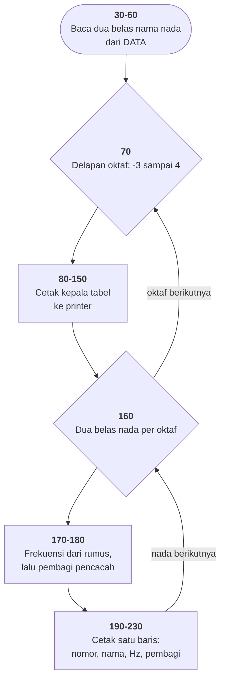

# NOTETABL.BAS di penelusur

> Program ketiga puluh. 26 baris, nomor 10–260, cakupan tabel **26/26 (100%)**.

Sumber: `run/NOTETABL.BAS` · tabel: `tracer/program/NOTETABL.js`

Mencetak tabel delapan oktaf **ke printer**: nomor nada, namanya, frekuensinya
dalam hertz, dan satu kolom terakhir yang jadi alasan berkas ini ada.

## Kenapa 125000

```basic
170 freq = 440 * (2 ^ (oct + (note - 10) / 12))
180 pitch = CINT(125000 / freq)
```

Baris 170 mengubah **nama nada** jadi **frekuensi** — matematika musik, rumus
yang sama persis dengan [OCTAVE.BAS](octave.md) baris 30.

Baris 180 mengubah frekuensi jadi **angka perangkat keras**. Pengeras suara IBM
PC tidak bisa diberi tahu "bunyikan 440 Hz". Yang bisa dilakukan cuma satu:
memasukkan sebuah **bilangan pembagi** ke cip pencacah waktu 8253. Cip itu
berdetak pada 1.193.180 Hz dan membagi detaknya dengan bilangan itu.

Dua dunia berbeda, disambung dua baris. Tabel ini adalah **jembatannya** — dan
itu menjelaskan kenapa keluarannya `LPRINT` dan bukan `PRINT`: bukan untuk
dibaca sekali lalu hilang, melainkan untuk **ditempel di dinding** dan dilihat
berkali-kali sambil menulis program lain.

Terverifikasi apa adanya (dibelokkan ke layar):

```
   80             G 3              3135.96348            40
   81             G# 3             3322.43758            38
   82             A 3              3520                  36
   83             A# 3             3729.31009            34
   84             B 3              3951.06641            32
-------------------------------------------------------------------------------
                             OCTAVE  4 ( 6 )
```

Nada 82 adalah A oktaf 3 — 440 × 2³ = **3520 Hz** tepat, dan 125000 / 3520 =
35,5 yang dibulatkan `CINT` jadi **36**.

## Rumus yang berjalan

[OCTAVE.BAS](octave.md) menyimpan rumusnya tapi gelungnya lupa maju — `note` dan
`octave` tidak pernah berubah. Di sini ia berada di dalam **dua gelung
bersarang** yang benar:

```basic
70  FOR oct = -3 TO 4
160   FOR note = 1 TO 12
```

Delapan oktaf × dua belas nada = **96 baris**, dari sekitar 16 Hz (di bawah batas
pendengaran) sampai sekitar 6.600 Hz.

`noteno` di baris 230 adalah pencacah yang berjalan terus melewati batas oktaf,
jadi kolom pertamanya menomori nada 1 sampai 96 berurutan. Nomor itu tidak
dipakai perhitungan apa pun — gunanya supaya orang bisa menunjuk "nada nomor 58"
tanpa menyebut oktaf.

## Peta arsitektur



## Yang bisa dicoba di halaman

| coba ini | yang terlihat |
|---|---|
| pasang titik henti di 170 | `OCT` bertahan dua belas putaran sementara `NOTE` berputar penuh |
| pasang titik henti di 180 | frekuensi jadi pembagi pencacah |
| lihat kepala tabelnya | `OCTAVE 4 ( 6 )` — angka dalam kurung, lihat di bawah |
| bandingkan dengan OCTAVE.BAS | rumus yang sama; di sana gelungnya tidak maju |

## Penyimpangan dari aslinya

1. **`LPRINT` dibelokkan ke layar.** Ini penyimpangan terbesar di berkas ini:
   yang Anda lihat di layar, di aslinya keluar di kertas. Tanpa pembelokan ini
   berkas tersebut tidak akan memperlihatkan apa pun sama sekali.
2. **Layar 80×25 tidak muat.** Tabelnya delapan oktaf × tujuh belas baris; yang
   terlihat cuma bagian yang tergulung terakhir.
3. **`OPTION BASE 1` tidak ditiru.** Larik penelusur tetap mulai dari 0; di
   program ini tidak berpengaruh karena lariknya cuma diisi 1 sampai 12.

## Yang jangan ditiru

- **Angka ajaib tanpa penjelasan.** `125000` di baris 180 tidak dijelaskan di
  mana pun. Satu `REM` akan menghemat setengah jam pembacanya.
- **Nomor yang mungkin meleset satu.** Baris 110 mencetak `oct + 2` dalam
  kurung. Kalau itu dimaksudkan sebagai nomor oktaf untuk `PLAY`, angkanya
  meleset: `PLAY` menyebut oktaf C tengah sebagai **3**, sedangkan penomoran
  program ini menyebutnya **0**. *Belum diperiksa di GW-BASIC sungguhan.*
- **Tidak ada cara berhenti.** Delapan oktaf dicetak tanpa jeda dan tanpa
  tawaran membatalkan — sekitar dua menit di printer titik-matriks 1982.

---
[Rancangan penelusur](_rancangan.md) · [OCTAVE](octave.md) · [GERMFOLK](germfolk.md) · [DREAM](dream.md) · [WHATMONF](whatmonf.md) · [WRTSTR](wrtstr.md)
