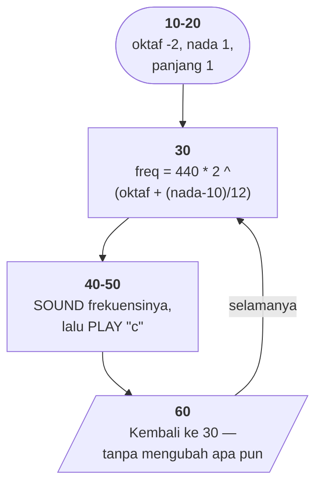

# OCTAVE.BAS di penelusur

> Program kedua puluh delapan. 6 baris, nomor 10–60, cakupan tabel
> **6/6 (100%)**.

Sumber: `run/OCTAVE.BAS` · tabel: `tracer/program/OCTAVE.js`

Enam baris: satu rumus yang layak diingat, dan satu gelung yang **tidak pernah
berhenti**.

## Satu baris yang memuat seluruh tangga nada

```basic
30 freq = 440 * (2 ^ (octave + (note - 10) / 12))
```

Dua kenyataan fisika dan satu kesepakatan manusia, digabung:

**Naik satu oktaf = frekuensi berlipat dua.** Fisika: senar setengah panjang
bergetar dua kali lebih cepat, dan telinga mendengar keduanya sebagai "nada yang
sama".

**Satu oktaf dibagi dua belas.** Kesepakatan — temperamen sama, kompromi yang
membuat semua tangga nada sama-sama sedikit sumbang tapi bisa dimainkan di alat
yang sama. Satu nada naik berarti mengalikan dengan `2^(1/12)` ≈ 1,059463; dua
belas kali mengalikannya menghasilkan tepat 2.

**440 Hz sebagai jangkar.** Kesepakatan internasional untuk nada A. Dan
`(note-10)` memilih A sebagai titik nol, karena A adalah nada kesepuluh dihitung
dari C — jadi `(10-10)/12 = 0` membuat rumusnya menghasilkan **tepat 440** waktu
oktafnya nol.

> Konstanta di dalam rumus dipilih supaya kasus acuannya jadi sederhana.

Yang mudah terlewat: `octave` tidak dikalikan apa pun. Ia langsung ditambahkan
ke eksponen — karena naik satu oktaf memang berarti menambah **satu** ke
eksponen dua. Bilangan pecahan `(note-10)/12` mengurus sisanya.

Terverifikasi: dengan `octave = -2` dan `note = 1`, penelusur menghitung
**65,41 Hz** — nada C dua oktaf di bawah C tengah. Benar.

*(Baris 180 [NOTETABL.BAS](../../run/NOTETABL.BAS) memakai rumus yang persis
sama untuk mencetak tabel frekuensi delapan oktaf ke printer. Dua berkas, satu
rumus — dan yang satu lagi benar-benar memakainya.)*

## Peta arsitektur



## Gelung yang lupa maju

```basic
60 GOTO 30
```

Yang jelas dimaksudkan: mainkan nada 1, lalu 2, lalu 3, sampai 12, lalu naik
oktaf — memperdengarkan tangga nada yang barusan dihitung.

Yang tertulis: hitung ulang frekuensi yang sama, bunyikan lagi, ulangi.
Selamanya. **Tidak ada satu baris pun di antara 30 dan 60 yang mengubah `note`
atau `octave`.**

Di penelusur cacat ini terlihat dengan cara yang tidak mungkin terlihat di mesin
sungguhan. Di DOSBox-X yang terdengar cuma "nada yang sama terus" — bisa saja
itu memang maunya. Di sini, panel variabel memperlihatkan `NOTE` tetap 1 dan
`FREQ` tetap 65,41 ronde demi ronde.

> Gelung yang tidak maju terlihat sebagai angka yang tidak berubah.

## Yang bisa dicoba di halaman

| coba ini | yang terlihat |
|---|---|
| pasang titik henti di 30 | `FREQ` yang tidak pernah berubah, ronde demi ronde |
| ubah `NOTE` jadi 10 lalu lanjutkan | 110 Hz — A, dua oktaf di bawah acuan |
| jalankan tanpa titik henti | tidak pernah selesai; tidak ada jalan keluar |

## Penyimpangan dari aslinya

1. **`SOUND` dan `PLAY` tidak berbunyi**, dan program ini tidak punya keluaran
   lain. Layarnya tetap kosong.
2. **Gelung 30–60 tidak pernah selesai.** Di penelusur ia terus berputar sampai
   dihentikan.

## Yang jangan ditiru

- **Gelung yang tidak pernah maju.** Baris 60.
- **Tidak ada jalan keluar.** Tidak ada `INKEY$`, batas pencacah, atau `END`.
  Satu-satunya cara menghentikannya adalah Ctrl-Break.
- **Variabel yang disetel dan tidak berguna.** `PLAY "o0 t255"` di baris 20
  menyetel oktaf dan tempo untuk `PLAY`, tapi baris 40 memakai `SOUND` yang
  tidak peduli pada keduanya. Dan `PLAY "c"` di baris 50 membunyikan nada yang
  **sama sekali tidak berhubungan** dengan `freq` yang baru dihitung.

---
[Rancangan penelusur](_rancangan.md) · [WHATMONF](whatmonf.md) · [GERMFOLK](germfolk.md) · [DREAM](dream.md)
