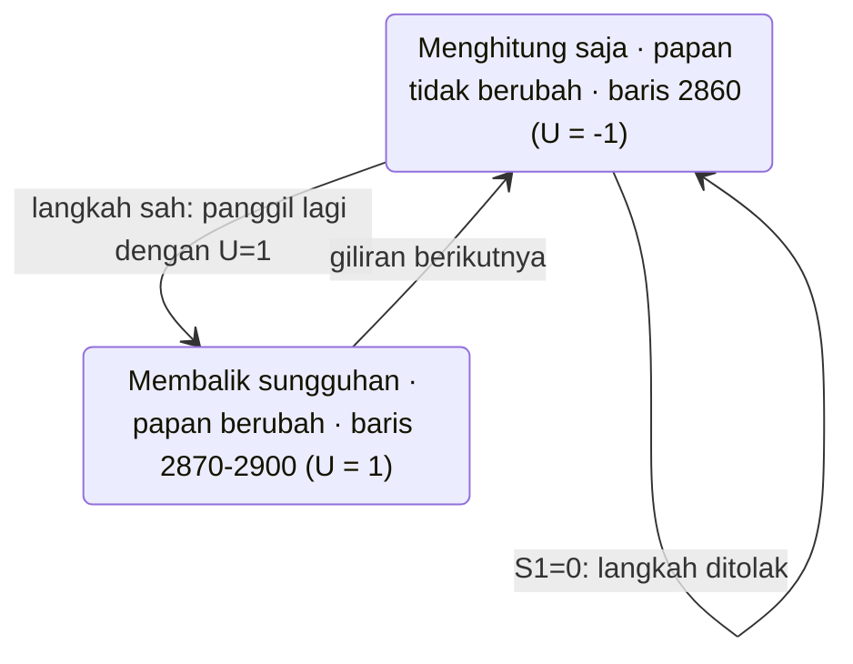
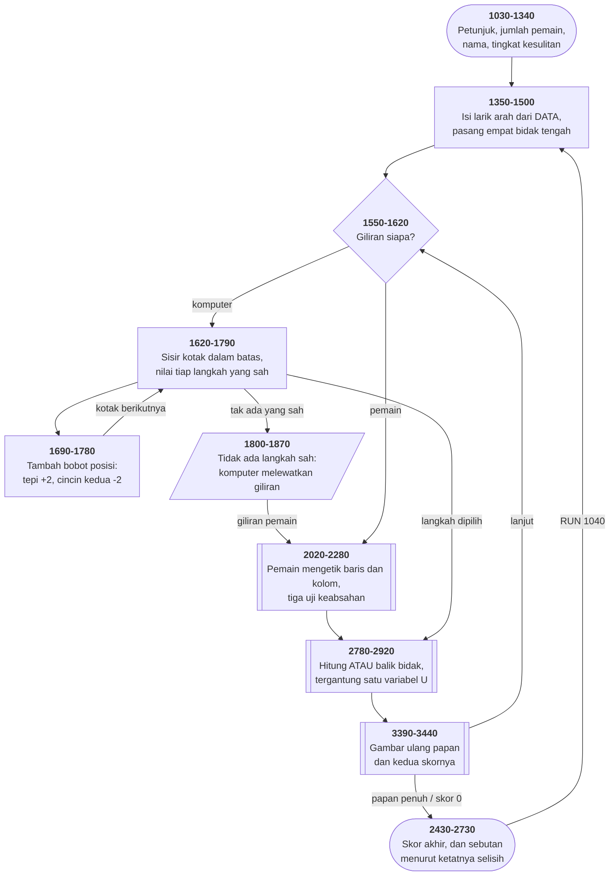

# OTHELLO.BAS di penelusur

> Program ketiga belas. 248 baris, nomor 1000–3450, cakupan tabel
> **248/248 (100%)**.

Sumber: `run/OTHELLO.BAS` · tabel: `tracer/program/OTHELLO.js` ·
analisis: [`reviews/OTHELLO.md`](../../reviews/OTHELLO.md)

Satu-satunya program di koleksi ini yang **bukan tulisan Friendlyware**, dan
ia mengakuinya sendiri di baris pertama:

```basic
1000 REM  OTHELLO -- PET VERSION -- MODIFIED BY PATRICK LEABO
1010 REM                                        TUCSON, ARIZONA
1025 REM NOT DONE YET BUT HAVE FUN -- PLEASE ADD A GOOD ALGORITHM TO IT
```

Port dari BASIC Commodore PET, dimodifikasi seseorang di Tucson pada Maret
1982 — dan dikirim dengan catatan bahwa algoritmanya belum bagus.

## Yang ditagih: `INPUT` — celah mesin besar terakhir

Sepanjang dua belas program sebelumnya, **tidak satu pun memakai `INPUT`**.
Semuanya menulis penyunting masukannya sendiri dari `INKEY$` — lihat
[BIO.BAS](bio.md) baris 1340–1670 dan [HANGMAN.BAS](hangman.md) baris
2130–2240, masing-masing tiga puluh baris untuk apa yang `INPUT` lakukan dalam
satu.

OTHELLO memakai perintah bawaannya:

```basic
1270 SOUND 3000,2:INPUT "ENTER PLAYER 1,S NAME! ";P$(1):P$(1)= P$(1)+" "+ CHR$(2)
```

Dan itu masuk akal — ia bukan tulisan tim yang sama.

Bedanya dengan `INKEY$` mendasar: `INKEY$` mengambil **satu tombol** dan tidak
pernah menunggu; `INPUT` menunggu **satu baris utuh**, lengkap dengan gema di
layar dan Backspace yang bekerja.

Terverifikasi di penelusur — mengetik `AGUX`, menekan Backspace, lalu Enter:

| tahap | keadaan |
|---|---|
| sesudah memilih jumlah pemain | status `masukan`, penunjuk berhenti di baris 1270 |
| mengetik `AGUX`, lalu Backspace | isi baris jawaban: `AGU` |
| Enter | `P$(1)` jadi `"AGU " + CHR$(2)`, penelusuran lanjut |

Lencana status berwarna ungu selama modus ini.

## Satu rutin yang menguji dan mengerjakan

Di Othello, sebuah langkah sah hanya kalau ia **mengapit** setidaknya satu
deret bidak lawan. Jadi program harus menjawab dua pertanyaan: "apakah langkah
ini sah?" dan "bidak mana saja yang terbalik?"

Naluri pertama: dua rutin. Masalahnya, keduanya harus **sepakat** — kalau
pemeriksa bilang sah tapi pengerjanya tidak membalik apa-apa, papannya rusak
diam-diam.

Program ini memakai **satu** rutin, dan satu variabel yang memilih perannya:

```basic
2860 IF U <> 1 THEN 2910
```



Dengan `U = −1` ia melewati baris 2870–2900 dan cuma menjumlahkan. Dengan
`U = 1` ia juga membalik bidaknya. Baris 2230–2240 memanggilnya untuk menguji;
baris 2340–2350 memanggilnya lagi untuk mengerjakan.

**Uji dan kerja tidak mungkin berbeda pendapat, karena keduanya kode yang
sama.**

Terverifikasi: langkah `3 D` ditolak (`S1 = 0`, "DOESN'T FLANK A ROW"), langkah
`3 E` diterima (`S1 = 1`), papan berubah, lalu komputer menjawab di `(3,6)` dan
membalik kembali bidak yang sama — Othello yang benar:

```
....WB..     ← W pemain di (3,5), B komputer di (3,6)
...WB...
...BW...
```

## Enam baris yang memuat seluruh strateginya

```basic
1690 IF (I=1) OR (I=8) THEN S1 = S1 + S2    ' tepi        +2
1710 IF (I=2) OR (I=7) THEN S1 = S1 + S5    ' cincin ke-2 −2
1730 IF (I=3) OR (I=6) THEN S1 = S1 + S4    ' cincin ke-3 +1
```

Tepi papan bernilai positif, dan cincin kedua **negatif**. Kenapa? Karena kotak
di sebelah sudut adalah jebakan paling terkenal di Othello: mengisinya memberi
lawan jalan masuk ke sudut, dan sudut tidak pernah bisa direbut kembali.

Kalau pemain menjawab `N` pada "should I play my best", ketiganya jadi nol —
komputer kembali ke strategi paling naif: ambil yang paling banyak sekarang.
**Dua tingkat kesulitan dari tiga angka.**

Satu detail lagi di baris 1770: kalau dua langkah bernilai sama, **lempar
koin**. Tanpa itu komputer selalu memilih kotak pertama yang ditemuinya, dan
permainannya bisa dihafal.

## Peta arsitektur



## Jejak mesin yang tidak ikut pindah

Program ini lahir di Commodore PET. Sebagian besar berhasil dipindahkan — tapi
**tiga hal ikut terbawa tanpa diterjemahkan**, dan ketiganya terlihat jelas
saat ditelusuri.

**`D$`** (baris 1050–1060) dibangun dari `CHR$(11)` dan dua puluh `CHR$(10)`.
Di PET itu perintah kursor: "pulang ke atas, lalu turun dua puluh". Di PC,
`CHR$(11)` bukan apa-apa dan `CHR$(10)` memindah baris — jadi tiap kali `D$`
dicetak, layarnya **tergulung dua puluh baris**. Itulah kenapa tampilan program
ini terasa berantakan, dan penelusur menirunya apa adanya.

**`TI$`** (baris 2980) adalah jam PET. Di GW-BASIC ia sekadar variabel string
yang tak pernah diisi, jadi mencetak kosong.

**`CHAIN "B:MENU",1000`** (baris 3240) menunjuk berkas di **drive B**. Di mesin
berdisket-satu, menekan ESC berarti galat 53 dan program berhenti. Cacat yang
menunggu.

Pelajarannya: memindahkan program antar-mesin berarti memeriksa **tiap** asumsi
tentang mesinnya — bukan hanya yang membuat program menolak jalan. **Yang
paling berbahaya justru yang tetap jalan, tapi salah.**

## Yang bisa dicoba di halaman

| coba ini | yang terlihat |
|---|---|
| tekan `1`, lalu ketik nama + Enter | lencana status jadi ungu (`masukan`) — modus `INPUT` |
| tekan Backspace saat mengetik | huruf terakhir terhapus di layar dan di baris jawaban |
| jawab `Y` pada "play my best" | `S2=2, S4=1, S5=−2` — ketiga bobot posisi menyala |
| jawab `N` | ketiganya nol; komputer jadi naif |
| ketik langkah `3 D` | ditolak di baris 2250: "DOESN'T FLANK A ROW" |
| ketik langkah `3 E` | diterima, `S1=1`, satu bidak terbalik |
| pasang titik henti di 2860 | lihat rutin yang sama dipanggil dua kali, dengan `U` berbeda |
| tekan `ESC` | `CHAIN "B:MENU"` — penelusuran berhenti dengan galat 53 |

## Penyimpangan dari aslinya

1. **`SOUND` dan `BEEP` tidak berbunyi**, dan `COLOR 26,0` (sian + kedip) tidak
   berkedip.
2. **`TI$` mencetak kosong** — bukan penyimpangan porting, memang begitu di
   mesin aslinya.
3. **`D$` menggulung layar dua puluh baris** — juga bukan penyimpangan
   porting.
4. **ESC menghentikan penelusuran** karena `B:MENU` tidak ada di koleksi.
5. **Keempat gelung tunda habis seketika**, dan pengacaknya berbenih tetap.

## Yang jangan ditiru

- **Variabel yang diisi dan tidak pernah dibaca.** `Z1 = 1` di baris 2140 tidak
  muncul lagi di mana pun.
- **Angka pecahan sebagai penanda.** Baris 3400: `FACE = (A+3)/2` memberi
  **1,5** untuk kotak kosong, dan baris 3410 mengujinya dengan `IF FACE = 1.5`.
  Membandingkan bilangan pecahan dengan tanda sama dengan adalah kebiasaan yang
  cepat atau lambat menggigit.
- **Baris terakhir yang tidak pernah tercapai.** `3450 GOTO 2730` — baris 3440
  sudah `RETURN` lebih dulu.

---
[Rancangan penelusur](_rancangan.md) · [MENU](menu.md) · [INTRO](intro.md) · [CHECK](check.md) · [TOWERS](towers.md) · [HEAREYE](heareye.md) · [TICTAC](tictac.md) · [MASTER](master.md) · [BOGGY](boggy.md) · [PEGLEAP](pegleap.md) · [BIO](bio.md) · [HANGMAN](hangman.md) · [BUSONE](busone.md)
