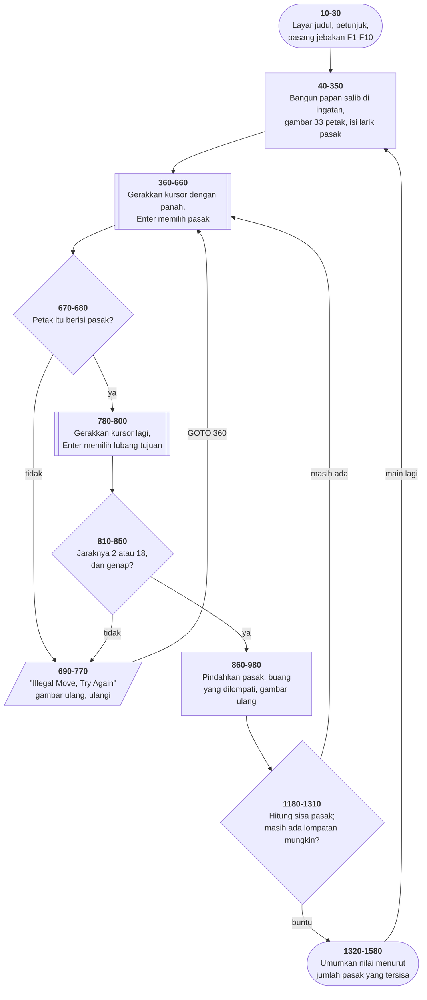
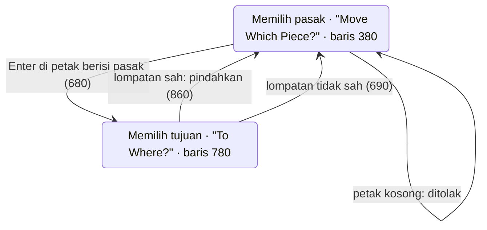

# PEGLEAP.BAS di penelusur

> Program kesembilan, dan yang pertama memakai **kursor sebagai alat tunjuk**.
> 202 baris, nomor 10–2010, cakupan tabel **202/202 (100%)**.

Sumber: `run/PEGLEAP.BAS` · tabel: `tracer/program/PEGLEAP.js` ·
analisis: [`reviews/PEGLEAP.md`](../../reviews/PEGLEAP.md)

Papan salib 33 petak, satu lubang di pusat, tujuan menyisakan satu pasak. Tidak
ada nomor kotak yang diketik: pemain menggerakkan kursor dengan tombol panah
lalu menekan Enter — dua kali, sekali untuk pasak yang melompat dan sekali
untuk lubang tujuannya.

## Yang ditagih program ini dari mesinnya

**1. Jebakan tombol panah.** `ON KEY(11..14)` — 11 atas, 12 kiri, 13 kanan, 14
bawah, penomoran GW-BASIC. Selama jebakannya terpasang, panah **tidak** sampai
ke `INKEY$`; ia langsung memanggil penanganya. [TOWERS.BAS](towers.md) memakai
jalan sebaliknya — panah lewat `INKEY$` sebagai `CHR$(0)`+kode pindai — dan
keduanya benar. Yang membedakan cuma ada tidaknya jebakan.

**2. `KEY(n) STOP` — keadaan ketiga.** Bukan sekadar ON atau OFF: tombolnya
tetap **diingat**, tapi penjemputannya ditunda sampai `KEY(n) ON` berikutnya.

```basic
410 KEY(11) ON:KEY(12) ON:KEY(13) ON:KEY(14) ON
420 KEY(11) STOP:KEY(12) STOP:KEY(13) STOP:KEY(14) STOP
430 ON KEY(11) GOSUB 500
…
470 MOVE$=INKEY$:IF MOVE$<>CHR$(13) THEN 410
```

Nyalakan, langsung tunda, pasang penangan, baca `INKEY$`; kalau bukan Enter,
ulangi. `KEY ON` di baris 410 itulah yang menjemput panah yang ditekan
sementara itu. Tanpa keadaan tunda, tombol yang datang di sela gelung hilang.

**3. Kursor sebagai penyimpan keadaan.** Lihat di bawah.

## Peta arsitektur



## Peta keadaan: satu tombol Enter, dua arti



Satu-satunya petunjuk keadaan yang diberikan ke pemain adalah teks di baris 23
layar: **"Move Which Piece?"** berubah jadi **"To Where?"**. Tidak ada penanda
lain — tidak ada warna, tidak ada bingkai. Kalau pemain melewatkan perubahan
teks itu, ia tidak punya cara tahu sedang di mana.

## Tiga trik penyimpanan yang layak dipelajari

### Satu daftar DATA, dua pekerjaan

Tiga puluh tiga angka di baris 340–350 dibaca **dua kali**:

- Baris 90 (`READ XY(R,C)`) membacanya sebagai **peta koordinat**: petak papan
  mana bernomor berapa.
- Baris 330 (`RESTORE` lalu `READ M:B(M)=-7`) membacanya lagi sebagai **daftar
  petak berisi pasak**.

Satu sumber kebenaran melayani dua kebutuhan, dan tidak mungkin melenceng satu
sama lain. Menambah petak berarti menyunting satu daftar, bukan dua.

### Jumlah tiga petak sebagai uji lompatan

Bagaimana tahu permainannya sudah buntu? Untuk tiap pasak, periksa tiap arah,
lihat apakah tetangganya pasak dan tetangga berikutnya lubang. Itu tiga
perbandingan per arah.

Baris 1220 melakukannya dengan satu penjumlahan:

```basic
1220 FOR A=R-1 TO R+1:T=0:FOR B=C-1 TO C+1:T=T+T(A,B):NEXT B
1230 IF T<>10 THEN 1250
```

Tiga petak berderet dijumlahkan. Kalau totalnya **10**, satu-satunya
kemungkinan adalah 5+5+0 — dua pasak dan satu lubang. Kombinasi lain tidak bisa
berjumlah 10, karena nilainya cuma 5 (pasak), 0 (lubang), dan −5 (luar papan).

Ini bekerja **hanya karena nilai penandanya dipilih dengan sengaja**. Kalau
"ada pasak" diberi nilai 1 dan "lubang" 0, jumlahnya tidak bisa membedakan
1+1+0 dari 1+0+1. **Memilih representasi yang membuat pertanyaan Anda mudah
dijawab adalah setengah dari pekerjaan pemrograman.**

### Bentuk papan sebagai perkalian

```basic
50 IF (R-4)*(R-5)*(R-6)=0 THEN 80
```

Bernilai benar kalau R adalah 4, 5, atau 6 — salah satu faktornya jadi nol.
Satu perkalian menggantikan `IF R=4 OR R=5 OR R=6`. Baris 850 memakai trik yang
sama untuk menguji jarak lompatan:

```basic
850 IF (ABS(Z-P)-2)*(ABS(Z-P)-18)<>0 THEN 690
```

"Jaraknya harus 2 atau 18" — mendatar atau menegak. Diagonal ditolak tanpa satu
pun `OR`.

## Layar sebagai satu-satunya ingatan

Pemain menggerakkan kursor dengan panah. Di petak mana kursornya sekarang?

Program ini **tidak menyimpannya**. Baris 480–490 menghitungnya kembali dari
posisi kursor di layar:

```basic
480 XSAVE=POS(0):XCOORD=(POS(0)-10)/6
490 YSAVE=CSRLIN:YCOORD=(CSRLIN/3)+1:RETURN
```

Berhasil, dan hemat dua variabel. Tapi artinya **layar adalah satu-satunya
tempat keadaan itu disimpan**. Satu `LOCATE` nyasar dari penangan mana pun — F10
misalnya — dan pilihan pemain ikut bergeser, tanpa satu pun pesan galat.

Program ini sadar akan bahayanya: baris 1830 menyimpan posisi kursor sebelum
penangan F10 mengubahnya, dan baris 1890 mengembalikannya. Tambalan yang benar
untuk masalah yang tidak perlu ada.

## Cacat yang menunggu di jalur langka

```basic
1380 IF F<>2 THEN 1410
1390 LOCATE 21,1:PRINT "EXECELLENT!"
1400 THEN LOCATE 21,3:PRINT "Try Again."
```

`THEN` tanpa `IF` di depannya. Itu bukan pernyataan yang sah di GW-BASIC.

Dan baris ini hanya tercapai lewat satu jalan: baris 1380 melompat ke 1410
kecuali `F=2`, jadi 1390 dan 1400 hanya jalan kalau permainan berakhir dengan
**tepat dua pasak tersisa**.

Seberapa sering itu terjadi? Cukup jarang sehingga bisa lolos dari seluruh
pengujian, dan cukup sering sehingga **pemain yang bermain bagus justru yang
menemukannya**.

Penelusur memodelkannya sebagai galat sintaks (ERR 2), jadi penelusuran berhenti
di sana dengan pesan yang jelas. **Apakah penafsir aslinya benar-benar berhenti
di situ belum diperiksa** — cara memastikannya satu perintah:

```
run\PEGLEAP.bat        mainkan sampai tersisa tepat dua pasak
```

Kalau muncul `Syntax error in 1400`, catatan ini benar. Kalau tidak, catatan ini
harus diperbaiki.

Pola ini punya nama yang layak diingat: **cacat berumah di jalur yang jarang
dilalui.** Jalur galat, jalur kasus tepi, jalur "seharusnya tidak mungkin".
Kalau Anda menulis cabang yang jarang dijalankan, jalankan ia sekali dengan
sengaja — sebelum penggunanya yang melakukannya untuk Anda.

## Yang bisa dicoba di halaman

| coba ini | yang terlihat |
|---|---|
| jawab `N`, lalu tekan panah kiri | kursor melompat enam kolom — jebakan `ON KEY(12)` yang menggerakkannya, bukan `INKEY$` |
| panah kiri dua kali, lalu Enter | `Z=39`, dan teks baris 23 berubah jadi **"To Where?"** |
| panah kanan dua kali, lalu Enter | pasak melompat dari 39 ke 41; petak 39 dan 40 jadi kosong |
| pilih petak kosong sebagai asal | "Illegal Move, Try Again" — baris 680 menolak sebelum menanyakan tujuan |
| coba lompat diagonal | ditolak di baris 850 oleh satu perkalian |
| pasang titik henti di 1400 | jalur cacat; hanya tercapai kalau tersisa dua pasak |
| pasang titik henti di 760 | satu-satunya cara membaca "Illegal Move" sebelum terhapus |

## Penyimpangan dari aslinya

1. **Baris 1400 dimodelkan sebagai galat sintaks** — lihat bagian di atas,
   termasuk apa yang belum diketahui.
2. **Jeda satu detik sesudah "Illegal Move" habis seketika** (baris 760).
3. **`COLOR 23,0` tidak berkedip.** Pasak yang sedang dipilih seharusnya
   berkedip putih.
4. **Larik `B()` dan `T()` ditulis `B_` dan `T_` di dalam mesin.** BASIC
   membedakan variabel `T` dari larik `T()`, dan baris 1220 memakai keduanya
   dalam satu baris.

---
[Rancangan penelusur](_rancangan.md) · [MENU](menu.md) · [INTRO](intro.md) · [CHECK](check.md) · [TOWERS](towers.md) · [HEAREYE](heareye.md) · [TICTAC](tictac.md) · [MASTER](master.md) · [BOGGY](boggy.md)
