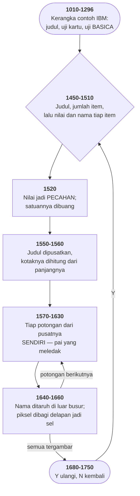

# PIECHART.BAS di penelusur

> Program ketujuh puluh empat. 77 baris, nomor 940–1750, cakupan tabel
> **77/77 (100%)**.

Sumber: `run/PIECHART.BAS` · tabel: `tracer/program/PIECHART.js`

Piechart (contoh IBM, 1982). Diagram pai yang seluruh irisannya merenggang tanpa satu baris pun yang khusus untuk itu.

## Sepersepuluh derajat yang menyelamatkan potongan pertama

Baris 1620 adalah baris yang menggambar tiap potongan:

```basic
1620 CIRCLE (CX,CY),SR,1,-A1-0.001,-A2,5/6
```

Dua argumen di tengah itu sudut awal dan sudut akhir. Keduanya ditulis **negatif**, dan tanda minusnya bukan soal arah.

Di GW-BASIC, sudut negatif pada `CIRCLE` berarti: *gambar busurnya, DAN gambar jari-jari dari pusat ke kedua ujungnya.* Tanpa minus yang keluar cuma lengkung melayang; dengan minus ia jadi potongan pai.

Tandanya membawa arti yang tidak ada hubungannya dengan besar sudutnya. Dan di situlah masalahnya.

Potongan **pertama** mulai di `A1 = 0`. Dan minus nol tetap nol. Penafsirnya melihat angka nol dan tidak punya cara tahu apakah itu "sudut nol, tolong gambar jari-jarinya" atau "sudut tidak diberikan sama sekali".

Akibatnya potongan pertama akan kehilangan satu sisinya — satu-satunya irisan di seluruh diagram yang terbuka.

Tambalannya: `-A1-0.001`. Kurangi seperseribu radian — sekitar sepertujuh belas derajat — supaya angkanya benar-benar negatif.

Kecil sekali. Di lingkaran berjari-jari 44 piksel, seperseribu radian menggeser ujungnya kurang dari setengah piksel. Tidak ada yang bisa melihatnya.

Yang dibelinya bisa dihitung. Digambar di permukaan grafik penelusur, satu potongan sepanjang satu radian menghasilkan:

`CIRCLE (160,100),44,1,0.001,1   →   48 piksel   (busur telanjang)`

`CIRCLE (160,100),44,1,-0,-1     →   81 piksel   (busur + SATU jari-jari)`

`CIRCLE (160,100),44,1,-0.001,-1 →   122 piksel   (busur + dua jari-jari)`

Empat puluh satu piksel. Itu harga dari seperseribu radian, dan itu satu sisi utuh potongan pertama.

Yang membuat tambalan ini layak dicatat bukan kepintarannya, melainkan **ketidakterlihatannya**. Tidak ada satu `REM` pun di berkas ini yang menjelaskan kenapa ada angka 0.001 di sana. Siapa pun yang membaca baris itu hari ini akan menyangkanya sisa dari eksperimen, dan siapa pun yang merapikannya akan mematahkan potongan pertama — satu potongan, di satu tempat, yang mungkin baru ketahuan berbulan-bulan kemudian.

Tambalan yang benar dan tidak dijelaskan adalah ranjau yang ditanam dengan niat baik.

## Potongan yang tidak pernah terlihat

Baris 1630 memilih warna isi tiap potongan:

```basic
1630 PAINT (CX+COS(AA)*0.8*SR,CY-SIN(AA)*0.8*SR),C MOD 4,1
```

Titik yang dicat dihitung dengan rapi — delapan persepuluh jari-jari sepanjang garis bagi sudutnya, jadi selalu jatuh di dalam potongan yang benar, sejauh mungkin dari kedua tepinya. Itu bagian yang dipikirkan.

Warnanya `C MOD 4`.

SCREEN 1 punya empat warna: 0, 1, 2, 3. Dan warna **0 adalah warna latar**. Sisa bagi empat dari nomor potongan menghasilkan:

`potongan 1 → 1   2 → 2   3 → 3   4 → 0   5 → 1   …`

Potongan keempat dicat dengan warna latar. Ia tidak hilang — garis tepinya tetap tergambar — tapi bagian dalamnya sama hitamnya dengan sisa layar. Begitu juga potongan kedelapan, kedua belas, dan seterusnya.

Yang benar cukup `1+(C-1) MOD 3`, yang berputar di 1, 2, 3 saja.

Kenapa tidak ketahuan? Karena diagram dengan tiga item bekerja sempurna. Dan tiga item adalah jumlah yang paling mungkin dipakai orang yang mencoba program contoh sebentar.

Cacat yang bersembunyi di balik **cara program itu biasanya dicoba**, bukan di balik kerumitan kodenya.

## Peta arsitektur



## Alur yang layak diikuti

| baris | yang terjadi |
|---|---|
| `1620` | sudut **negatif** di CIRCLE = gambar jari-jarinya juga → potongan pai |
| `1620` | …dan `-A1-0.001` memaksa sudut **nol** tetap terbaca negatif |
| `1600` | pusat tiap potongan **digeser** sepanjang garis bagi sudutnya |
| `1610` | …selisih `LR-SR` = enam piksel: itu seluruh "pai yang meledak" |
| `1520` | nilai diubah jadi **pecahan dari total**; satuannya dibuang |
| `1630` | `C MOD 4` → potongan keempat dicat dengan **warna latar** |
| `1650` | koordinat piksel dibagi **delapan** jadi koordinat sel teks |
| `1560` | kotak judul dihitung dari **panjang teksnya**, dalam piksel |

## Yang bisa dicoba di halaman

| coba ini | yang terlihat |
|---|---|
| pasang titik henti di 1620 | sudut **negatif** di CIRCLE = gambar jari-jarinya juga → potongan pai |
| pasang titik henti di 1620 | …dan `-A1-0.001` memaksa sudut **nol** tetap terbaca negatif |
| pasang titik henti di 1600 | pusat tiap potongan **digeser** sepanjang garis bagi sudutnya |
| pasang titik henti di 1610 | …selisih `LR-SR` = enam piksel: itu seluruh "pai yang meledak" |
| pasang titik henti di 1520 | nilai diubah jadi **pecahan dari total**; satuannya dibuang |

Aslinya dijalankan dengan `run\\PIECHART.bat`.

> Ketik judul diagram, lalu jumlah item, lalu nilai dan nama tiap item dipisah koma. Coba dengan empat item atau lebih dan perhatikan potongan keempatnya.

## Penyimpangan dari aslinya

1. **Kerangka 940-1299 dibangun oleh SPACE.js.** Penyimpangannya sama persis: `PLAY` diam, `PEEK(&H410)` selalu menjawab "ada kartu warna", dan `CHAIN "samples"` tidak pernah dicapai.
2. **Satu aksara TAB nyasar di baris 1560** berkas aslinya, tepat sebelum `,16`. GW-BASIC memperlakukannya seperti spasi, jadi tidak ada akibatnya — tapi ia ada di sana.
3. **`INPUT "numeric value ,name";R(I),A$(I)` dipecah jadi dua permintaan** di penelusur, karena satu `INPUT` yang mengisi dua variabel sekaligus tidak punya padanan langsung.

## Yang layak ditiru

**Pai yang meledak, dari satu pengurangan.** `LR=50` jari-jari tata letak, `SR=44` jari-jari potongan. Selisihnya enam. Baris 1600-1610 memakai selisih itu untuk menggeser **pusat** tiap potongan enam piksel sepanjang garis bagi sudutnya sendiri. Potongan yang mengarah ke kanan bergeser ke kanan, yang ke atas bergeser ke atas. Hasilnya diagram pai yang irisannya merenggang dari tengah — dan tidak ada satu baris pun yang mengurus "perenggangan". Ia akibat dari menghitung pusat per potongan, bukan sekali untuk semua.

**Sudut negatif sebagai penanda bentuk.** Di GW-BASIC, `CIRCLE` dengan sudut awal dan akhir menggambar **busur**. Kalau sudutnya ditulis **negatif**, ia juga menggambar jari-jari dari pusat ke kedua ujungnya — menjadikannya potongan pai. Tandanya membawa arti yang tidak ada hubungannya dengan besarnya. Padat, dan itulah yang melahirkan cacat di butir berikutnya.

**Menjembatani piksel dan sel dengan satu pembagian.** Baris 1650: `LOCATE 1+(LY\\8),1+(LX\\8)`. Satu sel aksara di SCREEN 1 lebarnya delapan piksel dan tingginya delapan piksel, jadi bagi-bulat delapan mengubah koordinat gambar jadi koordinat teks. Dan baris 1660 melakukan kebalikannya — mengalikan kembali jadi piksel untuk menggarisbawahi namanya. Dua sistem koordinat di satu layar, dijembatani satu operator.

## Yang jangan ditiru

**Nol yang tidak bisa dibedakan dari "tidak ada".** Baris 1620 menulis `-A1-0.001`, bukan `-A1`. Sebabnya: potongan pertama mulai di sudut **nol**, dan minus nol tetap nol. GW-BASIC tidak bisa membedakan "sudut nol, gambar jari-jarinya" dari "sudut tidak diberikan" — jadi potongan pertama akan kehilangan satu sisinya. Tambahan sepersepuluh derajat memaksanya jadi bilangan negatif yang sebenarnya. Angkanya sengaja sekecil mungkin supaya tidak terlihat. Ini jenis tambalan yang benar dan sekaligus rapuh: ia bekerja, tapi tidak ada satu `REM` pun yang menjelaskannya, dan siapa pun yang merapikan angka "aneh" itu akan mematahkan potongan pertamanya.

**Warna yang berputar melewati warna latar.** Baris 1630: `PAINT (...), C MOD 4, 1`. Dengan empat warna di SCREEN 1, sisa bagi empat menghasilkan 1, 2, 3, **0**, 1, 2, 3, 0… Dan nol adalah **warna latar**. Potongan keempat, kedelapan, dan seterusnya dicat dengan warna yang sama dengan latarnya — jadi tidak terlihat sama sekali, cuma garis tepinya. Yang benar `1+(C-1) MOD 3`: berputar di 1, 2, 3 saja. Kesalahannya cuma terlihat kalau diagramnya punya empat item atau lebih — dan contoh di manualnya kemungkinan besar tiga.

**Nama yang dipakai dua kali, lagi.** `A$(100)` menyimpan nama potongan; `A$` tanpa kurung dipakai baris 1710 untuk membaca tombol. Di BASIC keduanya variabel berbeda, jadi programnya benar — tapi ini tabrakan yang ketiga di koleksi ini, sesudah BOWLING dan SPACE.

**Seratus item yang tidak bisa muat.** `DIM R(100),A$(100)`. Tapi label potongan ditaruh dengan `LOCATE` di layar 40×25, dan warna isinya cuma punya tiga nilai yang terlihat. Diagram dengan sepuluh item saja sudah bertumpuk labelnya. Batas larik dan batas yang sebenarnya berjarak jauh, dan yang diberitahukan ke pemakainya cuma yang pertama.

---
[Rancangan penelusur](_rancangan.md) · [SPACE](space.md) · [15PUZZLE](15puzzle.md)
