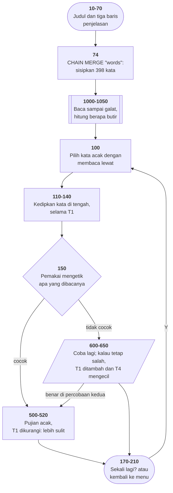

# READING.BAS di penelusur

> Program ketiga puluh tiga. 39 baris, nomor 5–2020, cakupan tabel
> **39/39 (100%)**.

Sumber: `run/READING.BAS` · tabel: `tracer/program/READING.js`

Sebuah **tachistoscope**: kata dikedipkan sekejap di tengah layar, pemakai
mengetik apa yang sempat dibacanya, dan lamanya kedipan disesuaikan menurut
betul-salahnya. Alat latih kecepatan membaca yang di sekolah 1970-an berupa
mesin proyektor seharga ratusan dolar — di sini tiga puluh sembilan baris.

## Program yang menyambung dirinya sendiri

Baris 74 adalah satu-satunya di seluruh koleksi ini yang memakai `CHAIN MERGE`:

```basic
74 CHAIN MERGE "words", 75, ALL
```

Tiga bagian: muat **words**, lanjutkan di baris **75**, pertahankan **semua**
variabel.

Yang membedakannya dari `CHAIN` biasa (yang dipakai HANGMAN.BAS dan OTHELLO.BAS
untuk pindah ke menu) adalah kata `MERGE`: barisnya tidak **menggantikan**
program yang sedang berjalan, melainkan **disisipkan ke dalamnya**, menurut
nomor baris.

Jadi sesudah baris 74, yang berjalan di memori adalah READING.BAS **ditambah**
[WORDS.BAS](words.md). Berkas READING.BAS di disket tidak berubah; yang berubah
program yang hidup.

Itu sebabnya WORDS.BAS bernomor mulai 10000 — supaya penyisipannya tidak menimpa
baris READING.BAS mana pun.

## Menghitung DATA dengan cara menabrak

Sesudah kamusnya masuk, program perlu tahu satu hal: **ada berapa kata?** Tanpa
itu, baris 100 tidak bisa mengundi kata acak.

BASIC tidak punya cara menanyakannya. Tidak ada `LEN(DATA)`, tidak ada penunjuk
yang bisa dibaca. Yang ada cuma `READ`, dan galat kalau `READ` kehabisan. Jadi
galat itulah yang dipakai sebagai jawaban:

```basic
1000 ON ERROR GOTO 1050
1010 RESTORE:L=0
1020 READ X$:L=L+1:GOTO 1020
1050 RETURN
```

Baca terus. Naikkan pencacah. Waktu DATA habis, BASIC melempar galat 4 dan
melompat ke 1050.

Terverifikasi di penelusur — **413 langkah, `L=398`**, cocok persis dengan
jumlah butir di WORDS.BAS (yang berisi 398 dan bukan 399 karena
[koma yang hilang di baris 10320](words.md#koma-yang-hilang)).

Ini pola yang di bahasa modern akan disebut menyalahgunakan pengecualian sebagai
alur kendali, dan memang begitu. Bedanya: di sini tidak ada pilihan lain.
**Satu-satunya cara mengetahui panjang sesuatu adalah berjalan sampai ujungnya
dan menabrak dindingnya.**

### Ranjau yang ikut terpasang

Baris 1050 memakai `RETURN`, bukan `RESUME`. `RESUME` yang menutup penanganan
galat; tanpanya, GW-BASIC menganggap dirinya masih di dalam penangan selamanya,
dan **galat berikutnya tidak akan tertangkap**. Di program sependek ini tidak
pernah terasa — tapi menambah satu `OPEN` saja sudah cukup untuk membuatnya
terasa.

### Dan satu jebakan waktu memportingnya

`READ X$:L=L+1:GOTO 1020` **wajib** ditulis sebagai tiga penggal terpisah di
tabel baris. Waktu `READ` gagal, BASIC meninggalkan sisa barisnya dan pergi ke
penangan galat — jadi `L=L+1` dan `GOTO 1020` tidak boleh ikut jalan. Ditulis
sebagai satu penggal, `GOTO 1020` akan **menimpa** belokan ke penangan galat itu
dan gelungnya tidak akan pernah berhenti. Persis yang terjadi di percobaan
pertama.

## Satu variabel yang menyetel kesulitannya

`T1` adalah lamanya kata dikedipkan — jumlah putaran gelung kosong di baris 140.
Mulai dari 1000.

| | |
|---|---|
| benar (baris 520) | `T1 = T1 - T4` — kedipan berikutnya lebih singkat |
| salah (baris 650) | `T1 = T1 + T4` — lebih lama, lebih mudah |

Dalam beberapa putaran, `T1` akan mengendap di sekitar batas kemampuan
pembacanya. Gagasan yang sekarang punya nama, *adaptive testing*, dalam dua
baris. Terverifikasi enam putaran berturut-turut:

```
putaran 1: kata="look"   T1=900
putaran 2: kata="one"    T1=800
putaran 3: kata="laugh"  T1=700
putaran 4: kata="put"    T1=600
putaran 5: kata="like"   T1=500
putaran 6: kata="right"  T1=400
```

### Langkahnya mengecil dan tidak pernah pulih

`T4`, besar langkah penyesuaiannya, mulai dari 100 — dan baris 600 menyetelnya
jadi **10** begitu ada kesalahan pertama:

```basic
600 PLAY "n50n25":T4=10
```

Tidak ada satu baris pun yang mengembalikannya ke 100. Terverifikasi:

```
kata="look"              T4 awal=100
setelah salah pertama:   T4=10
setelah salah kedua:     T1=1010  T4=10
putaran 2, benar:        T1=1000  T4=10   <- tetap 10
```

Sesudah satu kesalahan, alat ini butuh **sepuluh kali lebih banyak putaran**
untuk bergerak sejauh yang sama.

Yang membuatnya sulit terlihat: perubahannya **ke arah yang benar**. Langkah
yang mengecil sesudah kesalahan pertama memang terdengar masuk akal —
penyesuaian halus di dekat batas kemampuan. Tapi kalau itu maksudnya, ia
seharusnya berlaku dua arah dan bisa pulih. Yang tertulis cuma satu arah,
sekali, dan selamanya.

## Pujian yang seperempat waktunya kosong

```basic
500 COLOR 0,7:I=RND(6)*6+1:X=40-LEN(C(I))/2:LOCATE 12,X:PRINT C(I):COLOR 7,0
```

`RND(6)*6+1` menghasilkan 1 sampai 7. `C()` cuma diisi 1 sampai 5. Terverifikasi
— dua dari enam putaran di atas mendapat `I=7`:

```
putaran 2: pujian I=7 -> ""
putaran 5: pujian I=7 -> ""
```

Layar diam. Tidak ada galat, tidak ada tanda apa pun. Pemakai yang baru saja
menjawab benar cuma melihat tidak terjadi apa-apa.

## Benih acak yang dihitung lalu dibuang

```basic
75 GOSUB 1000:T1=1000:T4=100:T$=TIME$:XX=VAL(LEFT$(T$,2))*120+…:RANDOMIZE
```

`XX` dihitung dari jam — jelas dimaksudkan sebagai benih — lalu `RANDOMIZE`
ditulis **tanpa argumen**. Akibatnya dua-duanya salah:

1. `XX` tidak pernah dipakai di mana pun.
2. GW-BASIC malah **berhenti dan bertanya** `Random number seed (-32768 to
   32767)?` — di tengah layar judul, sebelum pemakai sempat menekan tombol apa
   pun.

Yang dimaksud hampir pasti `RANDOMIZE XX`.

Rumus `XX` sendiri juga meleset: jam dikali **120**, padahal menit dikali 60 dan
detik dikali 1. Seharusnya 3600. Rumus yang sama muncul lagi di baris 2000 dan
2010, tempatnya benar-benar dipakai untuk menunggu — dan di sana kesalahannya
terasa sekali dalam enam puluh menit.

## Peta arsitektur



## Yang bisa dicoba di halaman

| coba ini | yang terlihat |
|---|---|
| pasang titik henti di 1050 | `L=398` — hasil menghitung dengan cara menabrak |
| pasang titik henti di 130 | kata yang dikedipkan, dan `X` yang memusatkannya |
| jawab benar beberapa kali | `T1` turun 100 tiap kali |
| jawab salah sekali | `T4` jatuh ke 10 dan tidak pernah kembali |
| perhatikan `C(I)` di baris 500 | sesekali `I=6` atau `7` dan pujiannya kosong |

## Penyimpangan dari aslinya

1. **`CHAIN MERGE` ditiru dengan menyambung antrean `DATA`** milik WORDS.BAS ke
   antrean program ini. Baris-baris WORDS.BAS tidak muncul di panel sumber —
   tapi karena seluruhnya `DATA`, tidak ada satu pun yang akan pernah disorot
   sebagai baris yang berjalan. Kehilangannya nol untuk penelusuran; buka
   [halaman WORDS](words.md) untuk melihat isinya.
2. **Gelung tunda habis seketika.** Baris 140 (lama kedipan) dan 2000–2020
   (menunggu lima satuan jam) lewat dalam satu langkah, jadi kedipannya tidak
   berkedip: kata muncul lalu langsung hilang. Pasang titik henti di baris 130
   untuk membacanya.
3. **`PLAY` diam** — tiga nada naik untuk benar, dua dengung rendah untuk salah.
4. **Jam penelusur maju tetap tujuh detik tiap dibaca.** Di sini itu justru yang
   membuat gelung tunggu di baris 2010 bisa selesai sama sekali.
5. **`RANDOMIZE` tanpa argumen tidak bertanya** — benihnya dipasang tetap supaya
   penelusuran bisa diulang.

## Yang jangan ditiru

- **Undian yang melewati batas lariknya.** `I=RND(6)*6+1` untuk larik berisi 5.
- **Langkah penyesuaian yang mengecil dan tidak pernah pulih.** `T4`.
- **`RETURN` dari dalam penangan galat.** Baris 1050.
- **Jam yang dikali 120.** Baris 75, 2000, 2010.
- **Benih yang dihitung lalu dibuang.** `XX` dan `RANDOMIZE` polos.

---
[Rancangan penelusur](_rancangan.md) · [WORDS](words.md) · [WRTSTR](wrtstr.md) · [NOTETABL](notetabl.md) · [OCTAVE](octave.md)
