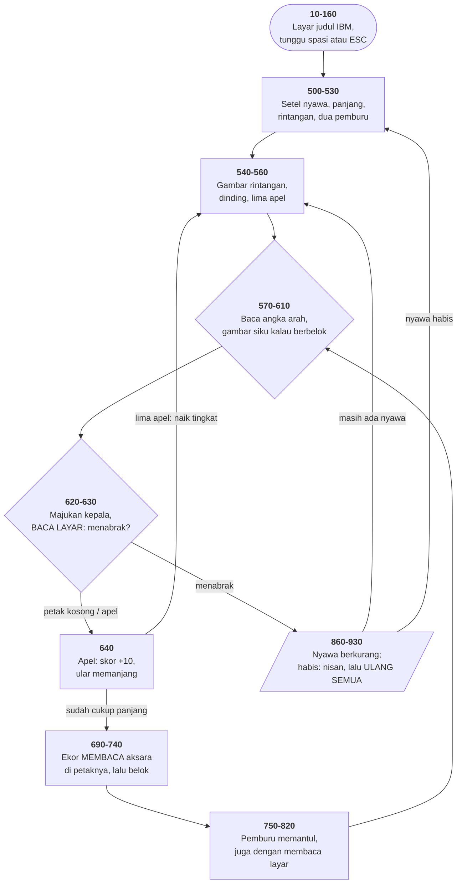
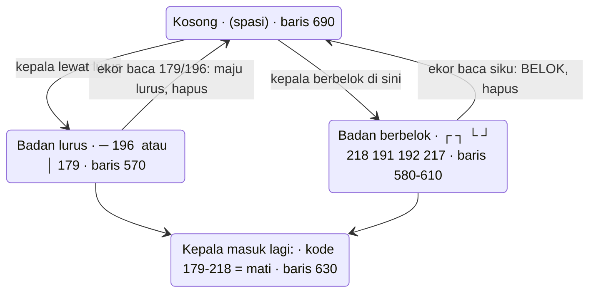

# SERPENT.BAS di penelusur

> Program keempat puluh. 64 baris, nomor 10–970, cakupan tabel **64/64 (100%)**.

Sumber: `run/SERPENT.BAS` · tabel: `tracer/program/SERPENT.js`

Permainan ular, Oktober 1982. Dan gagasan pusatnya salah satu yang paling
berani di seluruh koleksi ini:

**Tidak ada larik yang menyimpan tubuh ularnya.**

Tidak ada `DIM BODY(200)`, tidak ada antrean, tidak ada penunjuk kepala dan
ekor. Yang ada cuma empat angka — `HX,HY` kepala dan `EX,EY` ekor — dan **layar
itu sendiri** sebagai penyimpan keadaan.

## Bentuk aksara yang menyimpan arah

Tubuh ular digambar dengan aksara kotak CP437, dan bentuknya **mengandung
arah**:

| aksara | kode | artinya |
|---|--:|---|
| `─` | 196 | badan mendatar |
| `│` | 179 | badan menegak |
| `┌ ┐ └ ┘` | 218 191 192 217 | badan yang berbelok di sini |

Waktu kepala berbelok, baris 580–610 menggambar siku yang sesuai. Beberapa
langkah kemudian ekor tiba di petak itu, **membacanya kembali**, dan dari
bentuknya menyimpulkan harus belok ke mana:

```basic
690 S=SCREEN(EY,EX):LOCATE EY,EX:PRINT " ";
700 IF S=179 THEN EY=EY+Y2 ELSE IF S=196 THEN EX=EX+X2
710 IF S=191 THEN IF X2=1 THEN X2=0:Y2=1:EY=EY+Y2 ELSE ...
```

Terverifikasi di penelusur — ular berjalan ke kanan, dibelokkan ke bawah di
kolom 6, dan ekornya menyusul sendiri:

```
putaran 13: ekor(1,4) baca S=196  arah(1,0)   <- ─ terus ke kanan
putaran 14: ekor(1,5) baca S=196  arah(1,0)
putaran 15: ekor(1,6) baca S=191  arah(1,0)   <- ┐ tikungan!
putaran 16: ekor(2,6) baca S=179  arah(0,1)   <- sudah belok ke bawah
putaran 17: ekor(3,6) baca S=179  arah(0,1)
```

**Ekor menyusuri jalur yang persis sama dengan yang ditempuh kepalanya, tanpa
ada satu pun yang mengingat jalur itu.**

## Kepala yang terlihat

Ada satu detail yang mudah dikira salah ketik:

```basic
570 ... IF Y1=0 THEN PRINT "─"; ELSE PRINT "│";     ' posisi LAMA
660      IF Y1=0 THEN PRINT "│"; ELSE PRINT "─";     ' posisi BARU
```

Kedua baris memakai syarat yang sama tapi aksara yang terbalik. Itu disengaja:
baris 660 menggambar **kepalanya** — sebuah coretan melintang yang terlihat
menonjol dari badan. Satu langkah kemudian baris 570 menimpanya dengan aksara
badan yang benar, dan barulah ekor bisa membacanya sebagai jalur.

## Tabrakan dalam satu perbandingan rentang

```basic
630 S=SCREEN(HY,HX):IF S<219 AND S>178 OR S=235 THEN 860
```

Semua aksara kotak CP437 berada di rentang 179–218, dan tidak ada yang lain di
sana. Jadi **satu perbandingan rentang menggantikan seluruh daftar "apa saja
yang padat"** — karena tata letak tabel aksaranya sendiri sudah
mengelompokkannya.

Pemburu di baris 790–800 memantul dengan cara yang sama: baca layar di
depannya, dan kalau kodenya di rentang itu, balikkan arah.

## Memanjang tanpa menyisipkan apa pun

```basic
670 IF LE>1 THEN LE=LE-1:GOTO 750
```

Selama ular belum sepanjang `L`, ekornya **tidak dijalankan sama sekali** —
cuma dikurangi. Ular memanjang karena kepalanya jalan dan ekornya belum mulai.
Tidak ada antrean yang perlu disisipi, tidak ada penggeseran larik.

## Peta arsitektur



## Keadaan satu petak tubuh

Aksara di layar bukan gambar tubuhnya — aksara **itulah** tubuhnya.



## Yang bisa dicoba di halaman

| coba ini | yang terlihat |
|---|---|
| pasang titik henti di 690 | `S` = kode aksara yang sedang dibaca ekornya |
| pasang titik henti di 630 | `S` di depan kepala; 179–218 berarti mati |
| kemudikan dengan `8 2 4 6` | angka, bukan tombol panah — lihat di bawah |
| pasang titik henti di 670 | `LE` menghitung mundur: itulah ular memanjang |
| jalankan sampai mati tiga kali | baris 510 menyetel ulang **semuanya** |

## Penyimpangan dari aslinya

1. **`WIDTH 40` tidak ditiru** — penyimpangan terbesar di berkas ini. Lapangan
   aslinya 40×25 memenuhi layar; di sini ia menempati separuh kiri konsol 80
   kolom. Batas geraknya tetap 40 karena diperiksa program sendiri di baris
   620, jadi permainannya berjalan benar — cuma terlihat sempit.
2. **`SOUND` dan `BEEP` diam.**
3. **`COLOR ,,n` tidak ada padanannya** — argumen ketiga mengatur warna
   *bingkai* di luar daerah 80×25, sesuatu yang cuma ada di perangkat keras
   CGA. Baris 860 memakainya untuk mengedipkan bingkai saat ular mati.
4. **`INPUT$(1)` ditiru dengan penungguan satu tombol**, dan **`LOAD"MENU",R`
   diperlakukan sama seperti `RUN"MENU"`.**
5. **`LOCATE` penelusur menjepit nilainya ke dalam layar**, sedangkan GW-BASIC
   melempar galat untuk `LOCATE 0,0`. Bedanya terasa persis di satu tempat —
   lihat pemburu ketiga di bawah.
6. **`POKE 1047,32` tidak ditiru.** Alamat itu bendera papan tombol BIOS;
   menulis 32 mematikan Caps/Num/Scroll Lock sekaligus, supaya tombol angka
   arahnya terbaca sebagai angka.
7. **Gelung tunda habis seketika.**

## Yang jangan ditiru

- **Apel yang bisa jatuh di atas ular.** Baris 560 menaruh lima apel acak
  tanpa memeriksa apakah petaknya kosong.
- **Pemburu ketiga yang tidak pernah ditaruh di mana pun.** Baris 530 hanya
  menyiapkan `PX(1)` dan `PX(2)`, tapi `P` bertambah tiap 25 apel tanpa batas.
  Begitu `P` mencapai 3, baris 760 menjalankan `LOCATE 0,0` — **galat, dan
  permainan berhenti**.
- **Semua kemajuan hilang saat nyawa habis.** Baris 930 kembali ke 500, dan
  510 menyetel ulang `DL`, `L`, `SL`, `P`. Tapi `SC` **tidak** disetel ulang,
  jadi skor lama terbawa ke permainan baru.
- **Rentang nomor baris yang dipesan lalu dilupakan.** Baris 160 `REM TRANSFER
  COMMAND`, lalu langsung 500.
- **Satu baris, delapan belas penugasan.** Baris 530.

## Kenapa ini indah, dan kenapa tidak akan ditulis lagi

Keunggulannya nyata: tidak ada larik yang bisa kepenuhan, tidak ada kemungkinan
gambar dan data berbeda — keduanya benda yang sama — dan seluruhnya muat di
memori yang pada 1982 diukur dalam kilobita.

Kelemahannya sama nyatanya. Papan skor harus ditaruh di baris 25 di luar
lapangan, karena satu aksara nyasar di dalam lapangan akan dibaca sebagai tubuh
ular. Warna tidak boleh membedakan apa pun. Dan permainan ini tidak bisa
dipindah ke tampilan grafik tanpa ditulis ulang dari nol.

Yang hilang bukan kelenturan, melainkan **batas** — dan justru batas antara
"keadaan" dan "tampilan" itulah yang membuat program bisa diuji, dipindah, dan
diubah tanpa dipahami seluruhnya lebih dulu.

Tapi ada satu yang layak dibawa pulang: di sini, keadaan yang **ditampilkan**
dan keadaan yang **dipakai berpikir** tidak mungkin berselisih, karena ia satu
benda. Setiap kali antarmuka modern memperlihatkan angka yang berbeda dari
angka yang sebenarnya dipakai, yang hilang adalah jaminan yang program 1982 ini
dapatkan secara gratis.

---
[Rancangan penelusur](_rancangan.md) · [MAZE](maze.md) · [SIMEQN](simeqn.md) · [INTEGRAT](integrat.md) · [BUSNINE](bus-akuntansi.md)
