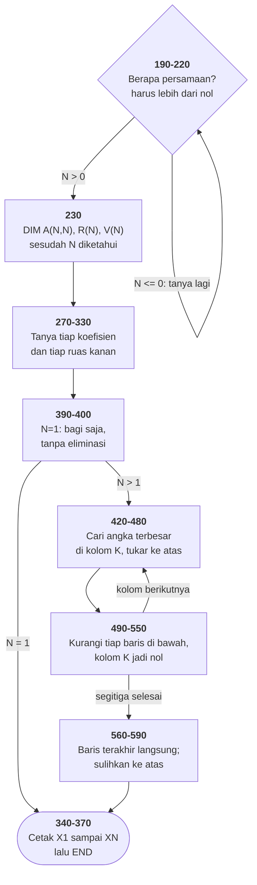

# SIMEQN.BAS di penelusur

> Program ketiga puluh lima. 50 baris, nomor 100–590, cakupan tabel
> **50/50 (100%)**.

Sumber: `run/SIMEQN.BAS` · tabel: `tracer/program/SIMEQN.js`

Penyelesai sistem persamaan linear serentak, Feldman & Rugg 1982. Metodenya
**eliminasi Gauss dengan pivot parsial** — algoritma yang sampai hari ini ada di
dalam LAPACK, yang dipanggil NumPy dan MATLAB setiap kali Anda menyelesaikan
sebuah sistem.

Dua puluh baris BASIC.

## Membuat segitiga, lalu memanjatnya

Tiga persamaan tiga variabel terlihat rumit karena ketiganya terikat satu sama
lain. Eliminasi Gauss melepas ikatan itu satu per satu.

Caranya cuma satu gerakan, diulang: **kurangi sebuah baris dengan kelipatan
baris di atasnya**, sebanyak yang membuat satu koefisiennya jadi nol. Itu boleh
karena mengurangkan persamaan dari persamaan tidak mengubah jawabannya.

| baris | bagian |
|---|---|
| 410–550 | **maju** — buat segitiga: semua yang di bawah diagonal jadi nol |
| 560–590 | **mundur** — baris terakhir tinggal satu suku; sulihkan ke atas |

Terverifikasi, `2x + y = 5` dan `x − y = 1`:

```
A = [[2, 1], [0, -1.5]]      <- sudah segitiga
R = [5, -1.5]
V = [2, 1]                   <- X1=2, X2=1
```

## Kenapa barisnya ditukar-tukar

Baris 420–480 adalah bagian yang paling mudah dikira kerapian, dan justru yang
paling penting.

Sebelum mengeliminasi kolom `K`, program menyisir seluruh baris dari K sampai N,
mencari yang **nilai mutlaknya paling besar** di kolom itu, lalu menukarnya ke
posisi K.

Alasannya ada di baris 500: `Q=A(M,K)/A(K,K)`. Angka yang jadi penyebut itu
dipakai untuk **setiap baris di bawahnya**. Kalau kebetulan kecil — katakan
0,0001 — maka `Q` jadi besar, dan setiap galat pembulatan kecil di baris K ikut
dikalikan besar dan disebar ke seluruh matriks.

Menukar baris **tidak mengubah jawaban sama sekali**; sistem persamaan tidak
peduli urutan penulisannya. Yang berubah cuma berapa banyak angka di belakang
koma yang masih bisa dipercaya di akhir.

Ini salah satu contoh paling bersih dari sesuatu yang sering terlihat di kode
numerik: **langkah yang secara matematika tidak melakukan apa-apa, tapi tanpanya
hasilnya berantakan.**

Terverifikasi dengan sistem yang baris pertamanya sengaja berkoefisien nol:

```
0x + 1y + 1z = 5
1x + 1y + 1z = 6
1x + 2y + 3z = 14
```

```
tukar pertama: K=1  L=2       <- baris 2 dinaikkan jadi pivot
A setelah maju: [[1,1,1], [0,1,1], [0,0,1]]
V = [1, 2, 3]                 <- benar
```

Tanpa penukaran itu, baris 500 akan membagi dengan nol di langkah pertama.

Perhatikan juga baris 470 dan 480: yang ditukar bukan cuma koefisiennya, tapi
**ruas kanannya juga**. Kalau yang kedua terlupa, matriksnya benar tapi
jawabannya salah, dan tidak ada satu pun yang akan memberi tahu. Persamaan
adalah kedua sisinya.

## Yang dicari, tapi tidak pernah ditanyakan

Program sudah bersusah payah mencari angka terbesar di kolom itu — tapi tidak
pernah bertanya apakah yang terbesar itu **nol**.

Kalau ya, sistemnya singular: dua persamaan yang sebenarnya sama, atau tiga yang
salah satunya gabungan dua lainnya. Diagonalnya jadi nol, dan baris 500, 560,
serta 400 semuanya membagi tanpa memeriksa.

Terverifikasi dengan `x + y = 2` dan `2x + 2y = 4`:

```
A setelah maju: [[2, 2], [0, 0]]
R = [4, 0]
V = [NaN, NaN]
status: selesai
```

**Program selesai dengan tenang dan mencetak sampah sebagai jawaban.** Tidak ada
galat, tidak ada peringatan. (Di GW-BASIC sungguhan hasilnya sedikit berbeda —
"Division by zero" tercetak lalu perhitungan dilanjutkan dengan tak-hingga mesin
1.701412E+38 — tapi akibatnya sama: angka yang terlihat seperti jawaban.)

Padahal pivot parsial di 420–450 sudah memegang informasinya. Satu `IF` di baris
455 sudah cukup untuk mengatakan "sistem ini tidak punya jawaban tunggal".

## Satu baris yang tertinggal di dalam gelung

```basic
580 Q=0:FOR J=M+1 TO N:Q=Q+A(M,J)*V(J)
590 V(M)=(R(M)-Q)/A(M,M):NEXT:NEXT
```

Perhatikan di mana `NEXT` yang pertama berada: **sesudah** `V(M)=…`. Artinya
penugasan itu ada di dalam gelung `J`, dan dijalankan ulang tiap putaran.

Hanya yang terakhir yang dipakai — dan yang terakhir itu memang benar, karena
`Q` sudah lengkap saat itu. Jadi programnya bekerja. Itu justru yang membuat
cacat semacam ini bertahan puluhan tahun: **tidak ada gejalanya.**

Tapi harganya bukan cuma kecepatan. Pembaca berikutnya — termasuk penulisnya
sendiri enam bulan kemudian — harus berhenti, melacak `Q`, dan meyakinkan diri
bahwa penugasan berulang itu tidak merusak apa-apa. Kode yang benar karena
kebetulan menuntut pembuktian ulang tiap kali dibaca.

Memindahkan satu `NEXT` ke ujung baris 580 menyelesaikan keduanya sekaligus.

## Dua gaya gelung dalam satu subrutin

```basic
410 FOR K=1 TO N-1:M=K+1          ' FOR/NEXT
450 IF M<N THEN M=M+1:GOTO 430    ' gelung buatan sendiri
510 FOR J=K+1 TO N                ' FOR/NEXT lagi
540 IF M<N THEN M=M+1:GOTO 500    ' buatan sendiri lagi
```

Keduanya melakukan hal yang persis sama, di subrutin yang sama, sepuluh baris
berjauhan. Yang buatan sendiri **tidak mendapat apa pun** sebagai gantinya — ia
cuma membuat batas gelungnya tidak terlihat.

## Peta arsitektur



## Yang bisa dicoba di halaman

| coba ini | yang terlihat |
|---|---|
| `2` lalu `2,1,5` dan `1,-1,1` | X1=2, X2=1 |
| taruh nol di koefisien pertama | baris 470 menyala: pivot ditukar |
| pasang titik henti di 500 | `Q` = kelipatan yang dikurangkan |
| pasang titik henti di 560 | segitiga selesai; sulih balik dimulai |
| beri dua persamaan yang sama | jawabannya sampah, tanpa satu pun peringatan |

## Penyimpangan dari aslinya

1. **`WIDTH 40` tidak ditiru**; konsol tetap 80 kolom. Terasa di baris 380, yang
   menggambar garis pemisah selebar 40 aksara.
2. **`BEEP` diam** (baris 210).
3. **Pembagian nol memberi `NaN`, bukan tak-hingga mesin.** Akibatnya sama:
   program selesai dengan tenang dan mencetak sampah.
4. **`SWAP` ditulis apa adanya sebagai tukar-tiga-langkah** di baris 470 dan
   480.

## Yang jangan ditiru

- **Membagi tanpa memeriksa nol.** Baris 400, 500, 560.
- **Penugasan yang tertinggal di dalam gelung.** Baris 590.
- **Dua gaya gelung dalam satu subrutin.**
- **`"The";N;"unknowns"`** — "The 1 unknowns", dan di sini `MID$(STR$(N),2)`
  tidak dipakai padahal dipakai di tiga tempat lain.

---
[Rancangan penelusur](_rancangan.md) · [INTEGRAT](integrat.md) · [READING](reading.md) · [WORDS](words.md) · [NOTETABL](notetabl.md)
