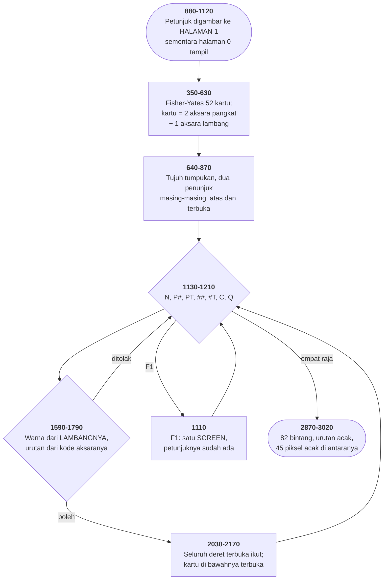

# SOLITAIR.BAS di penelusur

> Program kedelapan puluh. 313 baris, nomor 10–65399, cakupan tabel
> **313/313 (100%)**.

Sumber: `run/SOLITAIR.BAS` · tabel: `tracer/program/SOLITAIR.js`

Klondyke Solitaire (Jeff Littlefield, 1983-84). Layar petunjuk yang sudah tergambar di halaman lain sebelum ada yang memintanya.

## Layar yang sudah ada sebelum diminta

Kartu CGA punya memori teks untuk beberapa layar penuh sekaligus — delapan halaman di 40 kolom, empat di 80. Yang ditampilkan ke layar cuma satu, dan BASIC memilihnya lewat dua argumen terakhir `SCREEN`:

`SCREEN mode, warna, aktif, tampak`

`aktif` halaman yang menerima `PRINT`. `tampak` halaman yang terlihat. Keduanya boleh berbeda, dan di situlah seluruh triknya.

Program ini memakainya tiga kali, dan ketiganya berbeda:

`180 SCREEN 0,1,0,0`   tulis 0, tampil 0 — keadaan biasa

`880 SCREEN 0,1,1,0`   tulis 1, tampil 0 — **menggambar diam-diam**

`1110 SCREEN 0,1,0,1`   tulis 0, tampil 1 — **menampilkan yang tadi digambar**

Baris 880 sampai 1070 mencetak seluruh layar petunjuk: judul, enam aturan, sepuluh perintah, dua puluh dua baris teks berwarna. Semuanya masuk ke halaman 1, dan pemain tidak melihat apa-apa terjadi.

Lalu baris 1110 — penangan F1 — berbunyi:

```basic
1110 KEY (1) OFF : LOCATE ,,0: SCREEN 0,1,0,1
```

Matikan jebakannya sendiri, sembunyikan kursor, tampilkan halaman 1. Itu saja. Layar petunjuknya muncul dalam satu detak layar.

Dan penutupnya, baris 1090: `SCREEN 0,1,0,0`. Meja permainannya kembali — utuh, karena ia tidak pernah tersentuh.

Bandingkan dengan cara yang biasa dipakai program lain di koleksi ini: SUB.BAS membaca kembali isi layar sebelum menimpanya, lalu menuliskannya kembali sesudahnya. DRAW.BAS menyimpan seluruh RAM layar ke larik. Keduanya butuh kode, keduanya bisa salah, dan keduanya menghabiskan waktu.

Di sini tidak ada apa-apa yang perlu disimpan, karena tidak ada apa-apa yang ditimpa.

Diukur di penelusur: menekan F1 dari meja permainan membutuhkan **dua langkah** — baris 1110 saja — dan sesudahnya halaman 0 masih memegang meja lengkap dengan ketujuh tumpukannya sementara halaman 1 menampilkan seluruh layar petunjuk. Tidak satu sel pun ditulis ulang.

## Delapan puluh dua titik yang mengeja YOU WON

Di ujung berkas ada sembilan baris DATA berisi 82 string tiga angka:

```basic
3040  DATA "002","006","009","010","011","014","018",…
```

Dan baris 2980-3000 memakainya:

```basic
2980 Y = VAL(LEFT$(XYPOS$,1))+8
```

```basic
2990 X= VAL(RIGHT$(XYPOS$,2))
```

```basic
3000 LOCATE Y,X:PRINT "*";
```

Angka pertama barisnya (nol sampai lima, ditambah delapan jadi 8 sampai 13), dua angka terakhir kolomnya (2 sampai 39). Satu string tiga aksara membawa dua koordinat.

Digambar seluruhnya, kedelapan puluh dua bintang itu membentuk:

`  *   *  ***  *   *    *   *  ***  *   *`

`   * *  *   * *   *    *   * *   * **  *`

`    *   *   * *   *    * * * *   * *** *`

`    *   *   * *   *    * * * *   * * ***`

`    *   *   * *   *    * * * *   * *  **`

`    *    ***   ***      * *   ***  *   *`

YOU WON.

Tapi mereka tidak muncul sekaligus. Baris 2900-3010 mengambilnya satu per satu dalam urutan ACAK — dengan kocokan yang persis sama dengan yang dipakai untuk kartu di baris 410-450:

```basic
2950 LL = INT(RND(1)*I)+1
```

```basic
2960 XYPOS$=XYARR$(LL)
```

```basic
2970 XYARR$(LL)=XYARR$(I)
```

Ambil satu dari sisa, pindahkan yang terakhir ke tempatnya, perkecil sisanya. Tidak ada bintang yang muncul dua kali, dan tidak ada percobaan yang terbuang.

Dan di antara tiap bintang, baris 2910-2940 menaburkan 45 piksel berwarna acak ke seluruh layar. Jadi hurufnya tersusun perlahan di tengah hujan warna — tiga ribu enam ratus piksel acak, dan delapan puluh dua yang tidak acak.

Seluruh kembang api itu: sembilan baris DATA, dua puluh baris kode, dan sebuah kocokan yang sudah ada di program untuk keperluan lain.

## Peta arsitektur



## Alur yang layak diikuti

| baris | yang terjadi |
|---|---|
| `880` | petunjuk digambar ke **halaman teks lain** sementara meja tetap tampil |
| `1110` | …jadi F1 cuma satu `SCREEN`, dan menutupnya tak perlu gambar ulang |
| `390` | kartu = dua aksara pangkat + satu aksara **lambang** (CHR$ 3-6) |
| `2850` | …warnanya dibaca langsung dari lambangnya |
| `1680` | …urutannya dari selisih **kode aksara**; A/10/J/Q/K jadi kekecualian |
| `410` | kocokan Fisher-Yates yang benar — tanpa satu percobaan terbuang |
| `2950` | …dan kocokan yang sama dipakai lagi untuk urutan bintang kemenangan |
| `2790` | tundaan membaca **pencacah detak BIOS**, bukan gelung kosong |
| `520` | dua penunjuk per tumpukan: kartu teratas dan kartu terbuka terbawah |
| `2470` | satu baris yang **tidak pernah dijalankan** — 2460 RETURN, 2480 pintu masuk |

## Yang bisa dicoba di halaman

| coba ini | yang terlihat |
|---|---|
| pasang titik henti di 880 | petunjuk digambar ke **halaman teks lain** sementara meja tetap tampil |
| pasang titik henti di 1110 | …jadi F1 cuma satu `SCREEN`, dan menutupnya tak perlu gambar ulang |
| pasang titik henti di 390 | kartu = dua aksara pangkat + satu aksara **lambang** (CHR$ 3-6) |
| pasang titik henti di 2850 | …warnanya dibaca langsung dari lambangnya |
| pasang titik henti di 1680 | …urutannya dari selisih **kode aksara**; A/10/J/Q/K jadi kekecualian |

Aslinya dijalankan dengan `run\\SOLITAIR.bat`.

> Jawab Y untuk melihat petunjuknya. Di meja, tekan N untuk kartu berikutnya, "P3" untuk memindahkan kartu buangan ke tumpukan 3, "52" untuk memindahkan tumpukan 5 ke tumpukan 2, "1T" untuk ke tumpukan atas. F1 kapan saja untuk petunjuk — perhatikan betapa cepat ia muncul dan hilang.

## Penyimpangan dari aslinya

1. **`SOUND` diam**, termasuk bel salah langkah yang disebut petunjuknya sendiri di baris 950.
2. **Pencacah detak BIOS selalu memberi nilai yang sama**, jadi gelung tundaan di baris 2760-2820 tidak menunda apa pun. Di penelusur ia tetap berputar — dan kalau ditelusuri langkah demi langkah, jumlah putarannya bisa dilihat.
3. **`TIME$` selalu 00:00:00**, jadi jam di sudut kanan atas tidak berjalan.
4. **`LOAD"MENU",R` tidak bisa dijalankan.**
5. **Tiap halaman teks di kartunya punya kursornya sendiri; penelusur cuma punya satu.** Tidak berpengaruh di sini, karena tiap halaman selalu memasang `LOCATE`-nya sendiri sebelum mencetak.

## Yang layak ditiru

**Halaman kedua sebagai penyimpan layar.** `SCREEN 0,1,aktif,tampak` memilih halaman teks mana yang DITULISI dan mana yang DITAMPILKAN, dan keduanya boleh berbeda. Baris 880 memasang tulis-ke-1, tampilkan-0. Sepuluh baris berikutnya menggambar seluruh layar petunjuk, dan pemain tidak melihat apa pun — ia masih menatap mejanya. Lalu F1 memicu baris 1110, yang seluruh isinya satu perintah: tampilkan halaman 1. Petunjuknya muncul seketika, tanpa satu huruf pun dicetak. Dan yang lebih penting: saat ditutup, baris 1090 cukup menampilkan halaman 0 lagi. Meja permainannya masih utuh di sana, tidak pernah tersentuh. Tidak ada satu baris pun yang mengurus pemulihan layar — bandingkan dengan SUB.BAS, yang harus membaca kembali isi layar sebelum menimpanya.

**Tiga aksara yang membawa seluruh kartu.** `390 CARD$(I) = ZZ$+CHR$(Z)` Dua aksara pertama pangkatnya (`" A"`, `"10"`, `" K"`), aksara ketiga lambangnya — CHR$(3) sampai CHR$(6), yaitu hati, wajik, keriting, dan sekop di tabel aksara IBM. Aksara itu sekaligus yang **dicetak**. Tidak ada penerjemahan dari nomor lambang ke gambar: nomor lambangnya sudah gambarnya. Dan warnanya dibaca dari aksara yang sama (baris 2850): CHR$(3) dan CHR$(4) merah, sisanya hitam. Satu bandingan, dan aturan "merah tidak boleh di atas merah" jadi dua baris di 1590-1600. Yang layak dicatat: penyimpanan, penampilan, dan pengujian aturan semuanya memakai bentuk yang sama. Tidak ada titik tempat kartu perlu diterjemahkan.

**Dua penunjuk untuk satu tumpukan.** `STACKPTR(I)` menunjuk kartu paling atas; `VISIPTR(I)` menunjuk kartu TERBAWAH yang terbuka. Selisih keduanya adalah deret kartu yang boleh dipindahkan sekaligus, dan baris 2030 memakainya langsung sebagai batas gelung. Membuka kartu yang tadi tertutup jadi satu pengurangan (baris 2110). Menggambar tumpukan jadi satu perbandingan (baris 740): kalau nomor barisnya sama dengan VISIPTR, kartunya dicetak; kalau tidak, tiga kotak CHR$(254). Dua bilangan, dan seluruh keadaan "apa yang terlihat" ada di keduanya.

**Tundaan yang membaca jam, bukan menghitung putaran.** Baris 2720-2830 tidak berputar sekian ribu kali. Ia membaca pencacah detak BIOS di alamat 0040:006C dan menghitung berapa kali nilainya BERUBAH. `2740 DV!=DT!*18.2/1000` — 18,2 detak per detik, angka yang datang dari pembagi pencacah 8253 di dalam PC: 1.193.180 dibagi 65.536. `2790 A! = A!*256 + PEEK(&H6F-ID)` menyusun empat bita jadi satu bilangan, dibaca dari alamat tertinggi ke terendah. Hasilnya tundaan dalam milidetik yang benar di mesin secepat apa pun — sesuatu yang tidak bisa dilakukan gelung `FOR I=1 TO 2000` yang dipakai hampir semua program lain di koleksi ini.

**Kocokan yang dipakai dua kali untuk dua hal.** Baris 410-450 mengocok kartu: ambil satu acak dari sisa, lalu pindahkan kartu terakhir ke tempat yang barusan kosong. Baris 2950-2970 melakukan hal yang persis sama — tapi yang diambil bukan kartu melainkan POSISI BINTANG di layar kemenangan. Delapan puluh dua bintang muncul satu per satu dalam urutan acak yang tidak pernah mengulang. Algoritma yang sama, dipakai untuk sesuatu yang tidak ada hubungannya dengan kartu.

## Yang jangan ditiru

**Huruf O sebagai nol, lagi.** `2770 A! = O` dan `2780 FOR ID = O TO 3`. Keduanya huruf O, bukan angka nol. Dan keduanya benar — karena variabel `O` tidak pernah diisi. Ini pemakaian KEDUA dari kesalahan yang sama di koleksi ini; yang pertama ABM2A.BAS baris 250. Dua program, dua penulis, satu kebiasaan mengetik yang sama — dan dua kebenaran yang bergantung pada ketiadaan.

**Baris yang berdiri di antara dua alur.** `2460 RETURN` `2470 COLOR 2` `2480 IF SCR.WIDTH=40 THEN …` Baris 2470 tidak pernah dijalankan. Alur di atasnya berakhir dengan `RETURN`, dan satu-satunya jalan ke 2480 adalah `GOSUB 2480` dari baris 320 — yang melewatinya. Jelas ia dulu bagian dari 2480, lalu dipisah. Akibatnya kecil: warna pertanyaan "main lagi?" jadi warna apa pun yang tertinggal dari sebelumnya, bukan warna 2 yang dimaksudkan.

**Sepuluh yang berpangkat nol.** Kartu sepuluh ditulis `"10"`, jadi aksara keduanya — yang dipakai sebagai pangkat — adalah **"0"**. Dan "0" berada SEBELUM "1" sampai "9" di tabel aksara. Jadi seluruh perbandingan urutan di baris 1610-1680 dan 1710-1770 harus menulis kekecualian untuk sepuluh, dua kali di tiap tempat. Enam kekecualian yang seluruhnya ada karena satu keputusan penyimpanan: memakai aksara kedua sebagai pangkat, alih-alih menyimpan nomor pangkat tersendiri. Keputusan itu membeli sesuatu — kartu bisa dicetak apa adanya — dan yang dibayar tersebar di dua puluh baris di tempat lain.

**Tiga kali dua puluh empat.** `1220 IF DECKPTR+3>ENDDECK THEN DECKPTR=28` `1240 IF X <=3 THEN DECKPTR=ENDDECK ELSE DECKPTR=DECKPTR+3` Kartu buangan dibuka tiga-tiga, dan penunjuknya melompat tiga. Tapi `ENDDECK` menyusut tiap kali sebuah kartu dipakai, jadi kelipatan tiganya bergeser. Akibatnya beberapa kartu di tumpukan buangan jadi tidak pernah terlihat pada putaran tertentu — bukan hilang, tapi baru muncul sesudah putaran berikutnya menggeser kelipatannya. Solitaire sungguhan punya persoalan yang sama, jadi tidak ada yang pernah menyebutnya cacat. Tapi di sini ia akibat dari aritmetika penunjuk, bukan dari aturan permainan.

---
[Rancangan penelusur](_rancangan.md) · [LIFE2](life2.md) · [15PUZZLE](15puzzle.md) · [CRAZY8](crazy8.md)
