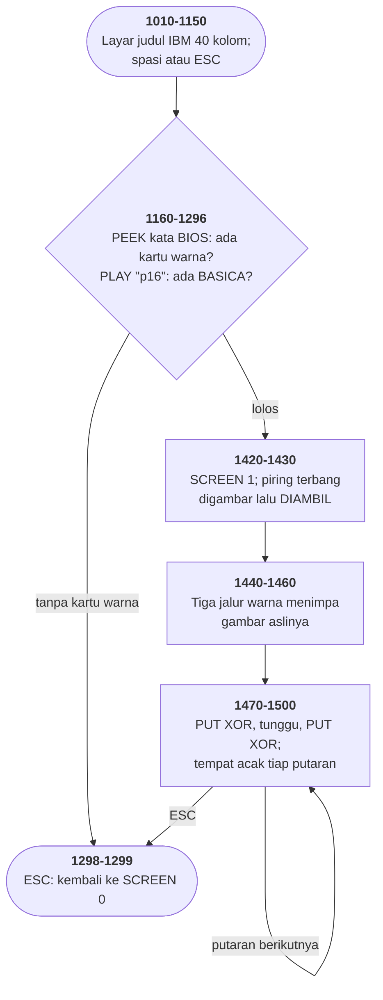

# SPACE.BAS di penelusur

> Program ketujuh puluh tiga. 57 baris, nomor 940–1500, cakupan tabel
> **57/57 (100%)**.

Sumber: `run/SPACE.BAS` · tabel: `tracer/program/SPACE.js`

Space (contoh IBM, R. Heiney & M. Hallerman, 1982). Lima puluh tujuh baris, dan hanya delapan di antaranya yang benar-benar programnya — sisanya kerangka yang dipakai seluruh disket contoh IBM.

## Satu baris yang membangun sebuah benda

Baris 1430 adalah seluruh bagian menarik dari program ini:

```basic
1430 CLS:CIRCLE(160,100),30,1,,,0.45:PAINT(160,100),1,1:DRAW"bm160,100e30bm160,100h30":LINE (130,100)-(190,100),2:GET(130,70)-(190,130),I
```

Dibaca satu per satu:

`CIRCLE(160,100),30,1,,,0.45` menggambar elips. Argumen terakhir aspeknya — 0,45 berarti tingginya kurang dari separuh lebarnya. Itu badan piringnya.

`PAINT(160,100),1,1` mengisinya. Warna isi dan warna batas sama-sama 1, dan itu cara BASIC berhenti tepat di garis elipsnya.

`DRAW"bm160,100e30bm160,100h30"` — `bm` pindah tanpa menggambar ke pusatnya, `e30` menarik garis 30 satuan ke kanan atas, lalu `bm` kembali ke pusat dan `h30` ke kiri atas. Dua sinar.

`LINE (130,100)-(190,100),2` satu garis mendatar melintasi badannya.

Dan yang terakhir:

`GET(130,70)-(190,130),I`

Petak 61×61 di sekeliling gambar itu **disalin ke dalam larik**. Sesudah baris ini, piring terbangnya ada di dua tempat: di layar, dan di memori.

Baris berikutnya menghapus yang di layar — tiga jalur warna menutupi seluruh 320×200. Yang tersisa cuma yang di memori.

Cara berpikirnya masih dipakai. Yang berubah cuma tempat asetnya dibuat: hari ini di penyunting gambar, di sini **di layar yang sama yang nanti dipakai menampilkannya**.

## Dari mana idiom pintu belakang itu berasal

Empat kali sebelumnya di koleksi ini muncul bentuk yang sama persis, di program yang penulisnya berbeda-beda:

```basic
980 SAMPLES$="NO"
990 GOTO 1010
1000 SAMPLES$="YES"
```

Baris 1000 tidak bisa dicapai dari mana pun. Satu-satunya cara menjalankannya adalah mengetik `RUN 1000` di prompt BASIC — dan yang melakukannya cuma satu program: SAMPLES.BAS, menu disket contoh IBM, yang memanggil tiap program contoh lewat baris keduanya supaya program itu tahu harus kembali ke menu.

Di MORTGAGE, DROIDS, MUSIC, dan WIZARD, saya cuma bisa mencatat bahwa idiomnya berulang. Di sini sebabnya terbaca: **ia bagian dari kerangka contoh IBM**, dan kerangkanya disalin.

Perbandingan baris demi baris antara SPACE.BAS dan PIECHART.BAS memberi angkanya: dari 44 baris yang ada di keduanya, **42 identik aksara demi aksara**. Yang berbeda cuma nomor 940 (judul di dalam REM) dan nomor 1040 (judul di dalam kotak).

Jadi yang sebenarnya disebar bukan cacatnya, melainkan seluruh kerangkanya — layar judul, uji kartu warna, uji BASICA, dan jalan keluar. Cacatnya cuma ikut menumpang, dan bertahan di setiap salinan karena tidak pernah mengganggu siapa pun.

Itu cara sebuah kebiasaan menyebar tanpa ada yang memutuskannya.

## Peta arsitektur



## Alur yang layak diikuti

| baris | yang terjadi |
|---|---|
| `1430` | satu baris: **gambar piring terbang, lalu AMBIL jadi sprite** |
| `1430` | `CIRCLE ...,0.45` — aspek 0,45 memipihkan lingkarannya jadi elips |
| `1440` | tiga jalur warna **menimpa gambar aslinya**; yang tersisa cuma cetakannya |
| `1480` | `PUT XOR`, tunggu, `PUT XOR` lagi → **hapus tanpa menyimpan latar** |
| `1410` | `I` skalar dan `I()` larik dipakai **bersamaan** |
| `1470` | `PLAY "o=j;"` — nomor oktaf **disulih dari variabel** |
| `1170` | `PEEK(&H410)` — uji kartu warna dari **kata perlengkapan BIOS** |
| `1293` | `PLAY "p16"` — jeda tak terdengar, dipakai **menguji adanya BASICA** |
| `980` | pintu masuk kedua yang mati — dan di sini ketahuan ia **bagian kerangka IBM** |

## Yang bisa dicoba di halaman

| coba ini | yang terlihat |
|---|---|
| pasang titik henti di 1430 | satu baris: **gambar piring terbang, lalu AMBIL jadi sprite** |
| pasang titik henti di 1430 | `CIRCLE ...,0.45` — aspek 0,45 memipihkan lingkarannya jadi elips |
| pasang titik henti di 1440 | tiga jalur warna **menimpa gambar aslinya**; yang tersisa cuma cetakannya |
| pasang titik henti di 1480 | `PUT XOR`, tunggu, `PUT XOR` lagi → **hapus tanpa menyimpan latar** |
| pasang titik henti di 1410 | `I` skalar dan `I()` larik dipakai **bersamaan** |

Aslinya dijalankan dengan `run\\SPACE.bat`.

> Tekan spasi di layar judul, lalu ESC untuk keluar. Piring terbangnya muncul di tempat acak dan hilang lagi, berulang sambil memainkan tangga nada yang naik satu oktaf tiap putaran.

## Penyimpangan dari aslinya

1. **`PLAY` diam.** Baris 1470 memakai `o=j;` — penyulihan variabel di dalam string musik, sama seperti YAHTZEE.BAS baris 5600.
2. **`PEEK(&H410)` tidak ditiru.** Baris 1170 membaca kata perlengkapan BIOS untuk menguji adakah kartu warna; penelusur selalu menjawab "ada" dan melompat ke 1291.
3. **`RANDOMIZE` tidak dipanggil sama sekali** di berkas aslinya; penelusur memasang benih tetap.
4. **Gelung tunda di baris 1296 dan 1480 habis seketika**, jadi piringnya berkedip secepat langkah penelusur.
5. **`CHAIN "samples",1000` tidak bisa dijalankan** — dan memang tidak pernah dicapai; lihat catatan cacat.

## Yang layak ditiru

**Menggambar sekali, lalu menyimpan cetakannya.** Baris 1430 menggambar piring terbang dengan empat perintah berbeda — elips, isian, dua sinar, satu garis — lalu `GET(130,70)-(190,130),I` menyalin seluruh petak 61×61 itu ke dalam larik. Baris berikutnya **menimpa gambar aslinya** dengan tiga jalur warna. Piring yang asli hilang; yang dipakai seterusnya cuma cetakannya. Itu pola yang masih dipakai hari ini: bangun aset sekali di awal, lalu tampilkan salinannya berkali-kali. Bedanya, di sini "aset"-nya dibuat oleh program itu sendiri, saat berjalan, di layar yang sama yang nanti dipakai menampilkannya.

**XOR: menghapus dengan menggambar ulang.** `PUT(K1,K2),I,XOR` dua kali di tempat yang sama mengembalikan layar persis seperti semula — karena `a XOR b XOR b = a`. Akibatnya program tidak perlu menyimpan apa yang ada di bawah spritenya. Di mesin dengan memori 64K dan layar 16K, itu bukan penghematan kecil.

**Aspek yang memipihkan lingkaran.** `CIRCLE(160,100),30,1,,,0.45`. Argumen terakhir adalah perbandingan tinggi terhadap lebar. Nilai bawaannya 5/6 — yang membuat lingkaran terlihat bulat di layar yang pikselnya tidak persegi. Nilai 0,45 memipihkannya jadi elips, dan itulah bentuk piring terbangnya. Satu angka, dan sebuah perintah lingkaran jadi perintah elips.

**Menguji kemampuan dengan sengaja membuatnya gagal.** Baris 1293 memainkan `PLAY "p16"` — jeda seperenam belas ketuk. Tidak terdengar, tidak mengubah apa pun. Gunanya cuma satu: kalau penafsirnya Cassette BASIC yang tidak punya `PLAY`, baris itu melempar galat, dan `ON ERROR GOTO 1295` menangkapnya untuk memberi tahu pemakainya memakai BASICA. Pengujian kemampuan sebelum ada satu pun cara resmi menanyakannya — dan idiom yang sama dipakai MUSIC.BAS di koleksi ini.

## Yang jangan ditiru

**Enam puluh baris kerangka untuk delapan baris program.** Dari 57 baris berkas ini, **44 di antaranya kerangka** yang juga ada di PIECHART.BAS — dan 42 dari 44 itu identik aksara demi aksara. Yang berbeda cuma judulnya. Kerangkanya sendiri masuk akal: layar judul, uji perangkat keras, uji penafsir, jalan keluar yang rapi. Yang jadi masalah adalah **cara ia dipakai ulang** — disalin, bukan dipanggil. Memperbaiki satu baris di dalamnya berarti memperbaikinya di setiap berkas contoh di disket itu, satu per satu.

**Pintu masuk kedua yang mati, disebarkan lewat kerangka.** Baris 980-1000: `SAMPLES$="NO":GOTO 1010` lalu baris 1000 yang menyetelnya `"YES"`. Satu-satunya cara mencapainya adalah `RUN 1000` dari luar, dan tidak ada yang melakukannya. Idiom ini sudah muncul empat kali sebelumnya di koleksi ini — MORTGAGE, DROIDS, MUSIC, WIZARD. Di sini akhirnya ketahuan dari mana: **ia bagian dari kerangka contoh IBM**, dan setiap program yang menyalin kerangkanya ikut membawanya.

**Nama yang dipakai dua kali.** Baris 1410 `DIM I(800)`, baris 1470 `FOR I=1 TO 2`. Di BASIC keduanya variabel berbeda — `I` skalar, `I()` larik — jadi programnya benar. Tapi pembacanya harus tahu aturan itu untuk yakin. Tabrakan nama yang sama dengan BOWLING.BAS.

**Larik delapan ratus unsur untuk sprite 61x61.** `DIM I(800)`. Sebuah petak 61×61 di SCREEN 1 butuh 61×61×2 bit = 930 bita, ditambah empat bita kepala. Larik 800 unsur presisi tunggal menyediakan 3.200 bita — cukup, tapi angkanya jelas ditebak, bukan dihitung.

---
[Rancangan penelusur](_rancangan.md) · [PIECHART](piechart.md) · [MORTGAGE](mortgage.md) · [DROIDS](droids.md)
