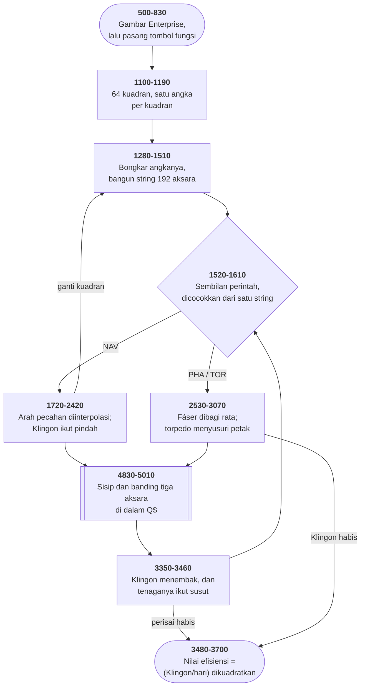

# STARTREK.BAS di penelusur

> Program keenam puluh sembilan. 508 baris, nomor 500–5570, cakupan tabel
> **508/508 (100%)**.

Sumber: `run/STARTREK.BAS` · tabel: `tracer/program/STARTREK.js`

Star Trek (Dave Ahl; dipindahkan Bob Fritz, Oktober 1981). Terbit di Creative Computing awal 1970-an, dipindahkan ke IBM PC sepuluh tahun kemudian — dan bekas kedua zamannya masih terlihat.

## Delapan kali delapan, dalam satu string

Kuadran tempat Enterprise berada adalah petak 8×8. Cara yang wajar menyimpannya hari ini: larik dua dimensi.

Program ini menyimpannya sebagai **satu string**:

```basic
1410 Q$=Z$+Z$+Z$+Z$+Z$+Z$+Z$+LEFT$(Z$,17)
```

`Z$` adalah dua puluh lima spasi. Tujuh kali dua puluh lima ditambah tujuh belas sama dengan **192** — enam puluh empat petak, tiga aksara masing-masing.

Alamatnya dihitung dengan rumus:

```basic
4830 S8=INT(Z2-0.5)*3+INT(Z1-0.5)*24+1
```

Tiga aksara ke kanan per petak, dua puluh empat ke bawah per baris. Itu persis perhitungan yang biasanya dikerjakan penafsir di balik layar untuk sebuah larik — di sini ditulis tangan.

Menaruh sesuatu berarti membelah stringnya:

```basic
4870 Q$=LEFT$(Q$,S8-1)+A$+RIGHT$(Q$,190-S8)
```

Dan memeriksa isinya berarti membandingkan tiga aksara:

```basic
5000 IF MID$(Q$,S8,3)<>A$ THEN RETURN
```

Yang membuat rancangan ini lebih dari sekadar hemat: **ketiga aksara itu adalah gambarnya**. Enterprise disimpan sebagai gambar Enterprise. Klingon sebagai gambar Klingon. Pemindai jarak dekat di baris 3840-3860 tidak menerjemahkan apa-apa — ia memotong stringnya jadi delapan baris dan mencetaknya.

Tidak ada tabel yang memetakan "isi petak" ke "aksara di layar", karena keduanya benda yang sama.

Satu-satunya tempat keduanya berbeda ada di baris 3850: petak kosong yang di dalam string berupa tiga spasi **ditampilkan** sebagai titik tengah `CHR$(250)`. Satu pengecualian, satu baris, dan sisanya identik.

Harganya juga jelas. Sebuah petak tidak bisa menyimpan apa pun yang tidak punya gambar — tidak ada tempat untuk "Klingon dengan kekuatan 137", jadi kekuatannya harus disimpan terpisah di `K(3,3)`, dan kedua struktur itu harus dijaga tetap sejalan dengan tangan. Baris 2710 dan 2720 melakukan itu: hapus dari string, nolkan di larik, kurangi angka galaksinya. Tiga tempat, satu peristiwa.

## Sepuluh tahun antara dua mesin

Star Trek yang asli ditulis Mike Mayfield sekitar 1971 dan menyebar lewat "BASIC Computer Games" karya David Ahl — buku permainan komputer pertama yang terjual sejuta eksemplar. Program itu lahir di mesin yang memorinya diukur kilobita.

Berkas ini pemindahannya ke IBM PC pada Oktober–November 1981, dua bulan sesudah PC-nya sendiri dijual. Dan bekas dua zaman itu terlihat berdampingan.

Yang **lama**: kuadran sebagai string, galaksi sebagai angka terkemas, `DEF FND` yang membaca variabel bersama. Semuanya cara berpikir orang yang menghitung bita.

Yang **baru**: `COLOR 16,7` untuk teks berkedip, `SOUND` untuk siaga merah, dan sembilan perintah yang dipasang di tombol fungsi — ketiganya hal yang tidak ada di mesin asalnya.

Dan bekas yang paling jelas ada di baris 1260:

```basic
1260 I=RND(1):IF INP(1)=13 THEN 1260
```

`INP(1)` membaca gerbang perangkat keras nomor satu. Di mesin tempat baris ini ditulis, itu mungkin papan tombolnya. Di IBM PC, itu pengendali DMA.

Yang menarik: baris 1250 di atasnya sudah **dikomentari**. Tulisan *"hit any key except return when ready to accept command"* masih ada di sumbernya, dimatikan dengan satu petik tunggal.

Jadi Bob Fritz tahu. Ia menemukan bahwa jedanya tidak bekerja, membuang ajakannya supaya pemain tidak menunggu sia-sia, dan meninggalkan gelungnya berjalan — karena mencabutnya berarti menyentuh sesuatu yang tidak ia tulis, dan yang tidak mengganggu siapa pun.

Itu keputusan yang dikenali siapa pun yang pernah memindahkan kode orang lain.

## Peta arsitektur



## Alur yang layak diikuti

| baris | yang terjadi |
|---|---|
| `1410` | `Q$` = **192 aksara** — 8×8 petak, tiga aksara tiap petak |
| `4830` | `S8 = (kolom-1)*3 + (baris-1)*24 + 1` — pengganti larik dua dimensi |
| `4870` | menaruh sesuatu = **memotong dan menyambung** stringnya |
| `5000` | memeriksa isinya = membandingkan **tiga aksara** |
| `1150` | galaksi = 64 angka: **ratusan Klingon, puluhan pangkalan, satuan bintang** |
| `2080` | arah pecahan **diinterpolasi** antara dua arah kompas |
| `990` | `DEF FND(D)` — parameternya **tidak pernah dipakai**; ia makro atas `I` |
| `3380` | Klingon **melemah setiap kali menembak**: `K(I,3)/(3+RND(0))` |
| `3140` | kutip penutup hilang → `:goto 1990` jadi **isi string**, bukan perintah |
| `5140` | sasaran ke-4 dan ke-5 sama → **"Aldebaran" tidak pernah dipakai** |
| `3700` | nilai akhir = `1000×(Klingon/hari)²` — kecepatan dikuadratkan |

## Yang bisa dicoba di halaman

| coba ini | yang terlihat |
|---|---|
| pasang titik henti di 1410 | `Q$` = **192 aksara** — 8×8 petak, tiga aksara tiap petak |
| pasang titik henti di 4830 | `S8 = (kolom-1)*3 + (baris-1)*24 + 1` — pengganti larik dua dimensi |
| pasang titik henti di 4870 | menaruh sesuatu = **memotong dan menyambung** stringnya |
| pasang titik henti di 5000 | memeriksa isinya = membandingkan **tiga aksara** |
| pasang titik henti di 1150 | galaksi = 64 angka: **ratusan Klingon, puluhan pangkalan, satuan bintang** |

Aslinya dijalankan dengan `run\\STARTREK.bat`.

> Ketik NAV, SRS, LRS, PHA, TOR, SHI, DAM, COM, atau RES. Di mesin aslinya F1 sampai F9 mengetikkan kesembilan perintah itu lengkap dengan Enter.

## Penyimpangan dari aslinya

1. **`SOUND` diam.** Keempat subrutin bunyi (5290-5570) tetap ditelusuri — siaga merah, torpedo, fáser, dan alarm.
2. **`KEY n,"..."` tidak ditiru.** Perintah itu memprogram tombol fungsi supaya **mengetik** nama perintah lengkap dengan Enter. Di penelusur, ketik perintahnya langsung.
3. **`RANDOMIZE` memasang benih tetap.**
4. **`INP(1)` di baris 1260 tidak ditiru.** Ia membaca gerbang I/O nomor satu — di IBM PC itu bagian pengendali DMA, bukan papan tombol. Lihat catatan cacat.
5. **`DEF FND` dan `DEF FNR` ditulis sebagai fungsi JavaScript**; barisnya (990 dan 1000) tetap ada di tabel.
6. **`LOAD "MENU",R` diperlakukan sama seperti `RUN "MENU"`.**
7. **Baris 620 sudah disunting pemilik koleksi** (nomor telepon penulis pemindahannya).

## Yang layak ditiru

**Peta yang gambarnya sekaligus datanya.** Kuadran 8×8 disimpan sebagai **satu string 192 aksara**, tiga aksara per petak. Dan ketiga aksara itu adalah **gambar yang muncul di layar**: Enterprise `CHR$(204)+CHR$(144)+CHR$(185)`, Klingon `"+"+CHR$(2)+"+"`, pangkalan `CHR$(174)+CHR$(127)+CHR$(175)`. Memeriksa apakah sebuah petak berisi Klingon berarti **membandingkan gambarnya** (baris 5000). Menghapus sesuatu berarti menulis tiga spasi. Pemindai jarak dekat (3840-3860) tidak menerjemahkan apa pun — ia mencetak stringnya langsung. Satu struktur untuk dua keperluan, dan tidak ada langkah penerjemahan di antaranya.

**Alamat sebagai rumus, bukan larik.** `S8 = (Z2-1)*3 + (Z1-1)*24 + 1`. Tiga aksara per petak mendatar, dua puluh empat per baris. Itu persis perhitungan yang dilakukan penafsir untuk larik dua dimensi — ditulis tangan, sekali, dan dipakai di lima tempat. Untungnya nyata di mesin 1970-an: sebuah string 192 bita memakan 192 bita. Larik `A$(8,8)` memakan 64 penunjuk ditambah isinya.

**Tiga angka dalam satu bilangan.** `G(I,J) = K3*100 + B3*10 + bintang`. Ratusan menghitung Klingon, puluhan pangkalan, satuan bintang. Membongkarnya cuma dua baris (1340-1350). Dan pemindai jarak jauh menampilkannya **tanpa membongkar sama sekali** (baris 2500): angka tiga digit itu sendiri yang dicetak, dan kaptennya membacanya sebagai "2 Klingon, 1 pangkalan, 5 bintang". Penyandiannya jadi antarmukanya.

**Arah pecahan yang diinterpolasi.** Sembilan arah kompas disimpan sebagai pasangan langkah di `C(9,2)`, dan arah ke-9 sengaja sama dengan arah ke-1. Baris 2080 memakai itu: `X1 = C(C1,1) + (C(C1+1,1)-C(C1,1)) * (C1-INT(C1))` Arah 2,5 berarti tepat setengah jalan antara arah 2 dan 3. Delapan arah jadi tak terhingga banyaknya, dengan satu interpolasi lurus — dan entri ke-9 yang mengulang entri ke-1 itulah yang membuat arah 8,5 tidak keluar dari lariknya.

**Musuh yang melemah karena menembak.** Baris 3380: `K(I,3) = K(I,3)/(3+RND(0))`. Setiap kali sebuah Klingon menembak, kekuatannya sendiri dibagi tiga atau empat. Jadi pertempuran panjang otomatis menguntungkan pemain, tanpa satu baris pun yang mengurus "keseimbangan". Aturannya ada di dalam aksinya.

**Meminjam tombol fungsi, lalu mengembalikannya.** Baris 850-940 memprogram F1 sampai F9 jadi makro perintah lengkap dengan Enter. Baris 4010-4070 **memprogramnya ulang** untuk submenu komputer. Dan baris 3570-3660 mengembalikan kesepuluh tombol ke bawaan BASIC — LIST, RUN, LOAD" — sebelum keluar ke menu. Program yang tahu bahwa ia sedang meminjam sesuatu milik bersama.

## Yang jangan ditiru

**Kutip penutup yang hilang, dan permintaan yang tetap dikabulkan.** Baris 3140 di sumbernya berbunyi: `3140 PRINT"<shields unchanged>:goto 1990` Kutip penutupnya tidak ada, jadi `:goto 1990` ikut jadi **isi string**. Lompatannya tidak pernah terjadi. Akibatnya: baris 3130 mencetak *"This is not the federation treasury"*, baris 3140 mencetak teks yang aneh, lalu alirannya **jatuh ke baris 3150** — yang menyetel perisainya juga. Terukur di penelusur: dengan tenaga awal 3.000 dan perisai 0, meminta **99.999** unit perisai melewati jalur 3100→3110→3120→3130→3140→3150→3160 dan berakhir dengan `S=99999` serta `E=−96999`. Penolakannya dicetak, lalu diabaikan.

**Satu nama bintang yang hilang dari galaksinya.** Baris 5140: `ON Z4 GOTO 5150,5160,5170,5180,5180,5200,5210,5220`. Sasaran keempat dan kelima **sama-sama 5180**. Jadi kuadran kolom lima diberi nama "Betelgeuse", sama seperti kolom empat — dan baris 5190, "Aldebaran", tidak pernah dijalankan sekali pun. Terukur di penelusur: menyapu seluruh 64 kuadran menghasilkan **lima belas** nama berbeda, bukan enam belas. Sebuah nama bintang yang ada di sumbernya, ditulis dengan rapi, dan tidak pernah muncul di layar siapa pun.

**Jeda yang membaca gerbang yang salah.** Baris 1260: `I=RND(1):IF INP(1)=13 THEN 1260`. `INP(1)` membaca gerbang I/O nomor satu — di IBM PC itu bagian pengendali DMA, bukan papan tombol. Yang lebih menarik: baris 1250 di atasnya berbunyi `PRINT:PRINT ' "hit any key except return when ready"` — **ajakannya sendiri sudah dikomentari**. Penulis pemindahannya tahu jedanya tidak bekerja di PC, membuang tulisannya, dan meninggalkan gelungnya berjalan tanpa guna.

**Fungsi yang parameternya tidak pernah dipakai.** `DEF FND(D)=SQR((K(I,1)-S1)^2+(K(I,2)-S2)^2)`. Yang dibaca adalah `I`, `S1`, dan `S2` — semuanya variabel bersama. `D` tidak muncul di ruas kanan sama sekali. Ia dipanggil `FND(0)` di baris 2640 dan `FND(1)` di baris 3380, dan kedua panggilan itu menghitung hal yang persis sama. Sebuah "fungsi" yang sebenarnya makro, dan pemanggilnya diam-diam menyandarkan diri pada nilai `I` yang sedang berlaku.

**Pesan yang tidak bisa dicapai.** Baris 4750 memeriksa `IF B3<>0` sebelum menyiapkan koordinat pangkalan — tapi baris 4760 melompat ke 4540 **tanpa syarat**. Baris 4770-4780, yang berbunyi *"Sensors show no starbases in this quadrant"*, tidak pernah dicapai. Kalau tidak ada pangkalan di kuadran itu, kalkulatornya diam-diam memakai koordinat lama dari perhitungan sebelumnya.

**Kutip yang tersesat di tengah kalimat.** Baris 2580: `PRINT"Phasers locked on target;  :;`. Yang tercetak di layar termasuk `:;` di ujungnya. Salah ketik yang tidak menghentikan apa pun, dan karena itu bertahan.

**Fitur pencetak yang dicabut tanpa dihapus.** Baris 4230-4240 berisi tawaran mencetak peta ke kertas, lengkap dengan `POKE 1229,2:POKE 1237,3:NULL 1` — semuanya dikomentari dengan petik tunggal. Begitu juga bagian pemulihnya di baris 4370. Tiga baris yang menyimpan cara sebuah program BASIC 1981 berbicara dengan pencetak, disimpan sebagai komentar, dan tidak pernah dinyalakan lagi.

---
[Rancangan penelusur](_rancangan.md) · [ELIZA](eliza.md) · [WIZARD](wizard.md) · [ATTACK](attack.md)
