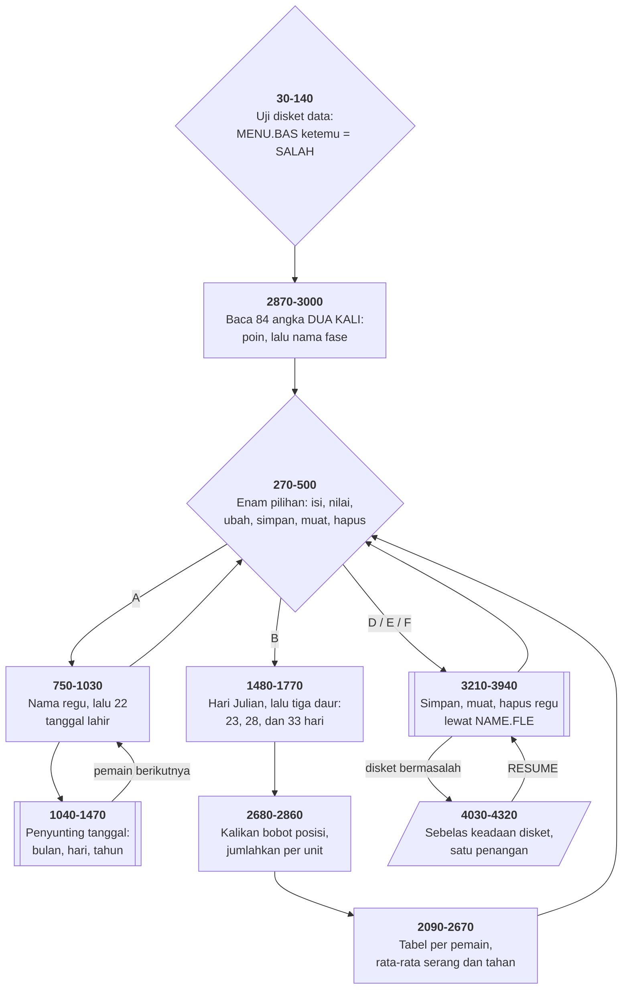

# STATS.BAS di penelusur

> Program kedua puluh empat. 449 baris, nomor 10–4490, cakupan tabel
> **449/449 (100%)**.

Sumber: `run/STATS.BAS` · tabel: `tracer/program/STATS.js`

"Biorhythm Sports Predicting". Dua regu sepak bola Amerika, dua puluh dua
pemain masing-masing, tanggal lahir semuanya — dan sebuah ramalan siapa yang
akan menang.

```
█████████████████████████████████████████
██             SPORTS MENU             ██
█████████████████████████████████████████
██    A) Enter A Team Roster.          ██
██    B) Evaluate Both Teams.          ██
██    C) Change Birth Date(s)          ██
██    D) Save A Team To Diskette.      ██
██    E) Load Team From Diskette.      ██
██    F) Erase Team Off Diskette.      ██
```

## Satu fungsi, tiga daur

Teori biorhythm mengandaikan tiga daur yang mulai bersamaan di hari kelahiran:
fisik 23 hari, emosi 28 hari, nalar 33 hari. Yang perlu dihitung: hari keberapa
dalam daur itu seseorang berada pada hari pertandingan — yaitu **sisa bagi**.

```basic
220 DEF FNX(V)=FIX(DIFF-(INT(DIFF/V))*V)+1
```

`DEF FN` adalah satu-satunya cara membuat fungsi di BASIC lama: satu baris, satu
ungkapan, dan ia mengambil variabel global (`DIFF`) langsung dari sekitarnya.
**Ini satu-satunya program di koleksi yang memakainya.**

Lalu baris 1620–1670 memanggilnya tiga kali: `FNX(23)`, `FNX(28)`, `FNX(33)`.

Terverifikasi: regu `BEARS` dibuat sebagai tuan rumah, tanggal lahir
quarterback diketik `3-15-60` (dengan tanda hubung — baris 1090 menerima titik,
spasi, garis miring, atau hubung sebagai pemisah) dan tersimpan sebagai
` 3/15/60`.

## Dua tabel yang dibaca dengan gelung yang sama

Tiap hari dalam daur perlu dua hal: **berapa poinnya** dan **apa nama fasenya**
(crit, low, avg, high).

```basic
2870 FOR B=0 TO 1
2880  FOR A=1 TO 23:READ D(0,A,B):NEXT
2890  FOR A=1 TO 28:READ D(1,A,B):NEXT
2900  FOR A=1 TO 33:READ D(2,A,B):NEXT
2910 NEXT
```

Gelung yang persis sama, dijalankan dua kali. Putaran pertama (`B=0`) membaca
angka poin (0 sampai 7,5); putaran kedua (`B=1`) membaca nomor nama fase (0
sampai 3). **Indeks ketiga lariknya yang membedakan arti.**

Dan baris 2160 memakai keduanya sekaligus:

```basic
PRINT ZZ(D(0,VAL(Z(B,2,A)),1));
```

Ambil nomor hari dari `Z`, cari nomor fasenya di `D`, lalu cari namanya di
`ZZ`. **Tiga tingkat pencarian tabel dalam satu ungkapan** — hampir mustahil
dibaca, dan menambah tabel keempat cuma berarti menambah satu putaran gelung.

## Dua puluh dua angka yang jadi seluruh ramalannya

```basic
2770 AVG!=AVG!*VALUE(B)
3080 DATA 5,3,2,2,2,2,1,1,1,1,1,4,2,2,2,2,2,1,1,1,1,3
```

Quarterback **5**. Halfback 3. Middle linebacker **4**. Free safety 3. Dan
sebelas pemain garis — center, tackle, guard, defensive lineman — semuanya
**1**.

Jadi biorhythm quarterback yang sedang buruk menyeret nilai regunya lima kali
lebih jauh daripada biorhythm penjaga garis. Mengubah pendapat program ini
tentang sepak bola berarti mengetik ulang satu baris `DATA`.

Dan ada satu angka lagi yang tidak masuk hitungan biorhythm sama sekali:

```basic
2830 IF A=0 THEN AVG!(A)=AVG!(A)+10
```

Regu nomor 0 adalah tuan rumah, dan ia dapat tambahan sepuluh. **Keuntungan
bermain di kandang** — masuk akal sebagai model, tapi tidak disebut di satu kata
pun layar petunjuk, dan hasilnya di layar tampil seolah seluruhnya perhitungan
biorhythm.

## Pembagi yang menyusut

```basic
2710 DD=3
2720 TOT1=VAL(Z(B,3,A)):IF TOT1=0 THEN DD=DD-1
2750 IF DD=0 THEN AVG!=0:GOTO 2790
2760 AVG!=(TOT1+TOT2+TOT3)/DD
```

Tiap daur yang nilainya nol tidak ikut membagi. Pemain tanpa tanggal lahir
dapat rata-rata nol, bukan **nol dibagi nol**. Penjagaan pembagian yang ditulis
sebagai pencacah, bukan sebagai `IF`.

## Peta arsitektur



## RETURN ke tempat lain untuk membatalkan

```basic
4010 KEY(9) OFF:RETURN 4020
4020 K9=1:CLOSE:RETURN
```

Jebakan F9 melakukan `RETURN <baris>` — pulang ke baris tertentu, bukan ke
tempat jebakannya terpicu. Baris 4020 memasang `K9=1`, dan **tiap langkah**
operasi disket memeriksanya (`IF K9 THEN 3450`).

Ini cara membatalkan operasi panjang di bahasa yang tidak punya pengecualian:
satu bendera, diperiksa di setiap persimpangan.

## Yang bisa dicoba di halaman

| coba ini | yang terlihat |
|---|---|
| pasang titik henti di 220 | `DEF FN` — satu-satunya fungsi buatan sendiri di koleksi |
| pasang titik henti di 2870 | 84 angka dibaca dua kali, arti berbeda |
| pasang titik henti di 2160 | tiga tingkat pencarian tabel dalam satu ungkapan |
| pasang titik henti di 2770 | bobot posisi — inti seluruh ramalannya |
| pasang titik henti di 2830 | bonus 10 untuk tuan rumah, tidak pernah diumumkan |
| ketik tanggal `3-15-60` | empat aksara berbeda diterima sebagai pemisah |
| ketik `2-31-60` | diterima — tidak ada yang menguji apakah harinya ada |
| pasang titik henti di 4040 | `AND` sebelum `OR` tanpa tanda kurung |
| pasang titik henti di 4010 | `RETURN 4020` — membatalkan lewat bendera |

## Penyimpangan dari aslinya

1. **Empat larik diganti namanya** karena punya kembaran skalar: `Z()` → `Z_`,
   `ZZ()` → `ZZ_`, `AVG!()` → `AVG_`, `TEAMNAME$()` → `TEAMNAME_`.
2. **Disketnya cuma ada di memori.** Regu yang disimpan hilang begitu halaman
   disegarkan — sama seperti [DRAW.BAS](draw.md).
3. **Uji disket data di baris 30–140 dijawab seperti DRAW.BAS:** panggilan
   pertama menemukan `MENU.BAS`, panggilan kedua tidak.
4. **`COLOR 31` di baris 120 tidak berkedip.**
5. **`RESTORE 3090` diberi indeks, bukan nomor baris.** Penelusur menyimpan
   seluruh `DATA` sebagai satu larik datar; indeks 190 adalah tempat daftar
   nama posisi dimulai.
6. **Gelung tunda habis seketika**, termasuk yang 10.000 putaran di baris 550
   dan 890.

## Yang jangan ditiru

- **`AND` dan `OR` tanpa tanda kurung.** Baris 4040:
  `IF ERR=53 AND ERL=3670 OR ERL=3880`. `AND` lebih erat daripada `OR`, jadi
  syaratnya sebenarnya "(ERR=53 dan ERL=3670) **atau** ERL=3880" — galat **apa
  pun** di baris 3880 masuk ke sini.
- **Kode sesudah `THEN <nomor baris>`.** Baris 3150:
  `IF INKEY$<>"" THEN 3150:Z3=Z1`. Apa pun sesudah `THEN <nomor>` tidak pernah
  dijalankan, jadi `Z3` tidak pernah diisi — dan baris 3200 memulihkan `Z1`
  dari sesuatu yang kosong.
- **Pengaman berlapis untuk keadaan yang mustahil.** Baris 4400–4410 menaikkan
  tiap huruf kecil saat diketik; baris 4450–4480 menaikkannya **lagi** sesudah
  selesai.
- **Tanggal yang tidak diperiksa kewajarannya.** Bulan diuji 1–12, hari 1–31,
  tahun 1–99 — tapi tidak ada yang menguji apakah harinya **ada** di bulan itu.
  31 Februari diterima, dan hari Juliannya dihitung tanpa mengeluh.
- **Bonus tersembunyi.** Baris 2830.

---
[Rancangan penelusur](_rancangan.md) · [MENU](menu.md) · [INTRO](intro.md) · [CHECK](check.md) · [TOWERS](towers.md) · [HEAREYE](heareye.md) · [TICTAC](tictac.md) · [MASTER](master.md) · [BOGGY](boggy.md) · [PEGLEAP](pegleap.md) · [BIO](bio.md) · [HANGMAN](hangman.md) · [BUSONE](busone.md) · [OTHELLO](othello.md) · [CRAPS](craps.md) · [DRAW](draw.md) · [WILDCAT](wildcat.md) · [MAZE](maze.md) · [SUB](sub.md) · [21](21.md) · [FOOTBALL](football.md) · [GOLF](golf.md) · [MATCH](match.md) · [DOMINOES](dominoes.md)
