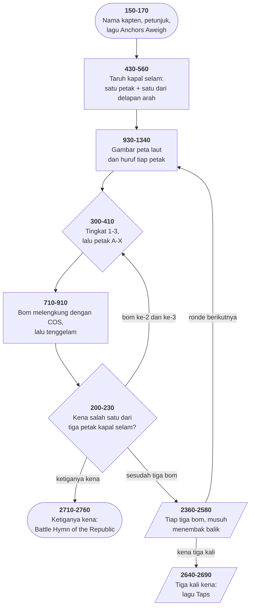

# SUB.BAS di penelusur

> Program kedelapan belas. 317 baris, nomor 10–3160, cakupan tabel
> **317/317 (100%)**.

Sumber: `run/SUB.BAS` · tabel: `tracer/program/SUB.js`

Berburu kapal selam. Layarnya dibagi tiga tingkat kedalaman, tiap tingkat 24
petak berhuruf A sampai X, dan kapal selamnya menempati **tiga petak
bersebelahan** di salah satu tingkat.

Terverifikasi apa adanya di penelusur:

```
                                     ▓▓▓▓   ╫   █ █
                          ─▄▄      ███████  ╫   █ █     ▄▄─
                 ╒      «═████     █░░█░░█░░█░░░░░░█   ████═»        ╥
                 ▀██▒▒▒▒▒▒▒▒▒▒▒▒▒▒▒▒▒▒▒▒▒▒▒▒▒▒▒▒▒▒▒▒▒▒▒▒▒▒▒▒▒▒▒▒▒▒▒▒██
             ______▀████████████████████████████████████████████████▀________
            /                                                               /
          /      A         B         C         D         E         F      /
        /      G         H         I         J         K         L      LEVEL 1
      /      M         N         O         P         Q         R      /
    /      S         T         U         V         W         X      /________
  /_______________________________________________________________/
```

## Menggambar di atas gambar tanpa merusaknya

Bom lautnya terbang melintasi peta — laut, kapal, garis petak, huruf. Kalau ia
sekadar mencetak dirinya lalu mencetak spasi, jejaknya akan berupa
lubang-lubang kosong.

Yang dilakukannya, baris 800:

```basic
800 V=SCREEN(X,Y):W=SCREEN(X,Y,1)
```

`SCREEN(x,y)` membaca **kode aksara** yang ada di kotak itu; dengan argumen
ketiga `1`, ia membaca **bita atributnya** — warna depan dan latar. Dua angka,
dan itulah seluruh isi kotak tersebut.

Lalu bomnya dicetak, dan sesudahnya, baris 820:

```basic
820 POKE (X-1)*160+Y*2-1,W:POKE (X-1)*160+Y*2-2,V
```

Dikembalikan persis seperti semula. Perhatikan rumus alamatnya: satu baris
layar 160 bita, satu kolom 2 bita, `-2` untuk bita aksara, `-1` untuk bita
warnanya.

Teknik ini punya nama: **simpan-di-bawah**. Ia dipakai di setiap permainan yang
punya benda bergerak, sebelum perangkat keras mengambil alih pekerjaannya.

## Bom yang tahu ke mana ia dilempar

Bomnya tidak jatuh lurus. Ia melengkung, dan lengkungannya berbeda tergantung
petak mana yang dituju. Seluruh mekanismenya tiga baris:

```basic
740 B=B(ABS(A-DROP))
770 FOR E=1.5 TO 4.76 STEP 0.25
780 L=COS(E)*(3+ABS(B))+6:LOCATE L,C
```

Kosinus dari 1,5 sampai 4,76 radian melewati satu setengah gelombang: mulai
hampir nol, turun, naik lagi. Dikalikan amplitudo dan digeser 6, hasilnya
**lintasan lempar** dalam nomor baris layar.

Sementara itu baris 830 menggeser kolomnya: `C=C+B`. Jadi `B` mengerjakan dua
hal sekaligus — **seberapa jauh mendatar** dan **seberapa tinggi**.

Dan angka-angkanya sendiri, di baris 2020–2030, disusun rapi:

```basic
2020 DATA -1.85,-1.1,-.3,.45,1.2,2,-2.00,-1.2,-.5,.3,1.1,1.85
2030 DATA -2.15,-1.4,-.6,.15,.9,1.7,-2.3,-1.55,-.8,0,.8,1.55
```

Enam angka per baris petak, dari −1,85 (jauh di kiri) sampai +2 (jauh di
kanan), dan makin bawah barisnya makin lebar rentangnya. **Dua puluh empat
angka yang menggantikan seluruh perhitungan lintasan.**

## Satu larik untuk tiga tingkat

Papan permainannya tiga tingkat, tiap tingkat 24 petak. Cara wajar: larik dua
dimensi. Yang dipakai: **satu** larik 72 petak.

```basic
2600 FOR A=0 TO 23:A(A)=A+65:A(A+24)=A(A):A(A+48)=A(A):NEXT
380  DROP=A+ASC(Z)-65            ' dengan A = 24*(tingkat-1)
```

Jadi `DROP` 0–23 tingkat satu, 24–47 tingkat dua, 48–71 tingkat tiga. **Satu
angka yang memuat tingkat dan petaknya sekaligus.**

Keuntungannya terlihat di baris 200–220: menguji apakah bom kena kapal selam
cukup satu perbandingan angka. Dan menyembunyikan kapalnya (baris 450) cukup
`A=A+FIX(RND*3)*24` — geser satu tingkat penuh dengan satu penjumlahan.

Harganya: kalau kapalnya diletakkan di tepi papan, arah yang salah akan
membuatnya "membungkus" ke tingkat sebelah tanpa ada yang mengeluh. Itu
sebabnya baris 440 memaksa petak awalnya berada di tengah — **bukan karena
aturan permainan, melainkan karena bentuk lariknya.**

Terverifikasi: kapal selamnya di petak 32, 25, 39 — tingkat 2, diagonal. Bom ke
tingkat 2 petak `I` (= 24 + 8 = 32) kena; `SUB(1)` jadi 99, `A(32)` jadi 15,
dan petak `I` di peta berganti jadi `☼`:

```
        /      G         H         ☼         J         K         L      LEVEL 2
```

## Satu perbandingan menggantikan dua

```basic
230 IF SUB(1)=SUB(2) AND SUB(3)=99 THEN GOSUB 2710:GOTO 2770
```

Petak yang kena diberi nilai 99, dan dua petak berbeda tidak mungkin sama —
kecuali kalau **keduanya sudah 99**. Jadi satu perbandingan sudah cukup menguji
dua petak sekaligus.

## Peta arsitektur



## Memanggil separuh penangan jebakan

```basic
1340 GOSUB 3020:RETURN
```

Baris 3020 ada **di tengah penangan tombol F10** — bagian yang menggambar ulang
bilah status di baris 25. Satu subrutin, dua pintu masuk: satu lewat jebakan
tombol, satu lewat `GOSUB` langsung ke ekornya.

## Yang bisa dicoba di halaman

| coba ini | yang terlihat |
|---|---|
| pasang titik henti di 800 | `SCREEN()` membaca aksara dan warna yang akan ditimpa |
| pasang titik henti di 820 | keduanya dipoke kembali — bomnya tidak meninggalkan lubang |
| pasang titik henti di 780 | satu kosinus yang jadi seluruh lintasan lempar |
| pasang titik henti di 470 | delapan arah dari daftar tujuh — `ON 0 GOTO` jatuh ke bawah |
| tembak petak kapal selam | petaknya berganti jadi `☼`, dan `SUB(n)` jadi 99 |
| pasang titik henti di 230 | satu perbandingan yang menguji dua petak |
| pasang titik henti di 1340 | `GOSUB` ke tengah penangan tombol F10 |
| tekan Backspace di layar nama | baris 3160 — galat 5, karena barisnya tidak menguji panjang |

## Penyimpangan dari aslinya

1. **`A(71)` jadi `A_` dan `B(23)` jadi `B_`**: keduanya punya kembaran skalar
   (`A` pencacah gelung sekaligus nomor tingkat, `B` pencacah sekaligus sudut
   lempar).
2. **`PLAY` dan `SOUND` diam.** Tiga lagu utuh tidak terdengar: "Anchors
   Aweigh" (2050), "Taps" (2640), dan "Battle Hymn of the Republic" (2710).
3. **Atribut 132 tidak berkedip.** Petak yang kena seharusnya bintang merah
   **berkedip**; di penelusur merahnya tetap.
4. **`PEEK` dan `DEF SEG` tidak berarti apa-apa.**
5. **Batas gelung di baris 850 memakai `L` yang baru saja diubah.**
   `FOR L=L+2 TO ...L...`: apakah batasnya dihitung dengan `L` lama atau baru
   menentukan bomnya tenggelam dua atau empat baris. Penelusur memakai yang
   **baru**. *Belum diperiksa di GW-BASIC sungguhan* — jalankan
   `run\SUB.bat` dan hitung barisnya kalau ingin memastikan.
6. **Pengacaknya berbenih tetap**, jadi letak kapal selamnya selalu sama.

## Yang jangan ditiru

- **Backspace yang tidak menguji panjang.** Baris 3160 memotong `ZH` satu
  aksara tanpa memastikan ada isinya. [DRAW.BAS](draw.md) punya baris 1870
  untuk itu; di sini tidak ada. **Kode yang sama, disalin, dengan satu barisnya
  hilang.**
- **Baris yang disisipkan dengan nomor ganjil.** `2919`, di antara 2910 dan
  2920 — dan isinya salinan kata-demi-kata baris 2080.
- **Tanda banding yang ditulis terbalik.** Baris 3040: `IF XX=<1`. GW-BASIC
  menerima `=<` sama seperti `<=`, jadi tidak pernah ketahuan.
- **Gelung yang batasnya memakai variabelnya sendiri.** Baris 850.
- **Salah ketik yang menular.** `REM******* BATTLE HYMN OF THE REPUPLIC` di
  baris 2700 — salah ketik yang sama persis muncul lagi di
  [MAZE.BAS](maze.md) baris 3010. Berkas disalin, komentarnya ikut.

---
[Rancangan penelusur](_rancangan.md) · [MENU](menu.md) · [INTRO](intro.md) · [CHECK](check.md) · [TOWERS](towers.md) · [HEAREYE](heareye.md) · [TICTAC](tictac.md) · [MASTER](master.md) · [BOGGY](boggy.md) · [PEGLEAP](pegleap.md) · [BIO](bio.md) · [HANGMAN](hangman.md) · [BUSONE](busone.md) · [OTHELLO](othello.md) · [CRAPS](craps.md) · [DRAW](draw.md) · [WILDCAT](wildcat.md) · [MAZE](maze.md)
