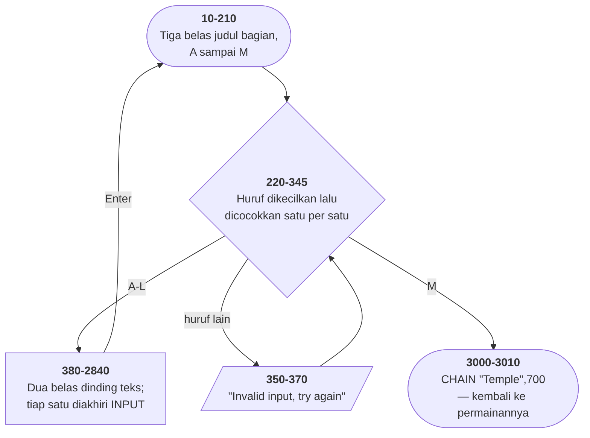

# TEM-INS.BAS di penelusur

> Program keenam puluh tiga. 290 baris, nomor 10–3010, cakupan tabel
> **290/290 (100%)**.

Sumber: `run/TEM-INS.BAS` · tabel: `tracer/program/TEM-INS.js`

Temple of Loth. Dua ratus sembilan puluh baris yang tidak menghitung apa pun — separuh dari sepasang berkas yang saling memanggil.

## Berkas yang tidak menghitung apa pun

Dua ratus sembilan puluh baris, dan tidak satu pun di antaranya menghitung sesuatu. Tidak ada gelung yang menghasilkan angka, tidak ada larik, tidak ada `RND`. Yang ada cuma `PRINT`, `LOCATE`, `COLOR`, dan tiga belas `IF` yang memilih blok mana yang dicetak.

Dan justru itu yang membuatnya layak ditelusuri.

Berkas ini ada karena sebuah batasan yang sudah lama hilang: BASIC memuat **seluruh** program ke memori sekaligus. Ruang kerjanya 64K, dibagi antara kode, variabel, dan larik. Permainan seukuran Temple of Loth — dengan matriks 8×8×8, dua belas jenis monster, dan delapan harta — sudah memakan sebagian besarnya.

Tiga ratus baris teks petunjuk tidak muat.

Jadi petunjuknya dipindahkan ke berkas sendiri, dan keduanya saling memanggil dengan `CHAIN`. Waktu pemain minta petunjuk, permainannya **dibuang dari memori**, petunjuknya dimuat, dibaca, lalu dibuang lagi dan permainannya dimuat kembali — melanjutkan di baris 700, seolah tidak pernah pergi.

Hari ini kita menyebutnya *lazy loading* atau pemisahan berkas, dan alasannya kerapian. Di sini alasannya bertahan hidup.

Dan pasangannya memang selamat. TEMPLE.BAS ada di koleksi ini, 1.187 baris, dan baris 11570-nya memanggil balik berkas ini: `CHAIN"TEM-INS.BAS",10`. Keduanya saling menunjuk, persis seperti yang dirancang.

Bahkan skor tertinggi yang disebut baris 2810 halaman ini — 142.498 milik Lord Nurúcc — muncul lagi di baris 12100 TEMPLE.BAS, sebagai ambang yang memicu pesan yang menyuruh pemainnya *mengganti skor itu di Tem-Ins.Bas*. Angka sama, di dua berkas, saling menunggu diperbarui.

## Kutip yang menutup terlalu cepat

Gaya berkas ini konsisten: string tidak ditutup.

```basic
60 LOCATE 12,7:PRINT "A. Character Creation
```

GW-BASIC menerimanya. Sebuah string yang belum ditutup berakhir di ujung barisnya, dan itu berlaku di ratusan tempat di sini.

Lalu baris 910:

```basic
910 PRINT " ...on level 8 will "DROP" you down
```

Penulisnya ingin kata DROP tampil di dalam tanda kutip. Tapi penafsir tidak punya cara tahu itu — kutip pembuka kedua **menutup** string yang sedang berjalan.

Yang sebenarnya dijalankan ada tiga bagian: string sampai `will `, lalu variabel bernama `DROP` yang belum pernah diisi apa-apa (nilainya nol), lalu string `" you down` yang juga tidak ditutup.

Hasil di layar: *on level 8 will  0  you down*.

Tidak ada galat. Tidak ada peringatan. Program berjalan sempurna.

Dan di sinilah letak pelajarannya: **gaya yang membolehkan string tak ditutup juga membolehkan string yang salah tutup**. Kalau berkas ini konsisten menutup setiap stringnya, baris 910 akan menjadi galat sintaks yang langsung ketahuan. Kelonggaran yang menghemat tiga ratus bita membeli kembali satu cacat yang tidak pernah ditemukan siapa pun.

## Peta arsitektur



## Alur yang layak diikuti

| baris | yang terjadi |
|---|---|
| `225` | `CHR$(ASC(A$) OR &H20)` — huruf besar jadi kecil dengan **menyalakan satu bit** |
| `225` | Enter kosong → `ASC("")` → **galat 5, program berhenti** |
| `330` | `"l"` diperiksa **sebelum** `"k"` — urutan penulisan, bukan urutan abjad |
| `910` | kutip di sekitar `"DROP"` **menutup** string dan memecah barisnya jadi tiga |
| `1050` | legenda ruangan memakai aksara kotak CP437 langsung di dalam string |
| `2560` | ajakan mengunggah versi perbaikan ke RBBS — **sumber terbuka, 1980-an** |
| `3010` | `CHAIN "Temple",700` — petunjuk dan permainan **tidak pernah ada di memori bersamaan** |

## Yang bisa dicoba di halaman

| coba ini | yang terlihat |
|---|---|
| pasang titik henti di 225 | `CHR$(ASC(A$) OR &H20)` — huruf besar jadi kecil dengan **menyalakan satu bit** |
| pasang titik henti di 225 | Enter kosong → `ASC("")` → **galat 5, program berhenti** |
| pasang titik henti di 330 | `"l"` diperiksa **sebelum** `"k"` — urutan penulisan, bukan urutan abjad |
| pasang titik henti di 910 | kutip di sekitar `"DROP"` **menutup** string dan memecah barisnya jadi tiga |
| pasang titik henti di 1050 | legenda ruangan memakai aksara kotak CP437 langsung di dalam string |

Aslinya dijalankan dengan `run\\TEM-INS.bat`.

> Ketik satu huruf A sampai M lalu Enter. M kembali ke permainan. TEMPLE.BAS ada di koleksi ini — 1.187 baris — tapi belum diport, jadi di penelusur alurnya berhenti di sana.

## Penyimpangan dari aslinya

1. **Argumen ketiga `COLOR` diabaikan.** Di `SCREEN 0`, `COLOR depan, latar, bingkai` — yang ketiga mewarnai **pinggiran layar** di luar area teks. Konsol penelusur tidak punya pinggiran.
2. **Warna 27 (baris 20 dan 2300) dan latar 15 (baris 360) memakai atribut kedip**; konsol tidak berkedip.
3. **`CHAIN "Temple",700` belum bisa dijalankan.** TEMPLE.BAS **ada** di koleksi ini — 1.187 baris, dan baris 11570-nya memanggil balik `CHAIN"TEM-INS.BAS",10` — tapi ia program grafik dan belum diport. Penelusur berhenti dengan pesan program tidak ditemukan.
4. **Baris 2560 sudah disunting pemilik koleksi ini** — nomor telepon papan buletin RBBS digantikan penanda.
5. **Baris 225 dibuat gagal secara eksplisit saat masukan kosong.** `ASC("")` di GW-BASIC menghentikan program dengan galat 5; penelusur menirukan galat itu, bukan mengabaikannya.

## Yang layak ditiru

**Dokumentasi sebagai overlay.** BASIC lama memuat **seluruh** program ke memori sekaligus. Tiga ratus baris teks petunjuk memakan ruang yang dibutuhkan permainannya. Memisahkannya jadi berkas sendiri, lalu `CHAIN` bolak-balik, adalah satu-satunya cara memuat keduanya. Jadi keputusan yang hari ini terlihat seperti "memisahkan dokumentasi dari kode" sebenarnya **manajemen memori**. Batasannya yang menghasilkan strukturnya, bukan seleranya.

**String yang tidak perlu ditutup.** Hampir setiap `PRINT` di berkas ini mengakhiri stringnya tanpa kutip penutup. GW-BASIC menerimanya — string yang belum ditutup berakhir di ujung baris. Ratusan kali, konsisten. Untungnya nyata: satu bita lebih pendek per baris di berkas tertokenisasi, dan tiga ratus baris berarti tiga ratus bita. Di mesin dengan 64K ruang kerja, itu bukan angka yang bisa diabaikan.

**Huruf besar jadi kecil dengan satu bit.** `A$=CHR$(ASC(A$) OR &H20)`. Di ASCII, huruf besar dan kecil berbeda tepat satu bit — bit kelima. Menyalakannya mengubah "A" jadi "a" tanpa perbandingan apa pun, dan huruf yang sudah kecil tidak berubah.

**Ajakan yang mendahului zamannya.** Baris 2560: *"if you have any ideas to improve this program yourself please do. Upload your improved version on Wes Meier's RBBS"*. Nama, alamat rumah, dan nomor papan buletin, tercetak di dalam programnya sendiri. Distribusi, kontribusi, dan tempat mengirimkannya — semuanya di satu layar teks, sepuluh tahun sebelum ada kata untuk itu.

## Yang jangan ditiru

**Kutip yang menutup string yang tidak diniatkan berhenti.** Baris 910 menulis `will "DROP" you down` di tengah sebuah `PRINT`. Kutip pertama **menutup** string yang sedang berjalan; `DROP` lalu dibaca sebagai nama variabel — kosong, jadi nol — dan `" you down` mulai string baru. Yang tampil di layar: *"on level 8 will  0  you down"*. Dan tidak ada galat, tidak ada peringatan. Justru karena string yang tak ditutup **sah** di sini, yang salah pun sah.

**Tabel pemilah yang tidak urut.** Baris 330 memeriksa `"l"`, baris 340 memeriksa `"k"`. Menu di layar menampilkan K sebelum L. Urutan barisnya menyimpan **urutan penulisan**, bukan urutan yang dilihat pemakai — bagian "Comments" ditulis sebelum "Scoring" selesai.

**Menu yang menyuruh mengetik hal yang salah.** Baris 220: *"Type in the **number** of the section desired"*. Bagian-bagiannya bernomor **huruf**, A sampai M, dan baris 225 hanya bisa memproses huruf. Mengetik angka selalu berujung ke "Invalid input".

**Masukan kosong yang menghentikan program.** Baris 225 memanggil `ASC(A$)` tanpa memeriksa apakah `A$` kosong. Menekan Enter saja di menu utama menghentikan program dengan **Illegal function call** — dan karena ini overlay, pemain kehilangan permainannya sekalian.

**Dua hitungan yang tidak cocok.** Baris 1090 menyebut monster sebagai *"1 of **9** different types"*. Baris 2190 menyebut *"There are **12** types of monsters"*, lalu baris 2210 menyebutkan dua belas namanya. Legendanya tidak ikut diperbarui waktu monsternya ditambah.

**Lubang di tabel peringkat.** Baris 2770-2780: `50000 - 75000 Scout`, lalu `90000 -110000 Adventurer`. Selang **75.000 sampai 90.000 tidak punya peringkat sama sekali**. Delapan gelar untuk sebuah garis bilangan yang bolong di tengahnya.

**Baris menu yang dikomentari dan ditinggalkan.** Baris 70, 80, dan 100 adalah entri menu lama yang dimatikan dengan petik tunggal. Dua di antaranya — 80 dan 100 — sama-sama diberi label "C." dan sama-sama di `LOCATE 5,7`, dengan judul yang berbeda. Itu **dua rancangan menu yang berbeda**, keduanya tertinggal di berkas yang sama.

**Salah eja yang bertahan sampai ke tabel peringkat.** `Whimp`, `Peasent`, `Ameteur`, `agian`, `simular`, `donated as` (untuk "denoted as"), `carring`, dan `SUGGESTION` tanpa S di judul bagian L.

---
[Rancangan penelusur](_rancangan.md) · [WIZARD](wizard.md) · [HISTORY](history.md)
