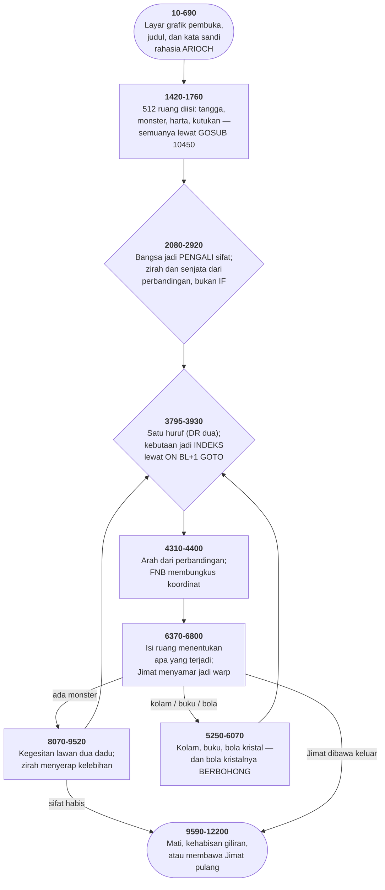

# TEMPLE.BAS di penelusur

> Program kedelapan puluh tiga. 1187 baris, nomor 10–12200, cakupan tabel
> **1187/1187 (100%)**.

Sumber: `run/TEMPLE.BAS` · tabel: `tracer/program/TEMPLE.js`

The Temple of Loth (John Belew, 25 Juli 1984). Program terpanjang di koleksi ini, dan yang paling banyak riwayatnya — turunan langsung WIZARD.BAS terbitan Recreational Computing 1980.

## Empat tahun, dua penulis, satu kerangka

Bagian kepala berkas ini menyebut sumbernya sendiri:

```basic
750 REM    * THANKS TO RECREATIONAL COMPUTING FOR THE ORIGINAL*
```

```basic
760 REM    * PROGRAM          JUNE 29, 1984                   *
```

Recreational Computing memuat WIZARD.BAS di edisi Juli/Agustus 1980, karya Joseph R. Power. Berkas itu ada di koleksi ini juga, 944 baris, dan sudah diport.

Yang membuktikan hubungannya bukan kalimat itu melainkan lima baris di bagian atas:

```basic
810 DEF FNA(Q)=1+INT(RND(1)*Q)
```

```basic
820 DEF FNB(Q)=Q+8*((Q=9)-(Q=0))
```

```basic
830 DEF FNC(Q)=-Q*(Q<19)-18*(Q>18)
```

```basic
840 DEF FND(Q)=64*(Q-1)+8*(X-1)+Y
```

```basic
850 DEF FNE(Q)=Q+100*(Q>99)
```

Kelimanya sama bentuknya dengan WIZARD.BAS baris 240-280. Bukan mirip — sama. Larik 512 ruang, pembungkusan koordinat delapan-ke-satu, batas atas 18 untuk sifat pemain, dan penanda "+100 berarti belum dilihat".

Dan yang berbeda menceritakan empat tahun di antaranya. WIZARD punya monster generik; TEMPLE berterima kasih kepada TSR — penerbit Dungeons & Dragons — dan memakai Mind Flayer, Drider, Balor Demon. WIZARD punya Orb of Zot; TEMPLE punya Amulet of Chaos dan cerita latar dua puluh baris tentang Perang Elf Pertama.

WIZARD berjalan di layar teks polos; TEMPLE membuka dengan layar grafik CGA, dua ratus bintang, dan terowongan elips yang menutup.

Yang tidak berubah: aritmetikanya. Empat tahun, dua penulis, dan lima baris yang disalin utuh karena tidak ada yang perlu diperbaiki di sana.

Dan TEMPLE menambahkan sesuatu yang tidak dimiliki induknya: berkas kedua. Baris 11570 memanggil `CHAIN"TEM-INS.BAS",10`, dan TEM-INS baris 3010 memanggil balik `CHAIN "Temple",700`. Dua ratus sembilan puluh baris petunjuk yang tidak muat di memori bersama permainannya, jadi keduanya saling melempar.

## Skor yang bernama John

Variabel skor program ini bernama `JOHN!`.

```basic
6450 JOHN!=IQ*100+ST*100+DX*100+KM!+FTRS+REQ+GP!-T*5
```

John Belew, yang menandatangani baris 520 dan menyebut dirinya Nurruc the Chaotic di baris 530. Tanda seru di ujungnya bukan ekspresi — ia penanda presisi tunggal, karena skornya bisa melebihi 32.767.

Dan baris terakhir program ini, nomor 12100, berbunyi:

```basic
12100 IF JOHN! > 142498 THEN PRINT " Don't forget to replace my score on Tem-Ins.Bas
```

Seratus empat puluh dua ribu empat ratus sembilan puluh delapan. Skor penulisnya sendiri, ditulis sebagai bilangan telanjang di dalam syarat.

Dan angka yang sama ada di TEM-INS.BAS — berkas petunjuknya, di disket yang sama, di daftar skor tertinggi. Dua berkas, satu angka, dan tidak ada apa pun yang menjaga keduanya tetap sama.

Yang diminta baris ini bukan agar programnya memperbarui daftar itu. Ia meminta **pemainnya** melakukannya: memuat berkas yang lain di penyunting BASIC, mencari barisnya, dan mengetik ulang angkanya.

Itu cara sebuah papan skor bekerja ketika tidak ada berkas data, tidak ada jaringan, dan satu-satunya penyimpanan bersama adalah disket yang dipinjamkan dari tangan ke tangan.

Dan itu juga sebabnya angka 142.498 masih ada di sini, empat puluh dua tahun kemudian, di kedua berkasnya: tidak ada seorang pun yang pernah mengalahkannya, atau kalau ada, tidak ada yang repot-repot menyuntingnya.

## Peta arsitektur



## Alur yang layak diikuti

| baris | yang terjadi |
|---|---|
| `3090` | tiga perbandingan **dikalikan** → "pemain ada di ruang kutukan ini?" |
| `4310` | arah gerak dari perbandingan: `X+(O$="N")-(O$="S")` |
| `2520` | harga zirah dari tiga perkalian, tanpa satu pun `IF` |
| `5280` | perbandingan jadi **INDEKS**: `ON (1-(ST<1)) GOTO hidup,mati` |
| `840` | `FND` memetakan tiga koordinat ke satu larik 512 ruang |
| `820` | …`FNB` membungkusnya: kastilnya berbentuk **donat** |
| `850` | …`FNE` mencopot penanda **+100 = belum dilihat** |
| `6040` | bola kristal **berbohong lima kali dari delapan** |
| `6770` | Jimat Chaos **menyamar jadi warp** — sama seperti WIZARD.BAS |
| `2100` | nomor bangsa langsung jadi **pengali** kekuatan dan kegesitan |
| `4570` | dua penugasan berurutan; yang pertama **langsung dibuang** |
| `10020` | tangga pangkat punya **lubang** antara 20.000 dan 35.000 |
| `12100` | skor penulisnya sendiri, 142.498, dan permintaan menyunting berkas lain |

## Yang bisa dicoba di halaman

| coba ini | yang terlihat |
|---|---|
| pasang titik henti di 3090 | tiga perbandingan **dikalikan** → "pemain ada di ruang kutukan ini?" |
| pasang titik henti di 4310 | arah gerak dari perbandingan: `X+(O$="N")-(O$="S")` |
| pasang titik henti di 2520 | harga zirah dari tiga perkalian, tanpa satu pun `IF` |
| pasang titik henti di 5280 | perbandingan jadi **INDEKS**: `ON (1-(ST<1)) GOTO hidup,mati` |
| pasang titik henti di 840 | `FND` memetakan tiga koordinat ke satu larik 512 ruang |

Aslinya dijalankan dengan `run\\TEMPLE.bat`.

> Jawab N pada pertanyaan grafik dan petunjuk untuk langsung masuk. Pilih bangsa dengan huruf pertamanya (H, E, M, D), lalu M atau F. Perintahnya satu huruf: N S E W U D untuk gerak, M peta, G bola kristal, F suar, # skor. Coba ketik ARIOCH di pertanyaan pertama.

## Penyimpangan dari aslinya

1. **`PLAY` dan `SOUND` diam.** Termasuk dua lagu pembuka yang dipilih acak di baris 560-640, dan seluruh efek pertarungan.
2. **`RANDOMIZE VAL(MID$(TIME$,7,2))` diganti benih tetap**, supaya kastil yang sama bisa ditelusuri dua kali.
3. **`LPRINT` (baris 11100-11330) dicetak ke layar.** Baris 500 di layar pembuka menyarankan pencetak; ringkasan lambang ruangnya hanya ada di sana.
4. **`CHAIN"TEM-INS.BAS",10` (baris 11570) tidak bisa dijalankan** — tapi berkasnya ada di koleksi ini dan sudah diport tersendiri: lihat [TEM-INS](tem-ins.md).
5. **Layar grafik pembuka (baris 70-340) memakai koordinat di luar layar** (`LINE (360,125)-(0,360)` pada layar 320×200). GW-BASIC memotongnya; permukaan grafik penelusur melakukan hal yang sama.

## Yang layak ditiru

**Lima baris yang memuat seluruh bentuk kastilnya.** `840 DEF FND(Q)=64*(Q-1)+8*(X-1)+Y` Delapan lantai, delapan baris, delapan kolom — 512 ruang, dan satu larik satu dimensi menyimpan semuanya. Fungsi ini yang menerjemahkan koordinat jadi indeks, dan ia dipakai lebih dari empat puluh kali. Perhatikan bahwa ia cuma menerima SATU argumen. X dan Y diambil dari variabel global — fungsi yang membaca keadaan di luar dirinya, yang di BASIC bukan kecerobohan melainkan satu-satunya cara: `DEF FN` hanya boleh punya satu baris. `820 DEF FNB(Q)=Q+8*((Q=9)-(Q=0))` Dan ini yang menentukan BENTUK kastilnya. Koordinat nol jadi delapan, sembilan jadi satu — keluar dari sisi barat berarti masuk dari sisi timur. Kastilnya berbentuk donat di kedua sumbu, dan seluruh topologi itu ada di satu baris yang tidak menyebut kata "dinding" sama sekali.

**Perbandingan sebagai bilangan, empat cara.** Di BASIC, perbandingan yang benar bernilai −1. Program ini memakainya untuk empat hal yang sama sekali berbeda: `3090 C(Q,4)=-(C(Q,1)=X)*(C(Q,2)=Y)*(C(Q,3)=Z)` — tiga perbandingan DIKALIKAN. Hasilnya 1 hanya kalau ketiganya benar. Menggantikan tiga `IF` bersarang dengan satu baris. `4310 X=X+(O$="N")-(O$="S")` — arah gerak. Kedua arah muat di satu baris tanpa percabangan. `2520 AV=-3*(O$="P")-2*(O$="C")-(O$="L")` — harga zirah. Tiga perkalian menghasilkan 3, 2, 1, atau 0 tepat sesuai huruf yang diketik. `5280 ON (1-(ST<1)) GOTO 2880,9120` — dan ini yang paling jauh: perbandingan jadi INDEKS. Kekuatan masih positif berarti indeks 1, habis berarti indeks 2, dan indeks 2 adalah layar kematian.

**Satu larik untuk dua kelompok.** `6420 … W$(WV+1) … W$(AV+5)` `W$` menyimpan delapan nama berurutan: empat senjata lalu empat zirah. Yang memisahkannya cuma pergeseran indeks — `+1` untuk senjata, `+5` untuk zirah. Dan `E$` di sebelahnya menyimpan delapan cara memasak, dibaca dari `DATA` yang sama, berselang-seling dengan `W$`. Baris 8470 menyambung nama monster dengan salah satunya: seratus empat kalimat dari dua puluh satu string.

**Nama monster yang dibersihkan dari kata sandangnya.** `8310 Z$=RIGHT$(C$(A+12),LEN(C$(A+12))-2)` `8320 IF LEFT$(Z$,1)=" " THEN Z$=MID$(Z$,2)` Nama monster disimpan lengkap: "a Kobold", "an Orc". Kalimat seperti *"You're confronting a Kobold!"* butuh bentuk itu; kalimat seperti *"Thud! The Kobold hit you!"* tidak. Dua baris membuang sandangnya: potong dua aksara, lalu kalau yang tersisa masih diawali spasi — karena sandangnya "an" dan bukan "a" — potong satu lagi. Dua baris, dua bentuk, satu daftar.

## Yang jangan ditiru

**Penugasan yang langsung dibuang.** `4570 IF Q > 99 THEN Q=Q-100:LET Q=34:REM TO HIDE ROOMS` Dua penugasan ke `Q` berurutan di baris yang sama, dan yang pertama tidak pernah berarti apa-apa: `Q=34` menimpanya seketika. Maksudnya jelas dari komentarnya — ruang yang belum dilihat digambar sebagai ruang tak dikenal. Tapi pengurangan seratusnya sisa dari versi sebelumnya, dan ia masih di sana, membuat pembacanya mengira nilai aslinya dipakai untuk sesuatu.

**Tangga pangkat yang berlubang.** `10020 IF JOHN! < 20000 THEN RANK$ ="a Wimp"` `10021 IF JOHN! > 35000 THEN RANK$="a Peasant"` Yang pertama menguji **kurang dari** 20.000; yang kedua **lebih dari** 35.000. Skor di antara keduanya tidak memenuhi satu pun, dan `RANK$` tetap string kosong. Kalimat pangkatnya tetap tercetak — tanpa pangkat di dalamnya. Dan rentang 20.000-35.000 justru rentang yang paling mungkin dicapai pemain baru.

**Dua rumus skor untuk satu nama.** `6450 JOHN!=IQ*100+ST*100+DX*100+KM!+FTRS+REQ+GP!-T*5` `11050 LET JOHN!=ST+IQ+DX+GP!-T` Baris 6450 dipakai papan keadaan; baris 11050 dipakai perintah "#". Keduanya menulis ke variabel yang sama, dan yang kedua jauh lebih kecil — tanpa pengali seratus, tanpa nilai monster yang dibunuh, tanpa denda giliran lima kali. Jadi menekan "#" MENURUNKAN skor yang tercatat, dan skor akhir di baris 10000 bergantung pada baris mana yang terakhir dijalankan. Pemain yang sering memeriksa skornya mendapat pangkat yang lebih rendah.

**Bola kristal yang berbohong tanpa memberi tanda.** `6040 IF FNA(8) < 4 THEN A=O(1) : B=O(2) : C=O(3)` `6050 … PRINT "The Amulet of Chaos at (";A;",";B;") level";C` Tiga dari delapan kali, A, B, dan C diisi letak Jimat yang sebenarnya. Lima dari delapan kali mereka tetap berisi angka acak yang disiapkan baris sebelumnya. Dan kalimat yang tercetak SAMA PERSIS di kedua kasus. Tidak ada "mungkin", tidak ada "sepertinya" — bola kristalnya menyatakan kebohongan dengan keyakinan yang sama dengan kebenaran. Sebagai rancangan permainan itu bagus. Sebagai kode ia berbahaya: satu-satunya yang membedakan kedua cabang adalah tiga penugasan di dalam sebuah `IF`, dan tidak ada satu komentar pun yang menyebutkannya.

---
[Rancangan penelusur](_rancangan.md) · [TEM-INS](tem-ins.md) · [WIZARD](wizard.md) · [XWING](xwing.md)
