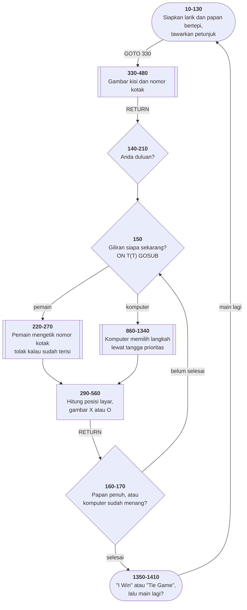
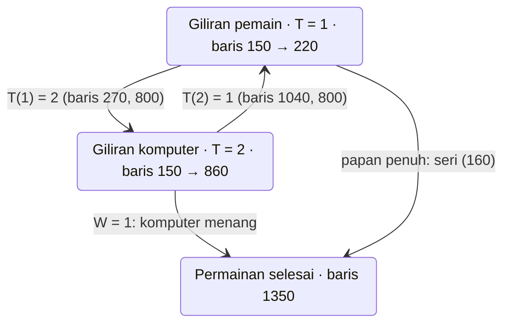
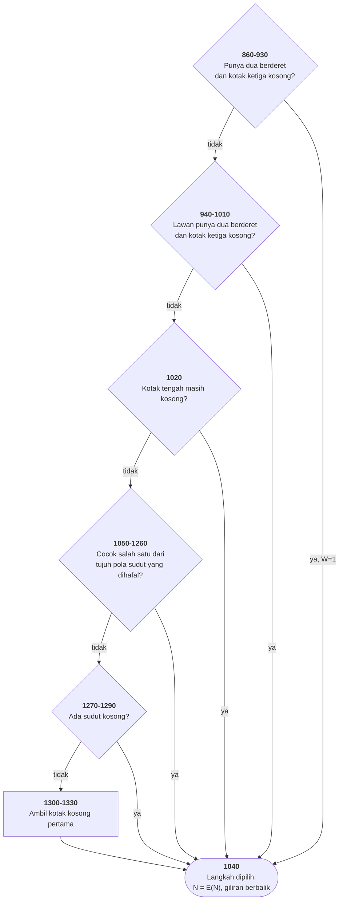

# TICTAC.BAS di penelusur

> Program keenam, dan **lawan komputer yang pertama**. 141 baris, nomor
> 10–1490, cakupan tabel **141/141 (100%)**.

Sumber: `run/TICTAC.BAS` · tabel: `tracer/program/TICTAC.js` ·
analisis: [`reviews/TICTAC.md`](../../reviews/TICTAC.md)

Komputernya benar-benar tak terkalahkan, dan ia mencapainya tanpa menelusuri
satu pun kemungkinan langkah. Dua gagasan di dalam program ini jauh lebih
berharga daripada permainannya sendiri.

## Papan yang lebih besar dari papannya

Cara paling wajar menyimpan papan tic-tac-toe adalah sembilan kotak. Program
ini memakai **dua puluh lima**:

```
   indeks              isi sesudah baris 740-760
  0  1  2  3  4         3  3  3  3  3
  5  6  7  8  9         3  .  .  .  3
 10 11 12 13 14   -->   3  .  .  .  3
 15 16 17 18 19         3  .  .  .  3
 20 21 22 23 24         3  3  3  3  3
```

Sembilan kotak main ada di 6,7,8 / 11,12,13 / 16,17,18. Enam belas kotak di
sekelilingnya diisi angka **3** — angka yang tidak akan pernah jadi milik
pemain (1) atau komputer (2).

Sekarang lihat apa yang bisa dilakukan pemeriksa kemenangan di baris 900:

```basic
900 IF C(A+D(B))=2 AND C(A+D(B)*2)=0 THEN N=A+D(B)*2:W=1:GOTO 1040
```

Ia melangkah dua kotak ke suatu arah **tanpa pernah memeriksa apakah sudah
keluar papan**. Kalau langkahnya jatuh di tepi, yang ditemukan angka 3, dan
perbandingannya gagal dengan sendirinya. **Tepinya yang menjawab.**

Tanpa tepi sentinel, tiap pemeriksaan butuh empat perbandingan tambahan (masih
di dalam baris? masih di dalam kolom?) dikalikan delapan arah dikalikan
sembilan kotak. Dengan tepi sentinel: nol.

Pola ini masih dipakai di mesin catur dan pencari jalan sampai hari ini.

## Delapan arah, delapan angka

Di kisi selebar lima, bergerak satu kotak ke kanan berarti indeks +1. Ke bawah:
+5. Ke bawah-kanan: +6. Ke bawah-kiri: +4. Dan empat kebalikannya negatifnya.

```basic
810 DATA 1,6,5,4,-1,-6,-5,-4
```

Delapan arah mata angin, sebagai delapan angka. Akibatnya "periksa kedelapan
arah dari kotak A" jadi:

```basic
FOR B=0 TO 7 : … C(A+D(B)) … : NEXT
```

Bandingkan dengan delapan blok `IF` yang masing-masing menghitung tetangganya
sendiri. Yang satu bisa diubah dengan menyunting satu baris `DATA`; yang lain
harus disunting delapan kali dan salah satunya pasti terlewat.

## Peta arsitektur

Ketiga diagram di bawah dihasilkan oleh `TRACER.peta.mermaid()` dari data di
[`tracer/program/TICTAC.js`](../program/TICTAC.js).



## Peta keadaan: giliran, dan saklar yang membaliknya



Larik dua unsur `T(1)=2, T(2)=1` dipakai sebagai **saklar**:

```basic
800 T(1)=2:T(2)=1
150 ON T(T) GOSUB 220,860
```

Kalau giliran barusan milik pemain (`T=1`), maka `T(T)` bernilai 2 dan yang
dipanggil target **kedua** — rutin komputer. Giliran berikutnya sebaliknya.
Satu larik dua unsur menggantikan seluruh `IF` pergantian giliran.

Ini kerabat dekat dari 21 `IF` di [MENU.BAS](menu.md) yang sebenarnya sebuah
tabel — bedanya di sini penulisnya sadar.

## Peta tangga prioritas otak komputer



Komputernya tidak pintar. Ia tidak menelusuri kemungkinan langkah, tidak
menilai posisi, tidak punya kedalaman pencarian. Ia cuma tangga prioritas yang
**urutannya benar**.

Perhatikan dua anak tangga teratas: bentuknya sama persis, dan bedanya cuma
angka 2 versus 1. Itu tabel yang menyamar jadi dua salinan kode — dua puluh
baris yang bisa jadi sepuluh dengan satu parameter.

Pelajarannya bukan "tangga prioritas selalu cukup" — untuk catur jelas tidak.
Pelajarannya: **sebelum membangun mesin pencari, periksa dulu apakah masalahnya
cukup kecil untuk diselesaikan dengan urutan aturan.** Sering kali iya, dan
hasilnya seratus kali lebih mudah dibaca.

## Baris 160, dan kalimat yang tidak tertulis

```basic
160 FOR A=6 TO 18:IF C(A)<>0 THEN NEXT:GOSUB 1350:GOTO 140
```

Baris ini berarti "kalau papan penuh, umumkan seri" — dan tidak satu pun kata
di dalamnya mengatakan itu.

Cara kerjanya bersandar pada aturan BASIC yang jarang disadari: **semua yang
sesudah `THEN` hanya jalan kalau syaratnya benar.** Jadi selama kotaknya terisi,
yang dijalankan cuma `NEXT` — gelung berputar. Begitu ketemu kotak kosong,
syaratnya salah, **seluruh sisa baris dilewati**, dan alur jatuh ke baris 170.
Kalau gelungnya habis tanpa pernah menemukan kotak kosong, barulah `GOSUB 1350`
tercapai.

Telusuri baris ini di penelusur dengan laju 2 baris/detik: penunjuknya
bolak-balik di dalam baris 160 (bagian 0 dan 1) selama papannya masih punya
kotak kosong.

## Pseudokode

```
baris  120   siapkan lima larik: papan, peta nomor<->indeks, arah, kolom
baris  740   ISI SELURUH TEPI PAPAN DENGAN ANGKA 3
baris  130   tampilkan judul, tawarkan petunjuk, gambar kisi
baris  180   tanya: Anda duluan?

baris  150   ULANG:
baris  150       panggil rutin giliran berikutnya - saklar T() yang memilih
baris  220           giliran pemain: minta nomor kotak, tolak kalau terisi
baris  860           giliran komputer: turuni tangga prioritas
baris  860               bisa menang sekarang? ambil kotak itu, tandai W=1
baris  940               lawan bisa menang? hadang
baris 1020               tengah kosong? ambil
baris 1050               cocok salah satu dari tujuh pola sudut? ikuti
baris 1270               ada sudut kosong? ambil
baris 1310               kalau tidak: kotak kosong pertama
baris  290       hitung baris dan kolom layar dari nomor kotak
baris  310       catat pemiliknya di papan
baris  320       gambar X (merah) atau O (hijau)
baris  160       semua kotak terisi? SERI
baris  170       komputer barusan menang? UMUMKAN

baris 1350   SELESAI: "I Win !!!!" atau "Tie Game"
baris 1390       main lagi? kembalikan penunjuk DATA, kosongkan papan, ulangi
baris 1400       tidak: kembali ke menu
```

## Yang bisa dicoba di halaman

| coba ini | yang terlihat |
|---|---|
| Langkah sampai baris 760 | papannya terisi `3,3,3,3,3 / 3,0,0,0,3 / …` — tepi sentinelnya lahir di depan mata |
| jawab `N`, lalu `Y`, lalu ketik `5` | pemain ambil tengah; komputer menjawab dengan sudut (kotak 1) — jawaban optimal |
| ketik nomor kotak yang sudah terisi | baris 260 menolaknya dan melompat ke 240 "Invalid Move" |
| biarkan komputer punya dua berderet | ia menang di anak tangga paling atas (860-930) dan menyalakan `W=1` |
| turunkan laju ke 2 baris/detik saat komputer berpikir | gelung bersarang 860/880 terlihat menyisir tiga belas kotak × delapan arah |
| jawab `Y` pada "Play Again" | `RESTORE` mengembalikan penunjuk DATA, papan dikosongkan, permainan mulai lagi |

## Penyimpangan dari aslinya

1. **Fanfare kemenangan tidak berbunyi** (baris 1410: lima pasang `SOUND 500,1`
   dan `SOUND 100,1`), dan tulisan "I Win !!!!" tidak berkedip (`COLOR 31` =
   putih terang + kedip).
2. **Jeda satu detik sesudah "Invalid Move" habis seketika** (baris 250).
   Pasang titik henti di sana untuk membacanya.
3. **`DEFSTR Z` tidak ditiru.**
4. **Larik `A()` dan `B()` ditulis `A_` dan `B_` di dalam mesin.** BASIC
   membedakan variabel `A` dari larik `A()`; JavaScript tidak, dan program ini
   memakai keduanya sekaligus. Hal yang sama berlaku untuk `T` dan `T()`.
   Perbedaannya hanya nama di dalam porting; nomor barisnya tetap sama.

## Membandingkan dengan yang asli

```
run\TICTAC.bat
```

Di DOSBox-X fanfare kemenangannya benar-benar berbunyi, dan "I Win !!!!"
berkedip.

---
[Rancangan penelusur](_rancangan.md) · [MENU](menu.md) · [INTRO](intro.md) · [CHECK](check.md) · [TOWERS](towers.md) · [HEAREYE](heareye.md)
