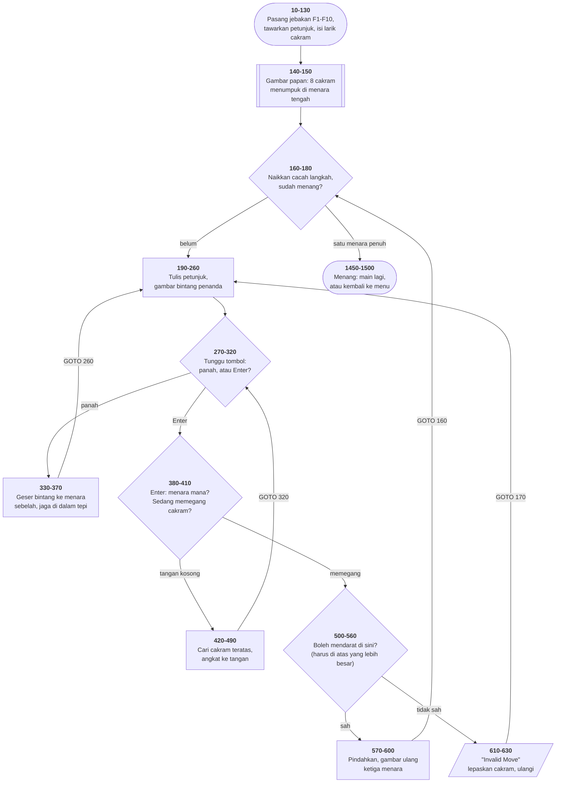
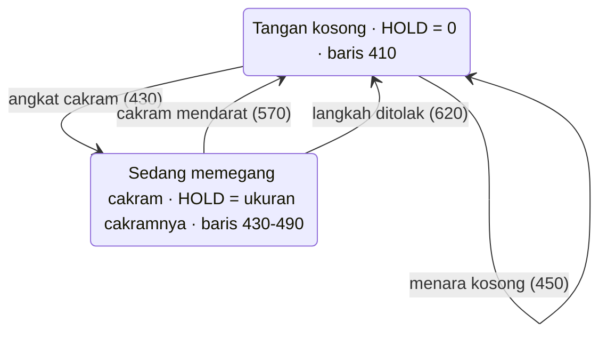

# TOWERS.BAS di penelusur

> Program keempat, dan **permainan yang pertama**. 131 baris, nomor 1–1500,
> cakupan tabel **131/131 (100%)**.

Sumber: `run/TOWERS.BAS` · tabel: `tracer/program/TOWERS.js` ·
analisis: [`reviews/TOWERS.md`](../../reviews/TOWERS.md)

Menara Hanoi delapan cakram. Tiga menara, satu cakram dipindah sekali jalan,
cakram besar tidak boleh naik ke atas cakram kecil. Penyelesaian terpendeknya
255 langkah — program ini menyebut "dua ratus lima puluh tiga", dan itu keliru,
tapi kekeliruan yang tidak berakibat apa-apa.

## Apa yang dipatahkan program ini

### Gelung `FOR`/`NEXT` yang membentang banyak baris

Sampai program ketiga, tiap gelung `FOR` muat dalam satu baris, jadi satu
langkah penelusuran menjalankan seluruh putarannya. Di sini tidak:

```basic
420 FOR DK=1 TO 8
430   IF TW(PL,DK) THEN HOLD=TW(PL,DK):HOLD1=PL:HOLD2=DK:GOTO 460
440 NEXT DK
```

Penunjuknya harus benar-benar kembali ke atas, jadi mesinnya sekarang punya
**tumpukan gelung**, terpisah dari tumpukan `GOSUB`. Dua perilaku GW-BASIC
ikut ditiru, dan keduanya penting:

1. **`FOR` dengan nama variabel yang sama membuang bingkai lama.** Itulah yang
   menyelamatkan baris 430 di atas: ia melompat keluar gelung dengan `GOTO`
   tanpa pernah sampai ke `NEXT`, meninggalkan bingkai menggantung. Tanpa
   aturan ini, tumpukannya bertambah tiap langkah dan tidak pernah surut.
2. **Syaratnya diuji di `NEXT`,** jadi badan gelung selalu jalan sekali.
   GW-BASIC menguji di `FOR` dan bisa melompati badannya sama sekali. Bedanya
   ditutup dengan menyebutkan baris tujuan pada tiap `m.untuk(...)`; kalau
   rentangnya kosong dan tujuannya belum disebutkan, penelusuran **berhenti dan
   mengatakannya** — bukan diam-diam menjalankan badan yang seharusnya
   dilewati.

### Larik dan `READ`/`DATA`

`TW(3,8)` adalah papan permainannya. `RDK$()` dan `LDK$()` menyimpan gambar
tiap ukuran cakram, dibaca dari `DATA` di baris 910–990 — **di tempat yang
tidak pernah dieksekusi**, karena baris 900 sudah `RETURN` lebih dulu. Itu sah:
`DATA` dikumpulkan sebelum program jalan, bukan saat barisnya dilewati.

### Tombol panah

`INKEY$` mengirim tombol tanpa kode ASCII sebagai **dua karakter**: `CHR$(0)`
lalu kode pindai papan ketiknya (75 = kiri, 77 = kanan). Itulah sebabnya baris
290 memeriksanya dengan `RIGHT$(Z,1)`, bukan `Z=CHR$(75)`.

## Peta arsitektur

Dihasilkan oleh `TRACER.peta.mermaid()` dari data `arsitektur` di
[`tracer/program/TOWERS.js`](../program/TOWERS.js).



## Peta keadaan

**Flowchart saja tidak cukup untuk program ini.** Ia memperlihatkan ke mana
alurnya pergi, tapi tidak memperlihatkan kenapa tombol Enter yang sama bisa
berarti dua hal berbeda. Yang menentukan bukan posisi penunjuk, melainkan
**keadaan** programnya:



Seluruh pembelahan itu ada di satu baris: `410 IF HOLD THEN 500`. Sebelum baris
itu, kedua mode berbagi kode yang sama — baca tombol, geser bintang,
terjemahkan kolom jadi nomor menara. Sesudahnya, mereka berpisah.

Perhatikan panah merah putus-putus: langkah yang tidak sah **tetap
mengembalikan tangan ke kosong**. Cakram yang tadi diangkat dilepas begitu saja
(baris 620) dan tetap di menara asalnya, karena ia belum pernah benar-benar
dipindah — `TW(HOLD1,HOLD2)=0` di baris 570 hanya jalan kalau langkahnya
berhasil.

## Pseudokode

```
baris   10   siapkan layar, pasang jebakan F1-F10
baris  130   tampilkan judul, tawarkan petunjuk, isi larik gambar cakram
baris  140   cacah langkah = -1   (baris 160 menaikkannya sebelum langkah pertama)
baris  150   gambar papan: 8 cakram menumpuk di menara tengah

baris  160   ULANG SELAMANYA:
baris  160       cacah langkah = cacah langkah + 1
baris  180       kalau menara kiri ATAU kanan berisi 8 cakram: MENANG
baris  190       tulis petunjuk dan jumlah langkah
baris  240       gambar bintang berkedip di atas menara yang sedang dipilih
baris  260       baca posisi bintang DARI LAYAR, bukan dari variabel
baris  280       tunggu tombol:
baris  290           panah kiri  -> geser bintang 24 kolom ke kiri
baris  300           panah kanan -> geser 24 kolom ke kanan
baris  330           jaga bintang tetap di antara kolom 16 dan 64
baris  350           hapus bintang lama, gambar di tempat baru, ulangi
baris  310           Enter -> lanjut ke bawah
baris  380       terjemahkan kolom bintang jadi nomor menara (1, 2, atau 3)

baris  410       KALAU TANGAN KOSONG - ini langkah "ambil":
baris  420           telusuri menara dari atas, cari cakram pertama yang ada
baris  430               ketemu   -> angkat ke tangan, ingat asalnya, ganti pesan
baris  450               tidak ada -> menaranya kosong, langkah tidak sah

baris  500       KALAU SEDANG MEMEGANG - ini langkah "taruh":
baris  500           telusuri menara tujuan dari atas, cari cakram pertama
baris  540               ketemu dan LEBIH BESAR -> taruh di atasnya
baris  550               ketemu dan lebih kecil -> TIDAK SAH
baris  560               tidak ada -> menara kosong, taruh di dasar
baris  570           kosongkan tangan dan tempat asalnya, gambar ulang menara

baris  610       LANGKAH TIDAK SAH: tulis "Invalid Move", tunggu, hapus
baris  620           lepaskan cakram yang dipegang - kembali ke keadaan awal

baris 1450   MENANG: tampilkan jumlah langkah
baris 1480       Y -> jalankan ulang program ini dari nol
baris 1500       N -> kembali ke menu
```

## Penjelasan untuk pemula

### Bagaimana papan disimpan

`TW(3,8)` adalah larik dua dimensi: **tiga menara, delapan posisi**. `TW(2,5)`
berarti "apa yang ada di menara 2, posisi 5". Isinya angka 1 sampai 8 yang
menyatakan *ukuran* cakram di situ, atau 0 kalau kosong.

Posisi 1 adalah puncak, posisi 8 adalah dasar. Itu sebabnya baris 420 mencari
cakram teratas dengan menelusuri dari 1 ke atas: yang pertama ditemukan adalah
yang paling atas.

Perhatikan apa yang **tidak** disimpan: tinggi tumpukan, jumlah cakram per
menara, cakram mana di atas mana. Semuanya bisa dihitung dari larik yang sama.
Menyimpan hal yang bisa dihitung adalah cara paling umum membuat dua sumber
kebenaran yang kemudian tidak cocok.

### Kenapa aturan mainnya cuma satu baris

Aturan Menara Hanoi: cakram besar tidak boleh diletakkan di atas cakram kecil.
Penegakannya seluruhnya ada di baris 540:

```basic
540 IF TW(PL,DK)>HOLD THEN TW(PL,DK-1)=HOLD:GOTO 570
```

`TW(PL,DK)` adalah cakram teratas di menara tujuan; `HOLD` adalah cakram yang
sedang dipegang. Kalau yang di menara lebih besar, langkahnya sah, dan
cakramnya mendarat satu posisi di atasnya (`DK-1`).

Itu bisa sesingkat ini karena **ukuran cakram disimpan sebagai angka**. Kalau
cakram disimpan sebagai gambar (string), aturannya harus membandingkan panjang
string; kalau sebagai objek, harus mengambil bidangnya dulu. Bentuk data yang
tepat membuat aturannya menciut.

Ini pelajaran yang terbawa ke mana-mana: **kalau aturan Anda butuh lima puluh
baris, kemungkinan besar Anda belum menemukan bentuk datanya.**

### Papan sebagai kebenaran, layar sebagai gambar

Baris 640–710 menggambar ulang ketiga menara dari isi `TW()`, dan tidak pernah
sebaliknya:

```basic
650 FOR A=1 TO 3
660   FOR B=1 TO 8
670     LOCATE B+14,(A-1)*24+7:PRINT RDK$(TW(A,B));
690   NEXT B
700 NEXT A
```

Satu arah: data → layar. Memisahkan "apa yang benar" dari "apa yang terlihat"
adalah pemisahan paling berguna yang bisa Anda pelajari dari program permainan,
dan program ini melakukannya nyaris sempurna.

**Nyaris** — karena baris 260 melanggarnya, dan itu satu-satunya tempat program
ini membaca kembali dari layar. Lihat bagian berikutnya.

### Gelung yang membentang banyak baris

Turunkan laju ke 2 baris/detik dan perhatikan sorotan saat program mencari
cakram teratas:

```
420 → 430 → 440 → 430 → 440 → 430 → 440 → …
```

Gelung berhenti terasa seperti kata dan mulai terasa seperti gerakan. Ini
program pertama di penelusur yang memperlihatkannya, karena tiga program
sebelumnya menaruh seluruh gelungnya dalam satu baris.

Satu detail yang layak diperhatikan: baris 430 keluar dari gelung dengan
`GOTO`, tanpa pernah sampai ke `NEXT`. Di bahasa modern itu `break`. Di BASIC
ia meninggalkan bingkai gelung menggantung — yang tidak berakibat di sini hanya
karena `FOR DK` berikutnya membuangnya. **Sebuah aturan bisa aman dilanggar
kalau Anda tahu persis kenapa aturan itu ada.**

## Yang bisa dicoba di halaman

| coba ini | yang terlihat |
|---|---|
| jawab `N` pada tawaran petunjuk | papan tergambar: delapan cakram menumpuk di menara tengah, tiga tiang, alas berpola |
| tekan Enter di menara kiri yang kosong | gelung 420 → 430 → 440 berputar delapan kali, tidak menemukan apa-apa, lalu 450 → 610 "Invalid Move" |
| panah kanan, lalu Enter | `HOLD` jadi 1 dan pesan di baris 4 berubah dari "Target Disk" jadi "Target **Tower**" — keadaan berpindah |
| panah kiri, lalu Enter | cakram mendarat; `TW(1,8)` jadi 1 dan `TW(2,1)` jadi 0 |
| ambil cakram 2, coba taruh di atas cakram 1 | ditolak di baris 550. `TW()` tidak berubah sama sekali, dan cacah langkah tidak naik |
| turunkan laju ke 2 baris/detik | gelung `FOR` terlihat berjalan, bukan melompat |
| pasang titik henti di baris 630 | satu-satunya cara membaca "Invalid Move" sebelum terhapus |

## Penyimpangan dari aslinya

1. **Bintang penanda tidak berkedip.** `COLOR 31,0` berarti putih-terang +
   kedip (15 + 16). Di layar aslinya kedip itulah yang membedakan penanda dari
   cakram. Ini penyimpangan yang paling terasa di program ini, dan alasannya
   selera: kedip di halaman web mengganggu.
2. **Jeda satu detik sesudah "Invalid Move" habis seketika.** Baris 630 berbunyi
   `FOR A=1 TO 2000:NEXT` — gelung kosong yang gunanya cuma memakan waktu.
   Karena muat dalam satu baris, penelusur menjalankan kedua ribu putarannya
   dalam satu langkah. Pasang titik henti di baris 630 untuk membacanya.
3. **Gelung `FOR` diuji di `NEXT`, bukan di `FOR`** — lihat penjelasan di atas.
4. **Tombol panah dikirim sebagai dua karakter**, persis seperti BIOS aslinya.
   Akibatnya panah kiri/kanan tidak lagi menggulung halaman selama penelusur
   terbuka.
5. **`DEFSTR Z` tidak ditiru.** JavaScript tidak punya deklarasi tipe per huruf
   awal, dan tidak ada satu pun tempat yang perilakunya bergantung pada itu.

## Membandingkan dengan yang asli

```
run\TOWERS.bat
```

Di DOSBox-X bintang penandanya benar-benar berkedip, dan jeda satu detik
sesudah "Invalid Move" benar-benar terasa. Keduanya hilang di penelusur.

---
[Rancangan penelusur](_rancangan.md) · [Catatan MENU](menu.md) · [Catatan INTRO](intro.md) · [Catatan CHECK](check.md)
