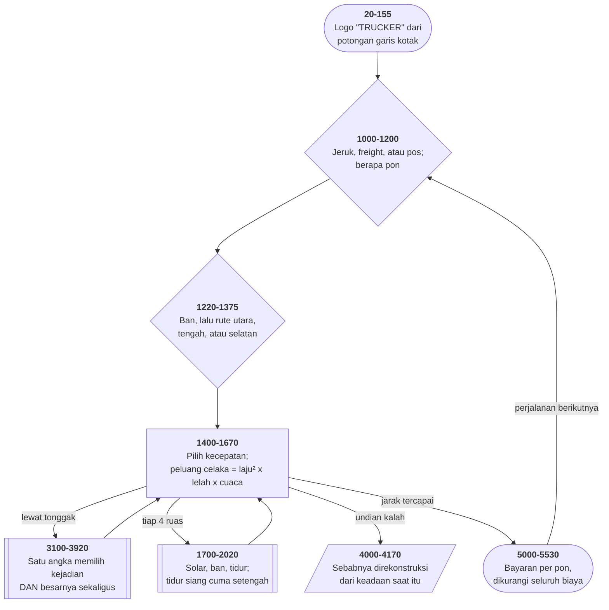

# TRUCKER.BAS di penelusur

> Program keenam puluh enam. 385 baris, nomor 5–59990, cakupan tabel
> **385/385 (100%)**.

Sumber: `run/TRUCKER.BAS` · tabel: `tracer/program/TRUCKER.js`

Trucker (Hughes Glantzberg). Mengemudi truk dari Los Angeles ke New York dalam empat hari, dengan peta yang muat di satu kolom angka.

## Tujuh puluh tiga tonggak dalam satu kolom angka

Perjalanan Los Angeles–New York di program ini dibagi jadi tonggak-tonggak: Barstow, Needles, Flagstaff, sampai Holland Tunnel. Tiap tonggak punya empat hal di DATA: jarak, nama tempat, nama jalan, dan **satu bilangan pecahan**.

```basic
9040 DATA 90,Barstow,I-15 in California,7.80
```

Bilangan terakhir itu yang menarik.

```basic
3130 ON INT(ZH) GOSUB 3210,3310,3360,3410,3500,3710,3860
```

Bagian **bulatnya** — 7 — memilih subrutin ketujuh: longsor batu di Terowongan Alleghany. Dan bagian **pecahannya** — 0,80 — jadi argumennya:

```basic
3710 IF RND < ZH-INT(ZH) THEN RETURN
```

Delapan puluh persen kemungkinan tidak terjadi apa-apa.

Yang membuat rancangan ini lebih dari sekadar hemat: **arti pecahannya berbeda-beda**. Di gerbang tol:

```basic
3310 T = 100*(ZH-INT(ZH))
```

`2.65` berarti kejadian kedua — gerbang tol — sebesar **$65**. Bukan peluang; jumlah uang.

Jadi satu kolom angka membawa: *kejadian apa*, dan *seberapa besar atau seberapa mungkin*. Yang menafsirkannya adalah subrutin yang dipilih oleh angka itu sendiri.

Harganya juga jelas. Tidak ada satu pun `REM` di berkas ini yang menjelaskan arti kolom itu. Siapa pun yang membuka TRUCKER.BAS hari ini melihat `7.80` dan tidak punya cara tahu artinya, kecuali membaca baris 3130 lebih dulu, lalu ketujuh subrutinnya satu per satu.

## Kosinus yang tidak pernah lebih dari satu

Keadaan pengemudi ditentukan enam baris berurutan, dari segar sampai kelelahan:

```basic
3020 IF HL<4 AND COS(HR/HS)<2.3 THEN CD=1:CD$="rested & rearing to go."
3030 IF HL<8 AND COS(HR/HS)<2.5 THEN CD=2:CD$="fine"
```

Bentuknya meyakinkan. Dua syarat: berapa lama sejak tidur, dan sesuatu tentang perbandingan jam jalan dengan jam tidur.

Tapi **kosinus selalu di antara −1 dan 1**. Tidak ada bilangan yang bisa dimasukkan ke `COS` yang membuat hasilnya melebihi 1, apalagi 2,3.

Kedua syarat itu **selalu benar**. Yang sebenarnya menentukan cuma `HL`.

Apa yang mungkin dimaksudkan? Baris 3010 di atasnya memakai `HR/HS>4` tanpa kosinus, dan 3040-3050 memakai `HR/HS<=3`. Jadi angka 2,3 dan 2,5 kemungkinan besar ambang untuk `HR/HS` itu sendiri — dan `COS(` masuk ke sana entah bagaimana.

Akibatnya? Kecil, dan itulah yang menarik. Pengemudi yang jam tidurnya kurang tetap dinyatakan "fine" selama `HL<8`. Permainannya jadi **sedikit lebih mudah** daripada yang dirancang, di satu arah, tanpa ada yang pernah merasakannya.

Cacat yang tidak pernah menghasilkan galat, tidak pernah menghentikan apa pun, dan tidak pernah membuat siapa pun curiga — karena satu-satunya cara menemukannya adalah menyadari bahwa sebuah perbandingan tidak pernah bisa salah.

## Peta arsitektur



## Alur yang layak diikuti

| baris | yang terjadi |
|---|---|
| `3130` | `ON INT(ZH) GOSUB` — **bagian bulat** memilih kejadian… |
| `3310` | …dan **bagian pecahan** jadi jumlah dolar tol… |
| `3360` | …atau **peluang** kejadiannya terjadi. Arti yang berbeda, angka yang sama |
| `1400` | peluang celaka = `laju² × lelah × cuaca` — tiga hal berkali |
| `1480` | irit bahan bakar berbentuk **bukit** dengan puncak tepat di 55 mil/jam |
| `1560` | penunjuk bensin sengaja **meleset acak** −4 sampai +5 galon |
| `3020` | `COS(HR/HS) < 2.3` — **selalu benar**; kosinus tak pernah lebih dari 1 |
| `2660` | `HL=HR+T+1` — salah huruf: ban pecah membuat pengemudi **lelah selamanya** |
| `1850` | `STOP` — cabang beli ban di warung **menghentikan program** |
| `3670` | jalan memutar Louisiana **menulis ulang tabel rute** di tengah perjalanan |

## Yang bisa dicoba di halaman

| coba ini | yang terlihat |
|---|---|
| pasang titik henti di 3130 | `ON INT(ZH) GOSUB` — **bagian bulat** memilih kejadian… |
| pasang titik henti di 3310 | …dan **bagian pecahan** jadi jumlah dolar tol… |
| pasang titik henti di 3360 | …atau **peluang** kejadiannya terjadi. Arti yang berbeda, angka yang sama |
| pasang titik henti di 1400 | peluang celaka = `laju² × lelah × cuaca` — tiga hal berkali |
| pasang titik henti di 1480 | irit bahan bakar berbentuk **bukit** dengan puncak tepat di 55 mil/jam |

Aslinya dijalankan dengan `run\\TRUCKER.bat`.

> Muatan 1-3, lalu berat, ban, dan rute. Sesudah itu tinggal memilih kecepatan tiap ruas. Batas 55 paling irit; ngebut menaikkan peluang celaka secara kuadrat.

## Penyimpangan dari aslinya

1. **`PLAY` diam.**
2. **Subrutin jeda 59950-59970 habis seketika**, tapi ketiga barisnya tetap ditelusuri — rumusnya sendiri cacat, dan itu bagian dari yang ingin diperlihatkan halaman ini.
3. **`RANDOMIZE` memasang benih tetap**; baris 160 tetap dijalankan supaya terlihat bahwa benihnya dibangun dari jam sistem dengan rumus yang sama cacatnya.
4. **`RUN "b:???0??"` dibangkitkan sebagai galat 64 (Bad file name).** Itu memang yang terjadi di GW-BASIC: `RUN` tidak menerima kartu liar di nama berkas.
5. **`DEFINT C-S` ditiru**: penugasan ke variabel yang namanya dimulai C sampai S dibulatkan, bukan dipotong. Yang paling terasa di `HL=HL/2` (baris 1990).
6. **DATA tiga rute ditulis sebagai larik JavaScript** alih-alih dibaca lewat `READ`, karena baris 1150 dan 1170 memakai `NEXT I,RT` bersarang yang tidak bisa dipecah per baris tanpa mengubah alurnya. Isinya sama persis, tujuh puluh tiga tonggak.
7. **Baris 140 dan 150 sudah disunting pemilik koleksi** (alamat rumah penulis).

## Yang layak ditiru

**Satu angka, dua muatan.** Tiap tonggak jalan punya satu bilangan: `7.80`, `2.65`, `3.65`. Baris 3130 memakai **bagian bulatnya** untuk memilih subrutin lewat `ON INT(ZH) GOSUB`, dan tiap subrutin memakai **bagian pecahannya** sebagai argumen. Yang membuatnya menarik: **artinya berbeda-beda**. Di gerbang tol (3310), pecahannya jumlah dolar. Di konstruksi jalan (3360), radar (3410), dan longsor (3710), ia peluang. Angka yang sama bentuknya, ditafsirkan berbeda oleh yang menerimanya. Tujuh puluh tiga tonggak jalan, tiga rute, tujuh jenis kejadian — semuanya muat dalam satu kolom DATA.

**Peluang celaka yang mengalikan tiga hal.** `AF = SP^2 * CD * CR`. Kecepatan **dikuadratkan**, lalu dikali angka keadaan pengemudi (1 sampai 100) dan angka cuaca (1 sampai 50). Ngebut saat sehat di cuaca cerah: 80²×1×1 = 6.400 dari sepuluh juta. Ngebut saat kelelahan di badai: 80²×100×50 = 32 juta — lebih dari sepuluh juta, jadi **pasti celaka**. Tiga faktor, satu perkalian, dan seluruh sistem risikonya jadi.

**Irit bahan bakar berbentuk bukit.** Baris 1480-1490: `T = ABS(55-SP)`, lalu `T1 = SP/(4.5-0.2*T)`. Selisih dari 55 — ke arah mana pun — memperkecil penyebutnya, jadi konsumsinya naik. Puncaknya tepat di 55 mil/jam, batas kecepatan nasional Amerika saat itu. Dan `IF T>12 THEN T=12.5` mematok selisihnya, supaya penyebutnya tidak pernah nol atau negatif.

**Penunjuk bensin yang sengaja meleset.** Baris 1560 menampilkan `INT(WF-4+RND*10)` — nilai sebenarnya digeser acak −4 sampai +5 galon. Pemainnya tidak pernah tahu persis berapa sisanya, dan harus mengisi lebih awal daripada yang tampak perlu. Ketidakpastian sebagai mekanik permainan, dibangun dari satu `RND` di baris tampilan.

**Peta yang bisa berubah di tengah jalan.** Baris 3660-3680: kalau truknya ditolak masuk Louisiana, nama jalannya diganti jadi "Arkansas county roads", **semua tonggak sesudah yang ke-12 digeser 200 mil**, dan jarak totalnya ikut ditambah. Tabel rutenya bukan data tetap yang dibaca sekali. Ia keadaan yang bisa ditulisi — dan satu kejadian di tengah perjalanan mengubah sisa peta yang akan dilalui.

**Sebab kecelakaan yang direkonstruksi.** Baris 4070-4120 tidak menyimpan kenapa truknya celaka. Ia **menyimpulkannya** sesudahnya, dari keadaan yang masih ada di variabel: kalau `CD=100` pengemudinya ketiduran, kalau `CR=50` ia keluar jalur di salju, kalau `SP>65` "Speed kills", dan kalau tidak ada yang bisa disalahkan — seorang pemabuk menabraknya. Urutan pemeriksaannya yang menentukan ceritanya, dan tidak ada satu variabel pun yang perlu disimpan untuk itu.

## Yang jangan ditiru

**Dua syarat yang tidak pernah salah.** Baris 3020: `IF HL<4 AND COS(HR/HS)<2.3 THEN…`, dan baris 3030 dengan `<2.5`. **Kosinus selalu di antara −1 dan 1.** Kedua perbandingan itu selalu benar, apa pun isinya. Yang sebenarnya menentukan keadaan pengemudi cuma `HL` — jam sejak tidur terakhir. Dua baris yang ditulis seolah menimbang dua hal, dan menimbang satu. Kemungkinan besar penulisnya bermaksud memakai fungsi lain, atau membandingkan dengan angka yang jauh lebih kecil.

**Satu huruf yang membuat permainan tak bisa dimenangkan.** Baris 2660: `HL=HR+T+1`. Yang dimaksud `HL=HL+T+1`. `HL` adalah jam sejak tidur terakhir; `HR` jam sejak berangkat. Sesudah **satu** ban pecah, `HL` melompat jadi total jam perjalanan — puluhan — dan baris 3010 (`IF HL>19`) langsung menyatakan pengemudinya kelelahan. Tidur menyetelnya kembali ke nol, tapi ban pecah berikutnya mengulanginya. Dan `CD=100` mengalikan peluang celaka seratus kali lipat. **Satu huruf yang salah, dan sisa perjalanannya hampir pasti berakhir di parit.**

**STOP di tengah permainan.** Baris 1850 berisi satu perintah: `STOP`. Ia dicapai kalau pemain menjawab "Y" pada tawaran membeli ban di warung truk — tawaran yang muncul begitu ban cadangannya sudah terpakai. Fitur yang tidak pernah selesai ditulis, ditinggal sebagai penanda, dan penandanya **menghentikan program**.

**Tiga variabel yang ditulis lalu dilupakan.** `ZC` (baris 2550) menampung $200 biaya pengiriman solar darurat — tapi seluruh pembukuan memakai `XC`. Dendanya tidak pernah ditagih. `TIMEPUT` (baris 2740) salah ketik untuk `TIMEOUT`; jedanya memakai nilai lama. `DH$` (baris 2170) salah ketik untuk `DM$`; tengah malam tercetak "12 AM", bukan "Midnight". BASIC tidak pernah mengeluh soal variabel yang tidak dikenal. Ia membuatnya, mengisinya dengan nol atau string kosong, dan diam.

**Denda terlambat yang tidak pernah dipungut.** Baris 1050 menjanjikan *"penalty for late delivery"*. Baris 5340 menyetel `CX=2` dan mencetak "Subtract ten percent penalty" — lalu melompat ke 5400. Dan tidak ada satu baris pun di jalur muatan freight yang membaca `CX` sesudah itu. Potongan sepuluh persennya **diumumkan tapi tidak pernah dikurangkan**.

**Sisa bagi yang ditulis sebagai pengurangan.** Baris 5110: `T=HR-INT(HR/24)`. Yang dimaksud jelas jam berapa sekarang — `HR-24*INT(HR/24)`, seperti yang ditulis benar di baris 1950 dan 5140. Untuk `HR=95`, yang benar 23; yang dihitung 92. Jadi syarat "gudang tutup" (`T<10 OR T>21`) hampir selalu benar, dan pengemudinya nyaris selalu disuruh menunggu sampai besok.

**Jam dikali seratus dua puluh.** Baris 59950: `VAL(LEFT$(TIME$,2))*120 + VAL(MID$(TIME$,4,2))*60 + VAL(RIGHT$(TIME$,2))`. Menit dikali 60 — benar. Jam dikali **120**, bukan 3600. Selama jedanya tidak menyeberang pergantian jam, selisihnya masih benar. Tapi begitu menyeberang, `TIME3-TIME2` melompat turun 3.420, dan gelungnya baru berhenti **hampir satu jam kemudian**. Program yang tampak menggantung, sekali sejam, tanpa pola yang bisa ditebak siapa pun.

**Cabang untuk kode yang tidak ada.** Baris 3140: `IF INT(ZH)=8 THEN 5000`. Kode kejadian terbesar di seluruh tabel adalah 7,9. **Delapan tidak pernah muncul**, dan cabang ini tidak pernah diambil. Kedatangan di New York diurus baris 1520.

**Satu tempat di negara bagian yang salah.** DATA baris 9060: `440,Flagstaff,I-40 in California`. Jalan yang ditulis di tiap baris adalah jalan yang dilalui **menuju** tonggak itu — dan antara Needles dan Flagstaff, truknya sudah di Arizona. Baris berikutnya (Gallup, "I-40 in Arizona") memakai aturan yang benar. Juga: `Indianna` dua kali, `Demoines` untuk Des Moines, dan `New Lersey border` — L di tempat J.

---
[Rancangan penelusur](_rancangan.md) · [BLACK](black.md) · [MORTGAGE](mortgage.md)
