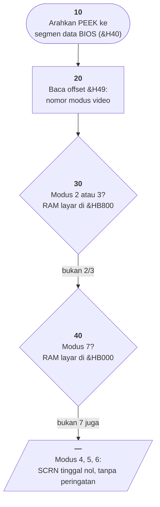

# WHATMONF.BAS di penelusur

> Program kedua puluh enam, dan **yang terpendek di seluruh koleksi**.
> 4 baris, nomor 10–40, cakupan tabel **4/4 (100%)**.

Sumber: `run/WHATMONF.BAS` · tabel: `tracer/program/WHATMONF.js`

Program pertama di luar FriendlyWare — dan ia **tidak mencetak apa pun**.
Tidak ada `PRINT`, tidak ada `CLS`, tidak ada `INPUT`. Layar penelusur tetap
kosong dari awal sampai akhir, dan itu bukan cacat porting.

## Pertanyaan yang harus dijawab sebelum menggambar apa pun

Beberapa program di koleksi ini menggambar dengan menulis **langsung ke RAM
layar** — [WILDCAT](wildcat.md) memoke kisi petanya, [MAZE](maze.md) memoke
seluruh dinding tiga dimensinya, [SUB](sub.md) mengembalikan latar di belakang
bomnya.

Semuanya perlu tahu satu hal lebih dulu: **di alamat mana RAM layarnya**. IBM PC
punya dua kemungkinan — `&HB000` (kartu monokrom) dan `&HB800` (kartu warna).
Menebak salah berarti menulis ke memori yang bukan layar, tanpa pesan galat.

Seluruh isi berkas ini adalah cara mengetahuinya:

```basic
10 DEF SEG=&H0040
20 VALUE=PEEK(&H0049)
30 IF VALUE=2 OR VALUE=3 THEN SCRN=&HB000
40 IF VALUE=7 THEN SCRN=&HB800
```

ROM BIOS menyimpan **nomor modus video** yang sedang aktif di
`&H0040:&H0049`, dan memperbaruinya tiap kali `SCREEN` dipanggil:

| modus | artinya |
|---|---|
| 0, 1 | teks 40 kolom |
| 2, 3 | teks 80 kolom — **hanya kartu warna** |
| 4, 5, 6 | grafik |
| 7 | teks 80 kolom — **hanya kartu monokrom** |

Satu bita itu sudah cukup menjawab pertanyaannya.

Terverifikasi: penelusur menjawab modus 3, dan `SCRN` berakhir **47104** =
`&HB800`.

## Peta arsitektur



## Berkas yang gunanya dibaca, bukan dijalankan

Menjalankan WHATMONF.BAS tidak menghasilkan apa-apa yang bisa dilihat. Ia
mengisi satu variabel lalu berhenti.

Itu bukan cacat. Berkas ini adalah **catatan** — jawaban atas pertanyaan teknis,
disimpan dalam bentuk yang bisa dimuat, dilihat dengan `LIST`, dan disalin ke
program yang sedang ditulis.

Uji yang sama muncul lagi di [MAZE.BAS](maze.md) baris 20, [SUB.BAS](sub.md)
590, [WILDCAT.BAS](wildcat.md) 1810, dan [STATS.BAS](stats.md) 2420 — dan
menariknya, **MAZE memakai bita yang berbeda**: `PEEK(1040)` (`&H410`, bita
perlengkapan) dan menguji dua bitnya. Dua program, dua bita, jawaban yang sama.

Di masa sebelum ada mesin pencari atau pustaka daring, begitulah pengetahuan
teknis disimpan: sebagai program pendek yang tidak dimaksudkan untuk dijalankan.

## Yang bisa dicoba di halaman

| coba ini | yang terlihat |
|---|---|
| jalankan sampai selesai | layar tetap kosong; yang bergerak cuma sorotannya |
| lihat `SCRN` sesudah baris 30 | 47104 = `&HB800` |
| bandingkan dengan MAZE baris 20 | pertanyaan yang sama, bita yang berbeda |

## Penyimpangan dari aslinya

1. **`PEEK` selalu menjawab 3** (teks 80 kolom, kartu warna), jadi `SCRN`
   selalu berakhir `&HB800`. Penelusur memang tidak punya kartu monokrom.
2. **Tidak ada keluaran layar sama sekali**, dan itu bukan cacat porting.

## Yang jangan ditiru

- **Kemungkinan yang tidak diuji dan tidak dikeluhkan.** Modus 4, 5, 6 tidak
  cocok dengan `IF` mana pun; `SCRN` tinggal **nol**, dan pemanggil yang
  mempercayainya akan memoke ke alamat 0 — tabel vektor interupsi.
- **Hasil yang cuma ada di dalam variabel.** Program ini selesai tanpa memberi
  tahu siapa pun apa yang ditemukannya.

---
[Rancangan penelusur](_rancangan.md) · [GERMFOLK](germfolk.md) · [OCTAVE](octave.md) · [DREAM](dream.md)
