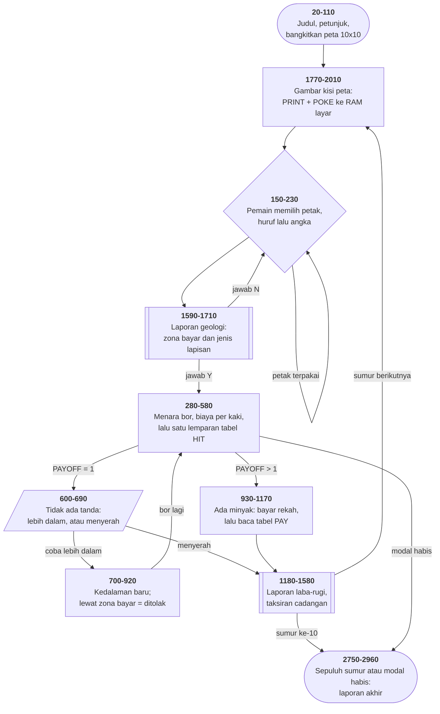

# WILDCAT.BAS di penelusur

> Program keenam belas. 296 baris, nomor 10–2960, cakupan tabel
> **296/296 (100%)**.

Sumber: `run/WILDCAT.BAS` · tabel: `tracer/program/WILDCAT.js`

Permainan pengeboran minyak. Sepuluh sumur, sejuta dolar modal, dan sebuah peta
10×10 yang enam puluh persen petaknya kosong sejak awal.

## Kisi yang digambar dengan dua cara sekaligus

Garis mendatarnya gampang — `PRINT STRING$(60,196)`, enam puluh potongan
sekali cetak. Masalahnya **simpangan**: di kolom 10, 16, 22, dan seterusnya,
garis itu harus berubah jadi `┬`, `┼`, atau `┤`.

Mencetak ulang seluruh baris potongan demi potongan jauh lebih lambat. Maka
program ini menulis langsung ke RAM layar:

```basic
1820 A=178:LOCATE A\160+1,10:PRINT STRING$(60,196)
1830 POKE A,B8:POKE A+12,B9:POKE A+24,B9: ... :POKE A+120,B0
```

Aritmetikanya perlu diketahui untuk membacanya: satu sel teks memakan **dua**
bita (aksara + warna), jadi satu baris 80 kolom = 160 bita, dan enam kolom =
**dua belas** bita. Itulah kenapa jaraknya 12.

Dan itu juga sebabnya baris 1820 menulis `LOCATE A\160+1,10` — membagi alamat
bita dengan 160 untuk mendapatkan nomor barisnya kembali. **Satu variabel,
`A`, dipakai sebagai alamat sekaligus sebagai nomor baris.**

Hasilnya, terverifikasi di penelusur:

```
                         B O O M   C O U N T Y   U S A
         ┌─────┬─────┬─────┬─────┬─────┬─────┬─────┬─────┬─────┬─────┐
         │     │     │     │  A3 │     │  A5 │     │     │  A8 │     │
         ├─────┼─────┼─────┼─────┼─────┼─────┼─────┼─────┼─────┼─────┤
         │     │     │  B2 │  B3 │     │     │     │     │     │     │
         └─────┴─────┴─────┴─────┴─────┴─────┴─────┴─────┴─────┴─────┘
                           Cash Assets $1,000,000.00
```

Penelusur menirunya apa adanya: `m.pokeLayar` menulis bita aksaranya saja dan
tidak menyentuh bita warnanya — persis seperti `POKE` ke alamat genap.

## Seluruh geologinya cuma tiga tabel

Pertanyaan intinya: seberapa besar peluang menemukan minyak di kedalaman
tertentu? Program ini tidak menjawabnya dengan rumus. Ia menjawabnya dengan
**tabel**.

```basic
570 TRY=FIX(RND*40)+1
580 PAYOFF=HIT(TYPE,TRY)
```

Satu lemparan dadu empat puluh sisi ke tabel yang dipilih menurut jenis
lapisan. Nilai 1 berarti gagal. Isi ketiga tabelnya:

| lapisan | kedalaman | angka 1 dari 40 | angka tertinggi |
|---|---|---|---|
| dangkal | 4.000–7.000 | 10 | 5 (enam kali) |
| sedang | 7.500–10.000 | 20 | 5 (empat kali) |
| dalam | 10.500–15.000 | **30** | 5 (dua kali) |

Dan tabel `PAY` untuk nilai 5 di lapisan dalam memuat angka seperti **4.400**
dan **2.200** barel per hari — sementara lapisan dangkal tertinggi 600.

Kalimat di layar petunjuk — "makin dalam, makin kecil peluangnya, tapi makin
besar temuannya" — **ditulis bukan sebagai aturan melainkan sebagai seratus
enam puluh angka**. Menyetel keseimbangan permainan cukup dengan mengetik ulang
satu baris `DATA`.

Terverifikasi: petak `A3` (lapisan sedang, 7.500–10.000). Bor sampai 8.000 kaki
→ `TRY=3`, `HIT(2,3)=1` → "No Show At 8,000 Feet." Lebih dalam ke 9.500 →
`TRY=22`, `HIT(2,22)=2` → minyak. Biaya rekah `10 × 9500 = $95.000`.

## Dua angka bersebelahan sebagai satu pasangan

```basic
1010 HIT=FIX(FIX(RND*10)*2)+1
1020 OPD=PAY(HIT,PAYOFF,TYPE)
1030 GSP=PAY(HIT+1,PAYOFF,TYPE)*1000
```

Baris 1010 sengaja hanya menghasilkan angka **ganjil** — 1, 3, 5, …, 19 —
supaya pasangan `(HIT, HIT+1)` tidak pernah tumpang tindih. Larik satu dimensi
yang dipakai sebagai larik pasangan: yang ganjil minyak, yang genap gas.

*(`FIX(FIX(RND*10)*2)` punya `FIX` di dalam `FIX`. Yang dalam sudah
membulatkan, jadi yang luar tidak berbuat apa-apa.)*

Terverifikasi dengan `HIT=17`: `PAY(17,2,2)=0` barel minyak dan
`PAY(18,2,2)=1333` ribu kaki kubik gas. Layarnya tetap berteriak **"EUREKA, WE
STRUCK OIL!"** padahal minyaknya nol — pesannya satu, tidak peduli mana yang
ditemukan.

Laporan laba-ruginya, apa adanya:

```
▒    Drilling          $270,000.00     ▒
▒    Fracture           $95,000.00     ▒
▒    1 YR. OPER.         $2,424.00     ▒
▒    Total Cost        $367,424.00     ▒
▒             Gross Income             ▒
▒    Oil                     $0.00     ▒
▒    Gas             $2,799,300.00     ▒
```

## Peta arsitektur



Flowchart saja sudah cukup di sini: tidak ada modus yang berganti dan tidak ada
tombol yang berubah arti — alurnya lurus dari peta ke sumur ke laporan.

## `CSH` dan `CHS`

Program ini punya dua variabel penting yang namanya cuma beda urutan dua huruf:

- `CSH` = uang tunai
- `CHS` = nomor sumur yang sedang dikerjakan

Keduanya muncul berdekatan berkali-kali:

```basic
490 IF CSH-CSF<0 THEN OOM=1:YRN(CHS+1)=-(CSH):GOTO 2750
```

Satu baris, tiga nama tiga huruf, ketiganya dimulai dengan C — dan `CSF`
(biaya sejauh ini) yang ketiga.

Tertukar sekali saja dan yang terjadi bukan pesan galat, melainkan larik yang
ditulis di indeks satu juta. Nama pendek dulu punya alasan: penafsir BASIC lama
hanya membedakan **dua huruf pertama**, dan tiap huruf tambahan memakan memori.
Alasannya sudah lama hilang; kebiasaannya belum.

## Yang bisa dicoba di halaman

| coba ini | yang terlihat |
|---|---|
| pasang titik henti di 1830 | sebelas `POKE` ke RAM layar, satu simpangan tiap enam kolom |
| pasang titik henti di 2090 | 120 angka masuk ke tabel `HIT` — inti permainannya |
| ketik `A3` lalu `Y` | laporan geologi, lalu menara bor dan biaya per kaki |
| pasang titik henti di 580 | satu lemparan dadu, satu bacaan tabel — itu saja |
| jawab `Y` pada "Go Deeper", ketik `9500` | zona bayar diuji di baris 880 |
| ketik kedalaman di luar zona | ditolak baris 900 (pasang titik henti, pesannya cepat hilang) |
| pasang titik henti di 1010 | pasangan minyak/gas diambil dari dua sel bersebelahan |
| pilih petak yang sama dua kali | ditolak baris 230 — **tanpa satu kata penjelasan** |

## Penyimpangan dari aslinya

1. **Larik dan skalar bernama sama dipisahkan.** `HIT(3,40)` jadi `HIT_` dan
   `Z(10)` jadi `Z_`, karena baris 1010 memakai `HIT` sebagai skalar dan baris
   160 memakai `Z` sebagai teks. BASIC membedakan keduanya; JavaScript tidak.
2. **`PEEK` dan `DEF SEG` tidak berarti apa-apa.** Uji kartu monokrom di baris
   1810 selalu menjawab kartu warna.
3. **`PRINT USING` yang ditiru hanya bentuk `$$`, `#`, `,`, `.##`** beserta
   spasi harfiah di ujung formatnya.
4. **Pengacaknya berbenih tetap**, jadi peta dan hasil pengeborannya selalu
   sama. `RIGHT$(TIME$,2)` di baris 70 memakai jam penelusur yang maju tetap,
   seperti [CRAPS.BAS](craps.md).
5. **Kelima gelung tunda habis seketika**, jadi "You Must Go Deeper" dan "You
   Are Past The Pay Zone" terhapus sebelum sempat terbaca.

## Yang jangan ditiru

- **Dua nama yang cuma beda urutan huruf.** `CSH` dan `CHS`.
- **Uji yang sama ditulis dua kali.** Baris 490 dan 510 memeriksa hal yang
  persis sama; bedanya cuma indeks larik, karena baris 500 menaikkan `CHS` di
  antaranya.
- **Indeks larik yang pecahan.** Baris 1970: `Z(A/2-1)` dengan `A` selalu
  ganjil, jadi indeksnya selalu berujung 0,5. Bekerja hanya karena pembulatan
  BASIC kebetulan searah dengan yang dimaui.
- **Larik yang tidak pernah di-`DIM`.** `YRN()` tidak muncul di baris 60; BASIC
  membuatnya sendiri dengan batas 10 — dan kebetulan itu pas, karena sumurnya
  memang sepuluh.
- **Sisa suntingan yang ikut terkirim.** Baris 1080 `GOTO 1090` melompat ke
  baris tepat di bawahnya, dan baris 1760 adalah subrutin tunda yang tidak
  pernah dipanggil siapa pun.
- **Penolakan tanpa penjelasan.** Baris 230 menolak petak yang sudah dipakai
  dengan cara membersihkan baris 24 — tidak ada satu kata pun yang memberi tahu
  kenapa.

---
[Rancangan penelusur](_rancangan.md) · [MENU](menu.md) · [INTRO](intro.md) · [CHECK](check.md) · [TOWERS](towers.md) · [HEAREYE](heareye.md) · [TICTAC](tictac.md) · [MASTER](master.md) · [BOGGY](boggy.md) · [PEGLEAP](pegleap.md) · [BIO](bio.md) · [HANGMAN](hangman.md) · [BUSONE](busone.md) · [OTHELLO](othello.md) · [CRAPS](craps.md) · [DRAW](draw.md)
