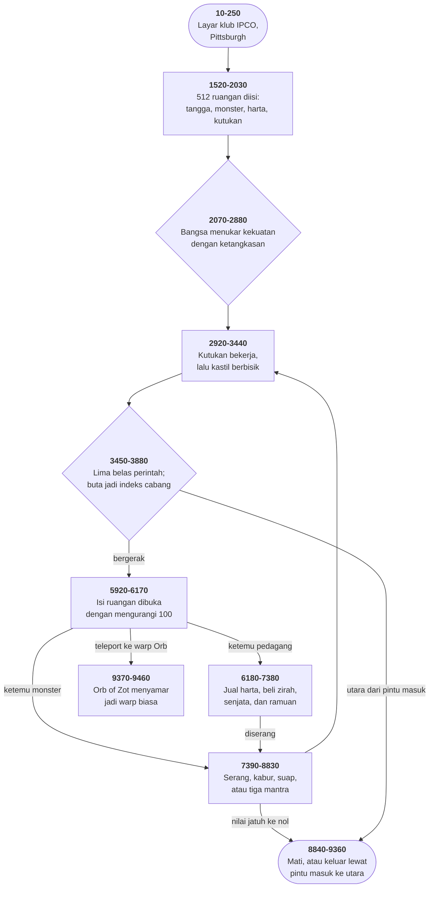

# WIZARD.BAS di penelusur

> Program ketujuh puluh dua. 944 baris, nomor 10–10180, cakupan tabel
> **944/944 (100%)**.

Sumber: `run/WIZARD.BAS` · tabel: `tracer/program/WIZARD.js`

The Wizard's Castle (Joseph R. Power, 1980). Program terpanjang di koleksi ini, dan induk dari sebuah permainan lain yang tersimpan di disket yang sama.

## Induk yang selamat, dan turunan yang hilang

Koleksi ini menyimpan sebuah permainan bernama "Temple of Loth" dalam dua berkas: [TEM-INS.BAS](tem-ins.md) yang berisi petunjuknya, dan TEMPLE.BAS (1.187 baris) yang berisi permainannya. Keduanya saling memanggil dengan `CHAIN`.

Yang tidak dijelaskan keduanya: dari mana Temple of Loth berasal. Berkas ini menjawabnya.

Delapan harta yang didaftar TEM-INS di baris 1820-1890 — *The Ruby Red, The Pale Pearl, The Opal Eye, The Green Gem, The Blue Flame, The Norn Stone, The Palantir, The Silmaril* — adalah delapan harta yang sama persis di baris 9520-9540 berkas ini, dengan urutan yang sama.

Tiga kutukannya sama: lesu, lintah, dan lupa. Kolam ajaib yang bisa mengubah bangsa pemain sama. Bola kristal yang berbohong setengah waktu sama. Dan yang paling menentukan: **Amulet of Chaos** di Temple of Loth berperilaku persis seperti **Orb of Zot** di sini — menyamar jadi warp, dan hanya bisa dimasuki dengan teleportasi memakai Runestaff.

Jadi Temple of Loth adalah tulisan ulang Wizard's Castle, dengan nama-nama yang diganti. Dan yang selamat sampai ke disket ini: **permainan aslinya**, plus **petunjuk turunannya**.

Wizard's Castle sendiri punya silsilah yang panjang. Ia terbit di Recreational Computing edisi Juli/Agustus 1980, ditulis Joseph R. Power untuk Exidy Sorcerer — komputer rumah yang programnya dijual dalam kartrid berbentuk kaset. J.F. Stetson memindahkannya ke Heath Microsoft BASIC. Seseorang lagi memindahkannya ke IBM PC. Dan klub International PC Owners di Pittsburgh menyebarkannya dengan nomor katalog 2039-A.

Empat mesin, empat orang, dan satu baris yang masih menyimpan bekas perjalanannya: baris 3590, `PRINT CHR$(27);"E"` — perintah bersihkan-layar untuk terminal Heath, di program yang sudah tidak pernah melihat terminal Heath lagi.

## Sistem yang dibangun rapi, lalu dilewati satu baris

Wizard's Castle menyimpan seluruh kastilnya — delapan tingkat, delapan kali delapan ruangan — dalam satu larik `L(512)`. Dan tiap unsurnya membawa **dua** keterangan sekaligus.

Isi ruangan disimpan sebagai angka 1 sampai 34. Kalau pemain belum pernah melihatnya, angkanya **ditambah seratus**.

```basic
1310 L(Q)=101
```

Seratus satu: ruangan kosong (1) yang belum diketahui (+100).

Membukanya cuma satu fungsi:

```basic
1180 DEF FNE(Q)=Q+100*(Q>99)
```

Dan seluruh permainan dibangun di atas pembedaan itu. Melangkah ke sebuah ruangan membukanya (baris 6000). Menyalakan suar membuka sembilan sekaligus **dan mencatatnya** (4390-4400). Menyorotkan lampu membuka satu (4690). Menatap bola kristal membuka satu yang acak (5540-5550).

Bahkan kutukan lupa dibangun untuk membalikkannya:

```basic
3000 L(FND(Z))=FNE(L(FND(Z)))+100
```

Satu ruangan acak dikembalikan ke keadaan tidak diketahui, tiap giliran. Peta pemain perlahan berbalik jadi tanda tanya lagi — dan Green Gem menangkalnya.

Enam mekanisme, semuanya bergantung pada satu angka seratus. Rancangan yang matang.

Lalu baris 4150:

```basic
4150 IF Q > 99 THEN Q=Q-100 ' LET Q=34 TO HIDE ROOMS
```

Perintah MAP mencabut angka seratus itu **tanpa syarat**, sebelum menggambar. Jadi peta menampilkan seluruh isi tingkat: setiap monster, setiap harta, setiap tangga — termasuk yang belum pernah didatangi.

Enam mekanisme itu tetap berjalan. Suar tetap mencatat, lampu tetap membuka, kutukan lupa tetap melupakan. Tapi tidak ada gunanya, karena satu perintah menampilkan semuanya kapan saja.

Dan yang membuat ini bukan sekadar cacat: **perbaikannya ada di baris yang sama**. Komentar `' LET Q=34 TO HIDE ROOMS` menyebutkan persis apa yang harus diubah, dan entri ke-34 di daftar isi ruangan — `DATA X,"?"` di baris 9550 — memang disiapkan untuk itu dan tidak dipakai untuk apa pun lain.

Terukur di penelusur: ruangan (1,1,1) tersimpan sebagai **116** — monster (16) yang belum pernah didatangi (+100). Sesudah baris 4150, `Q` bernilai 16 dan petanya mencetak "M". Isinya tetap tertandai belum dilihat di `L()`; yang bocor cuma tampilannya.

Seseorang membangun sistemnya, membangun saklarnya, menulis cara memakainya, dan meninggalkan saklarnya terbuka.

## Peta arsitektur



## Alur yang layak diikuti

| baris | yang terjadi |
|---|---|
| `1170` | `FND(Q)=64*(Q-1)+8*(X-1)+Y` — 8×8×8 jadi **satu larik 512** |
| `1150` | `FNB(Q)=Q+8*((Q=9)-(Q=0))` — **peta melingkar**, kedua tepi sekaligus |
| `1180` | `FNE(Q)=Q+100*(Q>99)` — ruangan disimpan sebagai isi **+100** sampai dilihat |
| `1310` | seluruh kastil diisi `101`: kosong, dan belum pernah dilihat |
| `4150` | perintah MAP **membuka seluruh tingkat** — dan komentarnya menyimpan perbaikannya |
| `6090` | Orb of Zot **menyamar jadi warp**; hanya teleportasi yang bisa masuk |
| `1900` | Runestaff disembunyikan **di dalam** salah satu monster |
| `3000` | kutukan lupa mengembalikan satu ruangan acak ke keadaan **belum dilihat** |
| `5960` | `W$(WV+1)` senjata, `W$(AV+5)` zirah — **satu larik, dua daftar** |
| `7790` | monster yang mati jadi **makan siang**: namanya disambung ke nama hidangan |
| `1000` | pintu masuk kedua yang **tidak dipakai siapa pun** — keempat kalinya di koleksi ini |

## Yang bisa dicoba di halaman

| coba ini | yang terlihat |
|---|---|
| pasang titik henti di 1170 | `FND(Q)=64*(Q-1)+8*(X-1)+Y` — 8×8×8 jadi **satu larik 512** |
| pasang titik henti di 1150 | `FNB(Q)=Q+8*((Q=9)-(Q=0))` — **peta melingkar**, kedua tepi sekaligus |
| pasang titik henti di 1180 | `FNE(Q)=Q+100*(Q>99)` — ruangan disimpan sebagai isi **+100** sampai dilihat |
| pasang titik henti di 1310 | seluruh kastil diisi `101`: kosong, dan belum pernah dilihat |
| pasang titik henti di 4150 | perintah MAP **membuka seluruh tingkat** — dan komentarnya menyimpan perbaikannya |

Aslinya dijalankan dengan `run\\WIZARD.bat`.

> H untuk daftar perintah. N/S/E/W bergerak, U/D naik-turun tangga, DR minum dari kolam, M peta, F suar, L lampu, O buka, G tatap bola, T teleport (butuh Runestaff), Q menyerah.

## Penyimpangan dari aslinya

1. **`RANDOMIZE` tidak dipanggil sama sekali** di berkas aslinya — baris 1250 cuma memanggil `RND(1)` tanpa menyemai. Penelusur memasang benih tetap.
2. **`PRINT CHR$(27);"E"` di baris 3590** adalah perintah bersihkan-layar terminal Heath, sisa dari pemindahan sebelumnya. Di sini diperlakukan sebagai `CLS`.
3. **`CHAIN "SAMPLES",1000` di baris 10180 tidak bisa dijalankan** — dan memang tidak pernah dicapai; lihat catatan cacat.
4. **Kelima `DEF FN` ditulis sebagai fungsi JavaScript**; baris 1140-1180 tetap ada di tabel.

## Yang layak ditiru

**Lima fungsi yang menggantikan seluruh tata ruangnya.** Baris 1140 sampai 1180 mendefinisikan lima fungsi, dan kelimanya mengurus hal yang berbeda: undian, peta melingkar, batas atas, pengalamatan tiga dimensi, dan penanda "sudah dilihat". Yang paling padat `FNB(Q)=Q+8*((Q=9)-(Q=0))`. Perbandingan bernilai −1 saat benar, jadi ungkapan dalam kurung menghasilkan −1, 0, atau +1 — dan dikali delapan ia jadi −8, 0, atau +8. **Satu baris yang mengurus kedua tepi peta sekaligus**, tanpa satu pun `IF`.

**Ruangan yang menyimpan isinya dan pengetahuannya sekaligus.** Tiap ruangan disimpan sebagai **isinya ditambah seratus** selama belum pernah dilihat. Baris 1310 mengisi seluruh kastil dengan 101 — ruangan kosong yang belum diketahui. Melihat sebuah ruangan berarti mengurangi seratus (`FNE`). Dan kutukan lupa (baris 3000) menambahkannya kembali ke satu ruangan acak tiap giliran, jadi peta pemain perlahan berbalik jadi tanda tanya lagi. Satu bilangan membawa dua hal: apa isinya, dan apakah pemain sudah tahu.

**Barang yang disembunyikan di dalam barang lain.** **Runestaff** tidak punya ruangan sendiri. Baris 1900-1950 menaruh sebuah monster acak, lalu mencatat tempatnya di `R(3)`. Membunuh monster di petak itu yang memunculkannya (baris 7810). **Orb of Zot** disimpan sebagai warp biasa — isi 109, sama seperti warp lain. Baris 6090 membedakannya: berjalan masuk membuat pemain terlempar satu petak lagi, dan hanya **teleportasi** — yang menyetel `O$="T"` — yang membawanya ke ruangan itu betulan. Dan **ketiga kutukan** ditaruh di ruangan yang isinya tetap "kosong". Tidak ada apa pun yang terlihat di sana, selamanya.

**Satu larik yang menampung dua daftar.** `W$(8)` berisi empat nama senjata di posisi 1-4 dan empat nama baju zirah di posisi 5-8. Baris 5960 membacanya dengan `W$(WV+1)` dan `W$(AV+5)` — dua penunjuk ke satu larik, berselisih empat. Dan `E$(8)` dibaca dari `DATA` yang **sama persis**, berselang-seling: "NO WEAPON" lalu " SANDWICH", "DAGGER" lalu " STEW". Dua daftar yang tidak berhubungan sama sekali, disimpan bergantian dalam satu deret.

**Kebutaan sebagai indeks cabang.** Baris 3520: `IF O$="F" THEN ON BL+1 GOTO 4260,4030`. Bendera buta bernilai 0 atau 1, jadi `BL+1` jadi 1 atau 2 — langsung dipakai memilih antara menjalankan perintah dan menolaknya. Tiga perintah memakai pola ini. Tidak ada `IF BL=1` di mana pun.

**Monster yang jadi makan siang.** Baris 7790: `PRINT "YOU SPEND AN HOUR EATING ";C$(A+12);E$(FNA(8));"."` — nama monster disambung dengan nama hidangan acak. "AN ORC BURGER". "A BALROG TACO". Dan syaratnya (`H > T-60`) memastikan itu cuma terjadi kalau sudah enam puluh giliran sejak makan terakhir. Sebuah sistem kelaparan, dibangun dari satu pengurangan.

## Yang jangan ditiru

**Perintah MAP yang membuka seluruh peta.** Baris 4150: `IF Q > 99 THEN Q=Q-100 ' LET Q=34 TO HIDE ROOMS`. Angka seratus yang menandai "belum pernah dilihat" dicabut begitu saja sebelum digambar. Jadi perintah MAP menampilkan **seluruh isi tingkat itu** — monster, harta, tangga, semuanya — termasuk ruangan yang belum pernah didatangi pemain. Dan perbaikannya ada di baris yang sama, sebagai komentar. Entri ke-34 di daftar isi ruangan (baris 9550) memang tanda tanya, disiapkan justru untuk ini. Seluruh sistem "ruangan tersembunyi" — angka +100, fungsi `FNE`, kutukan lupa, suar yang mencatat — dibangun dengan hati-hati, lalu **dilewati oleh satu perintah** yang saklarnya ditinggalkan dalam keadaan terbuka.

**Pintu masuk kedua yang tidak dipakai siapa pun.** Baris 1000 menyetel `SAMP$="NO"` lalu melompati baris 1010, yang menyetelnya `"YES"`. Satu-satunya cara mencapai 1010 adalah `RUN 1010` dari luar. Dan baris 10180 memakainya: `IF SAMP$="YES" THEN CHAIN "SAMPLES",1000 ELSE END`. Cabang itu tidak pernah diambil. Ini **keempat kalinya** idiom yang sama muncul di koleksi ini — sesudah MORTGAGE.BAS, DROIDS.BAS, dan MUSIC.BAS. Empat program, empat penulis berbeda, satu kebiasaan menyiapkan pintu belakang yang tidak pernah dipakai.

**Dua baris yang dilompati tanpa syarat.** Baris 4230 berbunyi `GOTO 4470`, dan tepat di bawahnya baris 4240 mencetak `") LEVEL";Z` lalu 4250 kembali ke gelung utama. Keduanya tidak pernah dicapai. Melihat isinya, keduanya sisa dari versi lama yang mencetak nomor tingkat di ujung peta — pekerjaan yang sekarang diambil alih subrutin 10160.

**Subrutin yang tidak dipanggil dari mana pun.** Baris 9960-9980 adalah pembaca angka lengkap: `INPUT O$`, `Q=INT(VAL(O$))`, `RETURN`. Tidak ada satu `GOSUB 9960` pun di seluruh berkas. Penggantinya ada tepat di bawahnya, di 9990-10060, dengan tambahan pemeriksaan rentang 1 sampai 8. Yang lama ditinggalkan utuh di tempatnya.

**Komentar yang rusak di berkasnya sendiri.** Baris 4290: `REM DISeADJACENT ROOM CONTENTS WITH FLARE`. Yang dimaksud jelas "DISPLAY ADJACENT" — tujuh aksara hilang dan satu huruf kecil tersisa di tengahnya. Berkas ini sudah melewati Exidy Sorcerer, Heath, dan IBM PC. Satu aksara yang tercecer di salah satu perpindahan itu, dan tidak ada yang pernah memperbaikinya karena komentar tidak dijalankan.

**Salah eja di pertanyaan pertama.** Baris 2190: *"WHICH SEX TO YOU PREFER"* — "TO" untuk "DO". Pertanyaan kedua yang dilihat setiap pemain, di program yang terbit di majalah nasional.

---
[Rancangan penelusur](_rancangan.md) · [TEM-INS](tem-ins.md) · [STARTREK](startrek.md) · [ELIZA](eliza.md)
