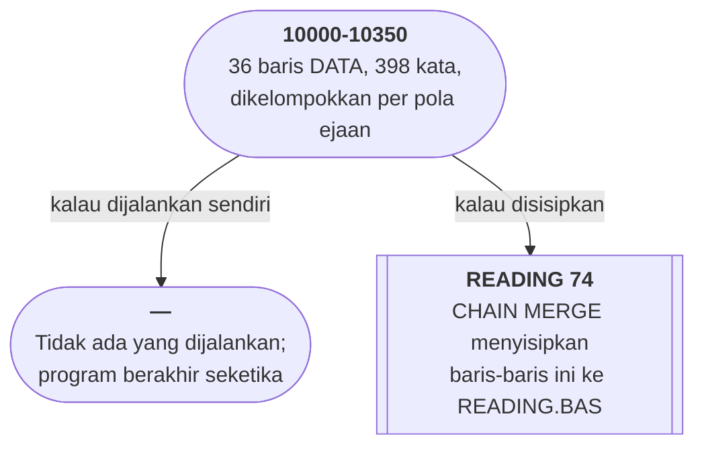

# WORDS.BAS di penelusur

> Program ketiga puluh dua. 36 baris, nomor 10000–10350, cakupan tabel
> **36/36 (100%)**.

Sumber: `run/WORDS.BAS` · tabel: `tracer/program/WORDS.js`

Tiga puluh enam baris, dan **semuanya `DATA`**. Tidak ada satu pun pernyataan
yang bisa dijalankan. Menjalankan berkas ini sendirian: program berakhir
seketika tanpa melakukan apa pun — terverifikasi, 35 langkah lalu selesai di
baris 10350.

Ini bukan program. Ini **kamus**: 398 kata bacaan tingkat dasar untuk
[READING.BAS](reading.md).

## Dikelompokkan menurut bunyi, bukan abjad

| baris | pola |
|---|---|
| 10000 | vokal `a` pendek — fat, cat, act, can |
| 10050 | konsonan ganda di akhir — glass, bell, dress |
| 10070 | bunyi `sh` — fish, dish, brush, splash |
| 10080 | bunyi `ch` — rich, witch, lunch, catch |
| 10090 | bunyi `th` — that, this, them, than |
| 10230 | bunyi `wh` — why, wheel, when, whip |
| 10350 | angka — one, two, three… ten |

Itu urutan pengajaran membaca fonetik, bukan urutan kamus. **Bentuk datanya
mengikuti cara mengajarnya.** Kalau daftarnya disusun menurut abjad, kata acak
yang dikedipkan READING.BAS tidak akan punya hubungan apa-apa dengan pelajaran
minggu itu.

## Koma yang hilang

```basic
10320 DATA better,never,after,under,coller,color,other,mother,water father
```

Tanpa koma di antara dua kata terakhir, BASIC membacanya sebagai **satu butir**:
`"water father"`. Jadi daftarnya berisi **398** kata, bukan 399 — terverifikasi
di penelusur, dan angka itu cocok persis dengan `L=398` yang dihitung
READING.BAS.

Akibatnya sesekali READING.BAS akan mengedipkan `water father` sebagai kata yang
harus dibaca seorang anak kelas satu. Tidak ada pesan galat, dan tidak ada yang
memeriksa.

Di baris yang sama, `coller` kemungkinan besar salah ketik untuk `collar`. Di
berkas yang isinya **daftar kata untuk belajar mengeja**, satu huruf yang salah
adalah pelajaran yang salah.

## Delapan ribu nomor yang sengaja dikosongkan

`CHAIN MERGE` menyisipkan baris **menurut nomornya**, dan nomor yang sama akan
**menimpa**. READING.BAS memakai 5 sampai 2020; berkas ini mulai dari **10000**.

Jarak itu bukan kebetulan — ia ruang yang sengaja dikosongkan supaya
penyisipannya tidak merusak apa pun. Pola yang sama masih ada di sekitar kita
dengan nama lain: rentang nomor port yang dipesan, blok alamat IP privat, awalan
pengenal yang dijatah per modul. **Ruang nama yang dibagi dengan cara
menyepakati batas, bukan dengan cara memeriksa.**

Dan seperti semua kesepakatan semacam itu, ia bekerja sampai ada yang lupa.
Kalau suatu hari READING.BAS tumbuh melewati baris 10000, kata-kata di berkas
ini akan mulai menimpa kodenya — diam-diam, tanpa satu pun peringatan.

## Peta arsitektur



## Yang bisa dicoba di halaman

| coba ini | yang terlihat |
|---|---|
| jalankan sampai habis | sorotan berjalan lurus 10000 → 10350, tidak ada yang berubah |
| lihat baris 10320 | `water father` — satu butir, bukan dua |
| buka [READING](reading.md) | daftar yang sama, tapi dipakai |

## Penyimpangan dari aslinya

1. **Tidak ada apa pun yang bisa dilihat.** Tidak ada layar, tidak ada variabel,
   tidak ada percabangan. Yang bisa dilakukan di halaman ini cuma membaca
   daftarnya dan melihat sorotan berjalan lurus.

## Yang jangan ditiru

- **Koma yang hilang di tengah data.** Satu karakter, dan sebuah butir data
  berubah artinya tanpa satu pun tanda.
- **Salah ketik di berkas yang isinya pelajaran mengeja.** `coller`.

---
[Rancangan penelusur](_rancangan.md) · [READING](reading.md) · [WRTSTR](wrtstr.md) · [NOTETABL](notetabl.md)
