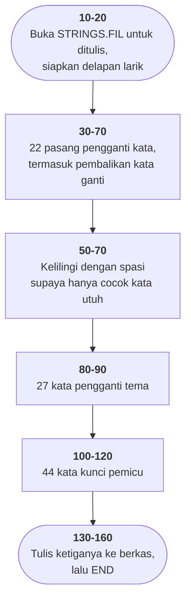

# WRTSTR.BAS di penelusur

> Program ketiga puluh satu. 17 baris, nomor 5–160, cakupan tabel
> **17/17 (100%)**.

Sumber: `run/WRTSTR.BAS` · tabel: `tracer/program/WRTSTR.js`

Tujuh belas baris yang tidak mencetak apa pun. Yang dihasilkannya sebuah
**berkas**: `STRINGS.FIL`, kosakata untuk [ELIZA.BAS](../../run/ELIZA.BAS).

Pola yang hampir hilang sekarang: program yang gunanya dijalankan **sekali**,
untuk menyiapkan data bagi program lain.

## Tabel dua kolom yang jadi seluruh ilusi

ELIZA terkenal karena terdengar seperti sedang mendengarkan. Sebagian besar dari
kesan itu berasal dari delapan pasang di baris 30:

| kata asli | jadi |
|---|---|
| I | YOU |
| YOU | I |
| ME | YOU |
| MY | *OUR |
| YOUR | MY |
| MYSELF | *OURSELF |
| I'M | *OU'RE |
| YOU'RE | I'M |

Waktu pemakai mengetik *"I hate my mother"*, ELIZA menjalankan kalimatnya lewat
tabel ini dan mendapat *"you hate your mother"*. Tinggal ditempel ke pola
jawaban — "Why do you say **you hate your mother**?" — dan hasilnya terdengar
seperti tanggapan yang dipahami.

**Tidak ada satu pun bagian dari program yang tahu apa arti "hate" atau
"mother".** Yang ada dua puluh dua pasang string dan sebuah gelung penukar.

Dua daftar lainnya sama sederhananya: **27 kata tema** memberi sinonim untuk
memvariasikan jawaban, dan **44 kata kunci** adalah pemicu — kalimat yang
mengandung "ALWAYS" memancing "can you think of a specific example?".

Seluruh mesin percakapannya, dalam 115 butir `DATA`.

## Tiga bintang yang seharusnya huruf Y

Terverifikasi di penelusur:

```
12: " I "      (3) -> " YOU "      (5)
15: " MY "     (4) -> " *OUR "     (6)
17: " MYSELF " (8) -> " *OURSELF " (10)
```

Tiga pengganti dimulai dengan tanda bintang — dan pasangan kebalikannya
(`YOUR→MY`, `YOURSELF→MYSELF`, `YOU'RE→I'M`) tertulis **benar**. Kelihatannya
`Y` yang terketik jadi `*`.

Kalau benar, ELIZA akan menjawab *"\*OUR mother"* alih-alih *"YOUR mother"* —
di salah satu kalimat yang paling sering muncul. *Akan diperiksa waktu ELIZA.BAS
diport.*

## Spasi pengapit sebagai batas kata

```basic
50 FOR I=5 TO 22:RW$(I)=" "+RW$(I)+" ":OW$(I)=" "+OW$(I)+" "
60 LO(I)=LO(I)+2:LR(I)=LR(I)+2
```

Empat pasang pertama adalah **tanda baca** (titik, koma, tanya, seru) dan
sengaja dilewati. Sisanya dikelilingi spasi supaya penggantiannya hanya mengenai
**kata utuh**: `" MY "` tidak akan cocok dengan `"MYSTERY"`.

Cara paling sederhana membatasi pencocokan ke kata utuh, dan masih dipakai di
mana-mana sebelum ada ekspresi reguler.

Terverifikasi: pasangan 1 tetap `"."` (panjang 1), pasangan 12 jadi `" I "`
(panjang 3). Dan baris 40 menyimpan panjangnya lebih dulu — ELIZA menyisir tiap
kalimat terhadap 22 kata, jadi menghitung ulang `LEN()` tiap kali berarti ribuan
panggilan yang hasilnya selalu sama.

## Peta arsitektur



## Kenapa datanya ada di berkas terpisah

GW-BASIC memuat seluruh program ke RAM, termasuk seluruh baris `DATA`-nya.
ELIZA.BAS sudah 514 baris; menambahkan lima baris `DATA` panjang berarti
menambah kilobita yang harus ikut dimuat setiap kali.

Dengan memisahkannya, kosakata itu ada di disket sebagai berkas data, dan ELIZA
membacanya dengan `INPUT#` ke larik — ke tempat yang sama, tapi tanpa ikut
memenuhi ruang program.

Harganya: berkasnya **harus dibuat lebih dulu**. Menjalankan ELIZA.BAS di disket
yang belum pernah dijalankan WRTSTR.BAS akan berakhir dengan galat 53, dan tidak
ada satu pun petunjuk di kedua berkas yang menyebutkan urutannya.

Pola ini punya nama sekarang: *build step*. Yang berbeda cuma bahwa di sini
tidak ada yang menjalankannya untuk Anda.

## Yang bisa dicoba di halaman

| coba ini | yang terlihat |
|---|---|
| pasang titik henti di 40 | 22 pasang terbaca, panjangnya disimpan sekalian |
| pasang titik henti di 50 | pasangan 5–22 dikelilingi spasi; 1–4 tidak |
| lihat `RW$(15)` | `" *OUR "` — bintang yang seharusnya Y |
| jalankan sampai 160 | 159 butir tertulis ke `STRINGS.FIL` |

## Penyimpangan dari aslinya

1. **Berkasnya ditulis ke disket dalam memori penelusur.** Bisa dibaca lagi oleh
   ELIZA dalam sesi yang sama; hilang begitu halaman disegarkan.
2. **Tidak ada keluaran layar sama sekali.**
3. **Spasi di ujung butir `DATA` yang tidak dikutip dibuang**, seperti yang
   dilakukan GW-BASIC. Empat butir yang dikutip (`" . "`) mempertahankan
   spasinya.

## Yang jangan ditiru

- **Bintang yang seharusnya huruf Y.** Tiga butir di baris 30.
- **Berkas keluaran tanpa satu kata penjelasan.** Tidak ada "menulis
  STRINGS.FIL…", tidak ada "selesai". Pemakai melihat kursor berkedip lalu
  prompt `Ok`, tanpa tahu apakah berhasil.
- **Larik yang di-`DIM` dan tidak dipakai.** `A$(20)` dan `M$(20)` tidak muncul
  lagi di mana pun — kemungkinan sisa daftar `DIM` ELIZA.BAS yang ikut tersalin.

---
[Rancangan penelusur](_rancangan.md) · [NOTETABL](notetabl.md) · [OCTAVE](octave.md) · [GERMFOLK](germfolk.md) · [DREAM](dream.md) · [WHATMONF](whatmonf.md)
