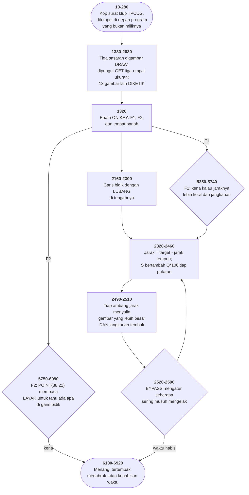

# XWING.BAS di penelusur

> Program kedelapan puluh dua. 732 baris, nomor 10–8030, cakupan tabel
> **732/732 (100%)**.

Sumber: `run/XWING.BAS` · tabel: `tracer/program/XWING.js`

Star Pilot / X-Wing Fighter (George Blank 1978, port PC 1982). Ditulis 25 September 1978, dipindahkan ke IBM PC Desember 1982, dan disebarkan klub yang menempelkan kop suratnya di depan.

## Torpedo yang bertanya pada layar

Meriam laser di baris 5420-5430 menguji kena dengan aritmetika: jarak antara titik bidik dan letak sasaran, dibandingkan dengan jangkauan tembak.

Torpedo tidak. Baris 5840:

```basic
5840 IF POINT(38,21)<>3 THEN 5880
```

Titik (38,21) adalah pusat garis bidik. `POINT` membaca WARNA piksel di layar. Dan warna 3 adalah warna Bintang Kematian.

Jadi pertanyaannya bukan "di mana Bintang Kematian?" melainkan *"apakah ada bagian Bintang Kematian tepat di tengah bidikan saya?"* — dan yang menjawabnya layar itu sendiri.

Bedanya bukan gaya. Bintang Kematian bukan titik: pada jarak terdekat ia gambar 7×7 piksel dengan lekuk dan lubang. Menguji "apakah bidikan mengenai bagian yang padat" dengan aritmetika menuntut menyimpan bentuknya. Menanyakannya pada layar tidak menuntut apa pun — bentuknya sudah ada di sana, digambar oleh `PUT` beberapa baris sebelumnya.

Dan petunjuknya di baris 7650 menjelaskannya dengan kata-kata yang sama: *"some part of the space station in the center of the cross hairs"*. Bagian. Bukan pesawatnya, bagiannya.

Ini pemakaian kesembilan "layar sebagai struktur data" di koleksi ini, dan yang paling ketat: yang dibaca bukan aksara melainkan satu piksel, dan yang bergantung padanya bukan tampilan melainkan syarat menang.

Sesudah lolos uji itu pun masih ada dua lapis lagi — baris 5850 memberi tingkat 0 kemenangan cuma-cuma, dan baris 5860-5870 melempar dadu untuk tingkat lainnya. Bidikan yang tepat bukan jaminan; ia cuma tiket untuk ikut undian.

## Kop surat di depan program orang lain

Berkas ini dimulai dengan dua ratus delapan puluh baris yang tidak ada hubungannya dengan permainannya:

```basic
40 PRINT"&#x2591;&#x2591;&#x2591;&#x2591;&#x2591;&#x2591;…"
```

```basic
110 PRINT"&#x2591;&#x2502; BROUGHT TO YOU BY THE MEMBERS OF  &#x2502;&#x2591;"
```

```basic
180 PRINT"&#x2591;&#x2502;      International PC Owners      &#x2502;&#x2591;"
```

```basic
200 PRINT"&#x2591;&#x2502;P.O. Box 10426, Pittsburgh PA 15234&#x2502;&#x2591;"
```

Sebuah kotak berbingkai aksara blok CP437, dengan huruf TPCUG digambar dari aksara &#x2584; dan &#x2588; setinggi lima baris, dan sebuah kotak pos di Pittsburgh.

Lalu baris 260 menunggu tombol, baris 280 membersihkan layar, dan baris 1000 memulai program yang sebenarnya — yang kepalanya menyebut tiga nama lain dan dua kota lain:

```basic
1010  REM * WRITTEN BY GEORGE BLANK, LEECHBURG, PA. *
```

```basic
1040  REM * MODIFIED TO RUN ON THE IBM PC BY ERNEST *
```

```basic
1050  REM * SMITH AND RAYMOND ROGERS, HOUSTON, TEXAS *
```

Tiga lapis kepemilikan, ditumpuk menurut urutan waktunya, dan tidak satu pun menghapus yang di bawahnya. Klub yang menyebarkannya menempelkan kopnya **di depan**, bukan menggantikan.

Nomor barisnya sendiri yang menceritakannya: 10-280 untuk kop suratnya, lalu lompat ke 1000. Seribu adalah nomor yang dipilih orang yang tahu ia sedang menyisipkan sesuatu di depan program yang sudah jadi, dan tidak mau menyentuh penomorannya.

Dan di antara ketiganya ada satu kalimat lagi, baris 1020, yang mengurus perizinan seluruh permainan ini dalam sembilan kata:

```basic
1020  REM * FOR  PUBLIC DOMAIN UNLESS MOVIEMAKERS OBJECT *
```

September 1978. Film itu baru setahun.

## Peta arsitektur



## Alur yang layak diikuti

| baris | yang terjadi |
|---|---|
| `1350` | tiga belas gambar **diketik** sebagai penugasan larik |
| `1360` | …`-32768!` butuh akhiran `!` supaya tidak melimpah |
| `2860` | ambang jarak menyalin gambar yang lebih besar — **dan jangkauan tembaknya** |
| `5420` | …jadi sasaran yang lebih dekat lebih mudah kena, tanpa satu perhitungan |
| `5840` | `POINT(38,21)` — torpedo bertanya pada **layar** ada apa di bidikan |
| `1180` | `KEY(n) STOP` berpasangan mengapit tiap bagian yang tak boleh disela |
| `5700` | Vader jatuh → gambarnya **diganti pesawat biasa**, pesannya ikut |
| `5230` | menit dihitung dari **berapa kali detik melompat mundur** |
| `2110` | tingkat 3 tidak menyetel `BYPASS`; nol berarti mengelak tiap putaran |
| `6130` | `S=SCALE;` di dalam DRAW → X-wing membesar dari 1 ke 24 |
| `5300` | dua baris yang **tidak pernah dijalankan** — sisa rancangan yang batal |

## Yang bisa dicoba di halaman

| coba ini | yang terlihat |
|---|---|
| pasang titik henti di 1350 | tiga belas gambar **diketik** sebagai penugasan larik |
| pasang titik henti di 1360 | …`-32768!` butuh akhiran `!` supaya tidak melimpah |
| pasang titik henti di 2860 | ambang jarak menyalin gambar yang lebih besar — **dan jangkauan tembaknya** |
| pasang titik henti di 5420 | …jadi sasaran yang lebih dekat lebih mudah kena, tanpa satu perhitungan |
| pasang titik henti di 5840 | `POINT(38,21)` — torpedo bertanya pada **layar** ada apa di bidikan |

Aslinya dijalankan dengan `run\\XWING.bat`.

> Jawab N untuk melewati petunjuknya, lalu pilih tingkat 0. Angka 1-9 mengatur kecepatan, panah menggeser kapal, F1 meriam, F2 torpedo. Perhatikan sasarannya membesar bertahap — dan makin besar, makin mudah kena.

## Penyimpangan dari aslinya

1. **`PLAY` dan `SOUND` diam.** Yang hilang lebih banyak daripada biasanya: tema Star Wars di baris 1250-1260 dan 6360-6370 ditulis sebagai **frekuensi mentah** (525.25, 783.99, 698.46…) dengan lama nada dalam satuan detak 18,2 per detik, bukan sebagai makro `PLAY`.
2. **`TIME$` dan `RANDOMIZE` diganti nilai tetap**, jadi penghitung waktu di baris 5200-5270 tidak berjalan dan batas waktunya tidak pernah habis.
3. **Larik gambar disalin utuh, bukan unsur demi unsur.** Di berkas aslinya `IM(0)=IM2(0):IM(1)=IM2(1):IM(2)=IM2(2):IM(3)=IM2(3)` menyalin SELURUH isi `IM2` — empat unsur memang seluruh gambarnya. Akibatnya sama.
4. **`POKE &H410` (baris 1070) diabaikan.**
5. **Kop surat klub di baris 40-230 memakai aksara blok CP437** (&#x2591;, &#x2584;, &#x2588;) yang digambar konsol penelusur apa adanya.

## Yang layak ditiru

**Jarak yang mengubah tiga hal sekaligus.** `2860 IF G-S<20000 AND IMPFIGH2=0 THEN IMPFIGH2=1:IMFLAG=1:IM(0)=IM2(0):…:IMX=37:IMY=20:IMR1=2:IMR2=2` Satu ambang jarak, dan yang berubah: **gambarnya** (disalin dari `IM2`), **titik bidiknya** (`IMX,IMY` bergeser karena gambarnya lebih besar dan titik acuannya di sudut kiri atas), dan **jangkauan tembaknya** (`IMR1,IMR2`). Yang terakhir itu yang paling halus. Baris 5420 menguji kena dengan `ABS(IMX-E)<IMR1` — jarak dari titik bidik lebih kecil daripada jangkauan. Karena jangkauannya ikut membesar, sasaran yang lebih dekat otomatis lebih mudah kena. Tidak ada satu baris pun yang menghitung "sasaran besar lebih mudah kena". Itu akibat dari menaruh ukuran dan jangkauan di baris yang sama. Dan `IMFLAG` mengingat gambar MANA yang sedang dipakai, supaya baris 2990-3000 bisa menghapus jejak lamanya dengan gambar yang benar. Mengganti gambar di tengah animasi XOR menuntut ingatan tentang apa yang tadi digambar.

**Satu DRAW, tiga ukuran, tiga GET.** `1330 …DRAW "C2;BM145,59;M+0,0;BM+10,1;…"` `1340 …GET (145,59)-(145,59),IM1:GET (155,58)-(157,60),IM2:GET (167,57)-(173,61),IM3` Satu perintah DRAW menggambar ketiga ukuran pesawat berjajar ke kanan di layar, lalu tiga `GET` memungut masing-masing dari petak yang berbeda. Yang paling kecil `GET (145,59)-(145,59)` — satu piksel. Itu pesawat yang masih terlalu jauh untuk berbentuk apa pun, dan ia tetap sebuah sprite penuh, dengan kepala dan semuanya. Dan gambar aslinya tidak dihapus: ia tetap terlihat di layar petunjuk sebagai contoh, di sebelah tulisan "IMPERIAL FIGHTER:". Bahan dan pajangan sekaligus.

**Jebakan yang ditunda berpasangan.** Baris 1180 menyalakan keenam jebakan tombol; baris 1190 menundanya. Keduanya dipanggil BERPASANGAN, mengapit tiap bagian yang tidak boleh disela — menggambar sasaran, menghapus jejaknya, memperbarui panel. Yang dipakai `KEY(n) STOP`, bukan `OFF`. Bedanya menentukan: tombol yang ditekan selama penundaan tetap **diingat**, dan dijemput begitu jebakannya menyala lagi. Pemain tidak pernah kehilangan tembakan. Tiga keadaan — nyala, tunda, mati — dan program ini memakai ketiganya: `OFF` baru dipakai saat permainannya benar-benar berakhir.

**Musuh yang diganti sesudah mati.** Kalau Darth Vader ditembak jatuh, baris 5700 menyalin gambar pesawat kekaisaran ke dalam slot gambar Vader, dan baris 5670 mengganti tulisan di panel jadi "KM TO IMPERIAL FIGHTER". Sesudah itu `DVGONE` menyala, dan setiap pesan, setiap gambar tembakan, dan setiap kalimat kekalahan memeriksanya untuk memilih kata yang benar. Satu bendera, dan seluruh peran yang tadi dipegang Vader diambil alih pesawat biasa — termasuk jaraknya, yang di-*reset* ke 25.000 km seperti musuh baru.

## Yang jangan ditiru

**Tiga belas gambar yang diketik dengan tangan.** Baris 1350-2030 berisi ratusan penugasan seperti `IM6(12)=-32760`. Tidak ada satu pun komentar yang mengatakan gambar apa itu, berapa ukurannya, atau dari mana angkanya datang. Angka-angka itu keluaran `GET` dari sesi lain yang tidak ada lagi — seseorang menggambar ledakannya, memungutnya, mencetak isinya, lalu mengetikkannya kembali ke dalam program. Satu salah ketik di antara ratusan bilangan itu tidak akan pernah ketahuan sampai gambarnya muncul di layar, dan bahkan kemudian yang terlihat cuma satu piksel yang salah warna. LANDER.BAS memilih jalan lain untuk persoalan yang sama, dan yang membedakan keduanya bukan kepintaran melainkan berapa banyak berkas yang mau dibawa di disket.

**Dua baris yang tidak pernah dijalankan.** `5280 GOTO 2320` `5290 REM * DISPLAY SKY FIGHTER *` `5300 IF J-S<10000 THEN A=3` Baris 5280 selalu melompat, dan tidak ada satu pun lompatan ke 5290 atau 5300 di seluruh 732 baris. Judulnya menyebut musuh ketiga — "SKY FIGHTER" — yang tidak pernah dibangun, dan satu-satunya sisanya penugasan `A=3` ke variabel yang tidak dibaca siapa pun. Dan nama itu muncul sekali lagi, di baris 3670: "YOU HAVE JUST BEEN SHOT DOWN BY AN IMPERIAL SKY FIGHTER!" — kalimat kekalahan untuk musuh yang tidak ada, dipakai untuk musuh yang ada.

**Tingkat kesulitan yang lupa satu nilai.** `2110 IF SKILL=0 THEN A1=5:A2=0:BYPASS=3` `2140 IF SKILL=3 THEN A1=2:A2=30` Tiga tingkat pertama menyetel `BYPASS`; yang keempat tidak. Nilainya tetap nol dari `CLEAR` di baris 1300. Dan nol punya arti: baris 2520 menguji `IF FLAG1<>BYPASS`, jadi dengan BYPASS=0 syaratnya langsung salah dan musuhnya mengelak SETIAP putaran. Kebetulan itu benar — tingkat 3 memang yang tersulit. Tapi yang membuatnya tersulit bukan angka yang dipilih melainkan angka yang **tidak ditulis**, dan tidak ada apa pun di baris 2140 yang mengatakannya.

**Sembilan belas pesan yang ditulis lima kali.** Pola ini muncul sembilan kali di berkas ini, tiap kali tujuh baris: `FOR K=1 TO 2 : LOCATE 24,1:PRINT "pesan"; : PLAY "L2 N0" : LOCATE 24,1:PRINT "spasi"; : PLAY "L16 N0" : NEXT K` lalu pesannya dicetak sekali lagi, dijeda dua kali, dan dihapus. Enam puluh tiga baris untuk sesuatu yang bisa jadi satu subrutin dengan satu argumen string. Dan karena disalin, pesannya sendiri harus ditulis DUA KALI di tiap salinan — sekali sebagai teks, sekali sebagai spasi sepanjang teks itu. Baris 3090 menghapus 34 spasi untuk pesan 33 aksara. Satu kelebihan, tidak berakibat apa-apa, dan tidak mungkin ketahuan tanpa menghitung.

---
[Rancangan penelusur](_rancangan.md) · [LANDER](lander.md) · [ABM2A](abm2a.md) · [SOLITAIR](solitair.md)
