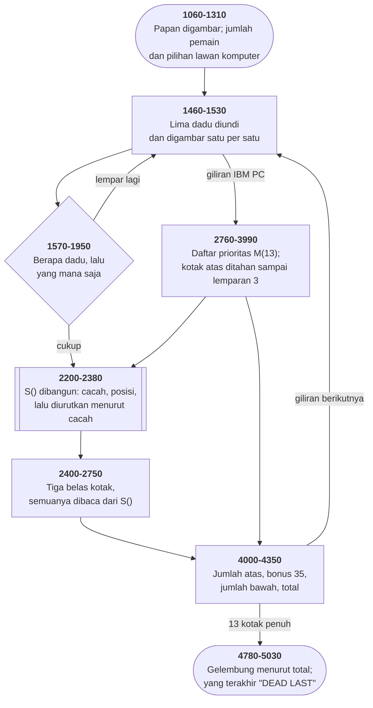

# YAHTZEE.BAS di penelusur

> Program ketujuh puluh satu. 612 baris, nomor 1000–7110, cakupan tabel
> **612/612 (100%)**.

Sumber: `run/YAHTZEE.BAS` · tabel: `tracer/program/YAHTZEE.js`

Yahtzee (CCII 1979; dipindahkan Patrick Leabo ke PC). Satu larik yang mengindeks dadu menurut banyaknya — dan empat puluh baris komentar yang menggambar larik itu.

## Empat puluh baris komentar yang menggambar sebuah larik

Di antara baris 6260 dan 6770, program ini berhenti melakukan apa pun dan mulai **menjelaskan dirinya sendiri**.

Pertama daftar semua lariknya, satu per satu, dengan arti tiap kolom dan tiap baris:

```basic
6300 REM  K(18,7)  SCOREBOARD
6310 REM           COLUMNS 1-13 BOARD NUMBER
6320 REM           COLUMN    14 BONUS UPPER
6330 REM           COLUMN    15 TOTAL UPPER
```

Lalu — dan ini bagian yang tidak ada duanya di koleksi ini — sebuah **contoh yang dikerjakan sampai selesai**, lengkap dengan diagram:

```basic
6530 REM  SAMPLE S(Y,X) FOR DICE OF 5,2,4,6,4
6550 REM  Y/X   0  1  2  3  4  5
6560 REM  0     4  6  5  2          IN QTY/VALUE SEQUENCE
6570 REM  1                         NO DIE=1
6580 REM  2     1  2                1 TWO POSITION 2
6600 REM  4     2  3  5             2 FOURS POSITIONS 3 AND 5
```

Dan tiga baris terakhir menarik panah ke bagian-bagiannya:

```basic
6640 REM  +     +  ++++++++++++++++ SECTION FOR POSITION DATA
6650 REM  +     +------------------ COLUMN INDICATES QTY
6660 REM  +------------------------ INDEX EQUATES TO DIE VALUE
```

Dengan lemparan 5,2,4,6,4: ada dua angka empat, dan sisanya satu masing-masing. Jadi `S(0,·)` berisi 4, 6, 5, 2 — empat lebih dulu karena paling banyak, lalu sisanya dari nilai tertinggi. `S(4,·)` berisi 2 (banyaknya), lalu 3 dan 5 (posisinya di antara kelima dadu).

Kenapa ini penting?

Karena tanpa penjelasan itu, baris seperti ini tidak bisa dibaca siapa pun:

```basic
2560 IF S(S(0,0),0)<>3 OR S(S(0,1),0)<>2 THEN 2740
```

Dengan penjelasan itu, ia terbaca sebagai satu kalimat: *"kalau nilai yang paling banyak muncul tidak muncul tiga kali, atau nilai kedua terbanyak tidak muncul dua kali, ini bukan full house."*

Enam puluh sembilan program lain di koleksi ini memakai larik yang sama rumitnya. Tidak satu pun menjelaskannya. Berkas ini menyediakan empat puluh baris — hampir tujuh persen dari seluruh programnya — untuk sesuatu yang tidak dijalankan mesin sama sekali.

Di mesin 64K, empat puluh baris komentar adalah ruang yang nyata. Seseorang memutuskan itu sepadan.

## Coronado, 1979 — Tucson, sekitar 1982

Empat baris komentar pertama menyimpan seluruh riwayat berkas ini:

```basic
1010 ' ORIGINAL BY JL HELMS & MF PEZOK FOR CCII
1020 ' CORONADO, CA
1030 ' ADAPTED TO IBM PC BY PATRICK LEABO
1040 ' TUCSON, AZ
```

Dan nama Patrick Leabo dari Tucson muncul lagi di koleksi ini — di [BLACKJCK.BAS](blackjck.md), baris 1010: *"ADAPTED TO PC BY PATRICK LEABO--TUCSON"*. Program itu pun karya CCII, dari Januari 1978.

Jadi paling tidak dua permainan dari klub komputer di Coronado, California, ditulis pada akhir 1970-an, dipindahkan ke IBM PC oleh orang yang sama di Arizona beberapa tahun kemudian, dan sampai ke disket yang sama.

Bekas dua zaman itu terlihat, seperti di STARTREK.BAS. Yang lama: larik terkemas, penomoran baris kelipatan sepuluh, dan blok dokumentasi empat puluh baris. Yang baru: `PLAY` dengan penyulihan variabel, `COLOR`, dan aksara kotak CP437 untuk papan nilainya.

Dan satu bekas lagi, yang paling sunyi. Baris 4680:

```basic
4680 RETURN
```

Satu kata, berdiri sendiri, tepat di depan layar yang menyebutkan J.L. Helms, M.F. Pezok, Coronado, dan tanggal 27 Juni 1979.

Layar itu masih ada di berkasnya, utuh, delapan baris. Tapi panggilan di baris 1130 mendarat di `RETURN` itu dan langsung pulang.

Empat puluh tahun kemudian, satu-satunya cara membaca nama mereka adalah membuka sumbernya — atau menelusurinya baris demi baris, seperti halaman ini.

## Peta arsitektur



## Alur yang layak diikuti

| baris | yang terjadi |
|---|---|
| `2260` | `S(nilai,0)` = **berapa dadu** yang menunjukkan nilai itu |
| `2270` | `S(nilai,1..5)` = **di posisi mana** saja dadunya |
| `2330` | urut dengan **menyapu**: cacah 5 turun ke 1, nilai 6 turun ke 1 |
| `2360` | …hasilnya `S(0,0)` = nilai yang paling banyak muncul |
| `2520` | tiga sama? cukup `S(S(0,0),0) >= 3` |
| `2560` | full house? yang terbanyak tiga **dan** yang kedua dua |
| `6530` | dan seluruhnya **digambar di komentar**, dengan contoh yang dikerjakan |
| `6800` | prioritas komputer: runtun besar, full house, Yahtzee, empat sama… |
| `2990` | …dan kotak atas **ditahan** sampai lemparan ketiga |
| `4680` | sebuah `RETURN` tunggal **mematikan layar nama penulis aslinya** |
| `5600` | `PLAY "N=TN(DIE);"` — variabel disulih **di dalam string musik** |

## Yang bisa dicoba di halaman

| coba ini | yang terlihat |
|---|---|
| pasang titik henti di 2260 | `S(nilai,0)` = **berapa dadu** yang menunjukkan nilai itu |
| pasang titik henti di 2270 | `S(nilai,1..5)` = **di posisi mana** saja dadunya |
| pasang titik henti di 2330 | urut dengan **menyapu**: cacah 5 turun ke 1, nilai 6 turun ke 1 |
| pasang titik henti di 2360 | …hasilnya `S(0,0)` = nilai yang paling banyak muncul |
| pasang titik henti di 2520 | tiga sama? cukup `S(S(0,0),0) >= 3` |

Aslinya dijalankan dengan `run\\YAHTZEE.bat`.

> Satu sampai lima pemain, dan bisa melawan komputer. Kotak 1-9 diketik dengan angka, kotak 10-13 dengan huruf A sampai D. Ketik "/" sebagai jumlah dadu untuk masuk ke bagian pemeriksa yang dijelaskan komentar 6710-6760.

## Penyimpangan dari aslinya

1. **`PLAY` diam.** Baris 5600 memakai `PLAY "L32T200N=TN(DIE);"` — tanda sama dengan dan titik koma di dalam string musik **menyulih isi variabel**, jadi tiap angka dadu berbunyi nada yang berbeda.
2. **`RANDOMIZE` memasang benih tetap.**
3. **`LOAD "MENU",R` diperlakukan sama seperti `RUN "MENU"`.**
4. **Semua `DATA` dimuat di awal**, seperti yang dilakukan BASIC sungguhan — itu sebabnya baris 1090 bisa membaca DATA di baris 1150 yang belum dilewatinya.
5. **Baris 4750 sudah disunting pemilik koleksi** (nomor telepon penulis aslinya di Coronado).

## Yang layak ditiru

**Satu indeks yang membuat tiga belas aturan jadi mudah.** Yahtzee punya tiga belas cara menilai lima dadu, dan hampir semuanya butuh pertanyaan "berapa banyak dadu yang sama". Program ini menjawabnya sekali, di baris 2200-2380, lalu semua aturan tinggal membacanya. `S(nilai,0)` menghitung berapa dadu yang menunjukkan nilai itu. `S(nilai,1..5)` mencatat di posisi mana saja. Dan `S(0,urutan)` menyimpan nilai-nilai itu **diurutkan dari yang paling banyak**. Sesudah itu: tiga sama jadi `S(S(0,0),0)>=3`. Full house jadi "yang terbanyak ada tiga dan yang kedua ada dua". Empat sama jadi satu perbandingan. Tiga belas aturan, satu larik.

**Mengurutkan dengan menyapu, bukan menukar.** Baris 2330-2380 tidak membandingkan apa pun. Gelung luarnya berjalan dari cacah lima turun ke satu; gelung dalamnya dari nilai enam turun ke satu. Yang cacahnya cocok dituliskan berurutan. Karena cacah dadu hanya bisa 1 sampai 5 dan nilainya 1 sampai 6, seluruh pengurutan selesai dalam tiga puluh langkah tetap — tanpa tukar, tanpa perbandingan, dan tanpa kemungkinan salah urut.

**Komputer yang menahan kotak mudah.** Baris 2990: `IF H<3 THEN 3160`. Sebelum lemparan ketiga, komputer **menolak** mengisi kotak atas — ia menyimpan gilirannya untuk mencoba kombinasi besar dulu. Dan daftar prioritasnya (baris 6800) mengejar runtun besar, full house, Yahtzee, dan empat sama sebelum menyentuh angka satu sampai enam. "Chance" — yang selalu bisa diisi — ditaruh paling akhir. Baris 4400-4430 mencoret kotak yang sudah terisi dari daftar itu, kecuali kotak Yahtzee yang memang boleh diisi berulang.

**Variabel yang disulih di dalam string musik.** `5600 PLAY "L32T200N=TN(DIE);"`. Tanda sama dengan diikuti nama variabel dan titik koma adalah sintaks GW-BASIC untuk **menyisipkan nilai variabel** ke dalam string musik yang sedang dimainkan. Enam nada disimpan di `TN(6)` dari DATA baris 1150, dan tiap dadu berbunyi menurut angkanya. Pemainnya bisa mendengar lemparannya sebelum melihatnya.

**Satu perkalian yang berarti "giliran komputer".** `IF A*CC=N THEN` muncul tiga kali. `CC` bernilai satu kalau komputer ikut bermain, dan komputer selalu pemain terakhir — jadi `A*CC=N` hanya benar kalau sekarang gilirannya. Dan kalau komputer tidak ikut, `CC=0` membuat ruas kiri selalu nol, yang tidak akan pernah sama dengan jumlah pemain. Satu ungkapan yang mengurus keberadaan **dan** giliran sekaligus.

## Yang jangan ditiru

**RETURN yang mematikan nama penulis aslinya.** Baris 1130 memanggil `GOSUB 4680`. Dan baris 4680 berbunyi: `RETURN`. Tepat di bawahnya, baris 4690 sampai 4770, ada layar sambutan yang lengkap: *"YATZEE.BAS VER 3.2 / 27 JUN 79 / DEVELOPED BY J.L. HELMS & M.F. PEZOK / CORONADO, CA."* Layar itu **tidak pernah tampil**. Terukur di penelusur: baris 4680 memang dijalankan, dan dari sembilan baris 4690–4770 **tidak satu pun** pernah tersentuh sepanjang permainan. Yang membacanya cuma orang yang membuka sumbernya. Kita tidak tahu kenapa — mungkin disengaja, mungkin sisa penyuntingan. Yang bisa dikatakan dari kodenya: nama pemindahnya ada di komentar baris 1030 dan tidak pernah tampil juga, sementara nama penulis aslinya ada di kode yang dimatikan. Keduanya sama-sama tidak terlihat pemainnya. Dan salah ketik di baris 4730 — `LOCATE,16,13`, dengan koma yang mengosongkan argumen pertama — membuktikan barisnya memang tidak pernah dijalankan siapa pun.

**AND yang bekerja karena kebetulan.** Baris 2630: `IF S(1,0)AND S(2,0)AND S(3,0)AND S(4,0)AND S(5,0)= 1 THEN`. Di BASIC, `AND` adalah operasi **bit**, dan `=` mengikat lebih kuat. Jadi yang dihitung: cacah dadu 1 sampai 4 di-AND-kan sebagai bilangan, lalu hasilnya di-AND dengan −1 atau 0 dari perbandingan `S(5,0)=1`. Hasilnya **kebetulan benar**: untuk lima dadu, satu-satunya cara keempat cacah itu bukan nol sambil cacah kelima tepat satu adalah runtun 1-2-3-4-5. Tapi alasannya sama sekali tidak terbaca dari barisnya, dan menambah satu dadu akan meruntuhkannya. Bandingkan dengan baris 2580 di atasnya, yang menguji hal serupa dengan `>0` di tiap suku — jelas, dan tidak bergantung pada apa pun.

**Petunjuk yang menjanjikan lebih dari kodenya.** Baris 4500: *"FROM 1 TO 7 PLAYERS MAY PLAY AT THE SAME TIME"*. Baris 1210: `IF N<1 OR N>5 THEN 1180`. **Lima**, bukan tujuh. Baris 4600: *"IN ADDITION YOU WILL BE GIVEN AN EXTRA TURN AT THE END OF THE GAME"* untuk Yahtzee kedua. Tidak ada satu baris pun di berkas ini yang menambah giliran — yang ada cuma tambahan 100 angka di baris 2690. Lariknya memang di-DIM untuk tujuh (`K(18,7)`, `A$(7)`), jadi janjinya bukan mengada-ada. Sesuatu dikurangi, dan petunjuknya tidak ikut diperbarui.

**Tanda banding yang ditulis terbalik.** Baris 5480: `IF X= > N THEN A= 0`. Yang benar `>=`. Persis kesalahan yang sama dengan ATTACK.BAS baris 1514 — dan GW-BASIC menerima keduanya tanpa bersuara.

**Plus yang tidak menambah apa-apa, di dua program sekaligus.** Baris 7100: `WHILE+ KB$=""`. Tanda tambah nyasar yang sama persis muncul di CRAZY8.BAS baris 1570, 2570, dan 2900 — program yang penulisnya lain sama sekali. Dua berkas, dua penulis, satu kebiasaan mengetik yang sama. Kemungkinan besar keduanya pernah lewat di alat yang sama, atau menyalin pola itu dari sumber yang sama.

**Baris DATA di tengah jalur utama.** Baris 1150 — `DATA 49,51,53,54,56,61` — duduk di antara `GOSUB 4450` dan `GOSUB 6820`, di tengah alur yang berjalan. Tidak ada yang rusak, karena BASIC melewati baris DATA saat menjalankan. Tapi siapa pun yang membaca alurnya harus tahu itu lebih dulu, dan tidak ada `REM` yang menyebutkannya.

---
[Rancangan penelusur](_rancangan.md) · [BLACKJCK](blackjck.md) · [BATSHIP](batship.md) · [CRAZY8](crazy8.md)
