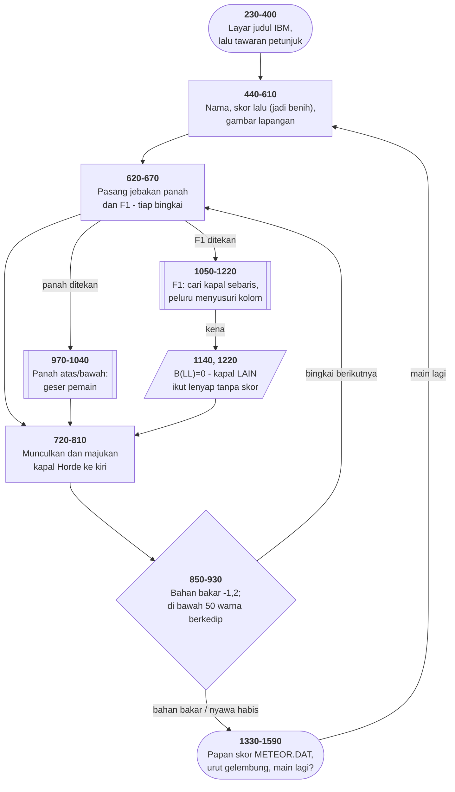

# ZAP'EM.BAS di penelusur

> Program kelima puluh satu. 137 baris, nomor 230–1590, cakupan tabel
> **137/137 (100%)**.

Sumber: `run/ZAP'EM.BAS` · tabel: `tracer/program/ZAP'EM.js`

Februari 1982. Penembak sisi: pemain adalah panah kiri `←` (CHR$(27)) di kolom
2, kapal Horde datang dari kanan, F1 menembak, panah atas/bawah bergerak.

**Dan petunjuknya menjelaskan sebuah cacat sebagai fitur.**

## Cacat yang naik pangkat jadi fitur

```basic
1280 PRINT"  The Horde ships are unpredictable.    Some are Ghost ships. These
     will take   more than one hit or will vanish upon   being hit without a
     score increment."
```

Terdengar seperti rancangan: kapal hantu, sulit ditebak, sebagian tahan
tembakan. Baris 1140 mengatakan yang sebenarnya:

```basic
1140 IF LL=B(Z) THEN … A(Z)=0:B(LL)=0:SCORE=SCORE+100:GOTO 680
```

`Z` adalah **nomor kapal** yang kena. `LL` adalah **kolom** tempat peluru
bertemu kapal itu — angka antara 3 dan 24. Keduanya sama sekali tidak
berhubungan.

`A(Z)=0` benar: kapal yang kena dimatikan. Tapi `B(LL)=0` mengosongkan kolom
milik kapal bernomor `LL`. Karena slot kapalnya 1 sampai 6, tembakan yang kena
di kolom 3, 4, 5, atau 6 akan **ikut menghapus kapal bernomor itu** —
diam-diam, tanpa skor, tanpa ledakan.

Itu persis *"vanish upon being hit without a score increment"*. Yang seharusnya
ditulis `B(Z)=0`.

Terverifikasi di penelusur — tembakan mengenai kapal #2 di kolom 8:

```
KENA: kolom LL=8   kapal Z=2
sebelum   1:7/4   2:9/8   3:20/24  4:8/6  5:6/3  6:0/0
sesudah   1:7/4   2:0/8   3:20/24  4:8/5  5:6/2  6:0/0
skor -900 -> -800
```

`A(2)` jadi 0 dan skor naik 100 — benar. `B(8)` juga ditulis nol; kebetulan
slot 8 tidak dipakai kapal mana pun, jadi kali ini tidak ada korban. *Akibat
untuk `LL` antara 3 dan 6 dibaca dari kodenya, bukan direproduksi di layar.*

Yang tidak bisa dipastikan: apakah penulisnya tahu. Dua kemungkinan sama masuk
akalnya — ia menemukan gejalanya, tidak menemukan sebabnya, dan menuliskannya
sebagai cerita; atau ia memang merancangnya dan kebetulan menulis indeks yang
salah.

Yang bisa dipastikan: **sekali sebuah cacat masuk ke dokumentasi, ia berhenti
jadi cacat.** Tidak ada lagi yang akan melaporkannya, karena perilakunya sudah
tertulis. Dan tidak ada lagi yang akan memperbaikinya, karena memperbaikinya
berarti melanggar dokumentasi.

## Benih yang diminta dari pemain

```basic
460 INPUT "AH....YOUR NAME PLEASE ";NME$:LOCATE 15,1:INPUT "YOUR LAST SCORE ";R
550 RANDOMIZE R
```

Pertanyaan kedua terdengar seperti basa-basi papan skor. Ternyata bukan: angka
itu jadi **benih pengacak**. Seluruh pola serangan — di baris mana kapal
muncul, dari kolom berapa, kapan berikutnya datang — ditentukan olehnya.

Akibatnya dua, dan keduanya menarik:

- **Main bagus berarti lapangan berikutnya berbeda.** Skor tinggi, benih
  tinggi, pola lain.
- **Dua orang yang mengetik angka yang sama mendapat lapangan yang sama
  persis.** Angka itu, tanpa disebut begitu, adalah *kode lapangan* — hal yang
  baru punya nama dua puluh tahun kemudian, waktu pemain Minecraft mulai
  bertukar *seed*.

Dan satu akibat yang mungkin tidak disengaja: mengetik **0** tiap kali membuat
setiap permainan identik.

## Slot kapal, bukan daftar kapal

Tidak ada daftar yang tumbuh dan menyusut. Yang ada dua larik, dan sebuah slot
dianggap **kosong** kalau `A()` atau `B()`-nya nol:

```basic
730 IF B(RR)=0 THEN A(RR)=INT(RND(3)*16)+5:B(RR)=INT(RND(4)*7)+30
750 IF A(F)=0 OR B(F)=0 THEN 810
```

Pola *object pool*, sebelum ada namanya.

Tapi ada yang tidak cocok. Baris 720 memakai `INT(RND*10)` — slot **0 sampai
9**. Baris 900 memakai `INT(RND*T1)` — slot 0 sampai 5. Gelung penggeraknya di
baris 740 cuma menjalani **1 sampai 6**.

Kapal yang mendarat di slot 0, 7, 8, atau 9 tidak pernah bergerak, tidak pernah
digambar, dan tidak pernah bisa ditembak — sekaligus **menutup slotnya
selamanya**, karena baris 730 cuma mengisi slot yang `B()`-nya nol.

**Empat dari sepuluh slot bisa mati tanpa gejala apa pun.**

## Peringatan lewat atribut layar

```basic
860 IF FUEL<50 THEN V=31
880 COLOR V
```

Nilai 31 adalah 15 (putih terang) ditambah bit kedip. Pesawat pemain mulai
**berkedip** saat bahan bakar menipis — tanpa satu kata pun, tanpa memakan
ruang layar.

## Papan skor bernama permainan lain

```basic
1390 OPEN "METEOR.DAT" FOR INPUT AS #1
```

[METEOR.BAS](meteor.md) ada di koleksi yang sama, dan tidak punya papan skor
sama sekali. Nama itu sisa salin-tempel — dan kalau suatu hari METEOR diberi
papan skor, keduanya akan berebut berkas yang sama.

Terverifikasi berjalan di disket dalam memori penelusur:

```
METEOR.DAT empat nilai pertama: ORDMAN / 4200 / SCHLICH / 3800
```

## Peta arsitektur



## Yang bisa dicoba di halaman

| coba ini | yang terlihat |
|---|---|
| pasang titik henti di 1140 | `LL` (kolom) dan `Z` (nomor kapal) — dua hal berbeda |
| pasang titik henti di 730 | slot kapal kosong yang baru diisi |
| pasang titik henti di 860 | `V` berubah jadi 31 saat bahan bakar < 50 |
| isi "YOUR LAST SCORE" dengan angka sama | pola serangan yang sama persis |
| jalankan tanpa menembak | terverifikasi: bahan bakar habis, skor −2550 |

## Penyimpangan dari aslinya

1. **`WIDTH 40` tidak ditiru**; konsol tetap 80 kolom.
2. **`SOUND` dan `BEEP` diam.**
3. **Gelung tunda habis seketika** — pakai penggeser laju.
4. **`RANDOMIZE R` memasang benih tetap.**
5. **Berkas `METEOR.DAT` disimpan di disket dalam memori penelusur**, dan
   diisi sepuluh baris awal supaya `OPEN … FOR INPUT` tidak langsung gagal. Di
   disket aslinya berkas itu memang sudah ada. Isinya bertahan melewati "main
   lagi", dan hilang begitu halaman disegarkan.
6. **Warna 31 tidak berkedip.**

## Yang jangan ditiru

- **Salah indeks yang jadi bagian dari cerita.** `B(LL)` di baris 1140.
- **`RND` dengan argumen yang dikira berarti.** `RND(2)`, `RND(3)`, `RND(4)` —
  di GW-BASIC argumennya diabaikan selama positif; ketiganya aliran yang sama.
- **Empat slot yang tidak pernah terlihat.** Slot 0, 7, 8, 9.
- **Dua variabel mati dalam satu baris.** Baris 820 `Y=Y+M`: `M` tidak pernah
  diberi nilai, `Y` tidak pernah dibaca.
- **Syarat yang tidak pernah benar.** Baris 700 menguji `FUEL=0`; bahan bakar
  berkurang 1,2 tiap bingkai dan melewati nol tanpa menyentuhnya.
- **Berkas skor bernama permainan lain.**
- **Skor pemain selalu ditaruh di slot kesepuluh**, yang tidak pernah
  ditampilkan (baris 1530 cuma menampilkan sembilan).

---
[Rancangan penelusur](_rancangan.md) · [KENO](keno.md) · [METEOR](meteor.md) · [SERPENT](serpent.md) · [BOWLING](bowling.md)
