# Rencana porting: 83 program BASIC → aplikasi web offline

Dokumen ini disusun **sebelum** pekerjaan dimulai, untuk disepakati lebih dulu.
Isinya: apa yang akan dibuat, urutannya, di titik mana saya berhenti untuk minta
review Anda, dan di titik mana saya jalan terus tanpa berhenti.

---

## 1 · Jawaban pertanyaan Anda soal SVG

**Bukan hanya bentuk primitif.** Yang bisa saya tulis tangan:

| Kemampuan | Contoh pemakaian di proyek ini |
|---|---|
| `<path>` dengan kurva Bézier & busur | simbol sekop/hati/keriting/wajik, badan pesawat, kurva grafik |
| Gradien linear & radial | logam, nyala roket, kilap kartu, kedalaman papan |
| Filter (`feGaussianBlur`, `feDropShadow`, `feTurbulence`, `feDisplacementMap`) | cahaya mesin, bayangan kartu, tekstur api yang tidak rata |
| `pattern`, `mask`, `clipPath` | guilloche di kartu, garis pindai CRT, potongan layar |
| `<use>` + `<symbol>` | satu definisi kartu dipakai 52 kali |
| Animasi CSS/SMIL + manipulasi lewat JS | kartu dibalik, bidak Othello berputar, hangman bertambah |
| Proyeksi isometrik manual | dadu 3D, papan miring |

**Batasnya jujur:** semua koordinat saya tulis manual, jadi saya kuat di bentuk
**geometris, ikonografis, dan terstruktur** — kartu, dadu, papan, pesawat, mesin,
panel, grafik, karakter bergaya. Saya **tidak** realistis untuk ilustrasi organik
fotorealistis (wajah manusia mendetail, tekstur alam, lanskap). Untuk 83 program
di koleksi ini, seluruh kebutuhannya masuk kategori pertama.

**Silakan nilai sendiri:** buka [`svg-demo.html`](svg-demo.html) di peramban.
Berisi kartu remi lengkap, dadu isometrik, modul pendarat bulan dengan nyala
roket, pesawat X-wing, panel CRT, hangman interaktif, papan Othello yang digambar
JS dari array, dan grafik data. Semuanya offline, tanpa pustaka.

---

## 2 · Kendala teknis "harus jalan offline"

Ini menentukan bentuk kodenya, jadi saya tetapkan di muka:

| Kendala | Akibat pada rancangan |
|---|---|
| Dibuka lewat `file://` | **ES module dilarang** (`type="module"` kena CORS). Semua JS pakai `<script>` klasik. |
| `fetch()` diblokir di `file://` | Tidak ada JSON eksternal. Data ditaruh sebagai berkas `.js` yang menetapkan variabel global. |
| Tanpa CDN, tanpa font eksternal | Font pakai *system stack*. Semua ikon SVG inline. Nol dependensi. |
| Web Audio butuh gestur pengguna | Tiap permainan bersuara punya layar "klik untuk mulai". |
| `localStorage` di `file://` | Jalan di Chrome/Edge/Firefox, tapi **semua berkas lokal berbagi satu origin**. Skor disimpan dengan awalan kunci per permainan, plus jalur cadangan kalau diblokir. |
| Tidak ada bundler | Kode ditulis agar terbaca apa adanya — yang justru bagus untuk bahan belajar. |

Konsekuensi baiknya: hasilnya bisa disalin ke flashdisk dan langsung jalan
di komputer mana pun, tanpa Node, tanpa server, tanpa pemasangan.

---

## 3 · Konsolidasi: 83 berkas → 67 halaman

Tidak semua `.BAS` layak jadi aplikasi terpisah. Ini pemetaannya:

| Berkas asli | Perlakuan | Alasan |
|---|---|---|
| `MENU.BAS`, `MENU2.BAS` | → **shell/peluncur situs** | Fungsinya memang menu; jadi halaman induk. |
| `HINTS.BAS` | → menyatu ke shell | Layar bantuan bersama. |
| `BUSONE`…`BUSTEN` (10) | → **1 aplikasi** tutorial 10 bagian | Dipecah dulu karena memori 64 KB. Kendala itu sudah tidak ada. |
| `WORDS.BAS` | → menyatu ke `READING` | Berkas data, bukan program. |
| `WRTSTR.BAS` | → menyatu ke `ELIZA` | Generator berkas aturan. |
| `TEM-INS.BAS` | → bantuan dalam aplikasi `TEMPLE` | Manual permainan. |
| `MUSIC1.BAS` | → dilewati | Duplikat `MUSIC.BAS`. |
| `WHATMONF.BAS` | → **dokumen saja**, tanpa aplikasi | Deteksi kartu video; tak ada padanannya di web. Tetap ditulis sebagai bahan pelajaran (termasuk bahwa kodenya keliru). |

**Hasil: 66 aplikasi + 1 shell = 67 halaman**, plus ~69 dokumen pembelajaran.

---

## 4 · Struktur berkas

```
web/
├─ index.html                shell / peluncur (pengganti MENU + MENU2)
├─ PLAN.md                   dokumen ini
├─ svg-demo.html             demo kemampuan SVG
│
├─ _shared/
│   ├─ tokens.css            warna, tipografi, spasi, radius (mode gelap/terang)
│   ├─ base.css              reset + komponen (panel, tombol, dialog, papan skor)
│   ├─ audio.js              padanan PLAY/SOUND di atas Web Audio
│   ├─ input.js              papan ketik + sentuh; padanan INKEY$ yang modern
│   ├─ rng.js                PRNG berbenih — bisa diulang, bisa diuji
│   ├─ store.js              localStorage + cadangan in-memory
│   ├─ loop.js               game loop fixed-timestep di atas requestAnimationFrame
│   ├─ ui.js                 dialog, toast, overlay "klik untuk mulai"
│   └─ svg.js                simbol bersama: kartu, dadu, ikon, bidak
│
├─ games/
│   └─ <nama>/
│       ├─ index.html        halaman (markup + <script src>)
│       ├─ <nama>.js         logika, terpisah dari tampilan
│       └─ <nama>.css        gaya khusus, kalau perlu
│
└─ docs/
    └─ <nama>.md             dokumen arsitektur & code review porting
```

Aturan yang saya pegang di setiap port:

1. **Logika terpisah dari tampilan.** Keadaan permainan adalah objek/array biasa;
   penggambaran adalah fungsi murni dari keadaan itu. Ini persis pelajaran yang
   gagal dipegang `BOWLING.BAS` (yang menjadikan layar sebagai sumber kebenaran).
2. **Tanpa variabel global**, kecuali satu namespace per permainan.
3. **Nama bermakna.** `C(24)` di TICTAC jadi `WINNING_LINES`.
4. **Aturan permainan dipertahankan persis.** Kalau ada bug di aslinya, saya
   perbaiki *dan* catat di dokumen — perbandingannya justru bahan belajar.
5. **Bisa diakses**: kontras cukup, bisa dioperasikan papan ketik, ada label ARIA.

---

## 5 · Isi dokumen pembelajaran per port

Tiap aplikasi dapat satu `docs/<nama>.md` dengan bagian tetap:

1. **Ringkasan** — program apa, dari disket mana, tahun berapa.
2. **Arsitektur asli** — ringkas, menautkan ke analisis yang sudah ada di
   `../reviews/<NAMA>.md` (call graph, tabel dispatch, dsb).
3. **Dari retro ke modern** — bagian wajib, lihat 5.1 di bawah.
4. **Peta translasi** — tabel spesifik program ini:

   | Pola di BASIC | Padanan modern | Kenapa berubah |
   |---|---|---|
   | `ON CHANCE GOTO 760,770,…` | array fungsi `PARTS[]` | sama-sama tabel; sekarang bisa diberi nama |
   | `GOSUB 280` (tunggu tombol) | `await nextKey()` | asinkron, tidak memblokir |
   | `POKE 106,0` | `input.flush()` | maksudnya jelas, tidak bergantung interpreter |

5. **Arsitektur baru** — diagram Mermaid modul & aliran keadaan.
6. **Cuplikan sebelum/sesudah** — potongan BASIC asli berdampingan dengan
   penggantinya.
7. **Latihan** — 2–3 tugas untuk pembaca.

### 5.1 · Bagian wajib: "Dari retro ke modern"

Setiap kali saya menyimpang dari bentuk aslinya, dokumen **harus** menjawab tiga
pertanyaan dalam satu tabel. Ini permintaan eksplisit Anda, dan sekaligus bagian
pelajaran yang paling berharga — karena hampir setiap keanehan di kode 1982
lahir dari sebuah **kendala**, dan memahami kendala itu lebih berguna daripada
sekadar tahu bentuk barunya.

| Aspek | Bentuk asli | Kenapa dulu begitu (kendala yang melahirkannya) | Bentuk sekarang & kenapa boleh berubah |
|---|---|---|---|
| Menunggu tombol | `280 Z=INKEY$:IF Z="" THEN 280` | Tidak ada konsep asinkron. Satu-satunya cara menunggu adalah memutar CPU. | `await input.nextKey()` — peramban punya event loop; menunggu tidak lagi berarti membakar CPU. |
| Kecepatan permainan | `FOR I=1 TO 2000:NEXT` | Tidak ada jam beresolusi tinggi. Waktu diukur dengan menghitung pekerjaan. | `requestAnimationFrame` + *fixed timestep* — sekarang ada jam sungguhan, jadi kecepatan tidak lagi bergantung pada kecepatan mesin. |
| Papan skor | `OPEN "O",1,"BS.SCO"` | Satu-satunya penyimpanan adalah disket. | `localStorage` — sama-sama bertahan antar sesi, tanpa disket. |
| Grafik | `PRINT CHR$(219)` di grid 80×25 | Mode grafis CGA lambat dan boros memori; karakter jauh lebih murah. | SVG — resolusi bebas, bisa dianimasikan, dan tetap ringan. Kendala memori sudah tidak ada. |

Aturan yang saya pegang: **tidak ada perubahan tanpa alasan tertulis.** Kalau
saya mengubah sesuatu hanya karena "lebih bagus", itu juga harus dinyatakan
sebagai keputusan selera, bukan disamarkan sebagai keharusan teknis.

Ada juga hal-hal yang **sengaja tidak saya ubah** meski bisa — misalnya
struktur tabel dispatch, karena justru itu yang mau ditunjukkan. Yang begini pun
dicatat, dengan alasannya.

Bagian 3, 4, dan 6 itulah nilai belajarnya: **melihat pola 1982 berubah jadi pola
sekarang, berdampingan, lengkap dengan alasannya.**

---

## 6 · Urutan pengerjaan

```mermaid
flowchart TD
    F["Fase 0 · Fondasi<br/>_shared + shell + 2 pilot"] --> G1{{"GERBANG 1<br/>review Anda"}}
    G1 --> P1["Fase 1 · Quick win<br/>musik 4 + puzzle 4"]
    P1 --> G2{{"GERBANG 2<br/>review ringan"}}
    G2 --> P2["Fase 2 · Papan & puzzle<br/>7 program"]
    P2 --> P3A["Fase 3a · pilot kartu<br/>SOLITAIR"]
    P3A --> G3{{"GERBANG 3<br/>komponen kartu"}}
    G3 --> P3B["Fase 3b · kartu & dadu<br/>11 program"]
    P3B --> P4["Fase 4 · matematika & alat<br/>7 program"]
    P4 --> P5A["Fase 5a · pilot edukasi<br/>ANATOMY"]
    P5A --> G4{{"GERBANG 4<br/>pola presentasi"}}
    G4 --> P5B["Fase 5b · edukasi & bisnis<br/>7 program"]
    P5B --> P6A["Fase 6a · pilot arkade<br/>BREAKOUT"]
    P6A --> G5{{"GERBANG 5<br/>game loop & rasa main"}}
    G5 --> P6B["Fase 6b · arkade<br/>10 program"]
    P6B --> P7["Fase 7 · simulasi<br/>7 program"]
    P7 --> P8A["Fase 8a · pilot raksasa<br/>ELIZA"]
    P8A --> G6{{"GERBANG 6<br/>pendekatan program besar"}}
    G6 --> P8B["Fase 8b · raksasa<br/>STARTREK, WIZARD, TEMPLE, XWING"]
    P8B --> P9["Fase 9 · shell final,<br/>indeks, silang-rujuk"]
    style G1 fill:#ffe9c7,stroke:#c98a1a
    style G2 fill:#ffe9c7,stroke:#c98a1a
    style G3 fill:#ffe9c7,stroke:#c98a1a
    style G4 fill:#ffe9c7,stroke:#c98a1a
    style G5 fill:#ffe9c7,stroke:#c98a1a
    style G6 fill:#ffe9c7,stroke:#c98a1a
```



Enam gerbang saja. Sisanya jalan terus.

### Fase 0a · Fondasi saja — **butuh review** ← *sedang dikerjakan*

| Keluaran | Isi |
|---|---|
| `_shared/tokens.css` | warna, tipografi, spasi, radius — mode gelap & terang |
| `_shared/base.css` | reset + komponen: panel, tombol, dialog, papan skor, HUD |
| `_shared/rng.js` | PRNG berbenih, bisa diulang persis |
| `_shared/store.js` | localStorage + cadangan bila diblokir |
| `_shared/input.js` | papan ketik & sentuh; padanan `INKEY$` yang asinkron |
| `_shared/audio.js` | penafsir makro `PLAY` + `SOUND` di atas Web Audio |
| `_shared/loop.js` | game loop *fixed timestep* |
| `_shared/ui.js` | dialog, toast, overlay "klik untuk mulai" |
| `_shared/svg.js` | simbol bersama: kartu, dadu, ikon, bidak |
| `_shared/catalog.js` | data 83 program (dibangkitkan dari katalog yang sudah ada) |
| `index.html` | shell/peluncur, menggantikan MENU + MENU2 + HINTS |
| `docs/_fondasi.md` | **seluruh keputusan "dari retro ke modern" tingkat koleksi** |

**Kenapa berhenti di sini:** semua yang Anda setujui di gerbang ini akan diulang
66 kali. Salah arah di sini mahal sekali.

### Fase 0b · Dua pilot — **butuh review**

| Keluaran | Kenapa dipilih |
|---|---|
| Pilot A: **HANGMAN** | terbaik untuk memamerkan SVG progresif + tabel dispatch |
| Pilot B: **15PUZZLE** | terbaik untuk memamerkan animasi CSS + logika papan |

Dua kasus yang cukup berbeda untuk menguji apakah fondasinya benar-benar
memadai, sebelum dipakai 64 kali lagi.

### Fase 1 · Quick win — 8 program, **review ringan di akhir**

Dipilih karena kecil, cepat selesai, dan hasilnya langsung enak dilihat.

| Kelompok | Program |
|---|---|
| Musik (jadi satu "lab musik" 4 tab) | `GERMFOLK`, `OCTAVE`, `DREAM`, `NOTETABL` |
| Puzzle kecil | `TICTAC`, `TOWERS`, `MASTER`, `LIFE2` |

`LIFE2` masuk di sini karena visualnya paling memuaskan per baris kode, dan
dokumennya bisa menjelaskan *double buffering* dengan diagram.

### Fase 2 · Papan & puzzle — 7 program, **jalan terus**

`PEGLEAP`, `HIQUE2`, `OTHELLO`, `MAZE`, `MAXIT1`, `BOGGY`, `BOWLING`

Semuanya sudah tercakup pola dari Fase 0–1.

### Fase 3 · Kartu & dadu — 12 program, **satu gerbang di awal**

- **3a (gerbang):** `SOLITAIR` — paling menuntut; sekaligus menetapkan komponen
  kartu bersama (bentuk, animasi balik, tumpukan, seret-lepas).
- **3b (jalan terus):** `21`, `BJ`, `BLACK`, `BLACKJCK`, `CRAZY8`, `KENO`,
  `YAHTZEE`, `CRAPS`, `DOMINOES`, `MATCH`, `BACKGAM`

Empat program blackjack sengaja dipertahankan keempatnya — dokumennya
membandingkan empat rancangan untuk permainan yang sama.

### Fase 4 · Matematika & alat — 7 program, **jalan terus**

`CURVE`, `INTEGRAT`, `SIMEQN`, `MORTGAGE`, `PIECHART`, `SPACE`, `MUSIC`

Kelompok paling mudah: input → hitung → gambar. Semua pakai komponen grafik yang
sama. `INTEGRAT` jadi menarik karena "callback berupa rentang nomor baris"
berubah jadi editor rumus sungguhan.

### Fase 5 · Edukasi & bisnis — 8 program, **satu gerbang di awal**

- **5a (gerbang):** `ANATOMY` — menetapkan pola "pembaca berhalaman".
- **5b (jalan terus):** `HISTORY`, `INTRO`, `HEAREYE`, `BIO`, `READING`(+`WORDS`),
  `CHECK`, `BUS` (10 bagian jadi 1)

### Fase 6 · Arkade — 11 program, **satu gerbang di awal**

- **6a (gerbang):** `BREAKOUT` — menetapkan game loop, tuning kecepatan, dan
  cara menangani fakta bahwa kecepatan asli ditentukan oleh CPU 4,77 MHz.
- **6b (jalan terus):** `METEOR`, `FLYS`, `ATTACK`, `SERPENT`, `ZAP'EM`, `ABM2A`,
  `LANDER`, `SUB`, `BATSHIP`, `TRUCKER`

Ini kelompok paling berisiko soal "rasa main". Karena itu gerbangnya di awal.

### Fase 7 · Simulasi & strategi — 7 program, **jalan terus**

`WILDCAT`, `GOLF`, `FOOTBALL`, `STATS`, `DROIDS`, `DRAW`, `HINTS`→shell

`DRAW` diperlakukan khusus: berkas `DRAW.EXE` yang dibutuhkannya tidak ada di
koleksi, jadi ia dibangun ulang sebagai aplikasi menggambar sungguhan dengan
kanvas — dan dokumennya menjelaskan apa yang hilang.

### Fase 8 · Raksasa — 5 program, **satu gerbang di awal**

- **8a (gerbang):** `ELIZA` — 82 subrutin, 47 tabel dispatch, aturan di berkas
  data. Menetapkan pola untuk program berbasis data besar.
- **8b (jalan terus):** `STARTREK`, `WIZARD`, `TEMPLE`(+`TEM-INS`), `XWING`

`WIZARD` dan `TEMPLE` berbagi struktur data yang sama persis, jadi dikerjakan
berurutan agar bisa berbagi kode — dan dokumennya bisa menunjukkan silsilahnya.

### Fase 9 · Penutup — **butuh review akhir**

Shell final, halaman indeks yang bisa dicari dan disaring, silang-rujuk antara
tiap aplikasi ↔ dokumen porting ↔ analisis BASIC asli di `../reviews/`, dokumen
`WHATMONF`, dan pemeriksaan menyeluruh bahwa semua jalan dari `file://`.

---

## 7 · Ringkasan gerbang review

| Gerbang | Setelah | Yang saya minta Anda nilai | Perkiraan keluaran |
|---|---|---|---|
| **1** | Fase 0 | arah visual, gaya kode, format dokumen | 2 aplikasi + fondasi |
| **2** | Fase 1 | apakah quick win sudah sesuai selera | 8 aplikasi |
| **3** | Fase 3a | komponen kartu (dipakai 12 program) | 1 aplikasi |
| **4** | Fase 5a | pola pembaca berhalaman | 1 aplikasi |
| **5** | Fase 6a | rasa main & tuning kecepatan | 1 aplikasi |
| **6** | Fase 8a | pendekatan program besar berbasis data | 1 aplikasi |
| **akhir** | Fase 9 | keseluruhan | seluruh situs |

Di luar tujuh titik itu, saya **jalan terus** dan melapor per kelompok selesai.

---

## 8 · Ritme: mana yang sekaligus, mana satu per satu

Tiga kategori. Yang menentukan bukan panjang berkasnya, melainkan **berapa
banyak keputusan baru** yang harus diambil.

### A · Quick win — dikerjakan **berkelompok, sekaligus, tanpa berhenti**

Ciri: pola sudah ada dari fase sebelumnya, tidak ada komponen baru yang perlu
dirancang, dan hasilnya langsung kelihatan.

| Kelompok | Program | Jumlah |
|---|---|--:|
| Musik | `GERMFOLK` `OCTAVE` `DREAM` `NOTETABL` | 4 halaman, 1 tata letak |
| Puzkecil | `TICTAC` `TOWERS` `MASTER` `LIFE2` | 4 |
| Papan lanjutan | `PEGLEAP` `HIQUE2` `OTHELLO` `MAZE` `MAXIT1` `BOGGY` `BOWLING` | 7 |
| Matematika & alat | `CURVE` `INTEGRAT` `SIMEQN` `MORTGAGE` `PIECHART` `SPACE` `MUSIC` | 7 |
| Edukasi lanjutan | `HISTORY` `INTRO` `HEAREYE` `BIO` `READING` `CHECK` `BUSONE` | 7 |

**Kenapa bisa sekaligus:** kelima kelompok ini masing-masing memakai satu pola
yang sudah disetujui. Program matematika semuanya berbentuk *input → hitung →
gambar* dan berbagi komponen grafik yang sama. Program edukasi semuanya memakai
mesin "pembaca berhalaman" yang sama.

### B · Berkelompok tapi **butuh satu pilot dulu**

Ciri: kelompoknya seragam, tapi anggota pertamanya harus menetapkan komponen
bersama yang akan dipakai belasan kali.

| Pilot (sendirian, berhenti untuk review) | Lalu sekaligus | Jumlah |
|---|---|--:|
| `SOLITAIR` — menetapkan komponen kartu | `21` `BJ` `BLACK` `BLACKJCK` `CRAZY8` `KENO` `YAHTZEE` `CRAPS` `DOMINOES` `MATCH` `BACKGAM` | 1 + 11 |
| `ANATOMY` — menetapkan pembaca berhalaman | rombongannya sudah masuk kategori A di atas | 1 |
| `BREAKOUT` — menetapkan game loop & rasa main | `METEOR` `FLYS` `ATTACK` `SERPENT` `ZAP'EM` `ABM2A` `LANDER` `SUB` `BATSHIP` `TRUCKER` | 1 + 10 |
| `ELIZA` — menetapkan pola berbasis data besar | tidak ada; empat raksasa sesudahnya masuk kategori C | 1 |

**Kenapa pilotnya sendirian:** komponen kartu akan dipakai 12 program. Kalau
rancangannya salah dan baru ketahuan setelah 12 program jadi, semuanya harus
diulang. Satu program dulu jauh lebih murah.

### C · Satu per satu — **tidak bisa diborong**

Ciri: masing-masing punya persoalan sendiri yang tidak dibagi dengan yang lain.

| Program | Baris | Kenapa sendirian |
|---|--:|---|
| `HANGMAN` | 217 | pilot pertama; menetapkan seluruh gaya |
| `15PUZZLE` | 117 | pilot kedua; menguji fondasi dari sudut berbeda |
| `WIZARD` | 944 | RPG penuh, 18 tabel dispatch, peta 8×8×8 |
| `TEMPLE` | 1187 | terbesar; 20 tabel dispatch, 255 `GOTO` |
| `XWING` | 732 | arkade berbasis kejadian, 6 penangan tombol |
| `STARTREK` | 508 | *fog of war*, 7 tabel dispatch, sistem kerusakan |
| `DRAW` | 287 | harus dibangun ulang: `DRAW.EXE` yang dibutuhkannya hilang |
| `WILDCAT` `GOLF` `FOOTBALL` `STATS` `DROIDS` | 183–449 | tiap simulasi punya tabel ekonomi/aturan sendiri yang tidak bisa dibagi |

`WIZARD` dan `TEMPLE` dikerjakan **berurutan langsung** meski masing-masing
sendirian, karena struktur datanya identik (`C$(34)`, `I$(34)`, `L(512)`,
`C(3,4)`) — jadi yang kedua bisa memakai ulang kode yang pertama, dan
dokumennya bisa menunjukkan silsilahnya.

### Ringkasan hitungan

| Kategori | Aplikasi | Sesi kerja |
|---|--:|--:|
| A — borongan (5 kelompok) | 29 | 10 |
| B — 4 pilot sendirian | 4 | 4 |
| B — borongan sesudah pilot (kartu 11 + arkade 10) | 21 | 5 |
| C — satu per satu | 12 | 11 |
| Fondasi + shell & penutup | (shell) | 2 |
| **Total** | **66 aplikasi + shell** | **32** |

Tiap sesi selalu menghasilkan **aplikasi + dokumennya**, tidak pernah aplikasi
saja.

---

## 8.1 · Jadwal per sesi

Ini urutan kerja yang mengikat. Kolom **Jml** adalah jumlah program BASIC yang
diselesaikan di sesi itu; kolom kumulatif menunjukkan berapa dari 66 yang sudah
jadi.

Sesi bernomor huruf (mis. **4b**) adalah putaran perbaikan atas tinjauan Anda.
Ia tidak menambah program BASIC yang selesai, jadi kolom Σ tidak bergerak —
tapi ia sering menghasilkan perubahan pada fondasi yang menguntungkan semua
sesi berikutnya.

| Sesi | Isi | Jml | Σ | Berhenti? |
|--:|---|--:|--:|---|
| **1** | **Fondasi** — `_shared/` (9 berkas), shell, `docs/_fondasi.md`, `docs/_teknik-svg.md` | — | 0 | ✅ **selesai** |
| **2** | `HANGMAN` — pilot pertama, menetapkan seluruh gaya | 1 | 1 | tinjau singkat |
| **3** | `15PUZZLE` — pilot kedua, menguji fondasi dari sudut lain | 1 | 2 | 🚪 **GERBANG 1** |
| **4** | `GERMFOLK` `OCTAVE` `DREAM` `NOTETABL` — empat halaman musik, satu tata letak bersama | 4 | 6 | tinjau singkat |
| **4b** | Putaran perbaikan atas tinjauan: overlay suara dibuang di semua aplikasi, not balok bergulir, 8 instrumen, `OCTAVE` jadi satu versi. Ditambah **`FREEPLAY`** — program baru (bukan port) yang menguji apakah fondasinya benar-benar bisa dipakai ulang | — | 6 | tinjau singkat |
| **4c** | Putaran kedua: penjadwal beruntun di `audio.js` (Berhenti benar-benar diam, instrumen bisa diganti di tengah lagu), **Jeda/Lanjut** menggantikan Berhenti-yang-menggulung-balik, bilah instrumen jadi tombol, jam yang bisa dijeda di `loop.js`, pembaca **berkas MIDI** di `midi.js` | — | 6 | — |
| **5** | `TICTAC` `TOWERS` `MASTER` `LIFE2` — **selesai** | 4 | 10 | 🚪 **GERBANG 2** |
| **6** | `PEGLEAP` `HIQUE2` `OTHELLO` `MAZE` — **selesai** | 4 | 14 | — |
| **7** | `MAXIT1` `BOGGY` `BOWLING` — **selesai** | 3 | 17 | — |
| **8** | `SOLITAIR` — pilot kartu, menetapkan `_shared/cards.js` + `cards.css` untuk 11 program berikutnya — **selesai** | 1 | 18 | 🚪 **GERBANG 3** |
| **9** | `21` `BJ` `BLACK` `BLACKJCK` — empat blackjack sekaligus, satu mesin `_shared/blackjack.js` dengan empat objek `aturan` — **selesai** | 4 | 22 | — |
| **9b** | Putaran perbaikan atas tinjauan. **(a)** Papan `PEGLEAP` dipusatkan — berhenti menggambar dua kolom pagar yang tak terlihat. **(b)** Letak panel **Cara bermain** jadi aturan fondasi: selalu `.screen → .ruleset → .howto → .hud` di kolom permainan, tidak pernah di kolom kanan. Diterapkan ke sembilan halaman; `PEGLEAP` dan `LIFE2` sebelumnya tidak punya panelnya sama sekali. **(c)** `LIFE2` dibuka dengan "Ini bukan permainan" — kategorinya tidak pernah dinyatakan. **(d)** Penunjuk bidik `BOWLING` jadi pelempar berwarna yang melangkah, menggantikan segitiga amber. **(e)** Panel ditambahkan ke `MASTER`, `HIQUE2`, `BOWLING` — dua yang pertama mengembalikan layar petunjuk yang ada di aslinya dan hilang saat diport | — | 22 | — |
| **10** | `CRAZY8` `KENO` `YAHTZEE` `CRAPS` — **selesai**. `YAHTZEE` jadi pilot dadu: menetapkan `_shared/dice.js` + `dice.css`, syarat yang sudah ditulis lebih dulu di `cards.js` (dibuat hanya kalau terbukti dipakai dua kali) | 4 | 26 | — |
| **11** | `DOMINOES` `MATCH` `BACKGAM` — **selesai**. `DOMINOES` ternyata All Fives, bukan domino biasa; `MATCH` ternyata permainan ingatan hadiah bergaya kuis TV, bukan kartu; `BACKGAM` backgammon lengkap dalam 161 baris | 3 | 29 | — |
| **12** | `CURVE` `INTEGRAT` `SIMEQN` `PIECHART` — **selesai**. `SIMEQN` menetapkan `_shared/gauss.js`: baris 390–590-nya identik kata demi kata dengan baris 780–980 `CURVE`, disalin-tempel karena BASIC tidak punya modul | 4 | 33 | — |
| **13** | `MORTGAGE` `SPACE` `MUSIC` — **selesai**. `MORTGAGE` satu-satunya berkas di koleksi yang punya riwayat perubahan (`REM Modified by …; September, 1986`); `SPACE` ternyata berbagi 42 dari 45 baris kerangkanya dengan `PIECHART` — IBM sendiri yang menyalin-tempel; `MUSIC` menala seluruh pianonya +4 sen dari A440 karena acuannya 36,8 dan bukan 36,708, dan galat yang seragam itu tidak pernah terdengar siapa pun | 3 | 36 | — |
| **14** | `ANATOMY` — pilot edukasi, menetapkan `_shared/reader.js` + `reader.css` — **selesai**. Ternyata **bukan** pelajaran anatomi tubuh: judul katalognya adalah tebakan dari nama berkas yang bertahan tiga belas sesi. Ia sembilan layar berisi listing `MASTER MIND`, dan karena **datanya adalah kode**, ia menipu penganalisis otomatis di enam tempat. Manualnya mendokumentasikan versi yang sudah tidak ada: 22 dari 115 baris ditulis ulang sebelum dikirim, termasuk `CONGRAGULATIONS` yang sudah diperbaiki di kodenya | 1 | 37 | 🚪 **GERBANG 4** |
| **15** | `HISTORY` `INTRO` `HEAREYE` `BIO` — **selesai**. Premis `reader.js` ternyata hanya benar untuk `HISTORY`: `INTRO` satu layar menu (nol halaman), `HEAREYE` dua alur maju-saja, `BIO` kalkulator terbuka — klaimnya dicoret di kepala modul, bukan dihapus. Judul katalog `HISTORY` salah untuk kali kedua berturut-turut sesudah `ANATOMY`. Tiga halaman `HISTORY` menimpa halaman sebelumnya tanpa `CLS`, jadi layarnya **dijalankan**, bukan disalin. `HEAREYE` melambat 10× di 14 kHz — 92% waktunya di rentang tempat pendengaran habis. `BIO` punya dua cacat yang saling menutupi: `YEAR+1900` menyembunyikan salah salin rumus Julian Day yang baru merusak 1 Maret 2034 | 4 | 41 | — |
| **16** | `READING`(+`WORDS`) `CHECK` `BUSONE`(10 bagian jadi 1) — **selesai**. `READING` memakai `CHAIN MERGE` (satu-satunya di koleksi) dan menghitung isi `DATA` dengan sengaja menabrak galat; satu dari enam pujiannya kosong karena `RND(6)*6+1` bisa memberi 6 sedangkan `C()` cuma diisi 1–5. `CHECK` ternyata **bukan** program buku cek melainkan peluncur ke `info.sys` yang tidak ada — separuh program hilang untuk ketiga kalinya. `BUSONE` 10 berkas, 41 layar: 50.111 bita tidak muat di PC 64 KB, dan 9 layarnya menambah tanpa menghapus satu aksara pun | 3 | 44 | — |
| **17** | `BREAKOUT` — pilot arkade, menetapkan game loop & rasa main — **selesai**. Ternyata **Spinout**, bukan Breakout: bolanya punya spin yang membelokkan lintasan tiap langkah lewat matriks rotasi sudut kecil — yang determinannya 1+t², jadi bolanya ikut makin cepat (+13,3% per 100 langkah pada spin 1). Satu angka kemampuan 1–10 mengendalikan **enam** hal, termasuk peluang bata yang sudah pecah dipasang kembali; baris 1170 diam-diam membuat peluang itu naik makin dekat ke kemenangan. Syarat menang 6800 = persis jumlah seluruh bata. Menetapkan: `loop.js` langkah tetap, `input.js` `isDown()`, **SVG bukan canvas**, warna dikunci ke palet CGA, nol transisi CSS pada yang bergerak | 1 | 45 | 🚪 **GERBANG 5** |
| **18** | `SERPENT` `METEOR` `FLYS` `ATTACK` — **selesai**, Σ 49. `FLYS`: sprite-nya dijalankan, bukan digambar ulang — penafsir makro `DRAW` ditulis dua kali (Python untuk memeriksa, JS untuk halaman) dan keduanya menghasilkan 100 piksel di kotak yang sama. Itu menjawab dua hal yang tidak bisa dijawab dengan membaca: **`FLY0` persegi KOSONG** (0 piksel lawan 50 dan 50) — penghapus, bukan fase kepakan ketiga seperti yang ditulis reviewnya, dan karena baris 630 menjalankannya di akhir *tiap* hinggapan, lalatnya hilang sebelum pemukulnya turun: **ini permainan ingatan, bukan ketangkasan**, judul salah keempat di koleksi. `DIM 21` dan `DIM 714` keduanya **minimum yang muat** (butuh 82 dan 2.854 bita). Dan `ceil(DELAY/99)` membuat kurva kesulitannya **mati di lalat ke-12** padahal menang butuh 31 — diverifikasi dengan memainkannya sampai tamat, cocok digit demi digit dengan hitungan yang dibuat lebih dulu. `SERPENT`: tubuh ular tidak disimpan di larik mana pun — glif gambar-garis di memori layar **itulah** senarai berantainya, dan penghapus ekor adalah penelusurnya. Empat cacat ditemukan lewat satu invarian ("apel di papan + apel dimakan = 5, tiap bingkai"), dua di antaranya cacat 1982 yang **mengunci ronde selamanya**: musuh yang melewati apel menghapusnya (760+790), dan baris 560 bisa menaruh dua apel di sel yang sama (~1 dari 95 ronde). `METEOR`: seluruh dunianya di layar 80×25, **nol larik** — dan benihnya diaduk selama pemain berpikir, `(R+511) MOD 32003` dengan orbit terbukti penuh 32.003 nilai, lawan 60 milik `RIGHT$(TIME$,2)` yang dipakai 27 dari 35 program berpenyemai. Satu sel layar terlarang (24,80) melahirkan **empat** pertahanan, yang keempat menyamar jadi tiga string yang sama-sama tepat 45 aksara `ATTACK`: disket utilitas **IBM** yang permainannya mengebom pabrik **Apple** — bertanggal 7 Okt 1982, sehari sesudah SERPENT, layar pembukanya kerangka yang sama persis. Seluruh lanskapnya **satu string 190 aksara** yang digulir `MID$(A$,L+Z,40-Z)`; `Z` membuat jendelanya ikut **menyempit**, jadi guncangan layarnya lahir dari satu variabel tanpa baris khusus. **Bomnya selalu jatuh di kolom 3** — yang dibidik waktu, bukan tempat — dan skornya ditentukan dengan **membaca layar**, `SCREEN(23,3)`: kemunculan kelima teknik itu, dan satu-satunya yang menanyakan **harga** alih-alih tabrakan. Benihnya kehilangan **faktor 60** karena `MID$(TIME$,3,2)` mengambil titik dua, lalu `VAL` berhenti di situ — cacat yang tidak pernah bisa terlihat dari perilaku. Dan dua `POKE` ke bita BIOS 1047 lewat dua rute pengalamatan berbeda, yang kedua menghapus yang pertama. Diverifikasi ujung ke ujung: waktu jatuh dihitung lebih dulu dari aritmetika BASIC-nya, bom dilepas di bingkai 117 dari baris 15, kolom 3 memang berisi kode 210 saat meledak, dan skornya bertambah **120 = (25−15)×12**. | | 4 | 49 | — |
| **19** | `ZAP'EM` `ABM2A` `SUB` — **selesai**, Σ 52.  Tertua di trio (3 Feb 1982, MAV-5-5-K). **Pemainnya mengetik sendiri benih acaknya** lewat pertanyaan "YOUR LAST SCORE" (460+550) — satu-satunya di koleksi yang bisa diulang dengan sengaja; diverifikasi benih sama → posisi Horde identik. **"Ghost ships" di cerita latarnya ternyata DUA cacat kode**, dan baris 1280 menjanjikan tepat dua gejala yang dihasilkannya: `B(LL)=0` memakai kolom sebagai indeks kapal, dan baris 1070-1090 cuma menguji kapal berindeks terkecil yang sebaris — **80 dari 749 tembakan** meleset karena sebab kedua, nol pelanggaran aturan. Papan skornya bernama **METEOR.DAT** padahal METEOR.BAS punya nol `OPEN`; review lamanya menyebut `BS.SCO` — keliru, dan `BS.SCO` ternyata yatim, tak satu pun dari 83 berkas membukanya. Sepuluh skor 1980-an di METEOR.DAT dipakai sebagai isi awal papan skor. Dan gelungnya memasang ulang jebakan tombol tiap bingkai karena penangannya tidak pernah `RETURN` | 3 | 52 | — **ABM2A**: Missile Command yang membela **enam pabrik IBM sungguhan** di pantai timur AS — BTV Burlington, FSH East Fishkill, HPN White Plains, MAN Manassas, RAL Raleigh, dan **BOC Boca Raton, tempat IBM PC dirancang** — berurutan utara ke selatan, rata 48 piksel. Sisi sebaliknya ATTACK. Satu angka `WH%` mengendalikan kotak bunuh **sekaligus** skor per kena; dan karena bidikannya bergerak per **10 piksel** sementara kotak bunuh `WH%=3` cuma **7×5**, **53,4% posisi layar mustahil dikenai** dengan hulu ledak berlabel "EXPERT" — resolusi kendali lebih kasar daripada resolusi aturan, dan tidak ada yang pernah membandingkan keduanya. `WH%=5` ("BEGINNER") justru yang terkecil yang selalu bisa menjangkau. Handicap `RS%` melewati bingkai, bukan mengubah kecepatan, dan berkurang tiap menang. Plus `FLAG` tanpa tanda persen di baris 400 yang lolos hanya karena baris 440 kebetulan sejalur | 3 | 52 | — **SUB**: **374 pernyataan `POKE` dalam 317 baris** — lebih banyak POKE daripada baris; peta dan potongan kapal selamnya ditulis langsung ke memori video, jadi ia tidak butuh satu pun tambalan gulir seperti METEOR. Ia memilih segmen videonya **dengan benar** (`PEEK(1040) AND 48` → 0xB000 monokrom / 0xB800 CGA) — dan bersama MAZE.BAS ia jadi **bukti bahwa WHATMONF.BAS di disket yang sama memetakannya terbalik**, pemeriksaan yang mustahil dilakukan dari satu berkas saja. `SCREEN()` dipakai sebagai **penyangga simpan-pulihkan** (kemunculan keenam "layar sebagai struktur data", dan satu-satunya yang membaca aksara **dan** atribut). Tabel balistik **24 entri** di `DATA`, 6×4 persis seperti petanya. Dan kepala kapal selam dibatasi 8 dari 24 kuadran supaya ekornya tidak keluar kisi — batasan itu pula yang membuat permainannya bisa dimenangkan: bermain buta cuma **1,37%** dengan 18 bom harapan | 3 | 52 | — |
| **20** | `LANDER` `BATSHIP` — **selesai**, Σ 54. **LANDER**: `LANDER.BIN` bukan berkas gambar melainkan **potret mentah tabel variabel GW-BASIC** — baris 1730 mem-`BLOAD`-nya ke `VARPTR(PDATA(0))` sehingga **satu perintah mengisi 40 array sekaligus**, dan kontraknya cuma urutan `DIM`. Ke-39 sprite 21×21 diekstraksi dari berkasnya, dan **panjang nama variabel membuktikan urutannya**: jarak antar sprite 143 bita 17×, 144 bita 17×, 145 bita 4× — persis pola `M2…M9`/`M10…M13`/`RR10…RR13`. Review lamanya menulis "36 array, `M1…M12`"; angkanya **39** dan `M1…M13`, dan sumber kekeliruannya terlihat di lampiran review itu sendiri (baris `DIM` terpotong di kolom 75) — sementara bagan `ON…GOTO` di halaman yang sama sudah benar dengan 13 cabang, dan `PDATA(0)=NANG=13` di berkas biner memutuskan. **Musiknya adalah jam permainannya**: baris 510 mengantre dua nada *Blue Danube* tiap bingkai, antrean `SOUND` dalamnya 32, dan 588 detak ÷ 75 bingkai = **2,32 bingkai/detik** — jadi menekan `S` (silence) di aslinya **mempercepat permainan berlipat**; buktinya penulisnya sadar ada di empat `SOUND 99,0` (pengosong antrean) tepat di saat mendarat dan menabrak. Fisikanya memakai **3.14, bukan π**, jadi pesawat yang "terbalik penuh" tetap terdorong menyamping 0,0303 per bingkai. `Y+MY-6` di baris 940 **bukan angka ajaib**: baris terisi paling bawah sprite `M1` adalah baris 14, dan `MY−6 = 14` — dua berkas yang tak saling tahu menyetujui satu angka. Logo IBM-nya membuktikan pembacaan `DATA`: baris 1890 mengisi indeks **genap saja**, dan salah indeks membuat gambarnya hilang. Dua cacat nyata: `TILT=0` di baris 3010 (diperbaiki — `ANG(0)` kosong dan `ON 0 GOTO` tidak bercabang) dan `15-6*ADVAN` diuji lawan `15-5*ADVAN` ditulis (dipertahankan, kedua angka ditampilkan). Rekor awalnya **152 atas nama "You"**, dibaca dari `LANDER.SCR`. | 2 | 54 | — **BATSHIP**: dua keputusan rancangan yang mengubah segalanya. **Papannya tidak pernah menandai kena** — baris 5850 hanya mencetak nomor giliran, dan yang melaporkan cuma kartu skor, itu pun tanpa alamat; jadi salvo tiga tembakan bukan alat mempercepat melainkan **alat pengaburan**, dan permainannya soal menyusun eksperimen, bukan membidik. **Kapal induknya berbentuk salib** (baris 2920 menyebutnya sendiri): lima lurus + dua melintang = 7 petak, sehingga totalnya **22** dan bukan 17 seperti Battleship standar — dan kartu skornya berbentuk kapalnya. Aturan "tidak boleh bersentuhan" ditegakkan dengan larik coretan 3×3 dan **benar**: 2.000 papan, nol pelanggaran di ketiga invarian; 300 papan lagi memeriksa bentuk salibnya, 300/300 benar. Benihnya `H*M*S` dengan `H=8-H` yang membuat `H` **negatif separuh hari** — 86.400 waktu mulai runtuh jadi **7.152 benih**. Bunyinya, seperti LANDER, adalah jamnya: **385 nada per tembakan** = 4,2 detik, ×3 per giliran. Baris 1440 **menawarkan "lihat kapalnya" lalu menggambar papan kosong** — kapalnya baru ditempatkan 100 baris kemudian; port menepatinya. Plus `TURN` dicetak sebagai "SHOTS" (meleset 3×) dan pemeriksa tembakan ulang yang **peka huruf besar-kecil** padahal masukannya tidak | 2 | 54 | — |
| **21** | `TRUCKER` — **selesai**, Σ 55. Simulasi ekonomi, bukan permainan aksi: satu putaran = satu jam, satu keputusan tetap (kecepatan). **Tiap titik jalan disimpan sebagai SATU bilangan pecahan yang memuat dua hal**: `INT(ZH)` memilih jenis kejadian (baris 3130) dan pecahannya adalah PELUANG KEJADIAN ITU TIDAK JADI — kecuali jenis 2, di mana pecahannya **besar tol dalam dolar** (3310). Satu kolom data, dua tata bahasa, tanpa penanda. 64 titik jalan nyata di tiga rute Interstate (I-40/I-70/I-80/I-10/I-20), $530 tol seluruhnya, 16 titik tanpa kejadian. **55 MPH adalah puncak kurva irit** — disapu 20-100 oleh halamannya sendiri, jawabannya 55 pada 4,5 mpg, dan kurvanya **simetris**: merangkak 20 sama borosnya dengan menggeber 100. Itu batas kecepatan nasional AS 1974, ditanam sebagai puncak. Jangkauan satu tangki 900 mil lawan rute terpendek 2.710. **`RH` menarik ke dua arah berlawanan**: rute utara paling pendek (2.710) tapi polisinya paling ketat dan bannya paling awet; selatan 410 mil lebih panjang tapi paling longgar dan badai saljunya 6,9% lawan 16,2%. **Cuaca memburuk makin ke timur** karena `AF=(3000+MF)*RND` dibandingkan ambang tetap — badai mustahil di mil nol; dan `CR<>50` membuat badai tidak boleh langsung kembali cerah, satu-satunya ingatan yang dimilikinya. Risiko celaka **hasil kali** `SP^2*CD*CR/10^7`: 0,03% saat segar-cerah-55, **61,3%** saat lelah-badai-70. **Pengukur bahan bakarnya sengaja berbohong** — yang dicetak `INT(WF-4+RND*10)`, diundi ulang tiap jam; 12 pembacaan pada tangki tetap 190 galon menghasilkan lima nilai berbeda, rentang 188-194. **Lima cacat nyata**: `1850 STOP` (menjawab Y pada beli ban menghentikan program — kodenya tak pernah ditulis); `2660 HL=HR+T+1` (HR bukan HL, jadi **ban kempes membuat Anda tertidur di belakang kemudi**, sementara 2730 di subrutin yang sama menulis bentuk benar); `COS(HR/HS)<2.3` yang **selalu benar** karena COS tak pernah lewat 1, jadi dua dari enam tingkat kelelahan mati; denda telat 10% yang **diumumkan lalu tak pernah dipotong** (5340 langsung ke 5400) — dibuktikan aritmetis di layar: 1950 − 1106,11 − 680 = 163,89 persis, padahal menu 1050 menjual muatan itu sebagai *penalty for late delivery*; dan `5110 T=HR-INT(HR/24)` yang lupa kali 24 sehingga **gudang New York tidak pernah tutup** — kode benar di jendela yang tak pernah bisa dimasuki, karena perjalanan tersingkat 33 jam. Plus batas resmi yang bukan batas (40.000 lb + traktor 19.000 + 7 lb/galon = **60.330**, lewat 60.000 sebelum berangkat) dan satu-satunya titik ber-`z` tepat 5 di seluruh 64 titik: perbatasan Louisiana, yang mengusir Anda memutar 200 mil lewat Arkansas dengan program **menyunting data rutenya sendiri**. Judul aksaranya menyembunyikan satu trik: batang huruf **T** digambar dengan `CHR$(31)`/`CHR$(29)` — kursor turun dan kursor kiri — bukan dengan `LOCATE`, dan karena itu sapuan pola pertama saya kehilangan hurufnya  **Lapisan animasi ditambahkan atas permintaan user**: tiga trailer berbeda per muatan (reefer berjeruk / van freight / trailer pos), parallax enam lapisan (gunung 0,05 sampai rumput 1,40), roda berputar menurut JARAK bukan waktu, lalu lintas dengan kecepatan RELATIF (pengali negatif = kita yang disalip), truk parkir tampak belakang di truck stop yang benar-benar dilewati kalau menolak berhenti, dan prop kejadian yang isinya dari DATA (papan nama kota, perisai Interstate dengan nomor yang diurai dari nama jalan, gardu tol, jembatan timbang, mulut terowongan). Semuanya di berkas TERPISAH tanpa satu pun aturan, dengan aliran acak sendiri. Pagar itu langsung menangkap cacat yang sudah ada: pengukur bahan bakar yang berbohong dihitung di perbaruiHud(), jadi JUMLAH PENYEGARAN TAMPILAN ikut menggeser permainan; diperbaiki jadi sekali per jam, yang justru lebih setia pada baris 1560. Diverifikasi: satu perjalanan penuh dengan dan tanpa animasi identik pada 92 putaran, 227 baris catatan, dan sidik jari 9.562 aksara. Dua putaran umpan balik user sesudahnya: (1) adegan yang DIBONGKAR tiap jam membuat kendaraan yang sedang menyalip lenyap - diperbaiki dengan adegan berkelanjutan plus KECEPATAN MUTLAK per benda, dx=(v_benda-v_kita)*parallax, sehingga saat kita melambat sampai berhenti mobil yang tadi kita salip justru menyalip balik tanpa satu baris kode khusus; (2) urutan lapisan salah - truk penyalip tergambar di belakang kincir angin dan kendaraan lawan arah tertimbun aspalnya sendiri; urutan sekarang disusun menurut kedalaman dan diuji sebagai perbandingan indeks. Plus teks SVG yang mengukur dirinya sendiri dengan getComputedTextLength (bukan textLength, yang menggepengkan glif), dan kotak catatan berlatar gelap tetap karena warnanya membawa arti. Putaran ketiga: tilang jadi empat babak (kejar-merapat-diam-lanjut) dengan mobil polisi ber-flag `ikut` (v_polisi = v_kita), sehingga ia mengekor lalu ikut berhenti tanpa kode khusus, dan baris dendanya DITAHAN sampai truk benar-benar berhenti; dan celaka jadi urutan 1,5 detik di mana truk keluar jalur menghantam pohon, retak, berasap, dengan bangkainya sengaja TIDAK dihapus saat pesan dibaca. Jebakan yang tercatat: properti CSS transform menimpa atribut transform SVG, jadi bagian yang tumbang harus di <g> dalam. | 1 | 55 | — |
| **22** | `WILDCAT` — **selesai**, Σ 56. Simulasi pengeboran minyak yang **petunjuknya mengarahkan pemain ke pilihan terburuk**: baris 2520 berbunyi *"Shallow wells are more likely to produce"* dan itu benar — 75% lawan 25% — tapi nilai harapan yang dihitung dari tabel `HIT`/`PAY` justru terbalik: dangkal **$96.240**, sedang **$68.907**, dalam **$498.591**. Zona sedang bahkan **didominasi ketat**: lebih mahal daripada dangkal DAN laba harapannya lebih kecil, jadi ~14% situs di peta adalah pilihan yang secara matematis tidak pernah benar. **Peluangnya tidak pernah membaca kedalaman yang diketik pemain** (`PAYOFF=HIT(TYPE,TRY)`), dan karena baris 850 memakai `>=`, mengetik kedalaman yang SAMA PERSIS memberi **undian gratis**: `CSF+30*(DPT-DT)` menambah nol dolar lalu 570 mengundi ulang. **Sepertiga tabel `PAY(20,5,3)` tidak mungkin dibaca** — 60 nilai karena payoff 1 berarti kering, 40 lagi karena `HIT` zona dalam tidak berisi 3 maupun 4 — dan keseratusnya nol: tanda bahwa penulisnya sadar dan mengganjal larik agar berbentuk persegi untuk tiga gelung `READ`. `FIX(FIX(RND*10)*2)+1` hanya menghasilkan indeks ganjil, jadi tiap baris `DATA` 20 angka sebenarnya **sepuluh pasang (minyak, gas)** — kerabat temuan LANDER: bentuk larik menyembunyikan struktur data. Plus **500 kaki gratis** tiap sumur (`CSF=SZN*30` tapi `DT=SZN+500`), `FOR C=0 TO 100` yang membuat 101 situs untuk peta 100 petak, 60% peta yang namanya tidak pernah dicetak, dan dua kali `RANDOMIZE` yang tetap menghasilkan 60 permainan karena benih kedua diturunkan dari yang pertama — satu-satunya program di koleksi yang penulisnya **sadar** masalah benihnya dan obatnya tidak bekerja. `PEEK(1040) AND 48` benar: saksi ketiga sesudah SUB dan MAZE bahwa WHATMONF.BAS memetakannya terbalik | 1 | 56 | — |
| **23** | `GOLF` — **selesai**, Σ 57. A. Vanchura, 17 Jul 1982: penulis dan tanggal yang sama dengan WILDCAT, dan keduanya bersaudara — seluruh dunianya di `DATA`, satu rumus melakukan semua pekerjaan. **Ketiga lapangan sebenarnya SATU daftar 54 lubang** yang dipotong tiga: baris 1290 memilih lapangan dengan MEMBUANG (C-1)×126 angka (7 medan × 18 lubang). Ketiganya **par 72** dengan susunan identik (4 par-3, 10 par-4, 4 par-5); yang berbeda hanya panjangnya — 6.347 / 7.470 / 8.173 yard. Menu menyebutnya *Rating* 65/69/72: urutannya benar, angkanya omong kosong golf (rating di bawah par berarti lapangan LEBIH MUDAH; lapangan 8.173 yard akan dinilai 78-80), dan panjangnya — satu-satunya angka yang benar-benar menerangkan kesulitan — tidak pernah ditampilkan. **Rumus jarak baris 530 punya batas keras**: handicap 0, kayu 1, ayunan penuh, undian termurah hati = **311 yard**. Lapangan 3 lubang 6 adalah **par 3 sepanjang 312 yard** — satu yard di luar jangkauan siapa pun, jadi birdie mustahil dan par menuntut memasukkan pukulan kedua. **Bola masuk air dikenai TIGA pukulan** karena 1390 dan 1420 saling memanggil (`STK=STK+1` jalan tiga kali) sementara layar mencetak *"Penalty Stroke Accessed"* — tunggal; aturan golf sungguhan dua. Besi masuk rumus sebagai `n+9,5` lalu dikurangi 5 di baris 500 sementara kayu melewati baris itu, jadi ada jurang jarak di tengah tas yang tak terisi tongkat mana pun. Dan baris 1170 **menyemai ulang RND selagi menunggu tombol** — masih 60 nilai, tapi yang memilihnya pemain, bukan jam mulai: obat yang bekerja, tidak seperti `RANDOMIZE(RND*30000)` di WILDCAT yang ditulis orang yang sama pada hari yang sama | 1 | 57 | — |
| **24** | `FOOTBALL` — **selesai**, Σ 58. *Head Coach*, Friendlyware, 29 Jul 1982 21:00. **Satu larik 10×5 dipakai DUA ARAH**: nomor formasi bertahan yang Anda tekan masuk ke `POSI`, dan `POSI` adalah kolom yang sama yang dibaca waktu Anda menyerang — jadi pertahanan Anda ikut memilih dari kolom mana hasil serangan komputer diambil. Kode 98/99 di dalamnya **bertukar arti** menurut siapa yang pegang bola (99 = *I Intercepted* atau *You Intercepted*): satu-satunya tempat di berkas ini yang memakai simetri alih-alih menyalin kode. **Indeksnya meleset di kedua ujung**: `RW=FIX(RND*10)` memberi 0..9 sementara baris 590 mengisi 1..10, jadi baris 0 tak pernah diisi — **satu dari sepuluh permainan selalu nol yard apa pun pilihan Anda** — dan baris 10, yang datanya sudah dibaca, tak pernah dipakai. Kode `100` (touchdown dari tabel) diperiksa di 1040 dan 1500 padahal **tidak ada satu pun angka 100** di `DATA`. **Seluruh baris `DATA 3030` tidak pernah dibaca** — 590 membaca 50 angka dan 3020 sudah 50; bedanya dengan 3020 tepat SATU angka (ke-8: 0 jadi 6). Dan **dua bug tanda di field goal** (2540 `NPS>35` di tengah blok yang semuanya `<`; 2710 `NPS<45` di tengah blok yang semuanya `>`) adalah akibat langsung dari empat blok kejadian yang disalin dua kali tanpa parameter — konsekuensi yang sudah diramalkan `reviews/FOOTBALL.md` dan ternyata benar-benar ada. `RANDOMIZE VAL(RIGHT$(TIME$,2))` dijalankan sebelum SETIAP permainan, jadi hasilnya fungsi murni detik jam: dua permainan di detik sama = hasil sama persis. Ditambah **tampilan dari pinggir lapangan**: dua regu sebelas lawan sebelas, snap, serah terima atau lemparan, pembawa bola berlari, bertahan menutup — kecepatannya dari angka nyata (lari 8 yard/detik, bola 18) dan label bola selalu sama dengan angka di catatan (nol ketidakcocokan pada 16 permainan segala jenis) | 1 | 58 | — |
| **25** | `STATS` + `DROIDS` — **selesai**, Σ 60. Friendlyware 1982, bukan permainan melainkan **penilai regu football berbasis biorhythm** (daur 23/28/33, bobot per posisi, 22 posisi × 2 regu). **Baris 2830 memberi regu 0 tambahan 10 tanpa syarat**: `IF A=0 THEN AVG!(A)=AVG!(A)+10`, lalu dibagi 22 dan dikali 100 di layar — tepat **45,45 angka**, setiap kali, apa pun rosternya, tidak pernah disebut di layar mana pun. Disapu 300 benih: bonus itu **sendiri** yang menentukan pemenang pada **57 (19 %)**. **Baris 2870–2910 membaca DUA lapis tabel kurva**, 84 angka masing-masing, tapi 1630/1650/1670 menulis `D(k,W,0)` secara harfiah — lapis kedua masuk memori lalu tak pernah disebut lagi; pengulangan persis `DATA 3030` di FOOTBALL.BAS (di sana 50 angka mati, di sini 84). **Baris 2720–2740 mengurangi PEMBAGI** tiap kali sebuah daur bernilai nol alih-alih menjumlahkan nolnya, jadi hari kritis — hari paling berbahaya menurut seluruh gagasan biorhythm — **tidak menurunkan nilai sama sekali**: dua hari kritis + satu puncak = rata-rata yang sama dengan tiga puncak. Sebaliknya baris 1710–1770 adalah algoritma Julian **Fliegel–Van Flandern** yang sungguhan (CACM 1968), ditulis tangan dengan `INT`/`FIX` yang tepat, dan baris 30 memakai `FILES"menu.bas"` untuk mendeteksi disket program dari isinya. **DROIDS** (IPCO 2043-A, koreksi John Beck, Melbourne): contoh paling murni sekaligus paling harfiah dari *layar sebagai struktur data* — **tidak ada larik papan sama sekali**, `DIM` hanya menyebut `PL$(4)` dan `CH(4)`, dan permainan membaca kembali buffer video dengan `SCREEN(y,x)` untuk tahu di mana bijihnya. Sel yang dimakan ditulisi `CHR$(0)` bukan spasi, jadi 2229 harus memeriksa 0 **dan** 32. Papan 15×10 = 150 sel, tapi keempat droid mendarat di atas bijih (1930 mengulang undian sampai dapat) lalu mengosongkannya tanpa menambah angka — **maksimum 146**, diperiksa: 126 terkumpul + 20 tersisa = 146 tepat. Berhentinya bukan saat bijih habis melainkan saat **tak ada droid yang bersebelahan dengan bijih**; disimulasikan 200 papan, **semuanya** berhenti dengan rata-rata **44,5 bijih masih tergeletak**. Dan baris 1890 menyambung detik dengan menit sebagai TEKS sebelum `VAL` — **3.600 benih**, satu-satunya di koleksi ini yang benar-benar melebarkan ruang benihnya, dan itu terjadi di berkas paling pendek di antara WILDCAT/GOLF/FOOTBALL yang ketiganya gagal | 2 | 60 | — |
| **26** | `DRAW` — **selesai**, Σ 61. Friendlyware, 30 Agu 1982 11:00. Bukan permainan: penyunting gambar karakter CP437, kanvas 80×19. **`DATA 2310` dan `2320` masing-masing 25 kode, dan kode ke-*n* di kedua baris SELALU sepasang**: `A` → ╔ dan `a` → ╚; `I` → ─ dan `i` → │; `L` → █ dan `l` → ▒. Jadi papan ketiknya bukan daftar 50 benda melainkan **25 tombol dengan dua sisi**, dan Shift memilih pelengkapnya — sudut atas/bawah, mendatar/tegak, empat tingkat naungan di dua tombol, panah berlawanan. **Tidak ada satu baris pun** dari 287 baris yang menjelaskan itu; baris 720–780 mencetak paletnya dengan susunan yang *memperlihatkan* pasangannya tapi tidak pernah menyebutnya. Diperiksa: 50 kode, tidak satu pun muncul dua kali. **Sebuah `.pic` adalah salinan MENTAH memori layar** — `BLOAD KEEP$,480` dengan 480 = 80×3×2 (tiga baris menu yang dilewati) dan 3040 = 80×19×2; dua bita per sel, jadi warnanya ikut tersimpan tanpa kode tambahan sebaris pun. Baris 310 **mendeteksi kartu grafisnya sendiri** lewat `PEEK(&H410)`. Dan **`DRAW.EXE` hilang dari koleksi** — 200 bita kode mesin dengan dua titik masuk (`CALL 0` selalu sebelum `CLS`, `CALL &H40` sesudahnya di rutin F2 *Runs Previous Picture*), jadi perilakunya (simpan-layar / pulihkan-layar) dibaca dari tempat ia dipanggil lalu dibangun ulang; itu satu-satunya bagian port ini yang tidak diturunkan dari kode yang ada, dan disebut terpisah | 1 | 61 | — |
| **27** | `ELIZA`(+`WRTSTR`) — pilot program besar berbasis data — **selesai**, Σ 62. Steve Grumette 1981; 514 baris, 82 subrutin, 113 `GOSUB`, 121 `GOTO`, 47 tabel `ON…`. Yang tertinggi di koleksi cuma dua dari lima: **82 subrutin** dan **47 tabel `ON…`** (yang kedua lebih dari dua kali lipat program mana pun). Ia **bukan** yang terpanjang (`TEMPLE` 1.187) maupun yang paling banyak melompat (`TEMPLE` 255 `GOTO`, `WIZARD` 224 — ELIZA ketiga). Satu-satunya pasangan yang **pembangkit dan hasilnya sama-sama selamat**: `WRTSTR.BAS` disimulasikan ulang dan cocok **bita demi bita** dengan `STRINGS.FIL` yang ada (1.275 bita, termasuk `Ctrl-Z`), jadi halamannya **menjalankan pembangkitnya** alih-alih menyalin hasilnya. Temuan utamanya: kaidah 12 (`I`→`YOU`) dan 13 (`YOU`→`I`) berjalan berurutan dan saling meniadakan, dan ada **DUA penjaga** untuk masalah itu yang bedanya bukan gaya melainkan **UMUR** — `*` dari `DATA` WRTSTR dibersihkan di 470–480 *sebelum* penyapuan, sementara `CHR$(0)` yang disuntikkan baris 180 bertahan sampai saat mencetak (4600–4605). Karena itu NUL bukan sekadar penjaga melainkan **satu bit informasi tambahan yang ikut dicocokkan**: `K$(43)=" YO␀U "` hanya cocok dengan YOU yang lahir dari "I" yang Anda ketik, `K$(36)=" I "` hanya dengan I yang lahir dari "YOU", dan `K$(21)`/`K$(22)` adalah kata `" ARE "` yang **sama persis di layar** tapi dikirim ke dua penangan berbeda. **Kata kuncinya bukan kata, melainkan siapa yang mengatakannya** — diverifikasi dengan melepas tiap penjaga: tanpa NUL, *I HATE YOU* jadi *I HATE I*; tanpa `*`, *MY DOG BIT ME* jadi *MY DOG BIT YOU*. Baris 570 menjalankan **dua aturan prioritas dalam satu gelung `FOR`**: kata kunci 1–20 menang menurut urutan daftar, 21–44 menurut posisi terkecil di kalimat, dan angka pembatas 21 hanya ada di kode — `STRINGS.FIL` tidak menyimpannya, jadi menyusun ulang daftarnya di WRTSTR memindahkan garis itu diam-diam. **Sembilan dari 46 keluarga jawaban menyisakan satu slot kosong** yang pemanggilnya pakai untuk melempar giliran itu ke penjawab pertanyaan (1100): pencacah putarannya sekaligus mesin keadaan yang mengganti topik dengan sengaja. Dua slot lain (2050, 2120) menyetel `A=0` sehingga kata kuncinya **menyerahkan** gilirannya dan penyapuan diteruskan ke kata kunci lain di kalimat yang sama. Ingatan `M$` adalah **antrean**, bukan tumpukan seperti Eliza aslinya Weizenbaum — 4460 mengambil `M$(1)`, jadi yang dipanggil kembali keluhan **pertama** Anda. Baris 900 menambah `S` tanpa memeriksa `DIM M$(20)`: jebol di *MY* ke-**21** berturut-turut, ke-**26** kalau diselingi giliran kosong; `DIM A$(20)` jebol di kalimat ke-21 dalam satu masukan. Keduanya tidak diperbaiki melainkan **ditahan lalu dikatakan** di papan angka dan panel. Dua kata umpatan disimpan sebagai kode aksara di `DATA 1510` sehingga `LIST` tidak pernah memperlihatkannya, dan 410/4740 menyimpan dua bendera yang membuat Eliza **menegur apa yang tidak Anda katakan** — sekali seumur percakapan. Baris 830 tak terjangkau, `T` di 140/380 saklar mati, 4650–4680 salinan kata demi kata dari 4610–4640. Review lamanya punya **dua** kekeliruan yang sesebab, dan keduanya "menghitung tanpa melihat": ia mencantumkan `WHILE`/`WEND` padahal ELIZA punya nol — satu-satunya "WHILE" ada di dalam **kalimat Inggris** di baris 2020 (sembilan program lain memang memakainya, jadi pemindainya tidak rusak, ia cuma tidak tahu sedang membaca prosa) — dan ia menyebut 121 `GOTO`-nya "tertinggi di koleksi" padahal `TEMPLE` 255 dan `WIZARD` 224. Kekeliruan kedua membalik kesimpulannya: yang tertinggi justru tabel `ON…`-nya, jadi percabangannya **terstruktur**, bukan kusut. Kebalikan persis dari `ANATOMY`, tempat kode terbaca sebagai data. Dan `misc/ELIZA.SRC` **24.320 bita = 190 × 128 persis**, `Ctrl-Z` di bita 24.255, isi sebelumnya identik dengan `run/ELIZA.BAS`, dan **64 bita sesudahnya adalah ekor simpanan sebelumnya** dari posisi tepat **128 bita** lebih awal: jejak satu penyuntingan yang tidak tercatat di mana pun. Mesinnya ditulis **dua kali dari listing yang sama** (Python sebagai acuan, JS untuk halaman) lalu diadu pada 10.000 giliran acak — sidik jari identik `71c5557d`, 802.065 aksara — dan 29 penangan diperiksa terjangkau semua lewat 200.000 masukan acak. Dua cacat portnya sendiri ditemukan dengan **melihat**, bukan membaca: `stat--warn` dipasang di `.stat__value` padahal `base.css` menuliskannya `.stat--warn .stat__value` (warnanya tak pernah muncul, tanpa galat apa pun), dan layar 80 kolom pada ukuran huruf tetap tidak muat sehingga yang terlihat jadi lebar jendela pembaca alih-alih perilaku programnya — sekarang ukuran hurufnya **diturunkan dari `WD`**, dengan petak monospace diukur sungguhan | 1 | 62 | 🚪 **GERBANG 6** |
| **28** | `STARTREK` — **selesai**, Σ 63. Silsilah terpanjang di koleksi: Mike Mayfield 1971 → *Creative Computing* → Dave Ahl → port IBM PC oleh Bob & Sharon Fritz, Okt–Nov 1981, lengkap dengan alamat dan nomor telepon San Diego di baris 610–620. Yang istimewa bukan kodenya melainkan **manualnya**: `STARTREK.DOC` ditutup *"This program is distributed AS IS. It certainly needs work, but at least we're started off"* dan menyebut **tiga keraguan penulisnya sendiri**. Dua yang mereka ragukan ternyata benar, dan yang keliru justru yang tidak mereka sebut. **(1)** *"9 supposed to be synonymous with 1, but I'm not sure it works"* — bekerja, dan `IF C1=9 THEN C1=1` bukan kenyamanan melainkan **penjaga**: rumus 2080 membaca `C(C1+1)`, dan untuk `C1=9` itu `C(10)`, satu di luar `DIM C(9,2)`. Penjaganya persis selebar yang dibutuhkan. **(2)** *"TOR DATA reliable only if direction is a whole number"* — justru **tepat sempurna**: disapu seluruh **4.032** pasangan posisi di kuadran 8×8, arah dari 4590–4730 diumpankan ke penggerak torpedo 2840 mengenai **4.032 dari 4.032**, bahkan setelah dibulatkan ke **tiga** angka berarti. Sebabnya bisa dinyatakan tepat: "arah" di sini **bukan sudut** melainkan parameter dari pemetaan linear sepotong-sepotong yang sama, dan `C1+|A|/|X|` adalah **fungsi kebalikan** interpolasi di 2080 — diperiksa lewat perkalian silang, 4.032 sejajar sempurna. **(3)** Yang justru keliru dan tidak mereka ragukan: **jaraknya Euclid** (`SQR(X^2+A^2)`) sementara geraknya **Chebyshev**, jadi memakai angka *Distance* apa adanya **melewati sasaran pada 31,8%** pasangan; diagonal murni tercetak 41% terlalu jauh. Temuan terbesar: baris 1930 memanggil `GOSUB 4810`, dan **baris 4810 isinya hanya `RETURN`** — pintu keluar gelung 4800. Yang seharusnya dipanggil 3350 *"klingons shooting"*, yang di seluruh program dipanggil dari empat tempat dan **keempatnya sesudah pemain menembak**. Jadi **Klingon tidak pernah menembak lebih dulu**: diuji 40 perintah NAV di kuadran berisi dua Klingon bertenaga penuh, perisai 500 tetap 500, nol *ENTERPRISE HIT*. Permainan bertahan-hidup berubah jadi permainan pilihan karena satu nomor baris meleset dari 3350 ke 4810. **Dua string tak ditutup**: 2580 mencetak ekornya sendiri `;  :;` tiap kali menembak, dan 3140 **menelan sebuah perintah** — `:goto 1990` ada di dalam teks, jadi alurnya jatuh ke 3150 yang **menerapkan** perubahan yang baru saja ditolaknya. Tapi itu **jebakan, bukan celah**: `E` jadi negatif dan tiap gerakan ditolak 1820, jadi kebal sekaligus terpaku (diuji: perisai 99.999 → NAV warp 1 tidak bergerak). Baris 4400 kehilangan satu **titik dua** sehingga `X$=""` jadi *perbandingan* yang ikut tercetak dan `X$` tak pernah dikosongkan; karena 1750 menyetel `X$="8"` untuk batas warp, laporan status bisa berbunyi **"Klingon8 left: 1"** — diverifikasi. **Peta nama galaksi bocor di dua tempat**: 5040 menguji `Z5<+4` (tambah uner, kekeliruan ketik sejenis `WHILE+` di BOWLING) alih-alih `Z5<5` sehingga kolom 4 memakai keluarga nama kedua, dan 5140 menyebut **5180 dua kali dan 5190 nol kali** sehingga *Aldebaran* tak pernah muncul sementara *Betelgeuse* menutupi 10 kuadran. Pemetaan yang seharusnya satu-satu (8×4×2 = 64) cuma menghasilkan **52 nama** untuk 64 kuadran, **22** kuadran berbagi nama, **12** salah nama. **Empat hal yang programnya bisa katakan dan tidak pernah bisa**: *Aldebaran* (5190), pesan Spock soal tak ada starbase (4770–4780, dilompati `GOTO` tanpa syarat di 4760), hukuman *CYGNUS 12* (3000–3020; syarat 2990 tak pernah salah karena 2180 menjamin `T ≤ T0+T9` — tandanya terbalik), dan kata **"docked"** (`CC$` di 3770 muncul **tepat sekali** di seluruh program dan tak pernah dibaca, sementara 3900 mencetak `C$` yang di jalur berlabuh tak pernah diperbarui, jadi indikator Condition membeku). `BAS NAV` tanpa starbase tidak berhenti melainkan **menghitung arah ke `(W1, X)` yang tak pernah diisi** — keduanya variabel yang dipakai ulang sebagai **faktor warp** dan **jumlah unit phaser**; diuji: warp 3 dan 250 unit memberi *Direction 8.995918, Distance 245.002*. `PLAY "mb"` di baris 510 membuat `SOUND` mengantre, tapi antreannya **32 nada** sementara keempat rutin bunyi mengantre 80–216 — jadi **rutin bunyi itulah satu-satunya pengatur tempo**: siaga 2,04 dtk, torpedo 1,42, phaser 0,72, alarm 2,16. Temuan yang sama dengan `LANDER`. Benihnya `RANDOMIZE 120*(detik+menit)`: 3.600 kombinasi runtuh jadi **119** karena **dijumlahkan**, bukan disambung seperti `DROIDS`; dan penambalnya gagal dua kali — teks *"hit any key"* ada di belakang tanda kutip tunggal jadi ia **komentar**, dan `INP(1)` membaca **port I/O nomor 1** bukan papan ketik (`&H60`), jadi pengaduk entropinya berputar **tepat sekali**. `Q$` dipertahankan sebagai **string 192 aksara** (8×8×3) karena tabrakan, pencarian tempat kosong, dan tampilan semuanya membacanya — bentuk *string sebagai petak dua dimensi*. Satu cacat tata letak ditemukan dengan mengukur: kolom status memakai `minmax(max-content, auto)` dan luber di bawah 520 px; sekarang `.st-atas` menyusun ulang menurut lebar **kotaknya**, bukan lebar jendela — media query tidak bisa melihat kolom sempit di jendela lebar. **Putaran perbaikan atas tinjauan user:** versi pertama menggambar kuadrannya dengan **glif CP437 asli**, dan itu **kesetiaan yang keliru** — `_fondasi.md` §2.3 sudah menyatakan bahwa karakter kotak CGA adalah *kompromi, bukan pilihan estetis*, jadi menyalin glifnya berarti menyalin **kendalanya**, bukan **maksudnya**. Sekarang ada `armada.js`: Enterprise kelas Constitution dari atas (cakram, kubah anjungan, cincin geladak, lambung teknik, piring deflektor, dua nacelle dengan kolektor Bussard merah dan kisi warp biru), Klingon D7 yang **haluannya sengaja berlawanan arah** supaya kawan dan lawan bisa dibedakan tanpa mengandalkan warna, starbase bertiang dok dengan panel surya, dan bintang tiga warna dengan korona — semuanya `<symbol>` 100×100 yang dipakai lewat `<use>`, pola yang sama dengan `_shared/svg.js`. Latarnya medan bintang yang dibangkitkan dari **nomor kuadran** supaya tidak berkedip tiap penggambaran ulang, plus tiga efek yang mengikuti angka yang sudah dicetak programnya: sinar phaser ke tiap Klingon, jejak torpedo yang menelusuri persis sel-sel *"Torpedo track:"*, dan ledakan di sel yang sama dengan pesan penghancurannya. Glif aslinya tetap ada di balik saklar, jadi keduanya bisa dibandingkan. **Tiga kesalahan dalam pengerjaannya layak dicatat karena ketiganya tidak menunjuk ke dirinya sendiri:** (a) `id` gradien `tr-klingon` menabrak `id` `<symbol>`-nya, dan kapal Klingon **hilang tanpa satu pun galat** karena `<use>` menemukan gradiennya lebih dulu — ruang nama `id` di dokumen SVG itu satu untuk semua jenis elemen; (b) backtick di dalam komentar SVG **menutup template literal**-nya, dan gejalanya muncul di berkas *lain* sebagai `Cannot read properties of undefined (reading 'DEFS')`; (c) lapisan efek semula ada di dalam svg papannya, dan karena satu perintah memanggil `gambar()` lebih dari sekali, sinar phasernya dibuat lalu **langsung ditimpa** — diperbaiki dengan memisahkannya jadi dua svg bertumpuk ber-`viewBox` sama, bukan dengan menambah penjaga. Ketiganya cuma bisa ditemukan dengan **melihat**, bukan membaca. Petak juga diberi seluruh lebar kolom (~59 px per sel, dari ~31 px), dan yang dipertahankan dari layar 80×25 adalah **urutan** kedelapan pembacaannya, bukan tempatnya | 1 | 63 | — |
| **29** | `WIZARD` — **selesai**, Σ 64. *The Wizard's Castle*, Joseph R. Power untuk Exidy Sorcerer, *Recreational Computing* Jul/Agu 1980; diport ke Heath Microsoft BASIC oleh J.F. Stetson; IPCO 2039-A. Roguelike lengkap sebelum kata itu ada: 8×8×8 = 512 kamar, 12 jenis monster, 8 harta, pedagang, kutukan. **Satu gagasan menjalankan seluruh program**: di BASIC sebuah perbandingan **bukan** benar/salah melainkan **angka** (−1 atau 0), dan Power memakainya di mana-mana sehingga 944 baris ini hampir tidak pernah bercabang. Empat dari lima `DEF FN`-nya adalah gagasan itu dipadatkan — `FNB(Q)=Q+8*((Q=9)-(Q=0))` adalah **aritmetika torus dalam sebelas aksara** (petaknya melingkar), `FNC` adalah `min(Q,18)` tanpa `IF`, `FND` memetakan (lantai,baris,kolom) ke 1..512 **tepat** mengisi `DIM L(512)` — dan badan programnya sama: `3900 X=X+(O$="N")-(O$="S")` bergerak tanpa satu pun `IF`, `3040` memakai **perkalian sebagai DAN tiga arah**, `4860 ON (1-(ST<1)) GOTO` menulis `if/else` sebagai tabel lompat. **Temuan terbesar:** baris 4150 `IF Q > 99 THEN Q=Q-100` **membuka** seluruh lantai di peta alih-alih menyembunyikannya, dan **komentar di baris yang sama menyebutkan perbaikannya** — `' LET Q=34 TO HIDE ROOMS` — sementara `DATA 9550` sudah menyediakan entri ke-34 (`X`/`?`) khusus untuk itu. Kabutnya dipelihara dengan benar oleh **enam** baris lain dan tidak pernah dibaca. Yang ikut mati: **suar, lampu, kutukan Forgetting, dan Green Gem penangkalnya** — empat mekanik, satu barang berbayar, satu kutukan, satu harta, semuanya dinetralkan oleh satu baris yang tidak berbunyi; port ini karena itu **menyalakan kabutnya sebagai bawaan** — satu-satunya penyimpangan aturan main di sini, dinyatakan alih-alih disamarkan, karena dengan kabut mati yang tersisa bukan permainan yang lebih mudah melainkan permainan yang **berbeda**; saklar `LET Q=34` mengembalikan perilaku 1981 persis. **Kedua:** `ST+DX` **selalu 16** untuk keempat ras (`2+2Q` dan `14−2Q` saling meniadakan), jadi satu-satunya pembeda adalah jumlah titik bebas — dan `2150 OT=OT+4*(RC=1)` memberi **Hobbit empat titik lebih sedikit**, bukan lebih banyak, karena `(RC=1)` bernilai −1. Hobbit jadi **didominasi ketat**, dan idiom yang membuat program ini elegan adalah juga yang menyembunyikan cacatnya: tanda minus yang hilang tidak menghasilkan galat, cuma ketidakadilan yang diam. **Ketiga:** seluruh syarat kemenangan ada di **satu baris** — Orb of Zot disimpan sebagai kamar warp biasa (kode 109, sama dengan 24 warp jebakan; layar bantuan menulisnya apa adanya, *"W = WARP/ORB"*), dan `6090 ON (1-(O$="T")) GOTO 3900,9370` mengambil cabang kedua **hanya** kalau perintah terakhir teleport, yang butuh Runestaff. Bola kristalnya **berbohong 62,5 %**: 5590 membuat tiga koordinat acak lebih dulu, lalu 3 dari 8 kemungkinan menimpanya dengan letak yang benar — 200.000 undian → 37,63 %. `W$` memuat **dua tabel dalam satu larik** (empat senjata lalu empat baju zirah, jahitannya `+5` di 5960) sementara `E$` — lelucon makanan — ikut terbaca di gelung `READ` yang sama, jadi satu `DATA` memuat tiga hal tak berhubungan. Monster **tak punya tabel sama sekali**: `7390 Q1=1+INT(A/2) : Q2=A+2` menurunkan serangan dan darah dari **urutan di DATA**, dan akibatnya **lawan terkuat di permainan ini adalah toko** (pedagang slot 13, darah 15, di atas naga). **Tidak ada satu pun `RANDOMIZE`** di 944 baris: kastel pertama tiap kali dijalankan **identik** — ruang benih **1**, lawan 60 di kebanyakan program, 119 di `STARTREK`, 3.600 di `DROIDS`, 32.003 di `METEOR`. Baris 1580 menulis tangga naik ke lantai atas **tanpa memeriksa** kamar itu kosong, aman hanya karena lantainya belum diisi — dan akibat sampingannya jadi aturan: tangga naik selalu tepat di atas tangga turun. Lubang memakai `FNB` sehingga jatuh di lantai 8 membawa ke lantai 1. Disimulasikan: **351 kamar terisi dari 512**. Sisa listing: 4240–4250 tak terjangkau, 9960–9980 subrutin yang tak pernah dipanggil, dan 1010 titik masuk kedua untuk `CHAIN "SAMPLES",1000` — berkas yang **tidak ada** di koleksi, separuh program yang hilang sesudah `CHECK` dan `DRAW.EXE`. Petanya digambar ulang jadi 16 simbol SVG dengan **hurufnya tetap di pojok tiap petak**, karena huruf itulah bahasa layar bantuan 3700–3740. Dan satu kesalahan pengerjaan yang layak dicatat karena ia **pengulangan**: `id` gradien menabrak `id` simbol di tiga tempat — persis kesalahan sesi 28, yang peringatannya sudah saya tulis di kepala berkas itu sendiri sebelum kodenya diketik. Yang menangkapnya bukan ingatan melainkan **pemeriksa enam baris** yang menghitung `id` ganda sebelum halamannya dibuka. Peringatan tidak mencegah apa pun; pemeriksaan mencegahnya | 1 | 64 | — |
| **30** | `TEMPLE`(+`TEM-INS`) — memakai ulang kode `WIZARD` — **selesai**, Σ 65. *The Temple of Loth* v4.2, John Belew ("Nurruc the Chaotic") of the Apple Eliminators; layar judul 25 Juli 1984, komentar kodenya 29 Juni 1984 — **katalog lama menulis 1995, keliru**. Terpanjang di koleksi (1.187 baris), dan hampir dua pertiganya bukan tulisan Belew: program ini **mengaku** di baris 750, *"THANKS TO RECREATIONAL COMPUTING FOR THE ORIGINAL PROGRAM"* — yaitu `WIZARD.BAS` — dan di 740, *"THANKS TO TSR FOR THE MONSTERS"*. Diukur dengan menormalkan kedua listing: **706 pernyataan identik kata demi kata**, 61,0 % dari TEMPLE dan 77,2 % dari WIZARD; kedua `DIM` dan kelima `DEF FN` sama **aksara demi aksara**; kedua blok `DATA` sama bentuknya persis (12 blok, **88 item lawan 88**). **Temuan utama: sebuah komentar yang berubah jadi kode.** WIZARD 4150 `IF Q > 99 THEN Q=Q-100 ' LET Q=34 TO HIDE ROOMS`; TEMPLE 4570 `IF Q > 99 THEN Q=Q-100:LET Q=34:REM TO HIDE ROOMS`. Empat tahun kemudian Belew **membaca catatan Power dan melakukannya** — instruksinya pindah dari balik tanda kutip ke dalam alur program — dan `Q=Q-100` yang dibiarkan di depannya jadi **fosil dari perbaikannya sendiri**, karena penetapan kedua menimpa yang pertama. Satu pernyataan mengembalikan **empat mekanik** yang mati di WIZARD. **Tiga cacat, tiga nasib:** peta (**diperbaiki** — terlihat saat bermain *dan* dicatat penulis lama), tidak ada `RANDOMIZE` (**diperbaiki** — Belew menambahkan `15 N=VAL(MID$(TIME$,7,2))` + `20 RANDOMIZE N`, ruang benih naik dari **1 ke 60**), dan `OT=OT+4*(RC=1)` yang menghukum Hobbit (**diwarisi utuh**, dan bernomor baris **sama persis 2150** di kedua program) — karena cacat yang hidup di dalam **tanda** sebuah idiom tidak punya gejala. **Dua rumus skor** di satu program: 6450 menghitung skor penuh **di dalam rutin papan status** sementara perintah `#` di 11050 memakai rumus yang sama sekali berbeda — diukur pada tokoh yang sama, **3.210 lawan 45**. Peubah skornya bernama **`JOHN!`**, nama depan penulisnya. Tangga peringkat 10020–10027 punya **dua** kekeliruan: rentang 20.000–35.000 tidak disentuh satu pun `IF`, jadi `RANK$` menyimpan peringkat **permainan sebelumnya** (string kosong pada yang pertama — diverifikasi), dan seluruh tangganya **bergeser satu anak** terhadap manualnya. **Papan skornya adalah sebuah `PRINT` di kode sumber berkas lain**: `TEM-INS` 2810 memuat *"Lord Nurᵣcc: 142,498"* dan `TEMPLE` 12100 memuat angka yang sama, jadi mengalahkannya menuntut menyunting **dua berkas** yang harus sinkron — dan permainannya sendiri yang memintanya. Baris 700 titik masuk publik dengan **dua kunci**: `CHAIN "Temple",700` dari manualnya, dan kata sandi tak terdokumentasi **`ARIOCH`** di baris 55. Delapan dari dua belas monster diganti jadi monster TSR (Mind Flayer, Drow, Drider, **Balrog → Balor**, mengikuti penggantian TSR sendiri sesudah masalah hak cipta 1977) — tapi kedelapan **harta** dibiarkan Tolkien apa adanya. Portnya karena itu **tidak menyalin mesinnya**: mesin WIZARD diangkat ke `_shared/zot.js` + `zot-kamar.js` + `zot.css`, dan kedua halaman jadi objek aturan — pola `_shared/blackjack.js`. Menyalinnya dua kali akan mengulang persis kesalahan yang jadi temuan sesi ini. WIZARD diuji ulang penuh sesudah refaktor | 1 | 65 | — |
| **31** | `XWING` — **selesai**, Σ 66. Program **tertua** di koleksi dan yang terakhir dikerjakan: George Blank, Leechburg PA, **v4.0 25 September 1978** (jadi ada tiga versi lagi sebelumnya), diport ke IBM PC oleh Ernest Smith & Raymond Rogers, Houston, Des 1982, disket IPCO 2060-A. Baris 1020 adalah kalimat paling jujur di seluruh 83 program: `REM * FOR PUBLIC DOMAIN UNLESS MOVIEMAKERS OBJECT *` — bukan lisensi, bukan sangkalan hukum, melainkan **satu syarat yang penulisnya tulis sendiri di dalam kodenya**. **TEMUAN UTAMA: gambar yang disimpan sebagai BAHASA.** Selama beberapa jam saya yakin sprite musuhnya larik IM4–IM8; itu keliru, dan baris 1340 mengatakannya sendiri. Sprite yang benar-benar dilawan saat terbang **tidak disimpan sebagai angka sama sekali**: baris 1330/1530/1760/1770 melukis ketiga ukuran tiap musuh **berdampingan di layar judul** dengan makro `DRAW` — gambar kecil di sebelah tulisan *"IMPERIAL FIGHTER:"* — lalu `GET (145,59)-(145,59)`, `GET (155,58)-(157,60)`, `GET (167,57)-(173,61)` memotong tiap ukuran dari layar itu. **Layar judulnya sekaligus lembar sprite.** Idiomnya sendiri layak dicatat: `DRAW` tidak punya perintah "nyalakan satu titik", jadi Blank memakai `M+0,0` — **garis sepanjang nol**. Menjalankan ulang keempat makro itu memulihkan **kesepuluh** gambarnya utuh: sebesar-besarnya musuh Anda **7×5 piksel**, dan **DV3 bukan salinan IM3** — keempat sudutnya dipangkas, jadi pesawat Vader digambar berbeda di dalam kanvas tujuh kali lima. **Larik IM4–IM8 ternyata bukan sprite terbang** melainkan animasi lintas lima bingkai (3320–3470, tiap bingkai dipisah `PLAY "P4"` — temuan bunyi-sebagai-jam yang sama dengan `LANDER` dan `STARTREK`, di program yang ditulis **tiga tahun lebih dulu**). Dan **tiga dari lima tidak bisa dipercaya**: IM4/IM5 terbaca sebagai TIE fighter bilah-tegak yang **cocok dengan IM3** (bukti dari sumber yang sama sekali berbeda), tapi **IM7 keluar sebagai transpose-nya** — bilah mendatar, penghubung tegak — IM6 cuma terisi **22 dari 45** elemen, dan untuk IM8 ketiga angkanya **tidak konsisten satu sama lain**: kepala 50 bit × 29 baris menuntut **207** bita sementara `DIM IM8(102)` menyediakan **206**, kurang satu. Karena itu ketiganya **tidak dipakai**; IM7 dipajang sebagai barang bukti, bingkai terdekat digambar tangan, dan itu disebut sebagai penyimpangan alih-alih disamarkan — membesarkan bacaan yang meragukan sampai sepertiga lebar layar akan membuatnya tampak seperti barang temuan justru saat ia paling terlihat. **TEMUAN KEDUA: tabrakan diuji dengan MEMBACA WARNA LAYAR.** Baris 5840 `IF POINT(38,21)<>3 THEN 5880` tidak membandingkan koordinat apa pun — ia membaca warna piksel di titik bidik dan menganggap kena kalau warnanya 3. Gambarnya **adalah** keadaannya. Di dekatnya: 5820 mengurangi `Z` **sebelum** 5830 memeriksa jangkauan (menembak dari luar jangkauan tetap menghabiskan satu dari tiga torpedo), dan 5850 memotong sebelum lemparan dadu sehingga di **SKILL 0 torpedo yang tepat menang 100%** — manualnya (7880) menulis *"best chance"* dan tidak menyebut itu. **Aturannya bukan "hancurkan tiga sasaran"** — versi pertama port saya salah di sini dan ditulis ulang — melainkan **perlombaan**: hanya torpedo ke Bintang Kematian yang menang, kedua pesawat **tidak bisa dihabisi** (ditembak pun jaraknya cuma ditambah 25.000 lalu posisinya diacak ulang, 3550/4730), menabraknya = `CRASH`, waktu habis = `TOO LATE!`. `G` mulai di **25.000 tepat**, bukan acak: pesawat Imperial selalu datang lebih dulu pada jarak yang sama di semua permainan. **`SKILL` 0–3 mengubah empat hal sekaligus** (batas waktu 5:00/3:00/2:45/2:30, seberapa sering musuh mengelak, peluang selamat saat dilewati, peluang torpedo kena) — dan **`BYPASS` untuk SKILL 3 tidak pernah ditetapkan** sehingga ia tetap 0: tingkat tersulit didapat bukan dengan menulis sesuatu melainkan dengan **tidak** menulisnya. **`FLAG2` dipakai dua kali dalam satu putaran**, sekali untuk pesawat Imperial (2880) dan sekali lagi untuk Vader (3950), jadi gerak mengelak keduanya **saling mengunci**; hanya Bintang Kematian punya pencacah sendiri (`FLAG1`). Penjepit tepi bawahnya pun berbeda: `N>35` untuk Bintang Kematian, `F>37` dan `I>37` untuk kedua pesawat. **Batas waktunya jam dinding sungguhan** (`TIME$` di 2290/5200) — satu-satunya di koleksi; hampir semua program lain menghitung putaran gelung, dan itulah yang membuat mereka rusak begitu prosesornya makin cepat. Sementara jaraknya tetap per putaran (`S=S+Q*100`, 5170), dan yang menyambungkan kedua satuan itu cuma **`SOUND 37*Q,1`** di 2440: deru mesin sepanjang **satu centang** (1/18,2 dtk) yang nadanya kebetulan juga **kecepatan Anda sendiri** — hiasan, jam, dan papan instrumen sekaligus. **Kotak bidiknya membesar sendiri** saat musuh mendekat (1×1, 2×2, lalu **4×3**) dengan `IMX`/`IMY` bergeser 38→37→35 tepat setengah lebar sprite barunya; yang terakhir **lebih lebar daripada tinggi**, asimetri yang searah dengan batas kemudi **−3..3 tegak lawan −5..5 mendatar** (1100–1170). Keduanya tidak disebut satu kalimat pun di layar aslinya, jadi di port ini keduanya **digambar**: kotak bidiknya sebesar `IMR1`×`IMR2` yang benar-benar diuji 5420, dan garis acuan kemudi bergeser 22 piksel per langkah supaya batasnya terlihat sebagai jarak. **Diperiksa:** 18 uji aturan pasti (termasuk **tepi kotak meleset** karena ujinya `<` bukan `<=`), **1.800 percobaan peluang** — 20/200 dan 82/200 untuk dilewati pesawat di skill 0 dan 3, 41/200 dan 103/200 untuk Vader, 199/400 untuk torpedo skill 3, dan **50 dari 50** untuk torpedo skill 0 — terhadap harapan 10/40/20/50/50/100%; jejak `G-S` per putaran yang menunjukkan tahap berganti pada **19500** bukan 20000 (percobaan pertama saya gagal karena menjalankan gelungnya satu putaran kurang); kelima akhir permainan; pemeriksa `id` ganda dan rujukan yatim **sebelum** halaman dibuka (36 `id`, nol kembar — pelajaran sesi 28/29 tidak terulang); dan luber mendatar di **sepuluh** lebar 1400→320 px. **Enam penangan kejadian** `ON KEY(1)`, `KEY(2)`, `KEY(11..14)` — satu-satunya program di koleksi yang memakai interupsi tombol untuk kemudi *sekaligus* senjata — sementara kecepatannya justru lewat `INKEY$` biasa (5160, angka 1–9). **Putaran perbaikan atas permintaan Anda:** ketiga musuhnya — TIE Imperial, TIE Advanced x1 milik Vader, dan Bintang Kematian — **digambar ulang sebagai SVG**, bukan sebagai piksel yang dipulihkan. Satu piksel bukan pesawat, ia titik, dan menaikkan peta 7×5 sampai selebar layar cuma menghasilkan kotak besar. Yang **tidak** berubah: letaknya, ketiga tahapnya, dan uji kenanya — semuanya tetap dihitung pada petak BASIC yang sama, dan kesebelas uji aturan dijalankan ulang sesudahnya, semuanya lulus. Bentuknya pun tetap terikat pada temuan: TIE Imperial mengikuti `IM3`, dan **TIE Advanced mengikuti `DV3`** yang keempat sudutnya dipangkas sehingga sayapnya **menyempit ke arah lambung** — yang justru bentuk TIE Advanced yang sebenarnya, jadi keputusan seniman 1978 di dalam kanvas tujuh kali lima piksel itu yang menentukan bentuk 2026-nya. Lebar gambarnya diambil dari **kotak bidiknya** (`2×IMR1` petak, kotak yang benar-benar diuji 5420) alih-alih dari lebar spritenya, sehingga **lebar kapal di layar sama persis dengan lebar daerah yang bisa dikenai meriam** — tidak ada pemain yang menembak benda yang tampak berada di dalam kurung lalu diberitahu bahwa ia meleset; untuk Bintang Kematian lebarnya diambil dari petaknya sendiri, karena petak itulah yang diuji `POINT(38,21)`. Cawan superlasernya sengaja **tidak di tengah**: bola yang simetris sempurna terbaca sebagai lingkaran, bukan sebagai bola — pelajaran yang sama dengan starbase sesi 28, tempat dua percobaan gagal karena simetrinya dan bukan karena kurang detail. Ditambah **cincin kontak** untuk sasaran terjauh, karena lambung kelabu gelap lenyap ke dalam medan bintang pada 30 satuan sementara aslinya tidak punya masalah itu — satu pikselnya digambar dengan warna CGA penuh. PUTARAN PERBAIKAN KEDUA, juga atas permintaan langsung: pelurunya DIGAMBAR. Aslinya tidak ada peluru sama sekali - yang menandai tembakan cuma sapuan bunyi 5380-5400 ditambah PUT (2,2),LASAR, sebuah larik 382 bilangan yang dipasang di 5370 lalu DILEPAS LAGI di 5410 (PUT bawaannya XOR), yaitu satu kilatan di pojok kiri-atas layar. Seluruh umpan baliknya sebuah kilatan di sudut dan sebuah suara, dan itu tidak cukup untuk dipahami sekarang: tanpa peluru yang terbang, 'kena' dan 'meleset' cuma dua baris teks yang berbeda. Sekarang meriam menembakkan empat larik merah dari ujung sayap dan torpedo satu butir jingga dari bawah kanopi, dan keduanya digambar JUJUR - pelurunya menuju benda yang memang akan meledak kalau kena, dan lewat menembus titik bidik kalau tidak. Satu akibat sampingannya justru LEBIH SETIA daripada versi sebelumnya: dunianya BERHENTI selama peluru terbang, karena 5350 dan 5750 adalah subrutin yang dipanggil dari ON KEY sehingga gelung utamanya memang tertahan (dan 5360/5760 mematikan tombol yang lain), dan uji kenanya baru di 5420 SESUDAH bunyinya habis. Kaca kanopi juga PECAH saat pesawatnya hancur - aslinya cuma CLS:PRINT 'CRASH' di 6570 - dengan retak radial dan melingkar yang dibangkitkan dari BENIH permainan supaya tidak berkedip tiap penggambaran ulang, dan Bintang Kematian digambar memenuhi pandangan karena O-S<=0 memang berarti sudah sampai di permukaannya; muncul untuk CRASH, BLAM! dan BOOM! tapi TIDAK untuk TOO LATE! karena di situ tidak ada yang menghantam apa pun. DUA CACAT PORT SENDIRI yang ketahuan di sini, keduanya sesebab: sinar dan ledakan semula memakai ANIMASI CSS, padahal innerHTML kokpitnya diganti tiap 55 ms sehingga elemennya lahir baru tiap bingkai dan animasinya tak pernah lewat dari beberapa persen pertama garis waktunya - itulah kenapa halaman ini seolah tidak menembakkan apa pun. Keduanya sekarang dihitung dari keadaan permainan (S.tembak.t dan S.ledak.sisa); waktu simulasi harus dipegang simulasinya, bukan dititipkan ke CSS. Diperiksa ulang dengan 23 uji, termasuk bahwa pelurunya benar-benar diarahkan ke sasaran yang akan meledak, bahwa Z belum berkurang selama peluru masih terbang lalu berkurang tepat saat ia sampai, dan bahwa TOO LATE! meninggalkan kacanya utuh. PUTARAN PERBAIKAN KETIGA, arahnya ditetapkan Anda: PERMAINAN YANG ENAK DIMAINKAN didahulukan. Batasnya jelas dan tidak dilanggar - tidak ada satu pun aturan yang diubah, karena masalahnya memang bukan sulit melainkan GELAP: skill 0 sebenarnya sudah mudah (5 menit, 90% selamat saat dilewati, torpedo tepat menang 100%), tapi tidak ada satu pun hal di layar yang memberi tahu apa yang sedang terjadi. TAMBAHAN TERBESAR: JALUR PENDEKATAN. Aslinya ketiga jaraknya cuma tiga angka yang dicetak ulang tiap putaran (2380, 2400, 2420), padahal keterampilan sebenarnya adalah MENGATUR KECEPATAN dan hubungan antara jarak, kecepatan, dan waktu tidak pernah diperlihatkan di mana pun. Strip di bawah kokpit menaruh ketiganya di satu garis berskala pangkat, dengan pita untuk ambang 26.000 (meriam, 5420) dan 10.000 (torpedo, 5830), plus dua angka turunan: detik-menuju-tiba dan LEBAR JENDELA TEMBAK, keduanya dihitung dari S=S+Q*100 per putaran pada 18,2 putaran per detik. Pada Mach 50 jendelanya 1,1 detik; pada Mach 10, 5,5 detik - angka itu sendiri menerangkan seluruh permainannya, dan sebelumnya tidak ada di mana pun. KUNCI SASARAN diperlihatkan: TORPEDO LOCK dan GUNS LOCK memakai uji yang sama persis dengan 5420/5430 dan 5830+5840, hanya tanpa menembak - aslinya keadaan ini tidak pernah ditampilkan, Anda baru tahu sesudah menembak dan kehilangan satu dari tiga torpedo. KENDALI dirombak: tombol PUSATKAN (0) menolkan V dan W sekaligus, karena keduanya KECEPATAN GESER bukan posisi (2550: M=M-W) sehingga untuk berhenti melayang pemain harus menekan panah lawan sebanyak tekanan tadi - hasilnya sama persis, yang dihapus cuma pekerjaan tangannya; 0 dipilih karena 5160 berbunyi IF VAL(Z$)>0 AND VAL(Z$)<10 sehingga nol tidak pernah jadi kecepatan. Alias Spasi (meriam) dan Enter/T (torpedo) ditambahkan karena F1 adalah tombol bantuan peramban; F1 dan F2 tetap berfungsi. Tombol layar kemudi kini bisa DITAHAN. SATU CACAT PORT SENDIRI diperbaiki: penangkap papan ketik dipasang di document tanpa syarat, jadi panah tidak pernah bisa dipakai menggulir halaman padahal panelnya panjang; sekarang hanya disandera selama kokpitnya terlihat. Percobaan pertama memakai IntersectionObserver dan itu SALAH PILIH - pengamat itu menyampaikan hasilnya lewat pembaruan render, yang berhenti saat tabnya tidak terlihat, jadi kalau ia tidak menyala sekali pun benderanya macet dan panah tersandera selamanya; diganti pembacaan getBoundingClientRect saat tombol ditekan. Pemilih Skill juga tidak lagi merebut panah. Ditambah SATU KALIMAT POST-MORTEM di tiap akhir, dihitung dari keadaan akhir (ejekan aslinya 'DARTH VADER IS LAUGHING AT YOU' tetap di tempatnya), dan bip peringatan saat waktu-tiba di bawah 3 detik. Diperiksa dengan 17 uji aturan dan 16 uji kendali, semuanya lulus, termasuk bahwa panah BEBAS menggulir begitu kokpitnya keluar layar dan tersandera lagi begitu ia kembali. PUTARAN KEEMPAT — LIMA UTANG DIBAYAR. (1) TEMUAN YANG HAMPIR HILANG: kotak grafiknya (2160 LINE (1,1)-(76,42),3,B) saya perlakukan sebagai jendela kokpit — rangka kanopi, kaca, kaca pecah — padahal programnya menyebut benda itu EMPAT KALI dan tidak sekali pun menyebutnya jendela: 2230 'RADAR TARGETS', 7490 'ON THE RADAR SCREEN.', 7570 dan 7660 'THE CROSS HAIRS ON YOUR RADAR SCREEN'. Itu LAYAR RADAR, dan titik 1x1 sampai 7x5 piksel itu KONTAK RADAR, bukan pesawat yang terlihat mata — yang sekaligus menerangkan kenapa musuhnya sekecil itu, kenapa bidikannya garis putus-putus menyilang layar (2170-2180), dan kenapa menabrak Bintang Kematian tidak memerlukan gambar apa pun. Aslinya ternyata sudah memisahkan DUA LAPIS dengan rapi: instrumen (kotak radar + angka) tempat keputusan diambil, dan dunia yang dibayangkan (layar judul + animasi lintas IM4-IM8) tempat abstraksinya pecah — dan animasi lintas itu satu-satunya saat program membiarkan pemain melihat lawannya, jadi nilainya justru dari kelangkaannya. Kokpitnya TETAP dipertahankan karena arah proyek ini sudah ditetapkan 'permainan yang enak dimainkan lebih dulu', tapi penyimpangannya kini disebut di docs/xwing.md 12a dan di panelnya sendiri: ia menyatakan sesuatu yang DIBANTAH SUMBERNYA SENDIRI. Sebagian utangnya dibayar jalur pendekatan — itu instrumen, dan itu memang radar. (2) F1/F2 tidak bisa dipastikan lewat pengujian otomatis: harness-nya terbukti TIDAK KONSISTEN mengantarkan tombol (sebuah perekam di window fase tangkap kadang melihat keempat tombol sampai, kadang nol), jadi dua pengamatan 'F1 tidak jalan' tidak sahih. Ditutup dengan pengerasan alih-alih klaim: penangannya dipindah ke window FASE TANGKAP (simpul paling awal yang pasti dilewati apa pun jalurnya), pencarian tombol memakai e.key LALU e.code sebagai jaring pengaman, papan angka numpad ikut dikenali, dan alias Spasi/Enter/T tetap ada. Ditambah penjaga baru: Enter dan Spasi TIDAK menembak kalau fokus sedang di tombol atau tautan — kalau tidak, menekan Spasi saat fokus di 'Misi baru' akan menekan tombolnya DAN menembakkan meriam sekaligus — sementara panah tetap mengemudi. (3) Papan skor lokal yang tercemar 50-an skor sintetis dari suite uji saya dibersihkan, termasuk bendera pembuka yang saya sendiri yang menutupnya. (4) PEMBUKA TIGA KALIMAT yang semula cuma separuh dikerjakan kini jadi lapisan sekali-jalan di atas kokpit yang MENGHENTIKAN jamnya selama dibaca, tersimpan begitu ditutup, dan bisa dibuka lagi dari panel Cara memainkannya; isinya tiga hal yang benar-benar mengubah cara main - satu-satunya cara menang, musuh yang tidak bisa dihabisi, dan jendela tembak 1,1 detik di Mach 50 lawan 5,5 detik di Mach 10. (5) Keadaan mati S.torpedoTerpakai diganti S.torpedoJauh yang benar-benar dipakai: torpedo yang terbuang DI LUAR JANGKAUAN dihitung terpisah, dan kalau ada, post-mortem-nya mendahulukan sebab itu lengkap dengan nomor barisnya - cara kalah yang paling tidak kelihatan, dan sebabnya cuma urutan dua baris. Satu kesalahan dalam pengujiannya sendiri layak dicatat: uji 'panah tetap mengemudi walau fokus di tombol' GAGAL sekali, dan yang salah ternyata ujinya - tbl.focus() menggulirkan tombolnya ke dalam pandangan sehingga kokpitnya keluar layar dan panahnya memang SEHARUSNYA diabaikan; dengan focus({preventScroll:true}) keduanya lulus. Total 11 uji aturan dan 13 uji kendali lulus. PUTARAN KELIMA — DUA CACAT YANG DILAPORKAN PEMAIN SAAT BENAR-BENAR BERMAIN, dan keduanya penjaga yang saya pasang sendiri. Gejalanya: Spasi dan Enter tidak menembak, dan panah kiri-kanan seolah tidak berefek. SEBAB PERTAMA: penjaga melepas Enter/Spasi untuk SETIAP tombol yang sedang fokus — dan sesudah mengklik tombol mana pun dengan tetikus, fokus memang tinggal di situ, jadi menyentuh satu tombol saja sudah mematikan kedua senjata. Yang memperburuk: saya sempat MENULIS UJI 'Spasi saat fokus di tombol TIDAK menembak' dan menyatakannya LULUS - yang salah bukan kodenya melainkan syarat yang saya uji. Sekarang pelepasan itu hanya berlaku kalau fokusnya dititi dengan Tab, dibedakan lewat bendera yang diset Tab dan direset pointerdown. SEBAB KEDUA: penjaga kedua mengukur apakah #kokpit terlihat, padahal tombol-tombolnya ada JAUH DI BAWAH kokpit - di layar yang tidak terlalu tinggi pemain harus menggulir untuk mencapainya, kokpitnya keluar layar, dan sejak itu SELURUH papan ketik lepas dari permainan. Diperbaiki dengan mengukur seluruh panel .screen, dan diverifikasi pada keadaan yang persis dilaporkan (kokpit di -97 px, tombol terlihat: panah tetap mengemudi). TOMBOL SENJATA DIPINDAH ke Z dan X atas permintaan pemain: Spasi dan Enter punya tugas bawaan di peramban yaitu MENEKAN kontrol yang sedang fokus, jadi memilihnya sebagai tombol tembak adalah cari perkara sekuat apa pun penjaganya; Z dan X tidak punya arti apa pun, berdekatan di tangan kiri, dan itu pasangan arkade paling lazim. F1/F2/Spasi/Enter/T tetap sebagai alias, dan C ditambahkan sebagai alias tombol pusatkan. Ditambah TANGGA KEMUDI di tepi layar (sebelas takik mendatar, tujuh takik tegak, yang aktif lebih tinggi dan terang) karena separuh keluhan 'panah tidak ada efek' memang umpan balik: pergeseran medannya satu petak per putaran per satuan W, jadi satu tekan hampir tak terlihat di antara gerak mengelak musuhnya - tangganya berubah seketika dan sekaligus memperlihatkan batas tak simetrisnya. Satu lubang lain ditutup sekalian: menekan tombol senjata SELAGI pembuka masih terbuka bisa membuat S.tembak nyangkut selamanya karena jamnya berhenti sehingga pelurunya tidak pernah sampai - sekarang meriam, torpedo, dan penangan tombol semuanya diam selama pembuka terbuka. BATAS_V/BATAS_W juga dipindah ke atas berkas karena gambar() memakainya sementara const-nya berada di bawah tempat pakainya - jebakan zona-mati yang tidak perlu diambil risikonya. Diperiksa ulang: 17 uji aturan dan 9 uji kendali lulus, termasuk kelima jalur yang gagal di tangan pemain. PUTARAN KEENAM, juga dari laporan pemain: 'kanan dan kiri arahnya sama saja'. Diperiksa dan TIDAK BENAR sebagai bug arah - uji berpasangan dengan BENIH SAMA memberi 38->48 untuk kiri dan 38->28 untuk kanan, simetris sempurna, begitu pula tegaknya. Yang tidak terbaca bukan arahnya melainkan AKIBATNYA: baris 2560-2590 menjepit sasaran ke petak 2..69, jadi kemudi yang ditahan membuat semuanya menumpuk di satu tepi. Diukur: pada W=1 sasarannya mentok dalam 1,8 detik lalu menghabiskan 65% dari lima detik berikutnya terkurung di sana; pada W=3 cuma 0,6 detik dan 89%. Jadi yang terlihat di kedua arah memang sama - semuanya melesat ke salah satu tepi lalu nyangkut, dan transisinya terlalu cepat untuk dibaca. Aturannya TIDAK disentuh; tiga penanda ditambahkan: tangga kemudi yang berubah seketika, PANAH ARAH yang menyatakan ke mana medannya bergeser (berlawanan dengan tombol, karena M=M-W), dan SEGITIGA DI TEPI LAYAR untuk tiap sasaran yang sedang terjepit. Pembuka dan panel Cara memainkannya juga menyebutkan bahwa panah adalah KECEPATAN PUTAR, bukan penggerak pesawat. Satu cacat kecil dalam pengerjaannya: segitiganya semula ditutup dengan dua belokan siku dan yang keluar persegi panjang - penanda arah yang tidak menunjuk ke mana pun, hanya ketahuan dengan melihatnya. PUTARAN KETUJUH — SATU KOREKSI BESAR YANG DIPICU PENOLAKAN ANDA. Saya menyebut kemudi yang menyeret semua sasaran ke tepi dalam 1,8 detik sebagai 'perilaku aslinya'. Itu tidak jujur: yang asli adalah penjepit petak 2..69 di baris 2560-2590, sementara KECEPATAN menabraknya datang dari pilihan saya sendiri — LAJU GELUNG. Versi sebelumnya memakai 18,2 Hz dengan alasan SOUND 37*Q,1 di 2440 menahan satu centang; itu keliru, satu centang adalah LANTAI bukan lajunya. Satu putaran aslinya mengerjakan delapan pasang LOCATE+PRINT (2340-2430), dua PUT, dua GOSUB berisi enam KEY ON/STOP, tiga blok musuh dengan PUT masing-masing, INKEY$, dan dua pembacaan TIME$ — di BASICA yang ditafsirkan pada 4,77 MHz, kerja itu yang menentukan, bukan bunyinya. Lajunya tidak bisa DIUKUR tanpa menjalankan DOSBox (di luar batas proyek), jadi dicari laju yang membuat angka-angka programnya sendiri membentuk permainan utuh: pada 18,2 Hz jendela membidik di Mach 10 cuma 5,5 detik dan medan mentok dalam 1,9 detik; pada 6 Hz jadi 16,7 detik dan 5,7 detik, sementara mendekat dengan Mach 90 makan 14 detik. 6 Hz juga sekitar 100-170 ms per putaran, sesuai perkiraan kerja BASICA — dua alasan yang tidak bergantung satu sama lain menunjuk ke tempat yang sama. Diverifikasi ulang: W=1 kini mentok dalam 5,5 detik (dari 1,8) dan 47% waktu di tepi (dari 65%), jendela bidik Mach 10 16,7 detik, arah tetap berlawanan, dan enam putaran tetap sama dengan satu detik jam dinding. Angka 'jendela tembak' di pembuka kini DIHITUNG dari HZ, bukan ditulis tangan — begitu lajunya dikoreksi, angka yang ditulis di HTML langsung jadi bohong tanpa ada yang memberi tahu. Ini tetap penyimpangan, bukan pemulihan: aslinya memang tidak punya laju tetap. PUTARAN KEDELAPAN, permintaan baru: HALAMAN PELUNCUR JADI BILINGUAL Indonesia/English. Lingkupnya sengaja sempit - hanya index.html, si shell. Ke-66 halaman permainan tetap memakai teks Inggris aslinya (keputusan (b) di PLAN.md 9: teks antarmuka aplikasi dipertahankan apa adanya supaya bisa dibandingkan dengan sumbernya) dan dokumen pembelajaran tetap Bahasa Indonesia seluruhnya; yang bilingual cuma pintu masuknya. Ditambahkan _shared/i18n.js berisi kamus dua bahasa untuk seluruh teks antarmuka, nama ketiga belas kelompok, pemetaan frasa asal ('PD / majalah' jadi 'Public domain / magazine') dan frasa 'menyatu ke ...' - dua yang terakhir dipetakan sebagai frasa, bukan medan per program, karena keduanya berulang di banyak entri. Terjemahan program sendiri TIDAK di i18n.js melainkan di catalog.js sebagai medan ringkas_en berdampingan dengan ringkas: dua berkas yang harus tetap sejajar selalu melenceng diam-diam, satu entri dengan dua medan tidak bisa. 72 deskripsi Inggris ditulis mengikuti brief yang sama dengan versi Indonesianya - program apa, apa yang menarik, apa yang bisa dipelajari pemrogram pemula. Tanpa pustaka dan tanpa berkas terjemahan terpisah, alasannya sama dengan kenapa catalog.js berupa .js: halaman ini harus jalan dari file:// dan di sana fetch() diblokir CORS. Pilihan bahasa disimpan di localStorage berawalan retro: seperti pilihan tema, bawaannya Indonesia kecuali peramban berbahasa Inggris, dan pilihan yang pernah disimpan selalu menang atas tebakan itu. Mengganti bahasa MENGGAMBAR ULANG, bukan memuat ulang halaman - saringan kelompok dan kata pencarian yang sedang aktif tidak boleh hilang cuma karena bahasanya berganti (diverifikasi: 5 hasil sebelum dan sesudah). Pemisah ribuan ikut bahasa: 18.414 lawan 18,414. Satu perubahan kecil di _shared/ui.js: themeToggle() kini menerima opts opsional untuk menimpa labelnya, karena tombol tema berasal dari sana dan 'Tema: sistem' di sebelah teks Inggris terbaca rusak; bawaannya tetap Indonesia sehingga ke-66 halaman permainan yang memanggilnya tanpa argumen tidak berubah sedikit pun. Yang TIDAK berubah: kotak pencarian tetap menyisir medan note Bahasa Indonesia di kedua mode, jadi mengetik POINT atau RANDOMIZE tetap menemukan program yang catatannya menyebutnya - badan pengetahuan itu satu, bukan dua. Diperiksa dengan 20 uji: seluruh teks berganti, atribut lang ikut berganti, siklus tema masih jalan sesudah tombolnya dibangun ulang, pencarian bertahan, dan nihil luber mendatar di enam lebar untuk KEDUA bahasa. **X-Wing pemainnya digambar tangan** karena di seluruh 732 baris **tidak ada satu pun spritenya**: layarnya pandangan dari kokpit, jadi tidak ada piksel yang bisa dipulihkan. Gambar SVG-nya memenuhi janji yang ditulis di `svg-demo.html` sejak fondasi dibangun, tiga puluh satu sesi lalu. Dan yang paling pantas dicatat untuk program **tertua** di koleksi: `POKE &H410`, `RANDOMIZE(VAL(RIGHT$(TIME$,2)))`, bunyi sebagai pengatur waktu, sprite sebagai data mentah, sapuan frekuensi untuk senjata — **semuanya sudah ada di sini, di 1978**. Yang kita sebut "temuan" selama tiga puluh sesi ternyata kebiasaan yang sudah terbentuk sebelum IBM PC ada, dan berpindah ke sana bersama orang-orang yang mem-port-nya. Yang benar-benar milik XWING sendiri cuma dua, dan keduanya tidak muncul di program mana pun lagi: **gambar yang disimpan sebagai makro `DRAW` lalu dipotong dari layar judulnya sendiri**, dan **tabrakan yang diuji dengan membaca warna piksel** | 1 | 66 | — |
| **32** | Shell final, indeks yang bisa dicari, silang-rujuk, dokumen `WHATMONF` | — | 66 | 🚪 **GERBANG AKHIR** |

### Catatan atas jadwal ini

**Kenapa `HANGMAN` dan `15PUZZLE` dipisah dua sesi.** Ini dua aplikasi pertama
yang pernah dibuat di atas fondasi. Kalau `HANGMAN` mengungkap ada yang kurang
di `_shared/`, lebih baik ketahuan sebelum `15PUZZLE` ditulis dengan asumsi yang
sama.

**Kenapa empat blackjack dikerjakan sekaligus di sesi 9.** `21`, `BJ`, `BLACK`,
dan `BLACKJCK` adalah permainan yang sama dengan empat rancangan berbeda —
tabel paralel, aritmetika dari indeks, 37% komentar, dan port dari CCII 1978.
Mengerjakannya berdampingan membuat dokumen perbandingannya jauh lebih tajam
daripada kalau ditulis terpisah berminggu-minggu.

**Kenapa `WIZARD` (29) dan `TEMPLE` (30) berurutan.** Struktur datanya identik
sampai ke nama array (`C$(34)`, `I$(34)`, `L(512)`, `C(3,4)`). Yang kedua bisa
memakai ulang kode yang pertama, dan dokumennya bisa menunjukkan silsilahnya.

**Kenapa `XWING` paling akhir (31).** Ia menggabungkan hampir semua yang
dipelajari sebelumnya: sprite berskala, arkade berbasis kejadian, enam penangan
tombol, dan gambar pesawat paling rumit di proyek ini.

**Sesi bisa digabung kalau berjalan lancar.** Kalau sesi 6 dan 7 ternyata
ringan, keduanya bisa jadi satu. Yang **tidak** boleh digabung adalah sesi
berlabel 🚪 — di situ saya berhenti dan menunggu.

**Kalau Anda mau mengubah urutan**, yang paling aman digeser adalah kelompok A
(sesi 4–7, 12–13, 15–16). Yang tidak boleh digeser adalah pilot (2, 3, 8, 14,
17, 27), karena tiap pilot menetapkan pola yang dipakai sesi-sesi sesudahnya.

---

### Tambahan di luar jadwal: empat port dari `.EXE`

Jadwal 32 sesi di atas menghitung **program BASIC**. Empat port berikut tidak
masuk hitungan itu dan sengaja **tidak disisipkan ke dalam tabelnya**, supaya
kolom Σ tetap berarti "program BASIC yang selesai" — kalau disisipkan, angkanya
akan naik tanpa ada program BASIC yang bertambah.

Sumbernya bukan `.BAS` melainkan biner yang dibongkar balik di `decompile/`.

| Port | Sumber | Basis | Catatan |
|---|---|---|---|
| [`pacgal`](games/pacgal/index.html) | `PAC-GAL.EXE` (1986) | `.bas` hasil rekompilasi | Labirinnya **dipanen dari layar EXE**, bukan digambar tangan |
| [`3dttt`](games/3dttt/index.html) | `3DTTT.EXE` (1984) | `.bas` hasil rekompilasi | Kubus 4×4×4, bisa diputar bebas |
| [`hopper`](games/hopper/index.html) | `HOPPER.EXE` (≤1991) | `.bas` hasil rekompilasi | Tabel kecepatan 11 jalur terbaca dari 232 bita kode mesin yang di-`POKE` |
| [`spacewar`](games/spacewar/index.html) | `SPACEWAR.EXE` (1985) | **tidak ada** — assembly murni | Aturan mainnya **dikutip dari teks di dalam biner**, bukan direkonstruksi |

Ketiganya yang pertama berangkat dari `.bas` yang benar-benar bisa di-`RUN`.
`SPACEWAR` tidak punya titik berangkat semacam itu sama sekali — 5 entri
relokasi lawan 786–2.357, dan 0 string galat runtime BASIC lawan 22.

Keempatnya terdaftar di `EXTRAS` pada `_shared/catalog.js`, bukan di `CATALOG`,
justru supaya statistik di halaman muka tidak ikut bergeser. Angka **"Sudah
diport"** menghitung `CATALOG` saja.

Dokumennya: [`docs/pacgal.md`](docs/pacgal.md) ·
[`docs/3dttt.md`](docs/3dttt.md) ·
[`docs/hopper.md`](docs/hopper.md) ·
[`docs/spacewar.md`](docs/spacewar.md)

---

## 9 · Keputusan yang sudah disepakati

Ditetapkan sebelum pekerjaan dimulai, 6 Agustus 2026:

**a. Arah visual — modern dengan jejak retro, dengan syarat.**
Tata letak, tipografi, dan kontras masa kini; palet, ikonografi, dan efek kecil
(garis pindai tipis, fosfor hijau sebagai aksen) mengingatkan asalnya.

> **Syarat dari Anda:** setiap penyimpangan dari bentuk retro harus dijelaskan di
> dokumen — *apa* yang diubah total, *bagaimana* logika retro-nya ditafsirkan,
> dan *bagaimana* implementasinya sekarang. Ini jadi bagian wajib di tiap
> dokumen (lihat 5.1) dan dijabarkan menyeluruh sekali di
> `docs/_fondasi.md`.

**b. Bahasa antarmuka aplikasi — pertahankan teks Inggris asli.**
`"Do You Wish To Go First? <Y/N>"` tetap apa adanya. Dokumen pembelajaran
seluruhnya Bahasa Indonesia, dan menjelaskan arti teks aslinya bila perlu.
Alasannya: setia pada sumber, memudahkan perbandingan sebelum/sesudah, dan
istilah permainan kartu memang lebih dikenal dalam Inggris.

**c. Aturan asli vs perbaikan — aturan main dipertahankan persis.**
Perbaikan hanya untuk yang jelas-jelas bug (pemetaan terbalik di `WHATMONF`,
`RANDOMIZE` ganda yang sia-sia di `WILDCAT`), dan setiap perbaikan dicatat di
dokumen beserta buktinya.

**d. Titik mulai — fondasi saja dulu, tanpa aplikasi.**
Fase 0 dipecah dua: **0a** membangun `_shared/` + shell + `docs/_fondasi.md`
untuk Anda nilai; baru setelah itu **0b** membangun dua pilot (HANGMAN,
15PUZZLE). Jadi ada satu gerbang tambahan sebelum aplikasi pertama dibuat.

---

## 10 · Yang tidak akan saya lakukan

- Tidak mengubah apa pun di `run\`, `reviews\`, `docs\`, atau `_attic\`. Seluruh
  hasil kerja ini hidup di `web\` saja.
- Tidak memakai pustaka pihak ketiga, framework, atau build step.
- Tidak menambahkan permainan yang tidak ada di koleksi asli.
- Tidak menjalankan DOSBox lagi.

---

Berkas terkait: [`svg-demo.html`](svg-demo.html) ·
[katalog koleksi](../README.md) · [analisis 83 program BASIC](../reviews/README.md)
