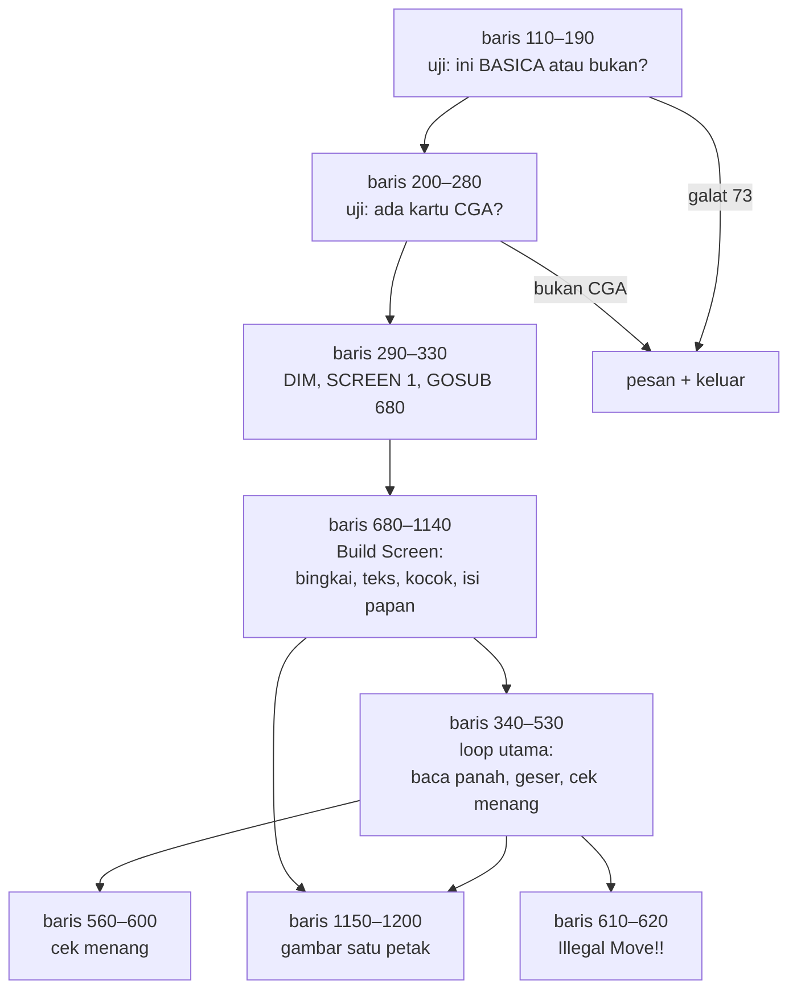

# THE 15 PUZZLE — dari BASIC 1982 ke web

| | |
|---|---|
| Sumber | `run/15PUZZLE.BAS` |
| Penulis | Dale Dewey, 7284 High View Trail, Victor, New York 14564 — Copyright 1982 |
| Ukuran asli | 117 baris, 4 subrutin, 13 `GOTO`, 9% komentar |
| Hasil port | [`../games/15puzzle/`](../games/15puzzle/index.html) |
| Analisis BASIC lengkap | [`../../reviews/15PUZZLE.md`](../../reviews/15PUZZLE.md) |

Program kedua yang diport. Dipilih karena bentuknya sangat berbeda dari
`HANGMAN` — kecil, grafis, dan **menyimpan satu bug yang membuat separuh
permainannya mustahil dimenangkan**.

---

## 1 · Arsitektur asli

Bentuknya kerucut: alur utama panjang, empat subrutin kecil di ujung.



### Dua pemeriksaan sebelum apa pun dimulai

```basic
110 ON ERROR GOTO 130
120 PLAY "mf": ON ERROR GOTO 0: GOTO 200
130 IF ERR<>73 THEN RESUME 200
```

Program menjalankan `PLAY "mf"` **bukan untuk membunyikan apa pun**, melainkan
untuk menanyai interpreternya sendiri. Kalau perintah itu meledak dengan galat
73 ("Advanced feature"), berarti yang dipakai bukan BASICA.

Perhatikan baris 120 langsung mematikan penangkap (`ON ERROR GOTO 0`) begitu
ujinya selesai. **Buka penangkap sesempit mungkin, lalu tutup lagi** — disiplin
yang masih benar sampai sekarang.

```basic
200 DEF SEG=0
210 IF (PEEK(&H410) AND &H30)<>&H30 THEN GOTO 290
```

`0040:0010` adalah *equipment word* BIOS; bit 4–5 menyatakan jenis adaptor
video. Nilai `&H30` (kedua bit menyala) berarti monokrom 80×25 — jadi kalau
**tidak** sama dengan `&H30`, berarti ada kartu warna dan program boleh jalan.

Ini pemakaian yang **benar** — dan menarik dibandingkan dengan
[`WHATMONF.BAS`](../../reviews/WHATMONF.md) di koleksi yang sama, yang membaca
byte serupa tapi memetakan hasilnya terbalik. Dua program, satu koleksi, satu
benar satu keliru.

### Grafik empat warna

`SCREEN 1, COLOR 0,1` — CGA 320×200 dengan palet 1, yang isinya hanya empat
warna: hitam, cyan, magenta, putih. Ubin di-`PAINT` magenta dengan batas putih;
hiasan memakai cyan. Palet itu dipertahankan di versi web (lihat komentar di
`15puzzle.css`).

Hiasan di sisi kiri layar juga dipertahankan:

```basic
760 FOR I=0 TO 55 STEP 5
770  CIRCLE (25,103),I,1,,,2.5
780 NEXT I
```

Dua belas elips sekonsentris. Argumen terakhir `2.5` adalah **rasio aspek** —
tanpa itu `CIRCLE` menggambar lingkaran, dan pada piksel CGA yang tidak persegi
hasilnya akan tampak gepeng.

### Sisa jejak perakitan koleksi

```basic
660 END 'RUN "MENU"
```

Kembali-ke-menu **dikomentari keluar**, menyisakan `END` saja. `15PUZZLE.BAS`
memang bukan bagian disket Friendlyware — ia karya Dale Dewey yang beredar
sendiri. Seseorang pernah menyambungkannya ke menu, lalu membatalkannya. Baris
itu fosil dari proses penggabungan koleksi ini.

---

## 2 · Bug: separuh permainannya mustahil dimenangkan

Ini temuan utama dari program ini.

```basic
 990 FOR I=1 TO 16
1000  ST(I)=INT(RND*16)+1
1010  IF I=1 THEN 1060
1020  FOR J=1 TO I-1
1030   IF ST(I)=ST(J) THEN 1000      ' sudah dipakai, ambil lagi
1040  NEXT J
1050  SOUND ST(I)*100,0.75
1060 NEXT I
```

Ini menghasilkan **permutasi acak murni** dari 16 angka. Masalahnya: 15-puzzle
punya besaran yang **kekal**.

Setiap geseran yang sah mengubah dua hal sekaligus — jumlah *inversi* (pasangan
angka yang urutannya terbalik) dan baris kotak kosong. Keduanya selalu berubah
sedemikian rupa sehingga **jumlah paritasnya tidak pernah berubah**.

Akibatnya, papan acak hanya bisa diselesaikan kalau paritasnya kebetulan sama
dengan papan tujuan. Peluangnya **tepat setengah**.

Simulasi 50.000 pengocokan dengan algoritma baris 990–1060:

```
mustahil diselesaikan : 24.967  (49,9%)
```

Dan tidak ada satu pun pesan yang memberi tahu pemain. Anda bisa menggeser ubin
berjam-jam pada papan yang secara matematis tidak punya solusi.

### Rumusnya

Untuk papan berlebar genap:

> Bisa diselesaikan ⟺ (jumlah inversi + baris kotak kosong dihitung dari bawah,
> mulai 1) berjumlah **ganjil**.

Papan tujuan: 0 inversi, kotak kosong di baris terbawah (= 1). Jumlah 1, ganjil. ✔

Rumus ini bukan diambil dari buku lalu dipercaya begitu saja — ia **dibuktikan
menyeluruh** pada papan 4×2 (lebar sama, 8! = 40.320 keadaan, semuanya bisa
ditelusuri):

```
total keadaan          : 40320
benar-benar terjangkau : 20160     (BFS dari papan tujuan)
diprediksi rumus       : 20160
rumus == kenyataan     : True
```

Papan 4×4 sendiri punya sekitar 10¹³ keadaan, jauh di luar jangkauan BFS —
tapi rumusnya hanya bergantung pada **lebar** papan, bukan tingginya.

### Perbaikannya

```js
if (!isSolvable(t)) {
  // Menukar dua ubin bukan-kosong mengubah jumlah inversi satu langkah ganjil,
  // jadi paritasnya berbalik. Satu tukar cukup; tidak perlu mengocok ulang.
  const a = t.findIndex(v => v !== BLANK);
  const b = t.findIndex((v, i) => v !== BLANK && i > a);
  [t[a], t[b]] = [t[b], t[a]];
}
```

Tanpa perulangan, tanpa membuang hasil kocokan. Setelah perbaikan ini: 50.000
papan, **nol** yang mustahil.

---

## 3 · Dari retro ke modern

| Aspek | Bentuk asli | Kendala yang melahirkannya | Bentuk sekarang & alasannya |
|---|---|---|---|
| Papan | `S(5,5)` — matriks 4×4 dengan satu baris/kolom kelebihan | `DIM` lebih murah daripada perhitungan indeks | Array rata 16 elemen. Perhitungan inversi jadi satu loop, bukan dua |
| Pengocokan | ambil acak, ulangi kalau sudah dipakai (baris 1000–1040) | Tidak ada struktur himpunan maupun fungsi kocok | Fisher–Yates dari `RETRO.rng` — waktunya pasti, hasilnya merata |
| Solvabilitas | tidak diperiksa sama sekali | Kemungkinan besar penulisnya tidak tahu invariannya | Diperiksa dan diperbaiki. **Ini perbaikan bug**, bukan selera |
| Grafik | `LINE`, `PAINT`, `CIRCLE` di `SCREEN 1` (320×200, 4 warna) | Mode grafis CGA satu-satunya yang ada | SVG. Palet 4 warna aslinya dipertahankan sebagai variabel CSS |
| Geseran ubin | `PAINT` ulang dua petak (baris 1150–1200) | Tidak ada animasi; menggambar ulang satu-satunya cara | `transform: translate()` + transisi CSS 150 ms. Hanya `transform` yang dianimasikan, supaya peramban tidak menghitung ulang tata letak |
| Warna teks | `DEF SEG: POKE &H4E,1` lalu `POKE &H4E,3` | Menulis ke ruang kerja interpreter; tak terdokumentasi | Kelas CSS. Sama seperti `POKE 106,0` di HANGMAN — *hack* yang menyebar karena berhasil, bukan karena benar |
| Jeda "Illegal Move" | `FOR I=1 TO 2000: NEXT` (baris 610) | Tidak ada jam | `setTimeout` 900 ms — sama di mesin mana pun |
| Membuang sisa tombol | `WHILE+ INKEY$<>"":WEND` (baris 355) | Penyangga ketik-dulu menumpuk saat menggambar | Tidak perlu; kejadian peramban tidak menumpuk |
| Bunyi geser | `PLAY "L16ac"` (baris 1180) | Speaker PC | **String makro disalin apa adanya** dan ditafsirkan `_shared/audio.js` |
| Keluar | `IF ANS$="Q" THEN 630` | — | Tombol `Q` tetap berfungsi, kembali ke peluncur |

> Catatan kecil: `WHILE+` di baris 355 memakai tanda plus uner yang tidak
> berguna. Salah ketik yang sama persis muncul di `BOWLING.BAS` (`WHILE+ A$=""`).
> Dua program berbeda, dua penulis berbeda, satu kebiasaan yang sama — mungkin
> keduanya diketik ulang dari listing yang memuat kekeliruan itu.

---

## 4 · Keputusan porting

### Dipertahankan persis

- **Panah menggerakkan kotak kosong**, bukan ubin. Baris 390:
  `IF Q=72 AND YZ>1 THEN X0=XZ: Y0=YZ-1` — `YZ,XZ` adalah posisi kosong, dan
  panah atas memilih ubin di **atasnya**. Banyak implementasi lain memakai
  semantik sebaliknya; yang ini tidak diubah.
- **Pencacah langkah** `PRINT USING "Move ####"`.
- **Palet empat warna CGA** dan motif elips sekonsentris.
- **Teks instruksi asli**, disalin dari baris 800–950.
- **Pemeriksaan menang yang tidak memeriksa petak terakhir** — kalau 1..15 sudah
  di tempatnya, sisa satu-satunya pasti kotak kosong. Logika baris 580.

### Diperbaiki

- **Solvabilitas** (bagian 2). Satu-satunya perubahan yang menyentuh aturan
  permainan, dan justru karena itu paling penting dijelaskan.

### Ditambahkan

- **Ubin yang sudah di tempatnya berubah hijau**, dan kembali magenta begitu
  digeser lagi. Plus pencacah "Di tempat n/15". Lihat catatan warna di bawah.
- **Timer**, dan **dua rekor yang berdiri sendiri** — tercepat dan
  tersedikit-langkah. Lihat bagian di bawah.
- **Mode gambar**: tiga gambar SVG bawaan, plus pilihan memuat gambar sendiri.
  Lihat bagian sesudahnya.
- Rekor bertahan antar sesi, **dengan tombol reset**. Aslinya tidak menyimpan
  apa pun. Aturan yang dipegang sejak HANGMAN: *menyimpan data permanen tanpa
  menyediakan cara menghapusnya adalah kelalaian, bukan fitur.*

#### Timer dan dua rekor

Aslinya hanya menghitung langkah (`510 PRINT USING "Move ####";MOVE`). Tidak ada
jam sama sekali — GW-BASIC punya `TIME$` beresolusi detik, tapi program ini tidak
memakainya.

Dua rekor disimpan **terpisah**, dan itu disengaja: mengejar waktu berarti
bergerak cepat tanpa banyak berpikir; mengejar langkah berarti sebaliknya.
Kedua rekor jarang dipecahkan dalam permainan yang sama, dan masing-masing juga
mencatat angka pasangannya (rekor waktu menampilkan berapa langkah yang dipakai,
dan sebaliknya) supaya perbandingannya jujur.

Satu keputusan kecil yang penting: **jam mulai berjalan pada gerakan pertama,
bukan saat papan diacak.** Kalau tidak, waktu memandangi papan sebelum mulai
ikut terhitung — dan itu justru bagian dari bermain yang tidak seharusnya
dihukum.

#### Mode gambar: kenapa SVG, bukan JPG/PNG

Tiga gambar bawaan (`pictures.js`) semuanya SVG yang digambar tangan:

| | SVG bawaan | JPG/PNG |
|---|---|---|
| Ukuran | 3–8 KB per gambar | 50–500 KB |
| Diperbesar | tetap tajam | pecah |
| Berkas tambahan | tidak ada | ada |
| Jalan dari `file://` | ya | ya |

Karena papan digambar dalam ruang koordinat 402×402, dan tiap gambar digambar
dalam ruang **yang sama**, potongan milik sebuah ubin cukup didapat dengan
menggeser gambar ke posisi rumahnya yang berlawanan lalu memotongnya:

```js
shift.setAttribute('transform', `translate(${-xOf(home)},${-yOf(home)})`);
```

Satu definisi gambar, lima belas `<use>` — persis semangat `DIM FIG$(5,5)` di
`CRAZY8.BAS` yang membangun 52 kartu dari satu rutin.

**Satu jebakan SVG yang perlu dicatat:** `clip-path` dan `transform` tidak boleh
dipasang pada elemen yang sama. Keduanya diselesaikan di ruang koordinat yang
sama, jadi bidang potongnya ikut bergeser bersama gambarnya. Perlu **dua grup
bersarang** — yang luar memotong, yang dalam menggeser.

**Gambar sendiri** dibaca lewat `FileReader` sebagai data URL. Cara ini bekerja
dari `file://` karena tidak melewati jaringan sama sekali — berbeda dengan
`fetch()` yang diblokir (lihat [fondasi bagian 6](_fondasi.md)). Berkasnya tidak
pernah meninggalkan komputer Anda.

Kalau memakai gambar sendiri, ubin yang sudah di tempatnya ditandai lewat
**tepinya** saja, bukan diwarnai seluruh mukanya — kalau tidak, gambarnya
tertutup.

#### Catatan warna: hijau tidak ada di palet aslinya

`SCREEN 1, COLOR 0,1` hanya menyediakan empat warna — hitam, cyan, magenta,
putih. **Tidak ada hijau.** Jadi petunjuk ini tidak mungkin dibuat pada 1982
dengan warna yang sama; paling dekat, penulisnya bisa memakai cyan (warna 1),
yang sudah terpakai untuk bingkai dan hiasan.

Hijau dipilih karena ia warna "benar" yang dipakai **seluruh situs** — huruf
tepat di HANGMAN, tombol utama, statistik positif. Konsistensi antar 66 aplikasi
lebih berharga daripada kemurnian palet untuk sebuah penanda *keadaan*.

Ini juga satu-satunya warna di halaman ini yang keluar dari palet CGA, dan
ditandai begitu di `15puzzle.css`.

Yang perlu ditegaskan: petunjuk ini **tidak mengubah aturan**. Ia hanya
menampilkan sesuatu yang pemain memang bisa hitung sendiri dengan melihat papan.
Bandingkan dengan perbaikan solvabilitas di bagian 2, yang benar-benar mengubah
papan mana yang mungkin muncul.

#### Catatan teknis: kenapa lapisan terpisah, bukan ganti `fill`

Cara yang tampak paling wajar — `.tile.is-home .face { fill: url(#tileHome) }` —
**tidak bisa dianimasikan**. Peramban tidak bisa menginterpolasi antara dua
*paint server*, jadi warnanya akan melompat.

Maka dipakai lapisan `<rect class="home">` yang selalu ada dengan `opacity: 0`,
dinyalakan jadi `1`. Halus, dan sekaligus mengikuti aturan yang lahir dari bug
getaran sebelumnya: **jangan mengubah geometri, ubah hanya warna dan opacity
lapisan yang sudah ada.**
- Ubin bisa diklik langsung, bukan hanya lewat panah — perlu untuk layar sentuh.
- Tombol "Susun rapi" untuk melihat papan tujuan.
- Geseran dianimasikan.

---

## 5 · Arsitektur baru

```mermaid
flowchart TD
    subgraph inti["logika murni — tidak menyentuh DOM"]
        SH["shuffledBoard()"]
        SO["isSolvable(t)<br/>inversi + baris kosong"]
        WN["isWon(t)"]
        CM["canMove(i)"]
    end

    subgraph st["keadaan"]
        S["tiles[16] · blank · moves<br/>phase · best"]
    end

    MV["moveTileAt(i)"]
    R["render()"]

    SH --> SO
    SH --> WN
    SH --> S
    MV --> CM
    MV --> S
    MV --> WN
    S --> R
    R --> DOM["15 elemen &lt;g&gt;,<br/>hanya transform yang berubah"]

    style S fill:#1e3f2c,stroke:#4ef08a
    style SO fill:#3d3117,stroke:#f0b429
```



Empat fungsi di kotak "logika murni" tidak menyentuh DOM sama sekali — itu yang
membuatnya bisa diuji tanpa peramban. Uji paritasnya dijalankan dengan
menyalin keempatnya apa adanya ke Python.

Ubin **dibuat sekali** di `buildTiles()`, lalu `render()` hanya memperbarui
atribut `transform`. Kalau elemen dibuat ulang tiap kali, transisi CSS tidak
akan pernah berjalan — geserannya akan meloncat.

---

## 6 · Sebelum & sesudah

### Pengocokan

```basic
1000  ST(I)=INT(RND*16)+1
1020  FOR J=1 TO I-1
1030   IF ST(I)=ST(J) THEN 1000
1040  NEXT J
```

```js
const t = solvedBoard();
random.shuffle(t);                     // Fisher–Yates, waktunya pasti
if (!isSolvable(t)) { /* tukar dua ubin, paritas berbalik */ }
```

Pola "ambil acak; kalau bentrok, ambil lagi" muncul **dua kali** di koleksi ini
— di sini dan di pemilih kata `HANGMAN.BAS`. Keduanya melambat seiring ruang
pilihan menyusut; yang di HANGMAN bahkan bisa menggantung selamanya.

### Cek menang

```basic
560 FOR I=1 TO 4
570 FOR J=1 TO 4
580 IF (I=4) AND (J=4) THEN WIN=1: RETURN
590 IF S(I,J)<>J+(I-1)*4 THEN WIN=0: RETURN
600 NEXT J: NEXT I
```

```js
function isWon(t) {
  for (let i = 0; i < COUNT - 1; i++) if (t[i] !== i + 1) return false;
  return true;
}
```

Rumus `J+(I-1)*4` menghitung nomor tujuan dari baris dan kolom. Dengan array
rata, nomor tujuan petak ke-`i` cukup `i + 1`.

---

## 7 · Latihan

1. **Rasakan bugnya sendiri.** Matikan pemeriksaan paritas di `shuffledBoard()`
   dan mainkan sepuluh kali. Berapa yang tidak bisa Anda selesaikan? Bagaimana
   perasaan Anda saat menyadari papannya memang mustahil?

2. **Cara lain menjamin solvabilitas.** Alih-alih memeriksa paritas, mulai dari
   papan tujuan lalu lakukan 200 geseran acak yang sah. Tulis versinya, lalu
   bandingkan: mana yang lebih mudah dibuktikan benar? Mana yang menghasilkan
   papan lebih acak?

3. **Buktikan invariannya.** Ambil papan mana pun, catat
   `inversi + baris kosong dari bawah`, lakukan satu geseran, hitung lagi.
   Kenapa paritasnya tidak pernah berubah? (Petunjuk: geseran mendatar tidak
   mengubah inversi sama sekali; geseran menegak memindahkan satu ubin melewati
   tepat tiga ubin lain.)

4. **Papan lain.** Ubah `N` jadi 3 (8-puzzle). Rumus paritas untuk lebar
   **ganjil** berbeda — cukup "jumlah inversi genap", tanpa suku baris kosong.
   Kenapa suku itu hilang?

---

Berkas terkait: [mainkan](../games/15puzzle/index.html) ·
[analisis BASIC asli](../../reviews/15PUZZLE.md) ·
[kode 1982](../../run/15PUZZLE.BAS) ·
[keputusan fondasi](_fondasi.md) · [HANGMAN](hangman.md)
