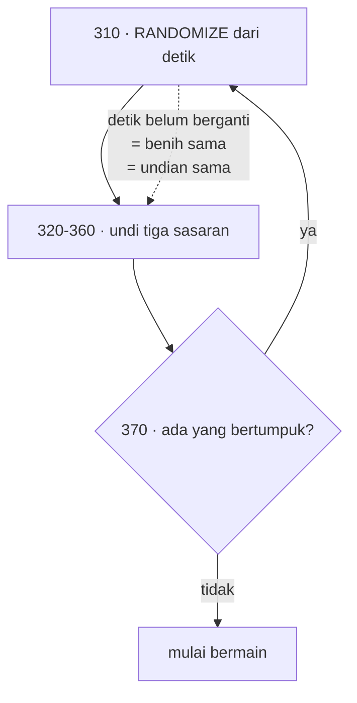

# BOGGY — dari BASIC 1982 ke web

| | |
|---|---|
| Sumber | `run/BOGGY.BAS` — Friendlyware PC Introductory Set, menu #1 pilihan T |
| Tahun | 1982 |
| Ukuran asli | 101 baris |
| Hasil port | [`../games/boggy/`](../games/boggy/index.html) |
| Analisis BASIC | [`../../reviews/BOGGY.md`](../../reviews/BOGGY.md) |

Kisi 10×10, tiga sasaran tersembunyi, sepuluh tebakan. Tiap tebakan dijawab
dengan **arah mata angin** untuk setiap sasaran yang masih hidup.

Dua hal layak dibaca: sebuah gelung penolakan yang tidak menolak apa-apa, dan
sebuah keputusan rancangan yang justru sangat baik.

---

## 1 · Penolakan yang tidak menolak apa-apa

```basic
310 RANDOMIZE(VAL(RIGHT$(TIME$,2)))
320 FOR I=1 TO 3
330     R(I)=FIX(RND(I)*10)
340     J=I+3
350     C(I)=FIX(RND(J)*10)
360 NEXT
370 IF (R(1)=R(2) AND C(1)=C(2)) OR (R(2)=R(3) AND C(2)=C(3))
       OR (R(3)=R(1) AND C(3)=C(1)) THEN 310
```

Baris 370 menolak undian yang menaruh dua sasaran di sel yang sama — masuk
akal, dan ketiga pasangannya diperiksa lengkap.

Masalahnya di **ke mana ia mengulang**. `THEN 310` kembali ke baris
`RANDOMIZE`, yang menyemai ulang dari **detik jam yang sama**.

Benih yang sama menghasilkan undian yang sama. Undian yang sama ditolak lagi.
Program berputar sampai **detik pada jam berganti**.



Ia tidak menggantung selamanya — detik pasti berganti. Tapi:

- ia bisa membakar prosesor sampai **satu detik penuh**, dan
- lebih penting: **penolakannya tidak bekerja.** Ia tidak mengambil undian
  baru; ia mengambil undian yang sama berulang kali sampai waktunya berubah.

Perbaikannya satu baris — pindahkan `RANDOMIZE` ke **atas** baris 310, supaya
pengulangan hanya mengulang pengundiannya.

### Kemunculan kelima, dan kelimanya berbeda

`RANDOMIZE VAL(RIGHT$(TIME$,2))` sudah muncul lima kali di koleksi ini, dan
**tidak ada dua yang salah dengan cara yang sama**:

| Program | Bentuk salahnya |
|---|---|
| [MASTER](master.md) | di dalam perulangan angka rahasia — tiap angka disemai ulang |
| [MAZE](maze.md) | dua kali dari **keluarannya sendiri** |
| [MAXIT1](maxit1.md) | dua kali dari sumber yang sama |
| `WILDCAT.BAS` | dari keluarannya sendiri |
| **BOGGY** | **di dalam gelung penolakan** |

> **Pelajaran.** Ini bukan lima orang yang ceroboh. Ini satu perkakas yang
> bentuknya mengundang salah pakai: `RANDOMIZE` terlihat seperti "aduk lagi",
> padahal artinya "mulai dari awal dengan benih ini".
>
> Nama yang tepat akan menghapus sebagian besarnya. `SEED n` sulit ditaruh di
> dalam perulangan tanpa curiga; `RANDOMIZE` justru terdengar seperti sesuatu
> yang aman diulang.

Port ini menyemai **sekali**, dan gelung penolakannya hanya mengulang
pengundian. Halamannya menampilkan berapa kali undian diulang — biasanya satu,
karena peluang tabrakan pada 100 sel kecil.

---

## 2 · Arah, bukan jarak

```basic
660 IF ROW=R(I) AND COL<C(I) THEN PRINT"East For No" I
670 IF ROW=R(I) AND COL>C(I) THEN PRINT"West For No" I
680 IF COL=C(I) AND ROW<R(I) THEN PRINT"South For No" I
690 IF COL=C(I) AND ROW>R(I) THEN PRINT"North For No" I
700 IF ROW<R(I) AND COL<C(I) THEN PRINT"Southeast For No" I
710 IF ROW<R(I) AND COL>C(I) THEN PRINT"Southwest For No" I
720 IF ROW>R(I) AND COL<C(I) THEN PRINT"Northeast For No" I
730 IF ROW>R(I) AND COL>C(I) THEN PRINT"Northwest For No" I
```

Delapan `IF`, satu per arah. Tidak ada jarak, tidak ada "panas atau dingin" —
hanya arah.

Itu keputusan rancangan yang **sangat baik**, dan layak dilihat kenapa:

- Satu jawaban "Southeast" langsung membuang **tiga perempat papan**.
  Jawaban "panas/dingin" hanya menyempitkan cincin.
- Ada **tiga** sasaran, jadi tiap tebakan membawa **tiga potong informasi
  sekaligus**.
- Sepuluh tebakan untuk tiga sasaran di 100 sel terasa ketat — dan memang
  cukup, justru karena tiap tebakan sepadat itu.

Di port ini kedelapan `IF` itu jadi dua sumbu yang disambung:

```js
function hintFor(i, row, col) {
  const ns = row < R[i] ? 'South' : row > R[i] ? 'North' : '';
  const ew = col < C[i] ? 'East'  : col > C[i] ? 'West'  : '';
  return (ns + ew) || null;          // null = tepat sasaran
}
```

Hasilnya sama persis, termasuk teks Inggrisnya. Yang berbeda: **tidak ada
cabang yang bisa terlewat.** Delapan `IF` menuntut kedelapannya benar; dua
sumbu hanya menuntut dua perbandingan benar, dan gabungannya menghasilkan
kedelapan arah dengan sendirinya.

> **Pelajaran.** Kalau daftar cabang Anda persis sama dengan hasil kali dua
> pilihan yang lebih kecil, tulislah kedua pilihan itu. Delapan arah adalah
> 3 × 3 kemungkinan (kurang satu, yaitu tepat sasaran) — bukan delapan hal
> yang berdiri sendiri.

---

## 3 · TAPS

Kalau sepuluh tebakan habis, program memainkan **"Taps"** — panggilan
sangkakala pemakaman militer:

```basic
800 PLAY "T140"+"MN"+"MB"
810 PLAY "O3L8C.L16C"+"L2F.L8C.L16F"
820 PLAY "L2A.L8C.L16F"+"L4A"+"L8C."+"L16F"+"L4A"+"L8C."+"L16F"+"L2A."
830 PLAY "O3"+"L8F.L16A"+"ML"+"O4L2C"+"MN"+"O3L4AL4FL2C."
840 PLAY "O3L8C.L16C"+"ML"+"L1F"+"MN"+"L4F"
```

Lima baris, sekitar tiga puluh nada, untuk sebuah permainan tebak-tebakan
sepuluh baris kode. Seseorang meluangkan waktu menuliskan seluruh lagu itu —
lengkap dengan artikulasi `ML`/`MN` dan perpindahan oktaf — hanya untuk saat
Anda kalah.

Versi pertama port ini menyalin **dua baris pertama saja** dan berhenti di
tengah lagu. Ketahuan hanya karena nomor barisnya diperiksa ulang: `800`
sampai `840`, bukan `800` sampai `810`.

> Kesalahan menyalin tidak berbunyi salah — ia berbunyi **pendek**. Dan
> sesuatu yang cuma pendek jauh lebih sulit disadari daripada sesuatu yang
> sumbang.

---

## 4 · Dari retro ke modern

| Aspek | Bentuk asli | Kendala | Bentuk sekarang & alasannya |
|---|---|---|---|
| Sasaran | `R(3)`, `C(3)`, mati ditandai `99` | Tidak ada tipe rekaman | Larik `alive` terpisah; `99` tidak lagi merangkap dua arti |
| Pengundian | Penolakan dengan penyemaian ulang | — | **Diperbaiki** (§1); jumlah pengulangan ditampilkan |
| Petunjuk | Delapan `IF` (baris 660–730) | — | Dua sumbu; teks Inggrisnya dipertahankan (§2) |
| Masukan | Dua `INKEY$` berurutan: baris lalu kolom | Tidak ada tetikus | Klik sel, **atau** ketik dua angka |
| Riwayat | Tergulung hilang dari layar | Layar teks 80×25 | Tersimpan semua, **terbaru di atas**, dan diletakkan sejajar papan — lihat di bawah |
| Petunjuk bermain | Layar `Y/N` sebelum mulai (baris 170–260) | — | Panel yang terbuka secara bawaan, plus teks aslinya dikutip utuh |
| Lagu kalah | "Taps", lima baris `PLAY` | — | Dipertahankan **lengkap** (§3) |
| Rekor | tidak ada | Tidak ada penyimpanan | `localStorage` |

### Riwayat adalah papan yang sebenarnya

Di sebagian besar permainan, papan menyimpan keadaan dan panel di sebelahnya
hanya pelengkap. Di sini terbalik: papan cuma mencatat **ke mana Anda sudah
menembak**, sedangkan seluruh informasi untuk menang — tiga arah per tebakan
— hidup di teksnya. Riwayat itu bukan catatan; ia permukaan bermainnya.

Versi pertama port ini menaruhnya sebagai panel **terakhir** di kolom kanan,
di bawah tiga panel esai. Artinya menyuruh pemain menggulung layar tiap kali
menebak, untuk membaca satu-satunya hal yang menentukan tebakan berikutnya.

Sekarang ia panel pertama, sejajar papan. Yang membuat ini aman bagi pemain
baru: **pada saat petunjuk paling dibutuhkan, riwayatnya masih kosong** dan
hampir tidak makan tempat; ketika riwayatnya sudah panjang, petunjuknya sudah
tidak dibaca lagi. Urutan panel tidak perlu berkompromi — cukup mengikuti
kapan tiap panel dibaca.

> **Pelajaran.** Urutkan panel menurut **seberapa sering dibaca**, bukan
> menurut seberapa penting kelihatannya. Panel esai terasa lebih "berbobot"
> daripada sebuah log, dan itulah kenapa ia naik ke atas tanpa ada yang
> memutuskannya.

### Petunjuk bermain, dan dari mana kata "monster" datang

Aslinya menawarkan layar petunjuk sebelum bermain, dan versi pertama port ini
tidak menyertakannya:

> *Welcome to Boggy Marsh. In this simple adventure you will be trying to
> locate the **monsters** of Boggy Marsh. For this task you will be given 10
> guesses… you beleive him to be in…*

Tanpa layar itu, tiga angka di kisi 10×10 tidak menjelaskan apa pun tentang
rawa maupun makhluk yang tinggal di dalamnya — dan seluruh nama permainannya
jadi tidak masuk akal. Teksnya kini dikutip utuh, **termasuk salah ketik
"beleive"** di baris 250.

Satu hal yang **tidak** diubah: sepuluh tebakan. Itu ketat, dan justru itu
yang membuat petunjuk arahnya terasa berharga.

---

## 5 · Latihan

1. **Reproduksi bugnya.** Tulis ulang pengundian persis seperti baris
   310–370, dengan benih dari detik. Berapa kali gelungnya berputar sebelum
   lolos? Sekarang pindahkan `RANDOMIZE` ke luar — berapa sekarang?

2. **Hitung peluangnya.** Berapa peluang dua dari tiga sasaran mendarat di sel
   yang sama pada 100 sel? Apakah gelung penolakan itu sepadan, atau ada cara
   mengundi yang tidak pernah bertabrakan sejak awal?

3. **Berapa tebakan yang cukup?** Tulis penyelesai yang memakai petunjuk arah
   secara optimal. Rata-rata berapa tebakan untuk tiga sasaran? Apakah
   sepuluh longgar, pas, atau kurang?

4. **Ganti petunjuknya.** Ubah dari arah menjadi jarak ("hangat/panas").
   Berapa tebakan yang dibutuhkan sekarang? Itu mengukur seberapa banyak
   informasi yang sebenarnya dibawa sebuah arah.

---

Berkas terkait: [mainkan](../games/boggy/index.html) ·
[fondasi §2.6 — keacakan](_fondasi.md) · [MASTER](master.md) ·
[MAZE](maze.md) · [MAXIT1](maxit1.md)
