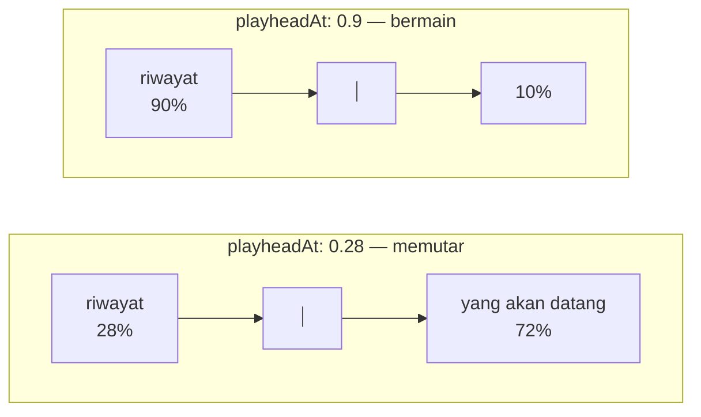
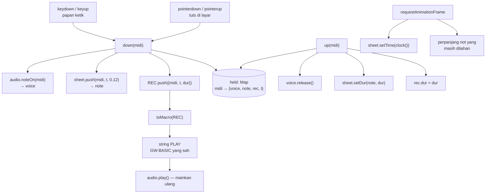

# FREEPLAY — program baru di atas fondasi lama

> Dokumen arsitektur & code review · bahan belajar
> Aplikasinya: [`web/games/freeplay/index.html`](../games/freeplay/index.html)

Ini satu-satunya halaman di seluruh proyek yang **tidak diport dari mana pun**,
dan satu-satunya yang bisa **membaca berkas MIDI**.
Tidak ada berkas `.BAS` di belakangnya, tidak ada kode 1982 yang ditafsirkan
ulang. Karena itu dokumen ini bentuknya berbeda dari sembilan dokumen lain: tidak
ada bagian "sebelum & sesudah", karena tidak ada "sebelum".

Yang dibahas di sini justru pertanyaan yang lebih jarang ditanyakan:
**bagaimana cara mengetahui bahwa sebuah fondasi sudah cukup baik?**

---

## 1 · Asal-usulnya: satu angka

Empat halaman musik sebelumnya — GERMFOLK, OCTAVE, DREAM, NOTETABL — semuanya
memutar lagu yang sudah ada. Not baloknya digambar seluruhnya di muka, lalu
digulung dari kanan ke kiri melewati sebuah garis penanda yang diam.

Garis itu diletakkan di `playheadAt: 0.28`, yaitu 28% dari kiri. Sisanya, 72%
layar di sebelah kanan, dipakai memperlihatkan not yang **akan** datang.

Program ini lahir dari mengubah satu angka itu jadi `0.9`.



Kenapa harus dipindah? Karena **tidak ada masa depan untuk digambar.** Tidak ada
yang tahu tuts mana yang akan Anda tekan berikutnya — termasuk Anda. Ruang di
kanan garis jadi tidak ada gunanya, jadi garisnya digeser ke sana dan seluruh
layar dipakai untuk riwayat.

Kode penggulungnya, penggambar kepala not, garis bantunya, penanda kres — semua
identik. Yang berbeda satu angka.

> **Pelajaran.** Kalau dua fitur yang terasa sangat berbeda ternyata hanya
> beda satu parameter, itu tanda abstraksinya kena. Kalau harus menyalin
> separuh berkas untuk membuat varian, itu tanda abstraksinya belum kena.

---

## 2 · Arsitektur



Perhatikan bahwa `held` adalah satu-satunya tempat keadaan "sedang ditekan"
disimpan, dan ketiga akibat sebuah tekanan — suara, gambar, rekaman — semuanya
digantung di entri yang sama. Saat tuts dilepas, ketiganya diselesaikan dalam
satu fungsi. Tidak ada kemungkinan salah satu tertinggal.

### Yang ditambahkan ke fondasi

Delapan, dan enam di antaranya kecil:

| Tambahan | Di mana | Kenapa perlu |
|---|---|---|
| `audio.noteOn(midi)` → `{release()}` | `_shared/audio.js` | `tone()` menjadwalkan nada yang panjangnya **sudah diketahui**. Tuts tidak begitu. |
| `staff.setDur(note, dur)` | `_shared/staff.js` | Not digambar saat tuts ditekan, tapi panjangnya baru ketahuan saat dilepas. |
| `piano.onDown/onUp` + `label` | `_shared/piano.js` | `onKey` hanya mengenal klik, bukan tekan-dan-tahan. |
| `staff.range` | `_shared/staff.js` | Jangkauan lima oktaf diketahui sejak awal, jadi kotak pandang bisa dipas sekali — bukan berubah skala saat not tinggi pertama muncul. |
| `staff.setPlayhead(frac)` | `_shared/staff.js` | Berpindah antara mode rekam (0.9) dan mode putar MIDI (0.28) **saat program berjalan**. |
| `RETRO.clock()` | `_shared/loop.js` | Jam pertunjukan yang bisa dijeda; `performance.now()` tidak bisa berhenti. |
| `audio.playNotes()` | `_shared/audio.js` | Memutar daftar nada **polifonik** dari berkas MIDI — sesuatu yang makro PLAY tidak bisa nyatakan. |
| `RETRO.parseMIDI()` | `_shared/midi.js` | Membaca Standard MIDI File tanpa pustaka apa pun. |

Selebihnya — penafsir PLAY, delapan instrumen, bilah instrumen, tema, topbar,
seluruh CSS not balok — dipakai apa adanya.

---

## 3 · Satu jam, bukan tiga

Program ini menyentuh tiga sumber waktu sekaligus, dan itu sumber bug yang khas:

1. **Jam `AudioContext`** — detik, presisi tinggi, milik Web Audio, dan berjalan
   dengan kecepatannya sendiri (kadang sedikit berbeda dari jam dinding).
2. **`performance.now()`** — milidetik sejak halaman dibuka.
3. **Urutan kejadian papan ketik** — tidak punya jam sama sekali.

Yang dipakai sebagai kebenaran di sini adalah **nomor 2, dan hanya itu.**
(Jam nomor 1 tetap dipakai di dalam `audio.js`, tapi tidak pernah bocor keluar —
lihat [fondasi §2.4c](_fondasi.md).)

### Jam yang bisa dijeda — dan bug yang menuntutnya

Versi pertama sesederhana ini:

```js
const T0 = performance.now();
const clock = () => (performance.now() - T0) / 1000;
```

Benar, dan salah. `performance.now()` tidak pernah berhenti — ia jam dinding.
Akibatnya gulungan not baloknya **berjalan terus selamanya**, bahkan saat tidak
ada satu tuts pun ditekan. Dua akibatnya:

1. Nada yang barusan dimainkan hanyut keluar layar dalam sembilan detik, jadi
   riwayat yang seharusnya dilihat justru hilang sendiri.
2. Tombol Berhenti tidak berpengaruh apa pun padanya, karena tidak ada yang
   bisa dihentikan dari sebuah jam dinding.

Yang dibutuhkan bukan jam dinding melainkan **jam pertunjukan**: waktu yang
berjalan selama pertunjukan berjalan dan diam selama dijeda. Itu
`RETRO.clock()`, dan pola dalamnya adalah pola stopwatch — menabung waktu yang
sudah lewat alih-alih menyimpan "kapan mulai":

```js
now()    { return saved + (running ? (performance.now() - since) / 1000 : 0); }
pause()  { saved = this.now(); running = false; }
resume() { since = performance.now(); running = true; }
```

Jamnya mulai berjalan pada tuts pertama yang ditekan.

### Kapan ia berhenti sendiri — dan kenapa angkanya diukur, bukan dikarang

Membiarkannya jalan selamanya juga salah. Setelah 8,1 detik sepi, rekaman Anda
sudah hanyut keluar tepi kiri layar walaupun tidak terjadi apa-apa — angka itu
langsung dari geometrinya: garis penanda di 810 unit, gulungan 100 unit/detik.

Tapi membekukannya terlalu cepat merusak hal yang lebih penting: **istirahat
yang memang bagian dari lagu ikut terhapus**, dan ritme yang terekam bukan lagi
ritme yang dimainkan. Makro PLAY yang dihasilkannya pun ikut salah.

Jadi ambangnya terjepit di antara dua batas, dan keduanya bisa dihitung.

**Batas bawah — diukur dari koleksi ini sendiri.** Seluruh makro PLAY di 83
program ditafsirkan, dan setiap perintah `P`/`R` dihitung durasinya:

| | |
|---|---|
| jumlah jeda di seluruh koleksi | 98 |
| **jeda terpanjang** | **0,500 detik** (33 kali) |
| persentil 95 | 0,500 detik |
| median | 0,240 detik |
| program dengan jeda terpanjang | BACKGAM, DOMINOES, ELIZA, FOOTBALL, GOLF, MORTGAGE, WIZARD |

Musik di koleksi ini nyaris tidak punya keheningan. Tapi ini jingle permainan,
bukan komposisi — sampelnya bias ke pendek, jadi ia hanya dipakai sebagai
pemeriksa bawah, bukan sebagai jawabannya.

**Batas bawah yang sebenarnya — dari musik umum.** Satu birama penuh 4/4 pada
tempo lambat (seperempat = 60) adalah **4 detik**. Lebih panjang dari itu,
sebuah keheningan berhenti menjadi istirahat dan mulai menjadi pergantian
bagian.

**Batas atas — 8,1 detik**, saat not terakhir hanyut keluar layar.

`MAX_REST = 4.0` memenuhi keduanya: delapan kali lebih longgar dari jeda
terpanjang yang pernah ditulis di koleksi ini, dan separuh dari jendela
layarnya, sehingga nada terakhir membeku di tengah layar — masih terlihat
jelas.

```js
if (autoFreeze && beat.running && !held.size && REC.length &&
    t - lastActive > MAX_REST) {
  beat.pause();
  beat.seek(lastActive + MAX_REST);   // BUKAN posisi frame yang kebetulan
}
```

Baris `seek` itu bukan kerapian. Kalau jamnya dibiarkan berhenti di mana pun
frame-nya mendarat, panjang jeda yang terekam akan berbeda-beda tergantung
beban mesin — dan **rekaman yang sama bisa menghasilkan makro PLAY yang
berbeda tiap kali dijalankan**. Membekukan di titik yang dihitung membuatnya
dapat diulang.

Harganya dinyatakan terbuka di halamannya: diam lebih lama dari 4 detik akan
tercatat sebagai 4 detik.

> **Pelajaran.** Setiap ambang waktu di sebuah program adalah keputusan yang
> menukar sesuatu dengan sesuatu. Kalau ia ditulis sebagai angka telanjang,
> pertukarannya hilang dan tidak ada yang bisa memeriksanya lagi. Cara
> memperbaikinya bukan menambah komentar "4 detik terasa pas", melainkan
> mencari **apa yang membatasinya dari dua sisi** — lalu memilih di antaranya.
> Di sini kedua batas itu ternyata bisa diukur: satu dari geometri layar, satu
> dari musiknya sendiri.

> **Pelajaran.** "Waktu sekarang" hampir selalu terlalu mentah untuk dipakai
> langsung. Yang sebenarnya dibutuhkan biasanya waktu **relatif terhadap
> sesuatu yang bisa berhenti** — dan begitu boleh ada jeda, menyimpan waktu
> mulai saja tidak cukup.

> **Pelajaran umum.** Kalau sebuah program punya lebih dari satu sumber waktu,
> pilih **satu** sebagai kebenaran dan turunkan sisanya. Menyinkronkan dua jam
> yang sama-sama berhak selalu berakhir dengan koreksi yang menumpuk.

Kesalahan yang justru sempat terjadi di halaman-halaman **lain** dan diperbaiki
bersamaan dengan program ini: GERMFOLK dan NOTETABL dulu memutar nadanya dengan
rantai `await` — mainkan baris, tunggu selesai, mainkan baris berikutnya. Tiap
`await` menambah beberapa milidetik sisa, dan setelah sembilan puluh nada not
baloknya sudah tidak sejajar lagi dengan bunyinya. Sekarang keduanya menjadwalkan
seluruh lagu dari satu titik nol.

---

## 4 · Not yang tumbuh sambil dimainkan

Sebuah not digambar pada saat tuts **ditekan**, jadi panjangnya belum diketahui.
Ada tiga cara menanganinya, dan dua di antaranya buruk:

| Cara | Akibatnya |
|---|---|
| Tunggu sampai tuts dilepas baru gambar | Not muncul terlambat; garis penanda kosong justru saat ada bunyi |
| Gambar dengan panjang tetap, perbaiki nanti | Not "melompat" memanjang saat dilepas |
| **Gambar pendek, perlebar tiap frame** | Batang not tumbuh mengikuti jari — inilah yang dipakai |

```js
(function tick() {
  const t = clock();
  sheet.setTime(t);
  held.forEach(h => sheet.setDur(h.note, Math.max(0.08, t - h.t)));
  requestAnimationFrame(tick);
})();
```

Yang penting di `setDur`: **hanya lebar batang yang berubah, bukan posisinya.**

```js
setDur(n, dur) {
  n.dur = dur;
  const bar = n.g && n.g.querySelector('.note__len');
  if (bar) bar.setAttribute('width', Math.max(6, dur * PPS));
}
```

Kalau yang diubah adalah `transform` atau `x`, not akan bergeser sambil ditahan —
persis jenis kesalahan yang dulu membuat ubin 15PUZZLE bergetar. Aturan yang
sama berlaku di sini dan ditulis langsung di `music.css`:

```css
/* Warna berubah, GEOMETRI TIDAK. */
.note { transition: opacity var(--t-fast) var(--ease); }
```

---

## 5 · Lingkaran yang tertutup: kembali ke makro PLAY

Empat halaman musik lain **membaca** string makro dari tahun 1984–1990. Halaman
ini **menulis** string dengan tata bahasa yang sama, dan hasilnya bisa ditempel
kembali ke BASICA di DOSBox.

```
T120 L4 O3 C8 D8 E4 P8 O4 C2
```

Itu GW-BASIC yang sah. Alat berumur empat puluh tahun ternyata masih jadi
format pertukaran yang bekerja.

### Yang hilang saat diterjemahkan — dan kenapa itu justru menarik

Penerjemahannya **tidak sempurna, dan tidak boleh berpura-pura sempurna.** Tiga
hal hilang, dan ketiganya adalah batasan GW-BASIC, bukan kekurangan penerjemah:

| Hilang | Sebabnya | Penanganannya |
|---|---|---|
| **Polifoni** | `PLAY` monofonik — speaker PC hanya punya satu pencacah | Not yang mulai sebelum not sebelumnya selesai dibuang |
| **Waktu bebas** | `PLAY` hanya mengenal 1/1, 1/2, 1/4, 1/8, 1/16, 1/32 | Panjang dibulatkan ke yang terdekat pada T120 |
| **Jeda halus** | `P` juga terikat pecahan yang sama | Hanya jeda di atas 0,12 detik yang ditulis |

```js
function lenOf(sec) {
  const quarter = 60 / TEMPO;
  let best = 4, err = Infinity;
  LENGTHS.forEach(l => {
    const e = Math.abs(quarter * 4 / l - sec);
    if (e < err) { err = e; best = l; }
  });
  return best;
}
```

Inilah bagian yang paling layak direnungkan seseorang yang sedang belajar
memrogram: **lagu-lagu di koleksi ini terdengar "kotak" bukan karena penulisnya
kurang mahir.** GERMFOLK dan DREAM ditulis oleh orang yang jelas paham musik.
Yang membuat hasilnya berketukan kaku adalah alatnya — `PLAY` memang tidak bisa
menyatakan yang lain.

Anda bisa membuktikannya sendiri: mainkan sesuatu dengan ketukan bebas, tekan
"Mainkan ulang", dan dengarkan apa yang tersisa. Selisih antara keduanya persis
sama dengan selisih antara musik dan `PLAY`.

Karena itu hasil terjemahannya digambar sebagai **lanjutan** riwayat, bukan
menggantikannya — supaya selama diputar, keduanya terlihat bersebelahan di
layar yang sama. Begitu pemutaran berhenti, jejaknya dibersihkan; alasannya di
§7c.

Pemutaran ulang punya tombol **Berhenti** sendiri, dan itu bukan pelengkap:
sebuah rekaman bisa panjang, dan tidak ada gunanya menawarkan "mainkan" tanpa
menawarkan "cukup". Aturan yang sama berlaku di semua halaman musik — setiap
sesuatu yang bisa dimulai harus bisa dihentikan, dan menghentikannya harus
benar-benar menghentikan bunyinya, bukan cuma gambarnya.

### Mengonversi oktaf, sekali lagi

```js
// MIDI = 12 x (oktafGW + 2) + semitone   ->   oktafGW = MIDI/12 - 2
const gw = Math.max(0, Math.min(6, Math.floor(n.midi / 12) - 2));
```

Rumus yang sama muncul di seluruh proyek ini, dan pernah salah satu kali:
versi pertama memakai `+1`, dan GERMFOLK terdengar seperti garis bas, bukan
melodi. Ujinya sederhana dan patut ditiru untuk konstanta ajaib mana pun —
**satu kasus yang jawabannya diketahui**: oktaf GW 3, not C, harus jadi MIDI 60,
yaitu C tengah.

---

## 5b · Memuat berkas MIDI

Pertanyaannya wajar: kalau halaman ini sudah bisa menulis makro `PLAY` dari
tuts yang ditekan, bisakah ia juga membaca berkas musik sungguhan?

Bisa, dan lingkarannya jadi lengkap: **`.mid` masuk, `PLAY` GW-BASIC keluar.**
Dua format pertukaran dari era yang sama akhirnya saling bicara — SMF
dibakukan 1988, `GERMFOLK.BAS` ditulis 1990, dan keduanya masih terbaca.

Penguraiannya ada di `_shared/midi.js`; seluk-beluk formatnya dibahas di
[fondasi §2.4e](_fondasi.md). Yang khas halaman ini adalah **pergantian
modenya**:

```js
sheet.setPlayhead(0.28);   // memuat MIDI  -> ada masa depan untuk digambar
sheet.setPlayhead(0.9);    // menutup MIDI -> kembali jadi perekam
```

Ini penutup yang rapi untuk §1. Di sana "satu angka" adalah alasan program ini
bisa ada sama sekali; di sini angka yang sama berpindah **saat program
berjalan**, dan halaman berubah dari perekam jadi pemutar tanpa satu pun kode
gambar yang berbeda.

Berkasnya tidak pernah meninggalkan mesin. `FileReader` membacanya jadi
`ArrayBuffer` di peramban; tidak ada `fetch`, tidak ada unggahan, dan halaman
ini memang tidak punya cara mengirim apa pun ke mana pun.

### Yang hilang saat MIDI jadi PLAY

Sama seperti permainan Anda sendiri, dan justru di sinilah paling terasa:

| Berkas MIDI | Makro PLAY |
|---|---|
| Puluhan nada bersamaan, banyak kanal | **satu nada** pada satu waktu |
| Panjang nada bebas | dibulatkan ke 1/1 … 1/32 |
| Tempo boleh berubah di tengah lagu | satu `T` untuk seluruh lagu |
| 16 kanal, tiap kanal punya instrumen | satu instrumen |

Muat sebuah lagu piano dua tangan, lalu lihat makro yang dihasilkan: tangan
kirinya hilang sama sekali. Bukan karena penerjemahnya kurang teliti — karena
`PLAY` memang tidak punya cara menyatakannya. Speaker IBM PC punya **satu**
pencacah, dan seluruh bahasa makro itu dibangun di sekitar kenyataan tersebut.

Itu jawaban paling konkret untuk pertanyaan "kenapa musik komputer tahun 80-an
terdengar begitu": bukan seleranya yang berbeda, melainkan satu pencacah.

---

## 6 · Peta papan ketik: meniru itu fitur

```
Baris atas   Q 2 W 3 E R 5 T 6 Y 7 U I 9 O 0 P     (+12 .. +28 semitone)
Baris bawah  Z S X D C V G B H N J M , L . ; /     (  0 .. +16 semitone)
```

Tata letak ini bukan karangan sendiri. Baris `ZXCVBNM` sebagai tuts putih dengan
`SDGHJ` sebagai tuts hitam adalah susunan yang dipakai hampir semua perangkat
lunak musik sejak Fasttracker awal 1990-an, dan masih dipakai FL Studio, Ableton,
serta hampir semua piano roll di peramban.

Menirunya berarti siapa pun yang pernah menyentuh perangkat lunak musik langsung
bisa memainkannya. Susunan yang "lebih logis" hasil karangan sendiri akan
membuang keuntungan itu demi kerapian yang tidak ada yang minta.

> **Pelajaran.** Konvensi yang sudah ada punya nilai yang tidak muncul di kode.
> Kalau melanggarnya, pastikan keuntungannya lebih besar dari biaya belajar
> ulang yang Anda bebankan ke pengguna.

Dua baris sengaja **bertindih satu oktaf** (semitone 12–16 punya dua huruf).
Itu bukan kelalaian: melodi yang melewati batas oktaf jadi tidak memaksa tangan
berpindah baris.

---

## 7 · Dua bug yang dicegah, bukan diperbaiki

### `event.repeat`

Menahan sebuah tuts membuat sistem operasi mengirim `keydown` berulang kali —
biasanya sekitar 30 kali per detik. Tanpa penjagaan, satu tekanan melahirkan
puluhan not.

```js
if (e.ctrlKey || e.altKey || e.metaKey || e.repeat) return;
```

`held` sebenarnya sudah menjaga hal yang sama (`if (held.has(midi)) return`),
tapi menolak lebih awal lebih murah **dan lebih jelas maksudnya**. Dua pagar
untuk satu bahaya bukan pemborosan kalau yang satu menjelaskan niat.

### Nada nyangkut

Ada empat cara `keyup`/`pointerup` tidak pernah sampai:

| Kejadian | Penanganannya |
|---|---|
| Jendela kehilangan fokus sambil tuts ditekan | `window.addEventListener('blur', …)` melepas semua |
| Jari digeser keluar tuts sambil menekan | `pointerleave` diperlakukan sama dengan `pointerup` |
| `audio.stop()` membungkam semuanya saat "Mainkan ulang" dihentikan | `stopReplay()` ikut mengosongkan `held`, supaya papan tuts tidak menyimpan nada yang sudah tidak berbunyi |
| Semua cara lain yang belum terpikirkan | Osilator dihentikan paksa 30 detik setelah mulai |

Yang ketiga adalah jaring pengaman di `audio.js`:

```js
v.oscs.forEach(o => { o.start(when); o.stop(when + 30); });
```

`stop()` boleh dipanggil ulang dengan waktu yang lebih awal — panggilan terakhir
yang berlaku. Jadi `release()` yang normal tetap menghentikannya tepat waktu,
dan batas 30 detik itu hanya berlaku kalau `release()` tidak pernah datang.

> **Pelajaran.** Untuk sumber daya yang harus dilepas (osilator, timer, koneksi,
> berkas), sediakan **batas waktu mutlak** di samping pelepasan yang normal.
> Bukan karena Anda tahu jalur mana yang bocor — justru karena Anda tidak tahu.

---

## 7b · Dua jam dinyalakan bersama, satu dimatikan

Bug ini pantas ditulis karena bentuknya akan terulang di program mana pun yang
punya lebih dari satu hal berjalan.

Menekan "Berhenti" saat memutar ulang membungkam suaranya — tapi not baloknya
terus bergulir. Kodenya terlihat benar sekali baca:

```js
function stopReplay() {
  audio.stop();
  Array.from(held.keys()).forEach(m => up(m));
  idle();
}
```

Yang hilang tidak terlihat karena ia **tidak ada di sana**: gulungan not balok
tidak dijalankan oleh `audio`, melainkan oleh `beat` — jam terpisah yang
dinyalakan beberapa baris sebelumnya di `startReplay()`:

```js
beat.resume();
const t0 = beat.now() + 0.25;
```

Dua jam dinyalakan bersama, hanya satu yang dimatikan.

Ini bukan salah ketik; ia akibat wajar dari kode yang menyalakan sesuatu di
satu tempat dan mematikannya di tempat lain. Selama keduanya berjauhan, tidak
ada yang mengingatkan bahwa jumlahnya sudah dua.

Aturan yang dipegang sekarang, dan alasannya bisa dipindah ke program lain:

> **Setiap tempat yang menyalakan lebih dari satu hal harus mematikan semuanya
> di satu fungsi.** Bukan karena lebih rapi — karena satu fungsi bisa dibaca
> sekaligus, dan sesuatu yang hilang dari daftar pendek jauh lebih mudah
> terlihat daripada sesuatu yang hilang dari sebuah halaman kode.

Sekarang `stopReplay()` menghentikan keduanya, dan menjeda — bukan mereset —
jam gulungannya, supaya riwayat yang sudah tergambar tetap di tempatnya.

---

## 7c · Membatalkan dengan menggambar ulang, bukan menghapus

Bug terakhir yang ditemukan: tiap kali "Mainkan ulang" ditekan, hasil
terjemahannya ditambahkan ke not balok — dan tidak pernah dibuang. Tekan tiga
kali, dapat tiga salinan bertumpuk.

Cara yang salah untuk memperbaikinya adalah melacak not mana yang berasal dari
pemutaran ulang, lalu menghapusnya satu per satu. Itu menambah keadaan baru
yang harus dijaga benar (daftar not "milik pemutaran"), dan keadaan yang harus
dijaga benar adalah tempat bug berikutnya tumbuh.

Cara yang benar jauh lebih pendek, dan alasannya sudah ada di rancangannya:
**`REC` adalah sumber kebenaran; not balok cuma gambarnya.**

```js
function restoreStaff() {
  sheet.setNotes(REC.map(r => ({ midi: r.midi, t: r.t, dur: r.dur })));
  beat.pause();
  beat.seek(recEnd());          // penanda kembali ke ujung rekaman
}
```

Tidak ada yang perlu dilacak. Membatalkan apa pun berarti "gambar ulang dari
data", dan hasilnya benar tidak peduli apa yang terjadi sebelumnya — termasuk
hal-hal yang belum terpikirkan saat fungsi ini ditulis.

Fungsi yang sama dipakai tiga tempat: saat pemutaran dihentikan, saat pemutaran
selesai wajar, dan saat berkas MIDI ditutup. Ketiganya butuh hal yang persis
sama, dan tidak satu pun perlu tahu apa yang sedang dibersihkan.

> **Pelajaran.** Kalau tampilan diturunkan dari data, "batalkan" selalu berarti
> *gambar ulang dari data* — bukan *cari dan hapus yang tadi ditambahkan*.
> Yang pertama panjangnya tetap; yang kedua tumbuh tiap kali ada cara baru
> untuk menambah sesuatu.

Ini prinsip yang sama yang membuat 15PUZZLE bisa dipercaya: papannya adalah
array, dan gambarnya fungsi dari array itu. Perbedaannya di sini cuma bahwa
saya sempat melanggarnya sendiri.

---

## 8 · Yang berbeda dari kesembilan dokumen lain

Tabel wajib "apa yang berubah dari retro, kenapa, dan bagaimana ditafsirkan"
tidak bisa diisi di sini, karena tidak ada retro-nya. Tapi ada tabel lain yang
lebih tepat: **apa yang program ini pinjam, dan dari mana.**

| Diambil dari | Apa | Diubah? |
|---|---|---|
| `audio.js` | penafsir makro PLAY, 8 instrumen | tidak; hanya ditambah `noteOn()` |
| `staff.js` | not balok bergulir | tidak; hanya `playheadAt` diisi 0.9 dan ditambah `setDur()` |
| `piano.js` | papan tuts SVG | tidak; ditambah `onDown/onUp` dan `label` |
| `ui.js` | topbar, pemilih instrumen, toast, tema | tidak sama sekali |
| `music.css` | seluruh tata letak halaman musik | tidak; hanya ditambah kelas baru di bagian bawah |
| NOTETABL | gagasan "satu data, dua tampilan" | diterapkan ulang: rekaman = not balok = makro |
| OCTAVE | rumus MIDI ↔ oktaf GW | dipakai terbalik (menulis, bukan membaca) |

Angka yang paling berarti dari tabel ini: **nol berkas fondasi yang harus
diubah cara kerjanya.** Semua yang ditambahkan bersifat menambah, tidak ada
yang mengubah perilaku lama. Halaman-halaman musik yang sudah ada tetap jalan
tanpa disentuh.

Itulah yang dimaksud fondasi yang sudah cukup baik.

---

## 9 · Latihan

1. **Metronom.** Tambahkan denyut yang bisa dinyalakan, lalu bulatkan waktu
   mulai tiap not ke denyut terdekat sebelum diterjemahkan. Bandingkan hasil
   makro PLAY-nya dengan yang tanpa metronom — apa yang jadi lebih baik, dan
   apa yang justru hilang?
2. **Rekam-tindih.** Biarkan pengguna memainkan lapisan kedua sambil lapisan
   pertama diputar ulang. Petunjuk: `REC` harus jadi daftar berlapis, dan
   `toMacro` harus memutuskan apa yang terjadi pada polifoni yang kini
   disengaja.
3. **Muat kembali.** Buat kotak isian yang menerima string makro PLAY dan
   menggambarnya di not balok tanpa membunyikannya. Anda sudah punya seluruh
   bahannya: `audio.debugParse()` dan `sheet.setNotes()`. Setelah itu, ambil
   string dari [DREAM](dream.md) dan lihat lagu 1984 itu di not balok.
4. **Cari bug jam.** Ubah `clock()` supaya memakai jam `AudioContext`
   (`ctx.currentTime`) alih-alih `performance.now()`, mainkan selama beberapa
   menit, dan perhatikan apakah not balok mulai melenceng dari bunyinya. Kalau
   ya — mana yang benar, dan bagaimana Anda tahu?
5. **Tuts nyangkut.** Hapus penjagaan `e.repeat`, tahan satu tuts selama tiga
   detik, lalu lihat berapa isi `REC`. Kemudian hapus juga `blur` dan pindah
   jendela sambil menekan tuts. Perbaiki keduanya kembali dengan cara Anda
   sendiri.

6. **MIDI jadi PLAY, lalu kembali.** Muat sebuah berkas `.mid`, salin makro
   PLAY-nya, tempelkan ke kotak `PLAY "…"` di BASICA lewat DOSBox, dan
   bandingkan. Berapa banyak lagunya yang masih bisa dikenali?

7. **Pertahankan polifoni.** Ubah `toMacro` supaya menghasilkan **dua** string
   PLAY — satu untuk nada tertinggi, satu untuk nada terendah pada tiap saat.
   GW-BASIC tidak bisa memainkan keduanya bersamaan, tapi Anda bisa. Apa yang
   Anda pelajari tentang kenapa pembatasan monofonik itu ada?

8. **Kanal perkusi.** Ubah `parseMIDI(fr.result, {drums: false})` jadi `true`,
   muat lagu yang punya drum, dan lihat not baloknya. Kenapa kanal 10
   dilewati secara bawaan?

9. **Ukur sendiri ambangnya.** Tulis program yang menafsirkan seluruh makro
   `PLAY` di `run/*.BAS` dan mengumpulkan panjang tiap perintah `P`/`R`.
   Berapa jeda terpanjangnya? Sekarang lakukan hal yang sama pada sebuah
   berkas MIDI sungguhan — apakah `MAX_REST = 4` masih cukup longgar? Kalau
   tidak, angka mana yang harus berubah: ambangnya, atau `pps` pada not
   baloknya?

---

Berkas terkait: [fondasi](_fondasi.md) · [teknik SVG](_teknik-svg.md) ·
[GERMFOLK](germfolk.md) · [OCTAVE](octave.md) · [DREAM](dream.md) ·
[NOTETABL](notetabl.md)
